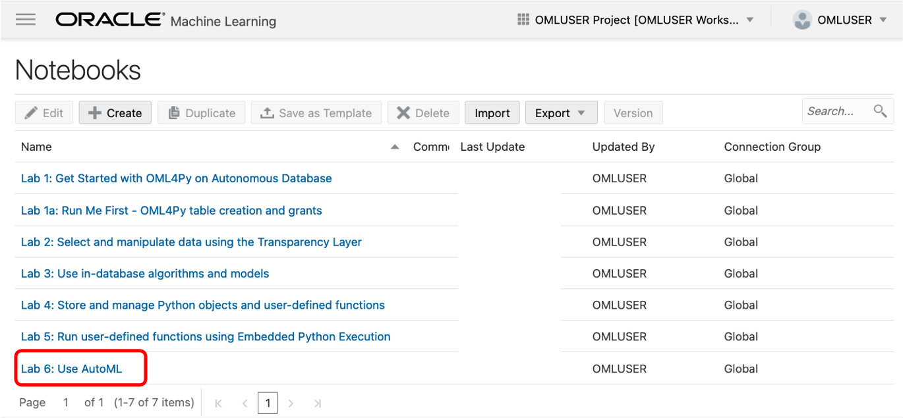
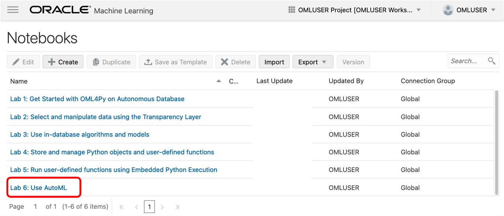
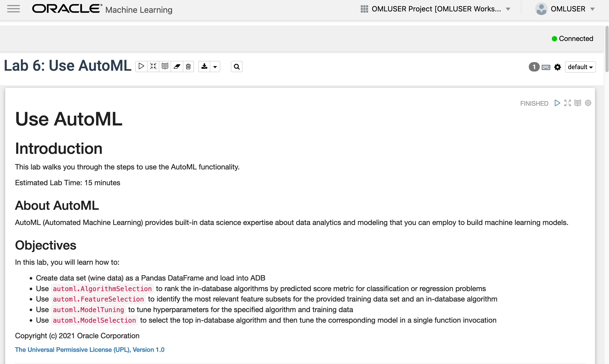
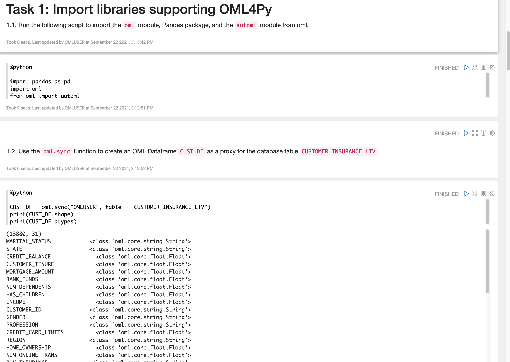
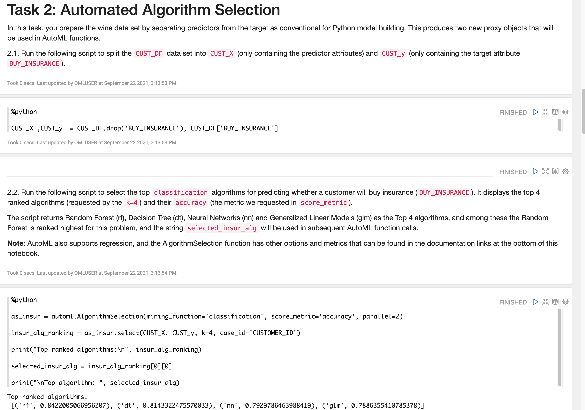
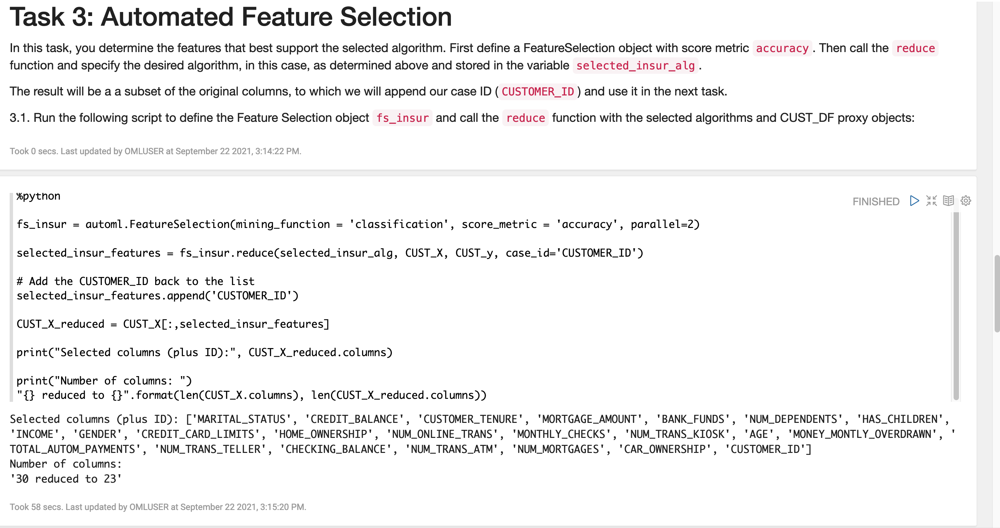
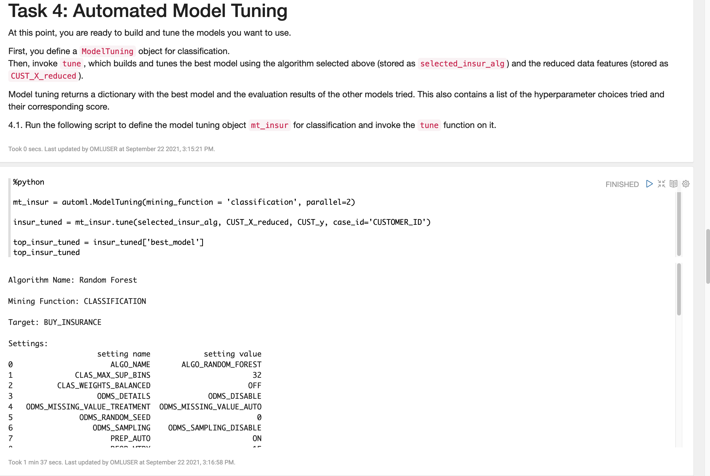
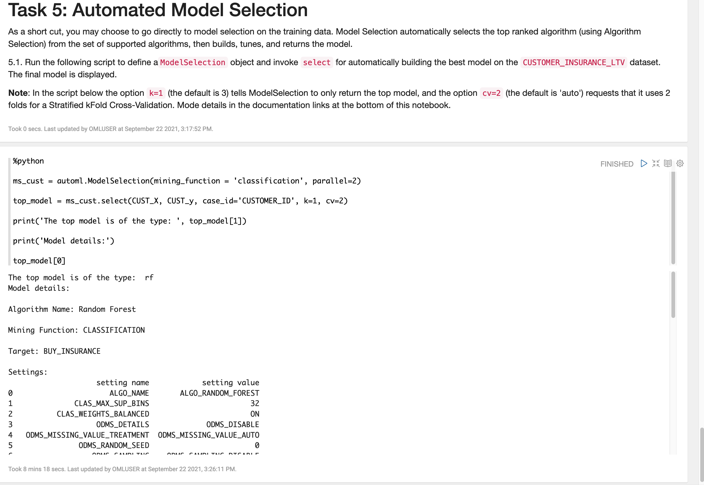

# Use AutoML

## Introduction

This lab walks you through the steps to use the AutoML functionality.

Estimated Time: 15 minutes

Watch the video below for a quick walk through of the lab.

### About AutoML
AutoML (Automated Machine Learning) provides built-in data science expertise about data analytics and modeling that you can employ to build machine learning models.

### Objectives

In this lab, you will learn how to:
* Create a Pandas DataFrame (OML DataFrame) proxy object for the `CUSTOMER_INSURANCE_LTV` database table to predict who would buy insurance based on the current customer behavior
* Use `automl.AlgorithmSelection` to rank the in-database algorithms by predicted score metric for classification of the BUY_INSURANCE target
* Use `automl.FeatureSelection` to identify the most relevant feature subset for the training data and the selected algorithm
* Use `automl.ModelTuning` to tune selected algorithm hyperparameters
* Use `automl.ModelSelection` to select the top in-database algorithm and return the tuned model in a single function

## Access the notebook for this Lab

1. Go back to the main notebooks listing by clicking on the "hamburger" menu (the three lines) on the upper left of the screen, and then select **Notebooks**.

 

2. Click the **Lab 6 notebook name** to view it.
   <if type="freetier">
    </if>
   <if type="livelabs">
    </if>

  OML Notebooks will create a session and make the notebook available for editing.

  You can optionally click the **Run all paragraphs** () icon, and then click **OK** to confirm to refresh the content with your data, or just scroll down and read the pre-recorded results.  
   
  

> **NOTE:** If you had problems downloading and extracting the ZIP file for the labs, please [**CLICK HERE** to download the lab6\_automl.json notebook file](./../notebooks/lab6_automl.json?download=1). Download the notebook file for this lab to your local machine and then import it like illustrated in **Lab 1, Task 2**.

> **Note:** Due to the nature of Automated Machine Learning, it is expected that some of the paragraphs will take several minutes to complete.

## Task 1: Import libraries supporting OML4Py and AutoML
Follow the flow of the notebook by scrolling to view and run each paragraph of this lab.

Scroll down to the beginning of Task 1.

   

## Task 2: Automated algorithm selection
Follow the flow of the notebook by scrolling to view and run each paragraph of this lab.

Scroll down to the beginning of Task 2.

  

## Task 3: Automated feature selection
Follow the flow of the notebook by scrolling to view and run each paragraph of this lab.

Scroll down to the beginning of Task 3.

  
  

## Task 4: Automated model tuning
Follow the flow of the notebook by scrolling to view and run each paragraph of this lab.

Scroll down to the beginning of Task 4.

  
  

## Task 5: Automated model selection
Follow the flow of the notebook by scrolling to view and run each paragraph of this lab.

Scroll down to the beginning of Task 5.

  
  

## End of the labs  

### Congratulations !!!
You reached the end of the lab "Python Users: Build intelligent applications faster with Oracle Machine Learning".

You can explore other Live Labs that make use of the Oracle Machine Learning components [by clicking here](https://apexapps.oracle.com/pls/apex/dbpm/r/livelabs/livelabs-workshop-cards?c=y&p100_product=70).

## Learn more

* [Automated Machine Learning](https://docs.oracle.com/en/database/oracle/machine-learning/oml4py/1/mlpug/automatic-machine-learning.html#GUID-4B240E7A-1A8B-43B6-99A5-7FF86330805A)
* [Oracle Machine Learning Notebooks](https://docs.oracle.com/en/database/oracle/machine-learning/oml-notebooks/)

## Acknowledgements
* **Authors** - Marcos Arancibia, Product Manager, Machine Learning; Jie Liu, Data Scientist; Moitreyee Hazarika, Principal User Assistance Developer
* **Contributors** -  Mark Hornick, Senior Director, Data Science and Machine Learning; Sherry LaMonica, Principal Member of Tech Staff, Machine Learning
* **Last Updated By/Date** - Marcos Arancibia and Jie Liu, October 2021
