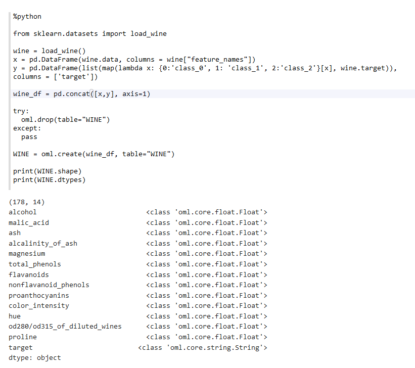

# Use AutoML

## Introduction

This lab walks you through the steps to use the AutoML functionality.

Estimated Lab Time: 20 minutes

### About AutoML
AutoML (Automatic Machine Learning) provides built-in data science expertise about data analytics and modeling that you can employ to build machine learning models.

### Objectives

In this lab, you will:
* Create data set (wine data) as Pandas DataFrame and load into ADB
* Use `automl.AlgorithmSelection` to automatically rank the best algorithms from the set of supported Oracle Machine Learning algorithms
* Use `automl.FeatureSelection` to quickly identify the most relevant feature subsets for a training data set and an Oracle Machine Learning algorithm
* Use `automl.ModelTuning` to tune the hyperparameters for the specified classification or regression algorithm and training data
* Use `automl.ModelSelection` to automatically select the best Oracle Machine Learning algorithm, and then tune that algorithm

### Prerequisites


* An Oracle Free Tier, Always Free, Paid or LiveLabs Cloud Account
* Item no 2 with url - [URL Text](https://www.oracle.com).


## **STEP 1**: Import libraries supporting OML4Py


1. Run the following script to import `oml` module, Pandas package, `automl` and set the display options:
    ```
    <copy>%python

    import warnings
    warnings.filterwarnings('ignore')

    import pandas as pd
    import oml
    from oml import automl

    pd.set_option('display.max_rows', 500)
    pd.set_option('display.max_columns', 500)
    pd.set_option('display.width', 1000)</copy>  
    ```


2. Create data set as Pandas DataFrame and load into ADB. In this example, you load the wine data set, combining target and predictors into a single DataFrame that matches the form the data would have as a database table. These DataFrame objects can then be loaded into Oracle Database using the create function.
    ```
    <copy>%python

    from sklearn.datasets import load_wine

    wine = load_wine()
    x = pd.DataFrame(wine.data, columns = wine["feature_names"])
    y = pd.DataFrame(list(map(lambda x: {0:'class_0', 1: 'class_1', 2:'class_2'}[x], wine.target)),
    columns = ['target'])

    wine_df = pd.concat([x,y], axis=1)

    try:
      oml.drop(table="WINE")
    except:
      pass

    WINE = oml.create(wine_df, table="WINE")

    print(WINE.shape)
    print(WINE.dtypes)</copy>
    ```

    

## **STEP 2:** Automatic Algorithm Selection

1. Run the following script to prepare the wine data set:
    ```
    <copy>%python

    WINE_X_cl,WINE_y_cl = WINE.drop('target'), WINE['target']</copy>
    ```

2. Run the following script to compute classification algorithm ranking for the wine data set:
    ```
    <copy>%python

    as_wine_cl = automl.AlgorithmSelection(mining_function='classification',
    score_metric='accuracy', parallel=2)

    wine_alg_ranking_cl = as_wine_cl.select(WINE_X_cl, WINE_y_cl, k=4)

    print("Ranked algorithms:\n", wine_alg_ranking_cl)

    selected_wine_alg_cl = next(iter(dict(wine_alg_ranking_cl).keys()))
    print("Best algorithm: ", selected_wine_alg_cl)</copy>
    ```
    

    The script returns the SVM Gaussian, SVM Linear, Neural Network and Random Forest. Among these, SVM Gaussian is ranked first.

## **STEP 3:** Automatic Feature Selection
In this step, you determine the features that best support the selected algorithm. You first define a FeatureSelection object with score metric accuracy.  You also invoke reduce function to specify the desired algorithm determined above and the train and test data set proxy objects.

You see the set of selected columns.

1. Run the following script to define the Feature Selection object `fs_wine_cl`:
    ```
    <copy>%python

    fs_wine_cl = automl.FeatureSelection(mining_function = 'classification',
    score_metric = 'accuracy', parallel=2)

    selected_wine_features_cl = fs_wine_cl.reduce(selected_wine_alg_cl,
    WINE_X_cl, WINE_y_cl)

    WINE_X_reduced_cl = WINE_X_cl[:,selected_wine_features_cl]

    print("Selected columns:", WINE_X_reduced_cl.columns)
    print("Number of columns:")
    "{} reduced to {}".format(len(WINE_X_cl.columns), len(selected_wine_features_cl))</copy>
    ```
    


## **Try it Yourself**
Try other algorithms, such as svm_linear, to see if different columns are selected.

## **STEP 4:** Automatic Model Tuning
At this point, you are ready to build and tune the models you want to use.

First, you define a `ModelTuning` object for classification.
Then, you invoke `tune` to produce the tuned model using the algorithms selected above and the reduced column data.

The result of model tuning is a dictionary with the 'best model' and 'all evals', which contains a list of all hyperparameter choices tried and their corresponding score

1. Run the following script to define the model tuning object `my_wine_cl` for classification.  
    ```
    <copy>%python

    mt_wine_cl = automl.ModelTuning(mining_function = 'classification', parallel=2)

    results_cl = mt_wine_cl.tune(selected_wine_alg_cl, WINE_X_reduced_cl, WINE_y_cl)
    tuned_model_cl = results_cl['best_model']
    tuned_model_cl</copy>
    ```
    

2. Run the following script to specify a custom search space to explore for model building using the `param_space` argument to the tune function. With this specification, model tuning will narrow the set of important hyperparameter values. We use parameters for the Random Forest algorithm for classification:
    ```
    <copy>%python

    search_space={'RFOR_SAMPLING_RATIO': {'type': 'continuous', 'range': [0.05, 0.5]},
    'RFOR_NUM_TREES': {'type': 'discrete', 'range': [50, 55]},
    'TREE_IMPURITY_METRIC': {'type': 'categorical',
    'range': ['TREE_IMPURITY_ENTROPY', 'TREE_IMPURITY_GINI']},}

    at_wine2_cl = automl.ModelTuning(mining_function='classification',
    score_metric='f1_macro', parallel=2)

    results2_cl = at_wine2_cl.tune('rf', WINE_X_cl, WINE_y_cl,
    param_space=search_space)

    score2_cl, params2_cl = results2_cl['all_evals'][0]
    "{:.2}".format(score2_cl)

    tuned_model2_cl = results2_cl['best_model']
    tuned_model2_cl</copy>
    ```
    

## **STEP 5:** Automatic Model Selection
As a short cut, you may choose to go directly to model selection on the training data. Model Selection automatically selects the best algorithm (using Algorithm Selection) from the set of supported algorithms, then builds, tunes, and returns the model.

1. Run the following script to select the best model for the wine data set:
    ```
    <copy>%python

    ms_wine = automl.ModelSelection(mining_function = 'classification', parallel=2)

    best_model = ms_wine.select(WINE_X_cl, WINE_y_cl, k=1, cv=2)
    best_model</copy>
    ```
    


## **Try it yourself**
**Hint:**
* Using the wine data set, prepare the data set with target  `alcohol`.
* Use AutoML to select a regression algorithm using the `r2` score metric,
* Then do feature selection followed by model tuning.
* Finally, view the model object.


Congratulations! You have completed this workshop!

## Learn More

* [URL text 1](http://docs.oracle.com)
* [URL text 2](http://docs.oracle.com)

## Acknowledgements
* **Author** - <Name, Title, Group>
* **Contributors** -  <Name, Group> -- optional
* **Last Updated By/Date** - <Name, Group, Month Year>
* **Workshop (or Lab) Expiry Date** - <Month Year> -- optional, use this when you are using a Pre-Authorized Request (PAR) URL to an object in Oracle Object Store.

## Need Help?
Please submit feedback or ask for help using our [LiveLabs Support Forum](https://community.oracle.com/tech/developers/categories/livelabsdiscussions). Please click the **Log In** button and login using your Oracle Account. Click the **Ask A Question** button to the left to start a *New Discussion* or *Ask a Question*.  Please include your workshop name and lab name.  You can also include screenshots and attach files.  Engage directly with the author of the workshop.

If you do not have an Oracle Account, click [here](https://profile.oracle.com/myprofile/account/create-account.jspx) to create one.
