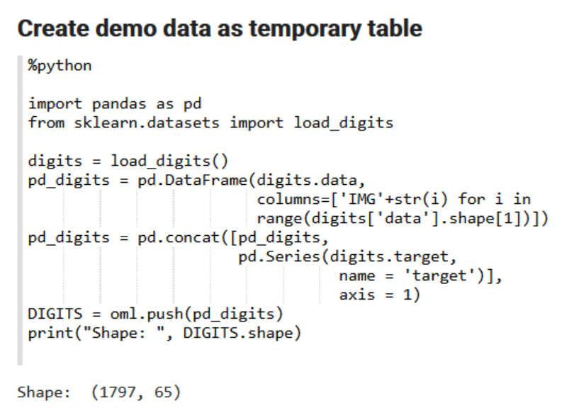

# Select and manipulate data using the Transparency Layer

## Introduction

This lab shows how to use OML4Py methods to work with data and to perform exploratory analysis of the data. In this lab, you'll learn to use to select and manipulate data using the transparency layer.  


Estimated Lab Time: 60 minutes

### About Data Selection and Manipulation
Enter background information here..

### Objectives

In this lab, you will:
  * Use the `oml.push` function to create a temporary table
  * Work with table rows and columns using proxy objects
  * Work with Pandas dataframe object
  * Use the `append` function
  * Use the `concat` function
  * Use the `split` and `KFold` function
  * Use the crosstab and pivot_table functions on a DataFrame


## **STEP 1**: Import libraries supporting OML4Py and create data table

To use OML4Py, you must first import the oml module and the Pandas library.

1. Run the following commands to import the oml and Pandas library:

   ```
   %python

   import warnings
   warnings.filterwarnings('ignore')

   import pandas as pd
   import oml

   pd.set_option('display.max_rows', 500)
   pd.set_option('display.max_columns', 50
   pd.set_option('display.width', 1000)
   ```
   
2. Create a temporary table IRIS_TMP for the IRIS data using oml.push function:

   ```
   %python

   from sklearn.datasets import load_iris
   import pandas as pd

   iris = load_iris()

   x = pd.DataFrame(iris.data, columns = ['SEPAL_LENGTH','SEPAL_WIDTH', 'PETAL_LENGTH','PETAL_WIDTH'])
   y = pd.DataFrame(list(map(lambda x: {0: 'setosa', 1: 'versicolor', 2:'virginica'}[x], iris.target)),
   columns = ['SPECIES'])
   z = pd.concat([x, y], axis=1)

   IRIS_TMP = oml.push(z)
   ```
   

## **STEP 2:** Select Table Columns using Proxy Object IRIS_TMP

1. Run the following script to select specific columns by name and return the first three records with the specified column names.
    ```
    %python

    IRIS_projected1 = IRIS_TMP[:, ["SEPAL_LENGTH", "PETAL_LENGTH"]]
    IRIS_projected1.head(3)
    ```
    
    The script returns the length of the petal and sepal from the IRIS_TMP table.
2. Run the following script to select specific columns by index range:
    ```
    %python

    IRIS_projected2 = IRIS_TMP[:, 1:4]
    IRIS_projected2.head(3)
    ```
    
    The script returns the columns by the specified index range.

3. Run the following script to select specific columns by data type:

    ```
    %python

    IRIS_projected3 = IRIS_TMP.select_types(include=[oml.String])
    IRIS_projected3.head(3)
    ```
    
    The script returns the columns by data type.

## **STEP 3:** Select Table Rows using Proxy Object IRIS_TMP

This step demonstrates how to select table rows using proxy object IRIS_TMP.

1. This step shows how to select sepal length and petal length where petal length is less than 1.5. This is an example of simple row selection. Run the following script:
    ```
    %python

    IRIS_filtered1 = IRIS_TMP[IRIS_TMP["PETAL_LENGTH"] < 1.5,
    ["SEPAL_LENGTH", "PETAL_LENGTH"]]
    print("Length: ", len(IRIS_filtered1))
    IRIS_filtered1.head(3)

    ```
    
    The script returns the rows with petal length less than 1.5.

2. This step shows how to select all rows in which petal length < 1.5 or sepal length = 5.0, by using the OR conditions in filtering. This is an example of compound row selection with OR. Run the following scripts:

    ```
    %python

    IRIS_filtered2 = IRIS_TMP[(IRIS_TMP["PETAL_LENGTH"] < 1.5) |
    (IRIS_TMP["SEPAL_LENGTH"] == 5.0), :]
    print("Length: ", len(IRIS_filtered2))
    IRIS_filtered2.head(3)
    ```
    
    The script returns the rows where petal length is less than or equal to 5.0.

3. This step shows how to select all rows in which petal length < 1.5 and sepal length > 5.0. This is an example of compound row selection using & (and). Run the following scripts:

      ```
      %python

      IRIS_filtered3 = IRIS_TMP[(IRIS_TMP["PETAL_LENGTH"] < 1.5) &
      (IRIS_TMP["SEPAL_LENGTH"] > 5.0), :]
      print("Length: ", len(IRIS_filtered3))
      IRIS_filtered3.head(4)
      ```
      
      The script returns the rows where petal length is less than 1.5 and greater than 5.0.

## **STEP 4:** Use proxy objects to manipulate database data

You can join data from `oml.DataFrame` objects that represent database tables by using the `append`, `concat`, and `merge` methods.

    * The `append` method appends or adds the other OML data object of the same class to this data object.
    * The `concat` method combines the current OML data object with the other data objects column-wise.
    * The `merge` method joins data sets.

These steps show how to use these methods


### Step 4.1: Use the append () function

These steps show how to create a temporary table from a Pandas DataFrame and use the `append()` function. The `append` argument is a boolean that specifies whether to append the x data to an existing table.

1. Run the following script to create a temporary table `MY_DF` from a Pandas Dataframe and to print the data type for each column. In addition, this script prints the id column values followed by the num column values by using the `append` function.

    ```
    %python

    my_df = pd.DataFrame({"id" : [1, 2, 3, 4, 5],
    "val" : ["a", "b", "c", "d", "e"],
    "ch" : ["p", "q", "r", "a", "b"],
    "num" : [4, 3, 6.7, 7.2, 5]})
    MY_DF = oml.push(my_df)

    print (my_df.dtypes)

    num1 = MY_DF['id']
    num2 = MY_DF['num']
    num1.append(num2)
    ```

    
    The script creates the table MY_DF.

2. In this step, you use the `append ()` function to append an `oml.Float` series object to another, and then append an oml.DataFrame object to another.

**Note:** An oml.Float is numeric series data class that represents a single column of NUMBER, BINARY_DOUBLE, or BINARY_FLOAT database data types.

Run the following script:

    ```
    %python

    x = MY_DF[['id', 'val']]
    y = MY_DF[['num', 'ch']]

    print("Types x:\n", x.dtypes)
    print("Types y:\n", y.dtypes)

    x.append(y)
    ```

    
    It creates two new proxy objects with corresponding subset of columns, prints the data type for each column, and then appends the data frame object Y (containing columns num and ch) to X (containing columns id and val).


### Step 4.2: Combine Columns by Using the concat method

Use the `concat` method to combine columns from one data frame proxy object with those of another. The `auto_name` argument of the `concat` method controls whether to call automatic name conflict resolution if one or more column names are duplicates in the two data frames. You can also explicitly rename columns by passing in a dictionary that maps strings to objects, as discussed below.

**Note:** To combine two objects with the `concat` method, both objects must represent data from the same underlying database table, view, or query.

1. Use the `concat` function to create two oml.DataFrame objects and combine the objects column-wise:

  ```
  %python

  from collections import OrderedDict

  x = MY_DF[['id', 'val']]  
  y = MY_DF[['num', 'ch']]
  x.concat(y)
  ```
  
  **Note:** The command automatically prints the result. When there is a single result to show, print command is not needed.

2.This step shows how to create an oml.Float object with the rounded exponential of two times the values in the num column of the oml_frame object, and then concatenate it with the oml.DataFrame object `y` using a new column name.

  **Note:** An oml.Float is numeric series data class that represents a single column of NUMBER, BINARY_DOUBLE, or BINARY_FLOAT database data types.

  

3. Concatenate object x with multiple objects and turn on automatic name conflict resolution. In this example, `auto_name=True` controls whether to call automatic name conflict resolution if one or more column names are duplicates in the two data frames:

  ```
  %python

  z = MY_DF[:,'id']
  x.concat([z, w, y], auto_name=True)
  ```

  

4. Run the following script to concatenate multiple OML data objects and perform customized renaming:

    ```
    %python

    x.concat(OrderedDict([('ID',z), ('round(exp(2*num))',w), ('New_',y)]))
    ```

  


### Step 4.3: Use the merge Functionality

Use the `merge` method to join data from two objects.

1. Run the following script to merge or join different columns from the MY_DF table:

    ```
    %python

    x = MY_DF[['id', 'val']]  
    y = MY_DF[['num', 'ch']]

    z = x.merge(y)
    z
    ```

  
  This example performs a cross join on the objects x and y from the table MY_DF.  

2. Run the following script to perform a left outer join using the `merge` method.

  ```
  %python

  x.head(4).merge(other=MY_DF[['id', 'num']], on="id", suffixes=['.l','.r'])
  ```

  
  This example performs a left outer join on the first four rows.  

### Try it Yourself: Use the MY_DF daraframe to craete a script for "Right outer join"


### Step 4.4: Drop rows and columns from a data set

In preparing data for analysis, a typical step is to transform data by dropping some values. You can filter out data that are not needed by using the drop, drop_duplicates, and dropna methods. Use the oml.drop function to delete a persistent database table. Use the del statement to remove an oml.DataFrame proxy object and its associated temporary table.

**Note:** `del` does not delete a persistent table.

To work with the drop functionality, you first create a demo data table `MY_DF2.`

1. Run the following script to create the table `MY_DF2` from Pandas dataframe:

  ```
  %python

  my_df2 = pd.DataFrame({'numeric': [1, 1.4, -4, -4, 5.432, None, None],
  'string1' : [None, None, 'a', 'a', 'a', 'b', None],
  'string2': ['x', None, 'z', 'z', 'z', 'x', None]})
  MY_DF2 = oml.push(my_df2, dbtypes = {'numeric': 'BINARY_DOUBLE',
  'string1':'CHAR(1)',
  'string2':'CHAR(1)'})
  MY_DF2
  ```
  

2. Run the script to drop rows with any missing values:

  ```
  %python

  MY_DF2.dropna(how='any')
  ```

  

3. Run the following script to drop rows with missing numeric values:

  ```
  %python

  MY_DF2.dropna(how='any', subset=['numeric'])
  ```

  

4. Run the following script to drop rows where all columns values are missing:

  ```
  %python

  MY_DF2.dropna(how='all')
  ```

  

5. Use the drop_duplicates() function to drop duplicate rows:

  ```
  %python

  MY_DF2.drop_duplicates()
  ```
  

6. Run the following script to drop a specific column:

  ```
  %python

  MY_DF2.drop('string2')
  ```
  

## **STEP 5:** Use the split and KFold functions

This lab demonstrates how to use the `split` and `KFold` function using the digits data set after creating an OML DataFrame proxy object for the digits data set.

The `KFold` method splits the series data object randomly into k consecutive folds for use with k-fold cross validation.
The `split` method splits the series data object randomly into multiple sets.

The following tasks are covered in this lab:
  * Split the data into 20% and 80% samples
  * Perform stratification on the target column
  * Compute Hash on the target column
  * Verify that the different categories of digits (digits 0~9) are present in only one of the splits generated by hashing on the category column
  * Split the data randomly into 4 consecutive folds using `KFold` function.

1. First, create a table using the digits data set.

    ```
    %python

    import pandas as pd
    from sklearn.datasets import load_digits

    digits = load_digits()
    pd_digits = pd.DataFrame(digits.data,
      columns=['IMG'+str(i) for i in
      range(digits['data'].shape[1])])
    pd_digits = pd.concat([pd_digits,
        pd.Series(digits.target,
          name = 'target')],
          axis = 1)
    DIGITS = oml.push(pd_digits)
    print("Shape: ", DIGITS.shape)
    ```

    

2. Run the following script to split the data set into samples of 20% and 80% size.

    ```
    %python

    splits = DIGITS.split(ratio=(.2, .8), use_hash = False)
    print("Split lengths: ", [len(split) for split in splits])
    ```

    

3. Run the following script to perform stratified sampling on the column `target`. In this example, the column in which you perform stratified sampling is `target`.

    ```
    %python

    splits = DIGITS.split(strata_cols=['target'])
    print("Split lengths: ", [split.shape for split in splits])
    ```

    

4. Verify that the stratified sampling generates splits in which all of the different categories of digits (digits 0~9) are present in each split

  	 ```
     %python

     print("Verify values: ", [split['target'].drop_duplicates().sort_values().pull()

     for split in splits])
     ```

     
     Here we see that each digit is represented in the split result.

5. Compute hash on the target column.

    ```
    %python

    splits = DIGITS.split(hash_cols=['target'])
    print("Split lengths: ", [split.shape for split in splits])
    ```

    

6. Verify that the different categories of digits (digits 0~9) are present in only one of the splits generated by hashing on the category column:

    ```
    %python

    print("Verify values: ", [split['target'].drop_duplicates().sort_values().pull()
    for split in splits])
    ```

    

7. Split the data randomly into 4 consecutive folds using the `KFold` function.

    ```
    %python

    folds = DIGITS.KFold(n_splits=4)

    print("Split lengths: ", [(len(fold[0]), len(fold[1])) for fold in folds])
    ```

    

## Try it yourself: Split the digit data set into four even samples of 25% each

## **STEP 6:** Use the crosstab and pivot_table functions

1. Sub step 1


2. You can also include bulleted lists - make sure to indent 4 spaces:

      - List item 1
      - List item 2

3. Code examples

    ```
    Adding code examples
    Indentation is important for the code example to appear inside the step
    Multiple lines of code
    <copy>Enclose the text you want to copy in <copy></copy>.</copy>
    ```

4. Code examples that include variables

  	```
    <copy>ssh -i <ssh-key-file></copy>
    ```


## **STEP 7**: Use the oml.boxplot and oml.hist functions

Step 1 opening paragraph.

1. Sub step 1

  To create a link to local file you want the reader to download, use this format:

2. Sub step 2 with image and link to the text description below. The `sample1.txt` file must be added to the `files` folder.

  

3. Ordered list item 3 with the same image but no link to the text description below.

  

4. Example with inline navigation icon  click **Navigation**.

5. One example with bold **text**.

  If you add another paragraph, add 3 spaces before the line.


## **STEP 8**: Manage and Explore Data Using Transparency Layer Functions

Step 1 opening paragraph.

1. Sub step 1

   To create a link to local file you want the reader to download, use this format:

2. Sub step 2 with image and link to the text description below. The `sample1.txt` file must be added to the `files` folder.

  

3. Ordered list item 3 with the same image but no link to the text description below.

   

4. Example with inline navigation icon  click **Navigation**.

5. One example with bold **text**.

  If you add another paragraph, add 3 spaces before the line.

*At the conclusion of the lab add this statement:*
You may now [proceed to the next lab](#next).

## Learn More

*(optional - include links to docs, white papers, blogs, etc)*

* [URL text 1](http://docs.oracle.com)
* [URL text 2](http://docs.oracle.com)

## Acknowledgements
* **Author** - <Name, Title, Group>
* **Contributors** -  <Name, Group> -- optional
* **Last Updated By/Date** - <Name, Group, Month Year>
* **Workshop (or Lab) Expiry Date** - <Month Year> -- optional, use this when you are using a Pre-Authorized Request (PAR) URL to an object in Oracle Object Store.

## Need Help?
Please submit feedback or ask for help using our [LiveLabs Support Forum](https://community.oracle.com/tech/developers/categories/livelabsdiscussions). Please click the **Log In** button and login using your Oracle Account. Click the **Ask A Question** button to the left to start a *New Discussion* or *Ask a Question*.  Please include your workshop name and lab name.  You can also include screenshots and attach files.  Engage directly with the author of the workshop.

If you do not have an Oracle Account, click [here](https://profile.oracle.com/myprofile/account/create-account.jspx) to create one.
