# Select and manipulate data using the Transparency Layer

## Introduction

This lab shows how to use the transparency layer classes to work with data and to perform exploratory analysis of the data.

Estimated Lab Time: 20 minutes

### About Transparency Layer, Data Selection and Manipulation
The transparency layer classes allows you to convert select Python objects to Oracle Autonomous Database (ADB) objects and also call a range of familiar Python functions that are overloaded to call the corresponding SQL on tables in the
database.
The OML4Py transparency layer supports functions that interact with database data and enables you to:
* Load Python `pandas.DataFrame` objects to Oracle Database to create database tables
* Access and manipulate database tables and views through the use of proxy objects
* Overloads Python functions, translating their functionality into SQL
* Leverages proxy objects for database data
* Uses familiar Python syntax to manipulate database data

### Objectives

In this lab, you will learn how to:
  * Use the `oml.push` function to create a temporary table
  * Work with table rows and columns using proxy objects
  * Work with `pandas.DataFrame` object
  * Use the `append` function
  * Use the `concat` function
  * Use the `split` and `KFold` function
  * Use the `crosstab` and `pivot_table` functions on a DataFrame

## **STEP 1**: Import libraries and create OML DataFrame proxy object

To use OML4Py, you must first import the `oml` module and the Pandas library to support OML4Py data manipulation and analysis, data exploration and preparation.

1. Run the following scripts to import the `oml` package, the Pandas library and set the display options:

     ```
     %python

     import pandas as pd
     import oml

     pd.set_option('display.max_rows', 500)
     pd.set_option('display.max_columns', 50
     pd.set_option('display.width', 1000)
     ```
     
2. Here, you load the IRIS data and combine the target and predictors into a single DataFrame, which matches the form the data would have as a database table. You use the `oml.push` function to load this Pandas DataFrame into the database, which creates a temporary table and returns a proxy object that you assign to IRIS_TMP.

  Such temporary tables will be automatically deleted when the database connection is terminated unless saved in a datastore. You learn more about datastore in lab 4.
  In OML notebooks, you use the zeppelin-context `z.show` method to display Python objects and proxy object content. Display the first few rows of IRIS_TMP using `z.show` for displaying DataFrame results in the Zeppelin viewer.

     ```
     %python

     from sklearn.datasets import load_iris
     import pandas as pd

     iris = load_iris()

     x = pd.DataFrame(iris.data, columns = ['SEPAL_LENGTH','SEPAL_WIDTH', 'PETAL_LENGTH','PETAL_WIDTH'])
     y = pd.DataFrame(list(map(lambda x: {0: 'setosa', 1: 'versicolor', 2:'virginica'}[x], iris.target)), columns = ['SPECIES'])

     iris_df = pd.concat([x, y], axis=1)
     IRIS_TMP = oml.push(iris_df)

     z.show(IRIS_TMP.head())
     ```


     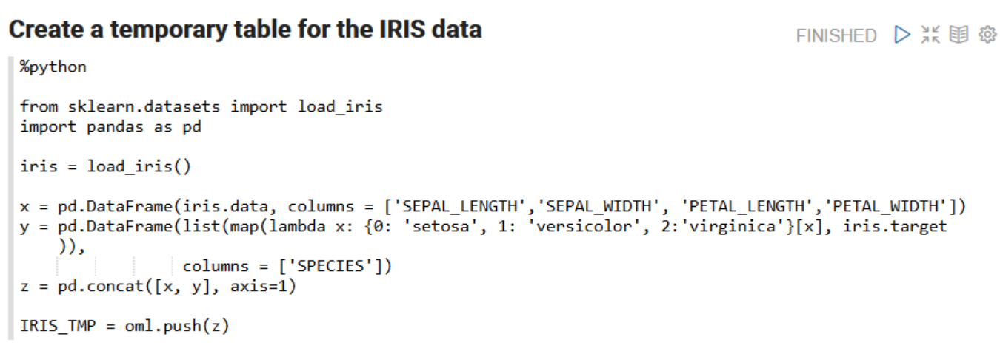   

 2. Run the following script to list all the transparency layer functions:

    ```
    %python

    res = [x for x in IRIS_TMP.__dir__() if not x.startswith('_')]
    res.sort()
    res
    ```

    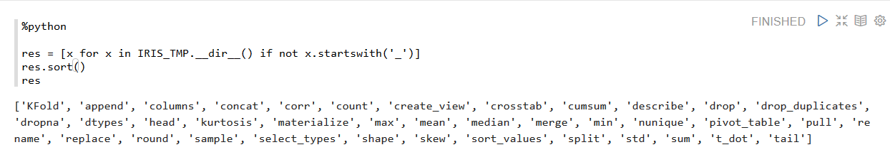   
## **STEP 2:** Select Table Columns using Proxy Object IRIS_TMP
In this step, you will select the first three records for columns `SEPAL_LENGTH` and `PETAL_LENGTH` from the `IRIS_TMP` table.

1. Run the following script to select specific columns by name and return the first three records with the specified column names.
    ```
    %python

    IRIS_projected1 = IRIS_TMP[:, ["SEPAL_LENGTH", "PETAL_LENGTH"]]
    IRIS_projected1.head(3)
    ```
    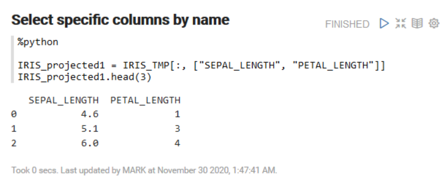
    The script returns the length of the petal and sepal from the IRIS_TMP table.

2. Select the first four columns in `IRIS_TMP` using an index range. Note that Python uses `0` as a starting element for indexing. The starting element is the first column, `SEPAL_LENGTH`. The second element is the second column, `SEPAL_WIDTH`, and so on.
    ```
    %python

    IRIS_projected2 = IRIS_TMP[:, 0:4]
    IRIS_projected2.head(3)
    ```

    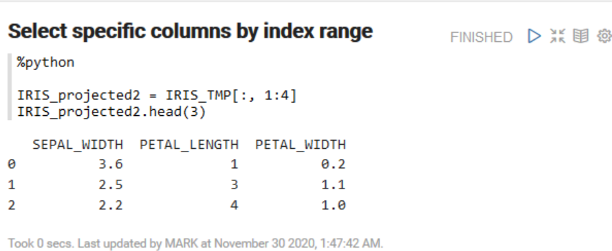
    The script returns the columns by the specified index range.

3. Run the following script to select columns by data type, specifying the data type as `oml.string`.  

    ```
    %python

    IRIS_projected3 = IRIS_TMP.select_types(include=[oml.String])
    IRIS_projected3.head(3)
    ```
    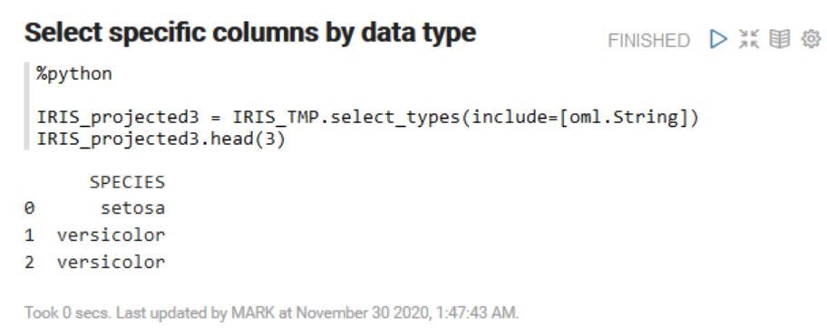
    The script returns the SPECIES column.

## **STEP 3:** Select Table Rows using Proxy Object IRIS_TMP

This step demonstrates how to select table rows using proxy object IRIS_TMP.

1. This step shows how to select `SEPAL_LENGTH` and `PETAL_LENGTH` where petal length is less than 1.5. This is an example of simple row selection. Run the following script:
    ```
    %python

    IRIS_filtered1 = IRIS_TMP[IRIS_TMP["PETAL_LENGTH"] < 1.5, ["SEPAL_LENGTH", "PETAL_LENGTH"]]

    print("Length: ", len(IRIS_filtered1))
    IRIS_filtered1.head(3)
    ```
    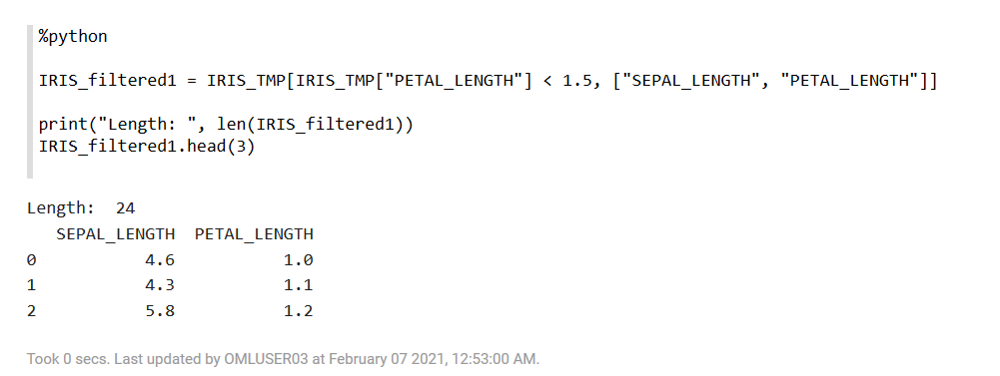
    The script returns the rows with petal length less than 1.5.

2. This step shows an example of a compound row selection using the `OR` filtering condition, denoted by the `|` symbol. Run the following scripts to select all rows in which `PETAL_LENGTH` is less than `1.5` OR `SEPAL_LENGTH` is equal to `5.8`:

    ```
    %python

    IRIS_filtered2 = IRIS_TMP[(IRIS_TMP["PETAL_LENGTH"] < 1.5) | (IRIS_TMP["SEPAL_LENGTH"] == 5.8), :]
    print("Length: ", len(IRIS_filtered2))
    IRIS_filtered2.head(3)
    ```
    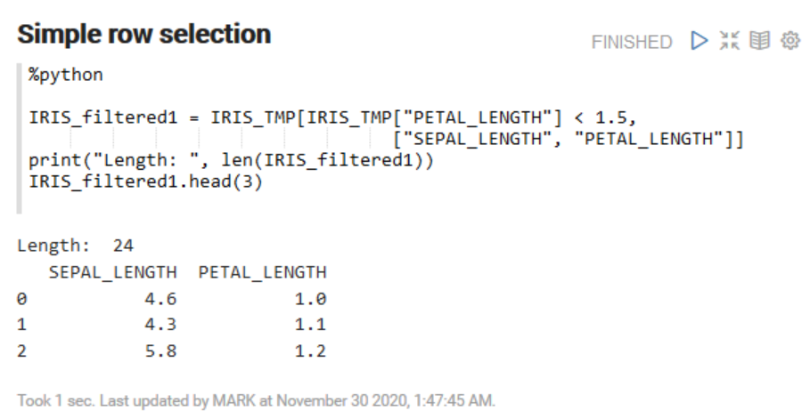
    The script returns the rows where petal length is less than or equal to 5.0.

3. This step shows an example of a compound row selection using `AND`, denoted by the `&` symbol. Run the following script to select all rows in which `PETAL_LENGTH` is less than 1.5 AND `SEPAL_LENGTH` is greater than 5.0:

      ```
      %python

      IRIS_filtered3 = IRIS_TMP[(IRIS_TMP["PETAL_LENGTH"] < 1.5) &
                          (IRIS_TMP["SEPAL_LENGTH"] > 5.0), :]
      print("Length: ", len(IRIS_filtered3))
      IRIS_filtered3.head(4)
      ```
      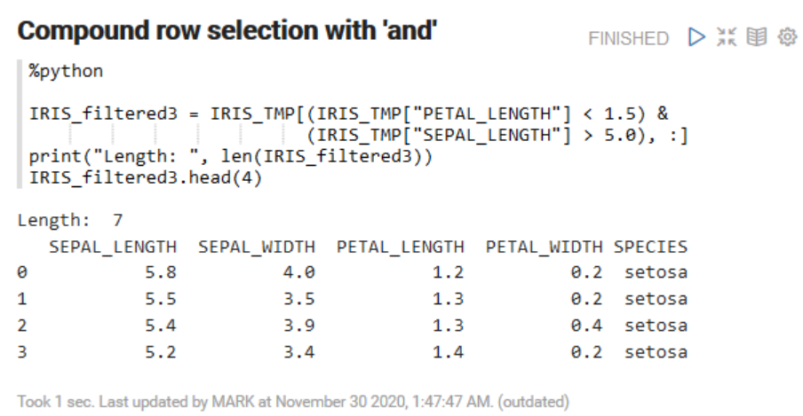
      The script returns the rows where petal length is less than 1.5 and greater than 5.0.

## **STEP 4:** Use Pandas DataFrame objects

You can join data from `oml.DataFrame` objects that represent database tables by using the `append`, `concat`, and `merge` methods.
  * The `append` method appends or adds the other OML data object of the same class to this data object.
  * The `concat` method combines the current OML data object with the other data objects column-wise.
  * The `merge` method joins data sets.

These steps show how to use these methods.

### Step 4.1: Use the append () function

These steps show how to create a temporary table from a Pandas DataFrame and use the `append()` function. The `append` argument is a boolean that specifies whether to append the x data to an existing table.

1. Run the following script to create a temporary table `MY_DF` from a Pandas Dataframe and to print the data type for each column. In addition, this script prints the id column values followed by the `num` column values by using the `append` function.

    ```
    %python

    my_df = pd.DataFrame({"id" : [1, 2, 3, 4, 5],
                          "val" : ["a", "b", "c", "d", "e"],
                          "ch" : ["p", "q", "r", "a", "b"],
                          "num" : [4, 3, 6.7, 7.2, 5]})

    MY_DF = oml.push(my_df)

    print (my_df.dtypes)

    num1 = MY_DF['id']
    num2 = MY_DF['num']
    num1.append(num2)
    ```

    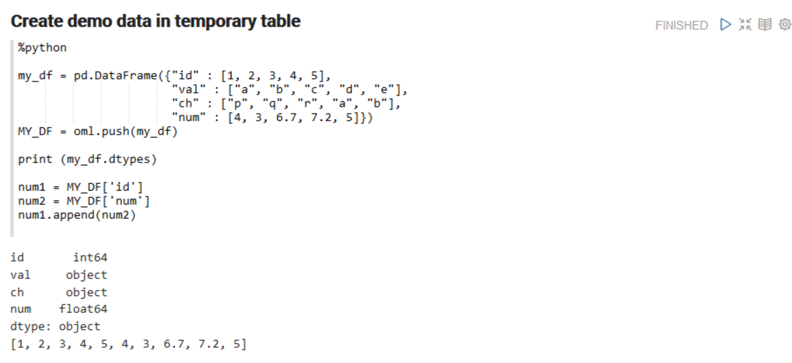
    The script creates the table MY_DF.

2. In this step, you use the `append()` function to append an `oml.Float` series object to another, and then append an `oml.DataFrame` object to another.

    **Note:** An `oml.Float` is numeric series data class that represents a single column of `NUMBER`, `BINARY_DOUBLE`, or `BINARY_FLOAT` database data types.

    ```
    %python

    x = MY_DF[['id', 'val']]
    y = MY_DF[['num', 'ch']]

    print("Types x:\n", x.dtypes)
    print("Types y:\n", y.dtypes)

    x.append(y)
    ```
    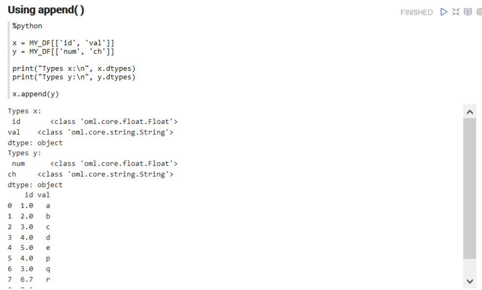
    It creates two new proxy objects with corresponding subset of columns, prints the data type for each column, and then appends the data frame object Y (containing columns num and ch) to X (containing columns id and val).
### Step 4.2: Combine Columns by using the concat method

Use the `concat` method to combine columns from one data frame proxy object with those of another. The `auto_name` argument of the `concat` method controls whether to call automatic name conflict resolution if one or more column names are duplicates in the two data frames. You can also explicitly rename columns by passing in a dictionary that maps strings to objects, as discussed below.

**Note:** To combine two objects with the `concat` method, both objects must represent data from the same underlying database table, view, or query.

1. Use the `concat` function to create two `oml.DataFrame` objects and combine the objects by column.

    ```
    %python

    from collections import OrderedDict

    x = MY_DF[['id', 'val']]
    y = MY_DF[['num', 'ch']]
    x.concat(y)
    ```


  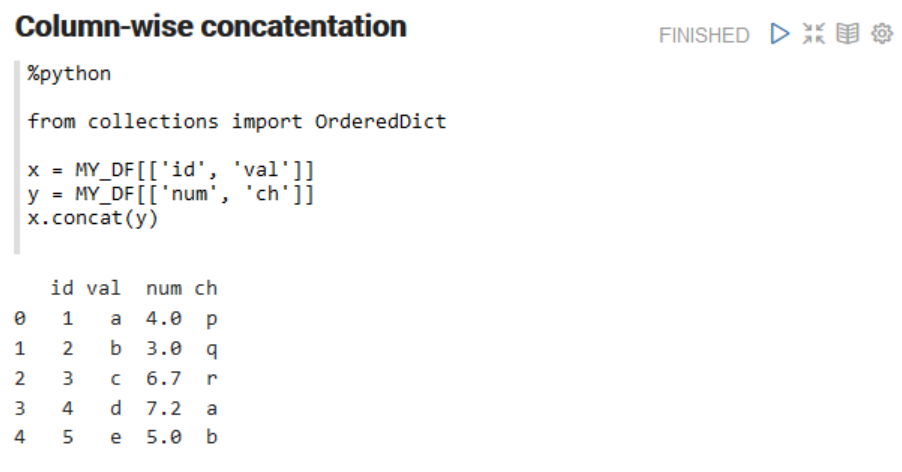
  **Note:** The script automatically prints the result. When there is a single result to show, print command is not needed.

2. This step shows how to create an `oml.Float` object with the rounded exponential of two times the values in the `num` column of the `oml_frame` object, and then concatenate it with the `oml.DataFrame` object `y` using a new column name.
    ```
    %python

    w = (MY_DF['num']*2).exp().round(decimals=2)
    y.concat({'round(exp(2*num))':w})
    ```

  **Note:** An oml.Float is numeric series data class that represents a single column of `NUMBER`, `BINARY_DOUBLE`, or `BINARY_FLOAT` database data types.

  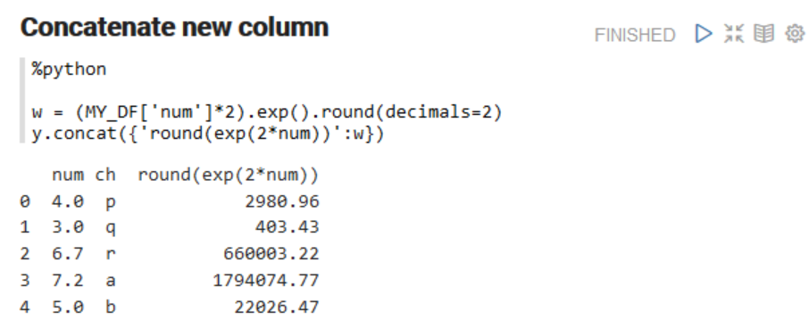

3. Concatenate object x with multiple objects and turn on automatic name conflict resolution. In this example, `auto_name=True` controls whether to call automatic name conflict resolution if one or more column names are duplicates in the two data frames:

    ```
    %python

    MY_DF2 = MY_DF[:,'id']
    x.concat([MY_DF2, w, y], auto_name=True)
    ```

  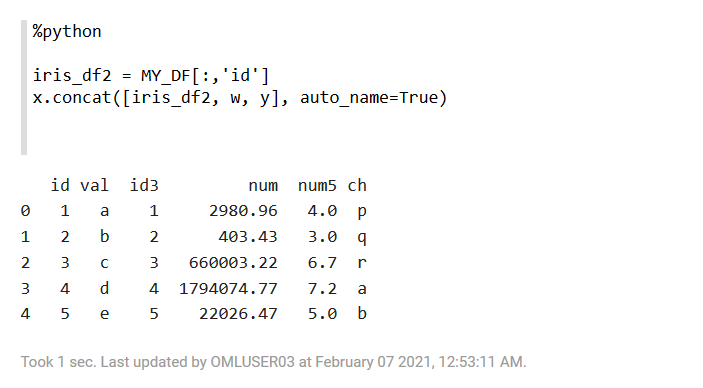

  **Note:** In this example, the `id` and `num` columns are duplicated.
4. Run the following script to concatenate multiple OML data objects and perform customized renaming. Here, you add the word `New` to the duplicate columns and use `OrderedDict` to preserve the order in which the objects are added.

    ```
    %python

    x.concat(OrderedDict([('ID',MY_DF2), ('round(exp(2*num))',w), ('New_',y)]))
    ```

  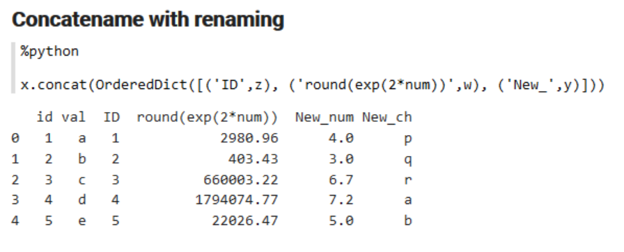


### Step 4.3: Use the merge function

Use the `merge` function to join data from two objects. These examples demonstrate how to use the merge function to perform a cross join and a left outer join from two objects.

1. Run the following script to perform a cross join on the `oml.DataFrame` objects x and y, which creates the `oml.DataFrame` object xy.

    ```
    x = MY_DF[['id', 'val']]
    y = MY_DF[['num', 'ch']]

    xy = x.merge(y)
    xy
    ```

  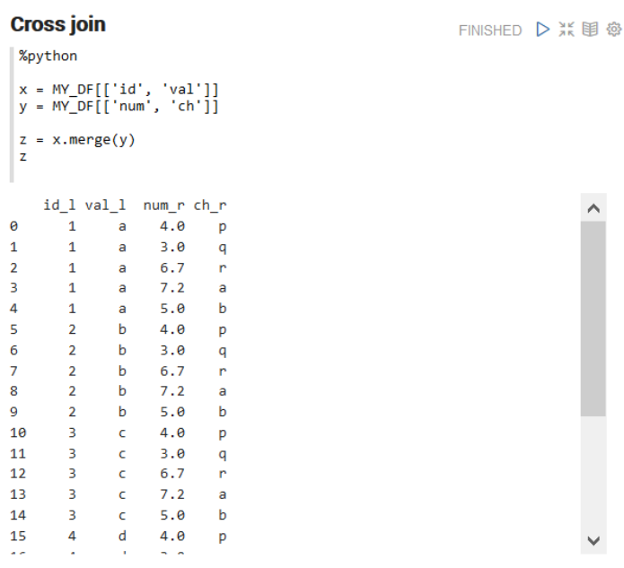


2. Run the following script to perform a left outer join on the first four rows of x with the `oml.DataFrame` object on the shared column id and apply the suffixes `.l` and `.r` to column names on the left and right side, respectively.

  ```
  %python

  x.head(4).merge(other=MY_DF[['id', 'num']], on="id", how='left', suffixes=['.l','.r'])
  ```

  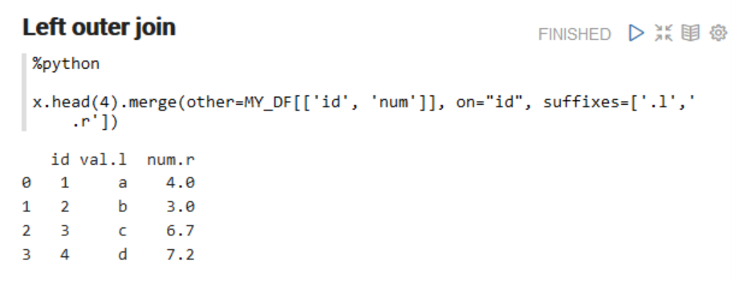
  This example performs a left outer join on the first four rows.  

### **Try it Yourself:** Use the merge function to perform a right outer join
Using the merge help file as a guide, and perform a `merge` with a right outer join on the id column on the left side object `x` and the `num` column on the right side object `y`.

### Step 4.4: Drop rows and columns from a data set

In preparing data for analysis, a typical step is to transform data by dropping some values. You can filter out data that are not needed by using the `drop`, `drop_duplicates`, and `dropna` methods. Use the `oml.drop` function to delete a persistent database table. Use the del statement to remove an oml.DataFrame proxy object and its associated temporary table.

**Note:** `del` does not delete a persistent table.

To work with the drop function, first create a demo data table `MY_DF2.`

1. Run the following script to create the table `MY_DF2` from Pandas dataframe:

    ```
    %python

    my_df2 = pd.DataFrame({'numeric': [1, 1.4, -4, -4, 5.432, None, None],
                         'string1': [None, None, 'a', 'a', 'a', 'b', None],
                         'string2': ['x', None, 'z', 'z', 'z', 'x', None]})


    MY_DF2 = oml.push(my_df2, dbtypes = {'numeric': 'BINARY_DOUBLE',
                                       'string1':'CHAR(1)',
                                       'string2':'CHAR(1)'})

    MY_DF2
    ```
  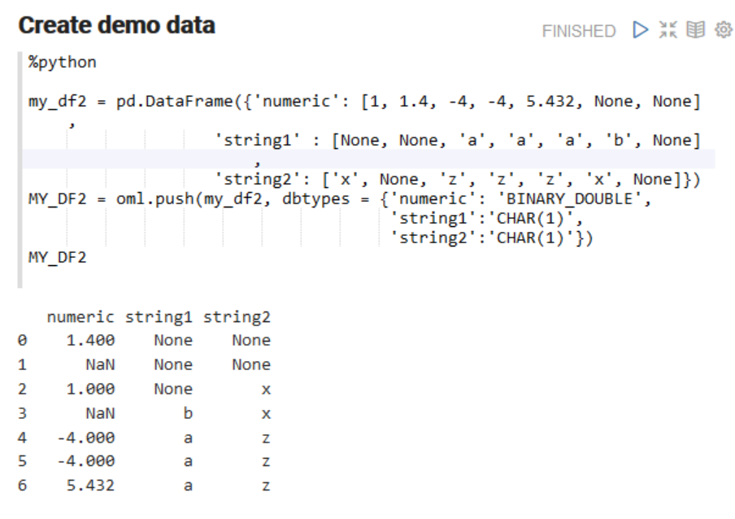

2. Run the script to drop rows with any missing values:

    ```
    %python

    MY_DF2.dropna(how='any')
    ```

  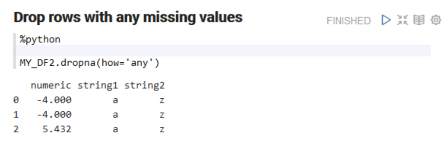

3. Run the following script to drop rows with missing numeric values:

    ```
    %python

    MY_DF2.dropna(how='any', subset=['numeric'])
    ```

    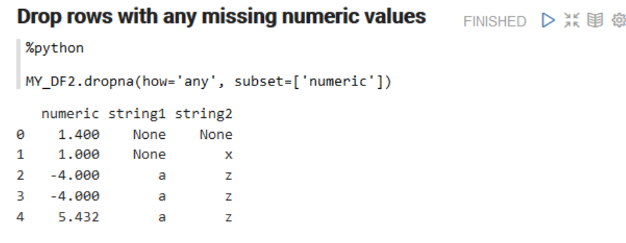

4. Run the following script to drop rows where all columns values are missing:

    ```
    %python

    MY_DF2.dropna(how='all')
    ```

    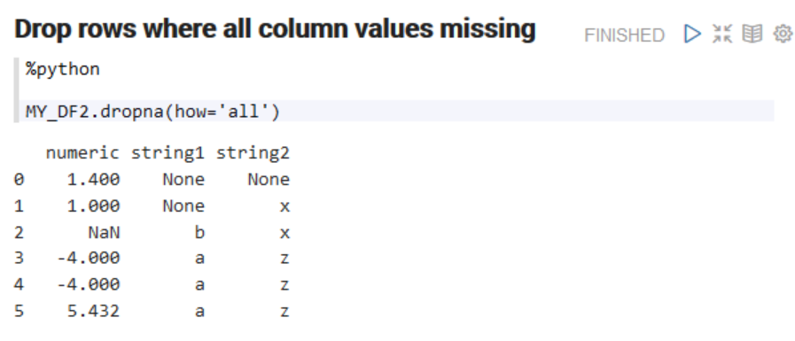

5. Use the `drop_duplicates()` function to drop duplicate rows:

    ```
    %python

    MY_DF2.drop_duplicates()
    ```
    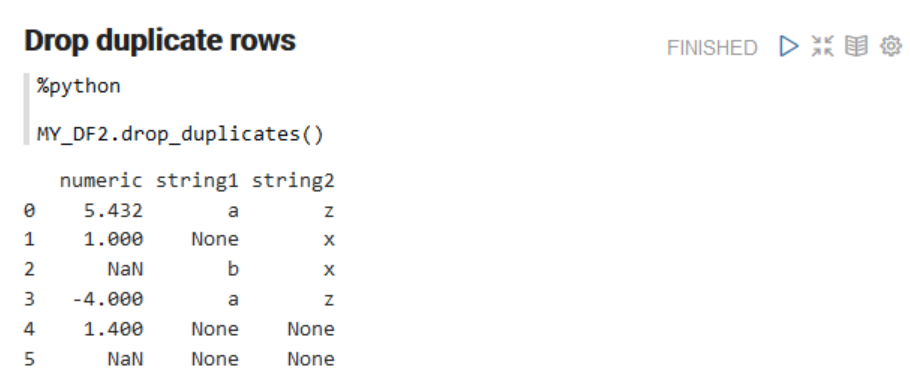

6. Run the following script to drop a specific column:

    ```
    %python

    MY_DF2.drop('string2')
    ```
    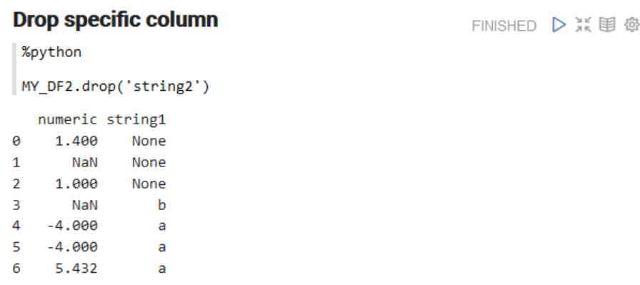

## **STEP 5:** Use the split and KFold functions

This lab demonstrates how to use the `split` and `KFold` function using the digits data set after creating an OML DataFrame proxy object for the digits data set.

The `KFold` method splits the series data object randomly into k consecutive folds for use with k-fold cross validation.
The `split` method splits the series data object randomly into multiple sets.

The following tasks are covered in this lab:
  * Split the data into 80% and 20% samples
  * Perform stratification on the target column
  * Verify that the stratified sampling generates splits in which all of the different categories of digits (digits 0-9) are present in each split
  * Compute Hash on the target column
  * Verify that the different categories of digits (digits 0-9) are present in only one of the splits generated by hashing on the category column
  * Split the data randomly into 4 consecutive folds using `KFold` function.

1. First, use the `oml.sync` function to create a DataFrame proxy object in Python that represents the DIGITS table. The DIGITS table resides in the OMLUSER schema. All database users have been granted read access on the table.

    ```
    %python

    DIGITS = oml.sync("OMLUSER", table = "DIGITS")
    print("Shape: ", DIGITS.shape)
    ```

    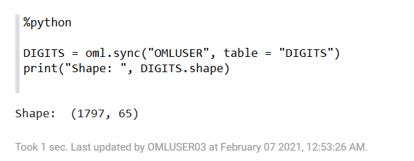

2. Run the following script to split the data set into samples of 20% and 80% size.

    ```
    %python

    splits = DIGITS.split(ratio=(.8, .2), use_hash = False)
    print("Split lengths: ", [len(split) for split in splits])
    ```

    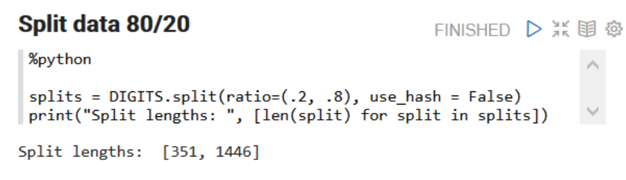

3. Run the following script to perform stratified sampling on the column `target`. In this example, the column in which you perform stratified sampling is `target`. Stratified sampling divides the data into different groups based on shared characteristics prior to sampling, ensuring that members from each subgroup is included in the analysis.

    ```
    %python

    splits = DIGITS.split(strata_cols=['target'])
    print("Split lengths: ", [split.shape for split in splits])
    ```

    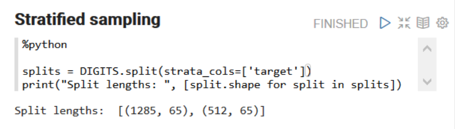

4. Verify that the stratified sampling generates splits in which all of the different categories of digits (digits 0-9) are present in each split

  	 ```
     %python

     print("Verify values: ", [split['target'].drop_duplicates().sort_values().pull() for split in splits])

     ```

     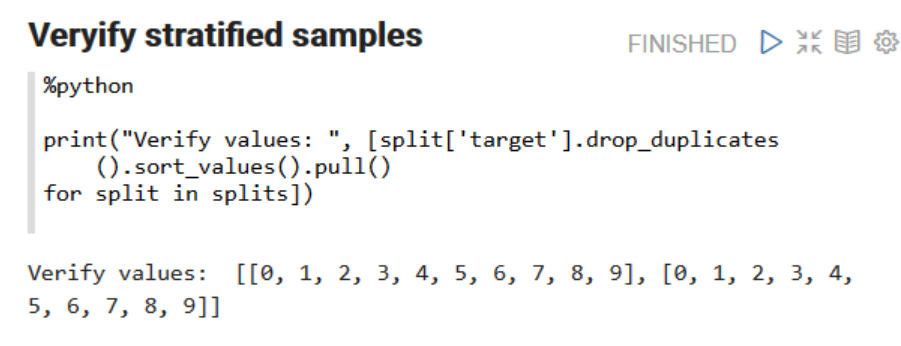
     Here we see that each digit is represented in the split result.

5. Compute hash on the target column.

    ```
    %python

    splits = DIGITS.split(hash_cols=['target'])
    print("Split lengths: ", [split.shape for split in splits])
    ```

    

6. Verify that the different categories of digits (digits 0-9) are present in only one of the splits generated by hashing on the category column:

    ```
    %python

    print("Verify values: ", [split['target'].drop_duplicates().sort_values().pull()
    for split in splits])
    ```

    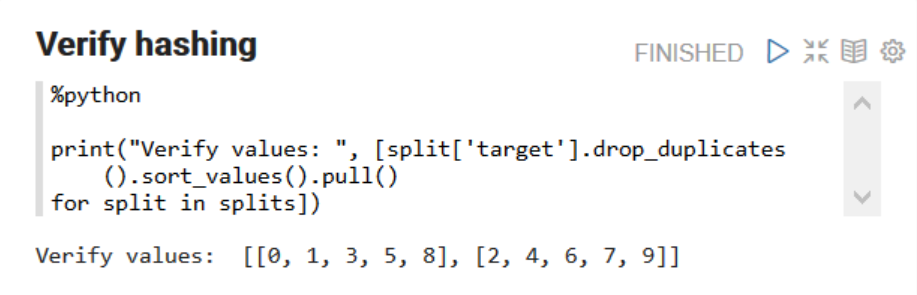

7. Split the data randomly into 4 consecutive folds using the `KFold` function.

    ```
    %python

    folds = DIGITS.KFold(n_splits=4)

    print("Split lengths: ", [(len(fold[0]), len(fold[1]))
    for fold in folds])
    ```

    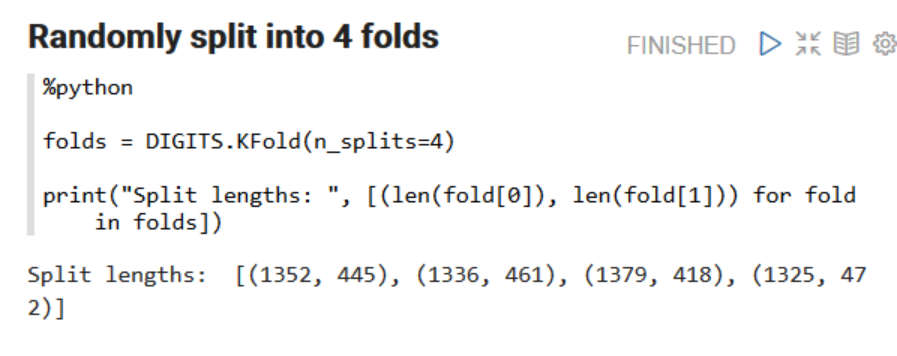

## Try it yourself: Split the digit data set into four even samples of 25% each

## **STEP 6:** Use the crosstab and pivot_table functions on a DataFrame proxy object

This step shows how to use the crosstab method to perform cross-column analysis of an oml.DataFrame object and the `pivot_table` method to convert an oml.DataFrame to a spreadsheet style pivot table.

Cross-tabulation is a statistical technique that finds an interdependent relationship between two columns of values. The `crosstab` method computes a cross-tabulation of two or more columns. By default, it computes a frequency table for the columns unless a column and an aggregation function have been passed to it.

The `pivot_table` method converts a data set into a pivot table. Due to the database 1000 column limit, pivot tables with more than 1000 columns are automatically truncated to display the categories with the most entries for each column value.

1. Create a temporary table `MY_DF4` using a demo data set. This data set reports on the speed and accuracy for a given task characterized by hand used (left or right) and gender (male, female, or not specified).

    ```
    %python
    my_df4 = pd.DataFrame({'GENDER': ['M', 'M', 'F', 'M', 'F', 'M', 'F', 'F', None, 'F', 'M', 'F'],
                         'HAND': ['L', 'R', 'R', 'L', 'R', None, 'L', 'R', 'R', 'R', 'R', 'R'],
                         'SPEED': [40.5, 30.4, 60.8, 51.2, 54, 29.3, 34.1, 39.6, 46.4, 12, 25.3, 37.5],
                         'ACCURACY': [.92, .94, .87, .9, .85, .97, .96, .93, .89, .84, .91, .95]})

    MY_DF4 = oml.push(my_df4)
    ```

  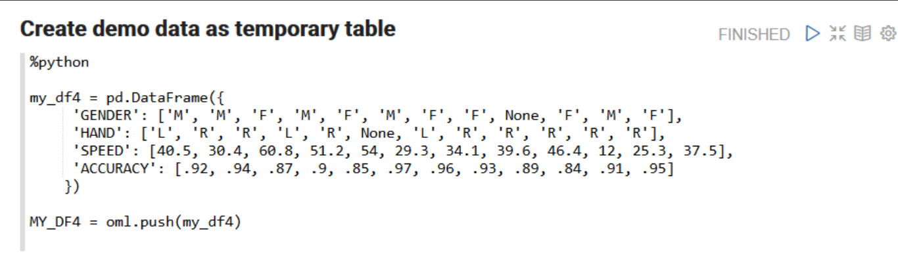

2. Use the `crosstab` function to find the categories that the most entries belonged to. This example shows how to use the `crosstab` function to find the count of gender, and right-handed and left-handed persons in descending order in the MY_DF4 dataframe.  

    ```
    %python

    MY_DF4.crosstab('GENDER', 'HAND').sort_values('count', ascending=False)
    ```  

      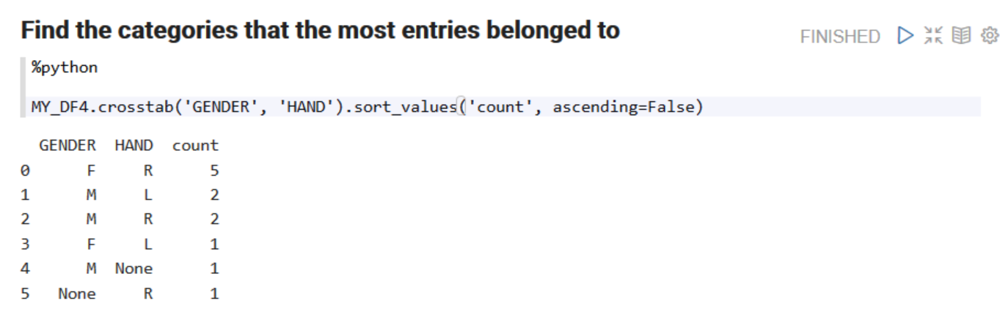

3. Use the `crosstab` function to find the ratio of entries with different hand values for each gender and across entries in the `MY_DF4` dataframe.

    ```
    %python

    MY_DF4.crosstab('GENDER', 'HAND', pivot = True, margins = True, normalize = 0)
    ```

    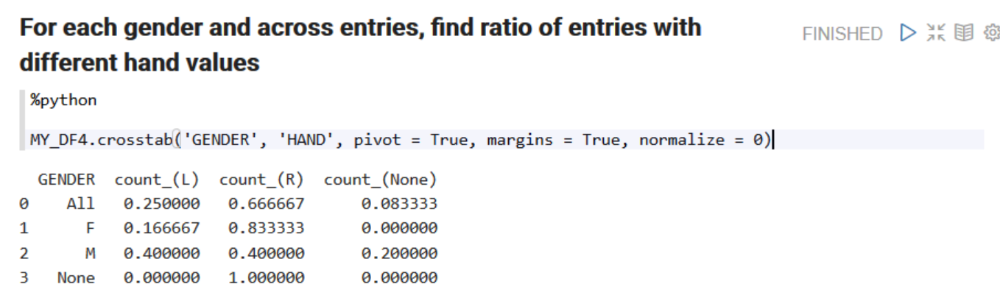

4. Use the `pivot_table` function to find the mean speed across all gender and hand combinations in the `MY_DF4` dataframe.

  	```
    %python

    MY_DF4.pivot_table('GENDER', 'HAND', 'SPEED')
    ```
    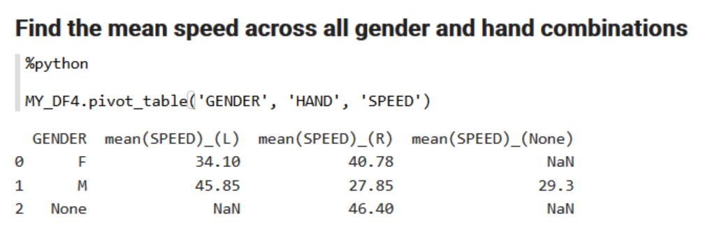

5. Use `pivot_table` function to find the maximum and minimum speed for every gender and hand combination and across all combinations in the `MY_DF4` dataframe:

    ```
    %python

    MY_DF4.pivot_table('GENDER', 'HAND', 'SPEED', aggfunc = [oml.DataFrame.max, oml.DataFrame.min], margins = True)
    ```

    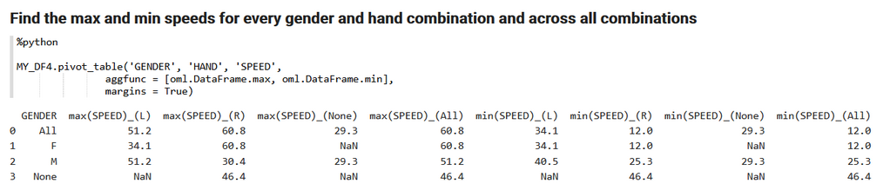

## **STEP 7**: Use the oml.boxplot and oml.hist functions

OML4Py provides functions for rendering graphical displays of data. The `oml.boxplot` and `oml.hist` functions compute the statistics necessary to generate box and whisker plots or histograms in-database for scalability and performance. OML4Py uses the `matplotlib` library to render the output.

This lab demonstrates how to use the `oml.boxplot` and `oml.hist` functions using the wine data set. The statistics supporting these plots are computed in-database, so transfer of data or client side memory limitations are avoided.
1. Import the `matplotlib` library and wine data set from sklearn. Run the following script:

    ```
    %python

    import matplotlib.pyplot as plt

    WINE = oml.sync("OMLUSER", table = "WINE")

    oml.graphics.boxplot(WINE[:,8:12], showmeans=True, meanline=True, patch_artist=True, labels=WINE.columns[8:12])
    plt.title('Distribution of Wine Attributes')
    plt.show()
    ```

    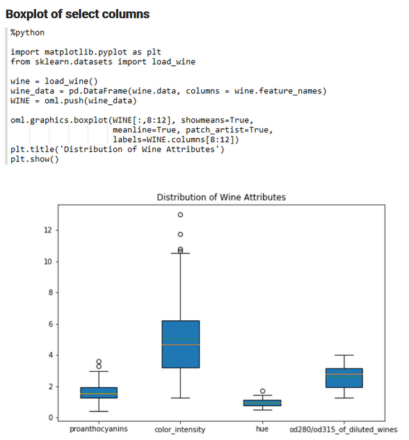


2. Run the following script to render the data in a histogram:

    ```
    %python

    oml.graphics.hist(WINE['proline'], bins=10, color='red', linestyle='solid', edgecolor='black')
    plt.title('Proline content in Wine')
    plt.xlabel('proline content')
    plt.ylabel('# of wine instances')
    plt.show()

    ```
  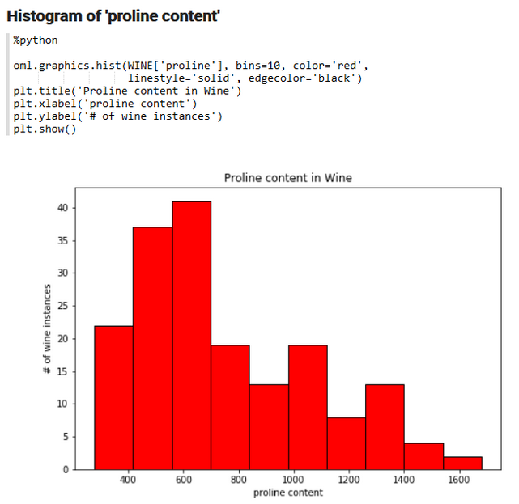

## **STEP 8**: Manage and Explore Data Using Transparency Layer Functions

With the transparency layer classes, you can convert selected Python objects to Oracle Autonomous Database (ADB) objects and also call a range of familiar Python functions that are overloaded to run the corresponding SQL on tables in the database.
  * `oml.create:` Creates a table in the database schema from a Python data set.
  * `oml_object.pull:` Creates a local Python object that contains a copy of data referenced by the `oml` object.
  * `oml.push:` Pushes data from a Python session into an object in a database schema.
  * `oml.sync:` Creates a DataFrame proxy object in Python that represents a database table or view.
  * `oml.dir:` Return the names of `oml` objects in the Python session workspace.
  * `oml.drop:` Drops a persistent database table or view.


### **Step 8.1**: Create and view a persistent database table using oml.create

This example shows how to create a persistent table using the `oml.create` function. The `oml.create` function creates a table in the database schema and returns an `oml.DataFrame` object that is a proxy for the table. The proxy `oml.DataFrame` object has the same name as the table. The resulting table is available from both Python and SQL, even after the session ends - in contrast to the temporary table created when using the `oml.push` function

Use the `z.show` function to automatically pull the desired data to Python for display in the notebook. By doing this, you can also use the built-in Zeppelin visualization options such as bar, pie, area, line, and scatter plots.

1. To create a persistent database table by using `oml.create` function, run the following:

    ```
    %python
    try:
    oml.drop(table="IRIS")
    except:
       pass

    IRIS = oml.create(iris_df, table="IRIS")
    print("Shape:",IRIS.shape)
    z.show(IRIS.head(10))
    ```
   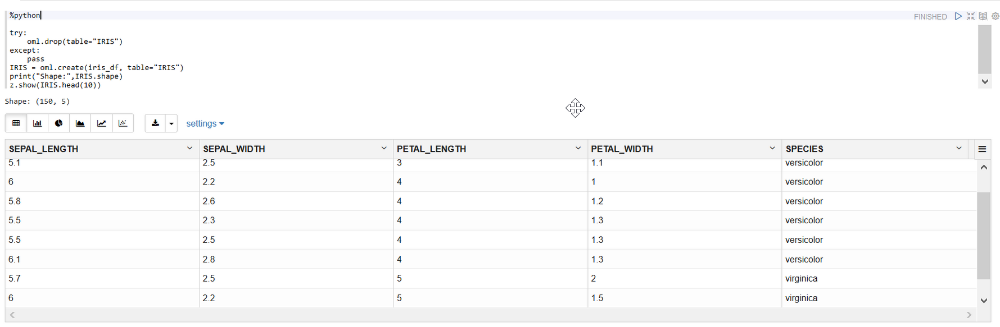

2. Run the following script to view the persistent database table:

    ```
    %python

    list(oml.sync(table=".*", regex_match=True).keys())
    ```
    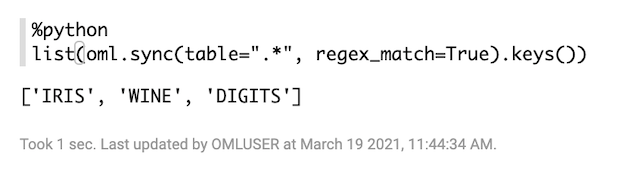

### **Step 8.2:** Use other transparency layer functions
The `oml.cursor()` function returns a cx_Oracle cursor object of the current OML database connection. It can be used to execute queries against Oracle Database.

1. Create a cursor object for the database connection using `oml.cursor` from `cx_Oracle`, then shows the SQL data types of the columns in table IRIS.

    ```
    %python

    cr = oml.cursor()
    _ = cr.execute("select data_type from all_tab_columns where table_name ='IRIS'")
    cr.fetchall()
    ```
    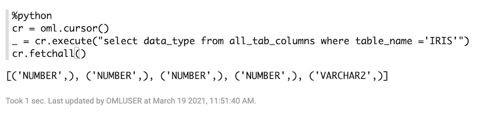

2. To close the cursor, run `cr.close`.

    ```
    %python

    cr.close()
    ```
3. Use the transparency layer function `shape()` to view the shape, or number of rows and columns, of the IRIS table.

    ```
    %python

    IRIS.shape
    ```

    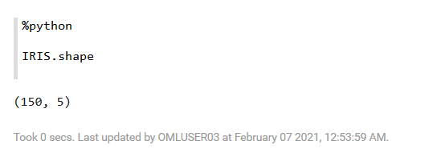
4. Use the transparency layer function `head()` to view the first three rows of the IRIS table.

    ```
    %python

    IRIS.head(n=3)
    ```

    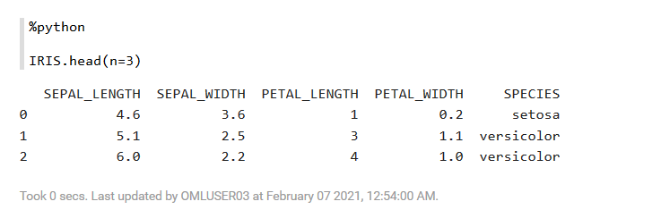

5. Use the transparency layer function `describe()` to calculate descriptive statistics that summarize the central tendency, dispersion, and shape of the IRIS table in each numeric column.

    ```
    %python

    IRIS.describe()
    ```

    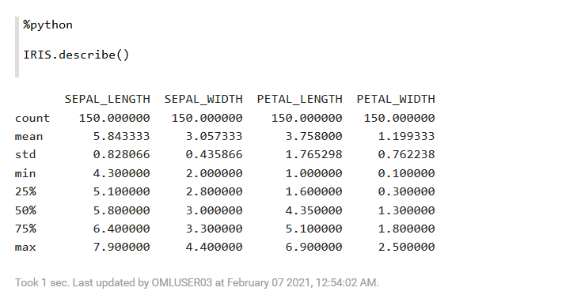

You may now [proceed to the next lab](#next).

## Learn More

* [Transparency Layer Functions](https://docs.oracle.com/en/database/oracle/machine-learning/oml4py/1/mlpug/about-oml4py.html#GUID-2AD97DE9-B43F-4B0B-8269-C6DFB47576A9)
* [Prepare and Explore Data](https://docs.oracle.com/en/database/oracle/machine-learning/oml4py/1/mlpug/prepare-and-explore-data.html#GUID-10C55FA5-2F98-4B52-9C56-4EA43E62D786)
* [Oracle Machine Learning Notebooks](https://docs.oracle.com/en/database/oracle/machine-learning/oml-notebooks/)

## Acknowledgements
* **Author** - Moitreyee Hazarika, Principal User Assistance Developer
* **Contributors** -  Mark Hornick, Senior Director, Data Science and Machine Learning; Marcos Arancibia Coddou, Product Manager, Oracle Data Science; Sherry LaMonica, Principal Member of Tech Staff, Advanced Analytics, Machine Learning
* **Last Updated By/Date** - Moitreyee Hazarika, February 2021
* **Workshop (or Lab) Expiry Date**

## Need Help?
Please submit feedback or ask for help using our [LiveLabs Support Forum](https://community.oracle.com/tech/developers/categories/livelabsdiscussions). Please click the **Log In** button and login using your Oracle Account. Click the **Ask A Question** button to the left to start a *New Discussion* or *Ask a Question*.  Please include your workshop name and lab name.  You can also include screenshots and attach files.  Engage directly with the author of the workshop.

If you do not have an Oracle Account, click [here](https://profile.oracle.com/myprofile/account/create-account.jspx) to create one.
