# Store and manage Python objects and user-defined functions

## Introduction

This lab walks you through the steps to use and work with OML4Py datastores and the script repository.

Estimated Time: 20 minutes

Watch the video below for a quick walk through of the lab.

### About datastores
Datastores exist in the user’s Oracle database schema. A datastore, and the objects it contains, persist in the database until explicitly deleted. By using a datastore, you can store Python objects in a named datastore entry. This named datastore can then be used in subsequent Python sessions, and even be made available to other users or programs by granting/revoking read permissions.

Python objects, including Oracle Machine Learning for Python (OML4Py) proxy objects, exist for the duration of the current Python session unless you explicitly save them. You can save one or more Python objects, including OML proxy objects, to a named datastore and then load those objects in a later Python session. This is also useful when using embedded Python execution.
By using a datastore, you can:
* Save OML4Py and other Python objects for use across Python sessions.
* Grant or revoke read privilege access to a datastore or its objects to one or more users. You can restore the saved objects in another Python session.
* Easily pass multiple and non-scalar arguments to Python functions for use in embedded Python execution from Python, REST, and SQL  API.
      >**Note:** SQL and REST APIs support passing scalar values, such as datastore name or numeric values, only.

* List available datastores and explore datastore contents.

### About the Python script repository

OML4Py stores named user-defined functions called scripts in the script repository. You can make scripts either private or global. A private script is available only to the owner. A global script is available to any user. For private scripts, the owner of the script may grant the read privilege to other users or revoke that privilege.

* `oml.script.create` - Creates a script, which contains a single Python function definition, in the script repository.
* `oml.script.dir` - Lists the scripts present in the script repository.
* `oml.script.drop` - Drops a script from the script repository.
* `oml.script.load` - Loads a script from the script repository into a Python session.
* `oml.grant` - Grants read privilege permission to another user to a datastore or script owned by the current user.
* `oml.revoke` - Revokes the read privilege permission that was granted to another user to a datastore or script owned by the current user.

### Objectives

In this lab, you will learn how to:

**Datastores**
  * Move objects between datastore and a Python sessions
  * Save Python objects in a datastore
  * Save model objects in a datastore
  * Load datastore objects into memory
  * View datastore and its details
  * Manage datastore privileges
  * Delete datastores

**Python script repository**
  * Use the Python Script Repository
  * Create Scripts in Repository
  * Store a function as a global function
  * Drop scripts from the Script Repository

## Access the notebook for this Lab

1. Go back to the main notebooks listing by clicking on the "hamburger" menu (the three lines) on the upper left of the screen, and then select **Notebooks**.

 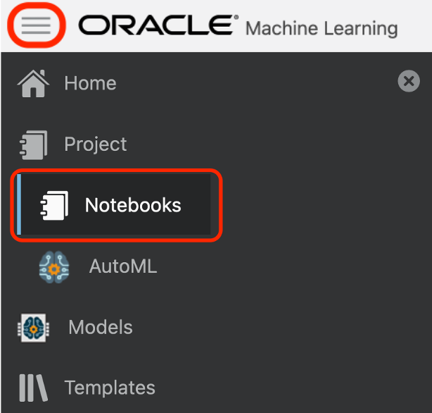

2. Click the **Lab 4 notebook name** to view it.
   <if type="freetier">
   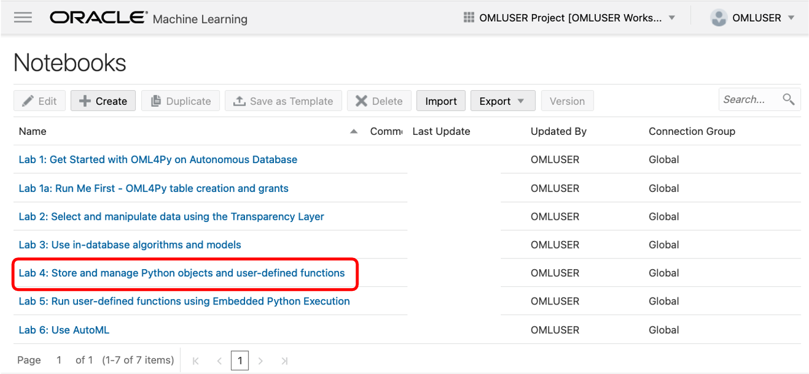 </if>
   <if type="livelabs">
   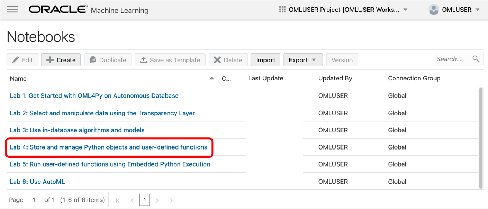 </if>

  OML Notebooks will create a session and make the notebook available for editing.

  You can optionally click the **Run all paragraphs** () icon, and then click **OK** to confirm to refresh the content with your data, or just scroll down and read the pre-recorded results.  
   
  

> **NOTE:** If you had problems downloading and extracting the ZIP file for the labs, please [**CLICK HERE** to download the lab4\_datastores.json notebook file](./../notebooks/lab4_datastores.json?download=1). Download the notebook file for this lab to your local machine and then import it like illustrated in **Lab 1, Task 2**.

## Task 1: Import libraries supporting OML4Py and create data table

Follow the flow of the notebook by scrolling to view and run each paragraph of this lab.

Scroll down to the beginning of Task 1.

  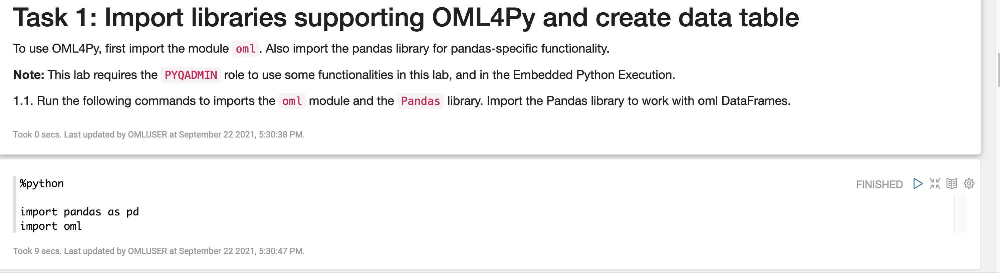  

## Task 2: Create pandas dataFrames and load them into Oracle Autonomous Database

Follow the flow of the notebook by scrolling to view and run each paragraph of this lab.

Scroll down to the beginning of Task 2.

  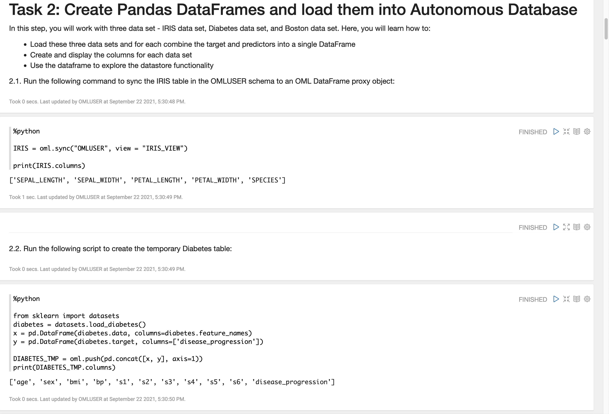  
  
## Task 3: Save Python objects to a datastore instance
Follow the flow of the notebook by scrolling to view and run each paragraph of this lab.

Scroll down to the beginning of Task 3.

  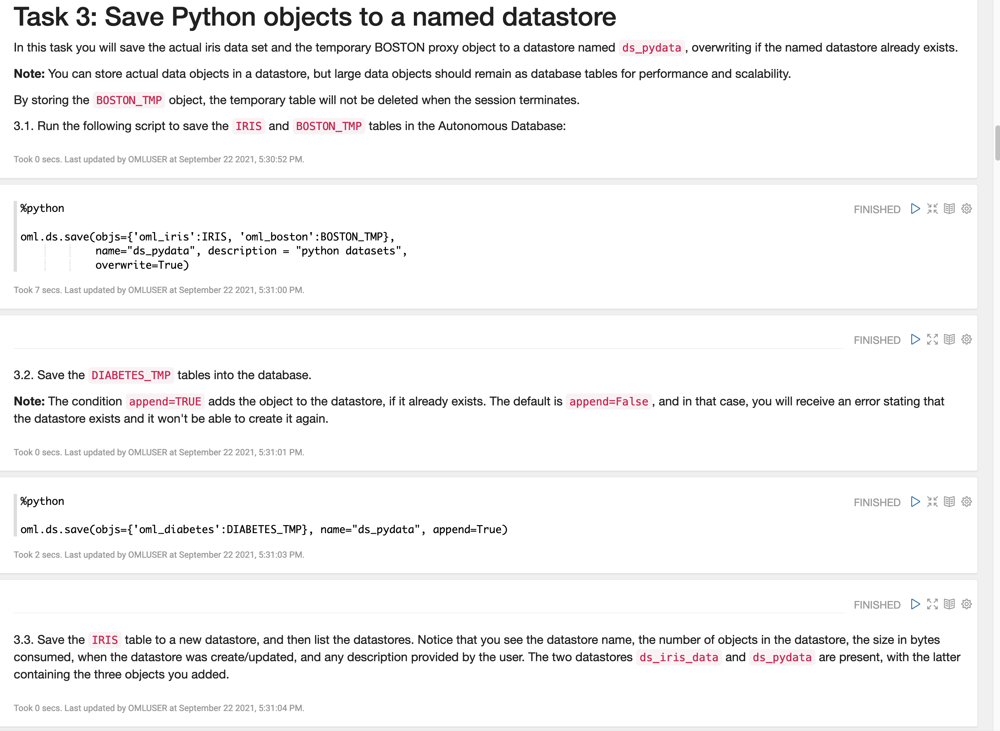  

## Task 4: Save model objects in a datastore instance
Follow the flow of the notebook by scrolling to view and run each paragraph of this lab.

Scroll down to the beginning of Task 4.

  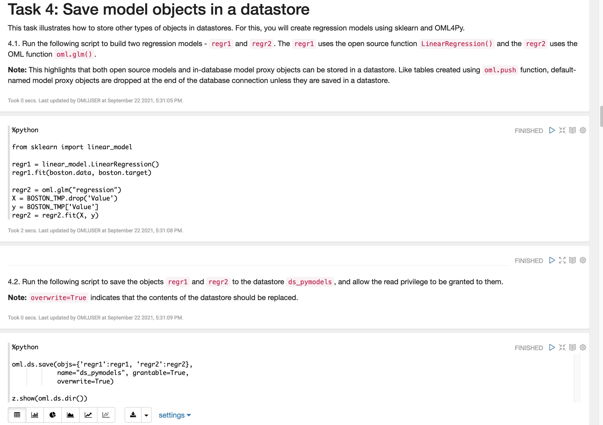  

## Task 5:  Load datastore objects into memory
Follow the flow of the notebook by scrolling to view and run each paragraph of this lab.

Scroll down to the beginning of Task 5.

  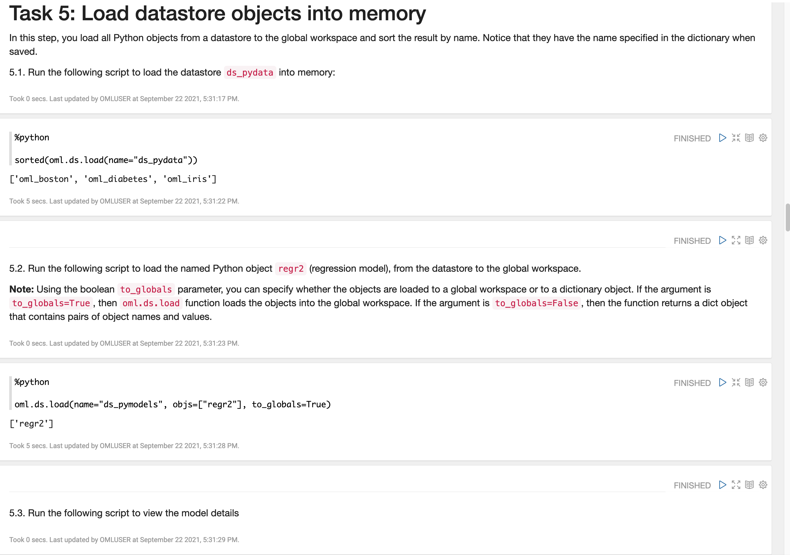  

## Task 6: View datastores and other details
Follow the flow of the notebook by scrolling to view and run each paragraph of this lab.

Scroll down to the beginning of Task 6.

  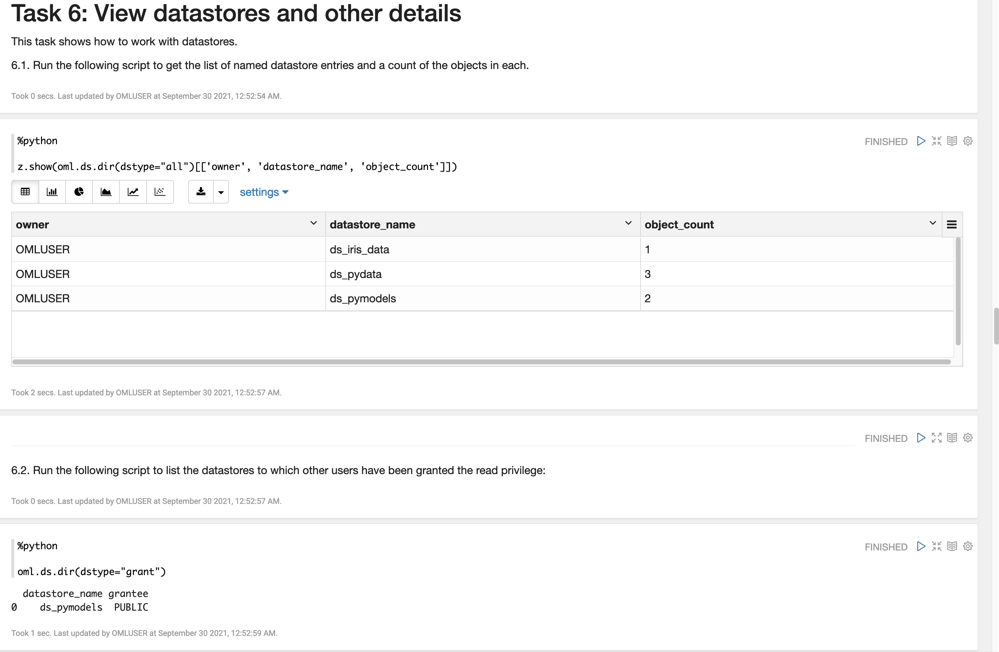  

## Task 7: View contents of a datastore
Follow the flow of the notebook by scrolling to view and run each paragraph of this lab.

Scroll down to the beginning of Task 7.

  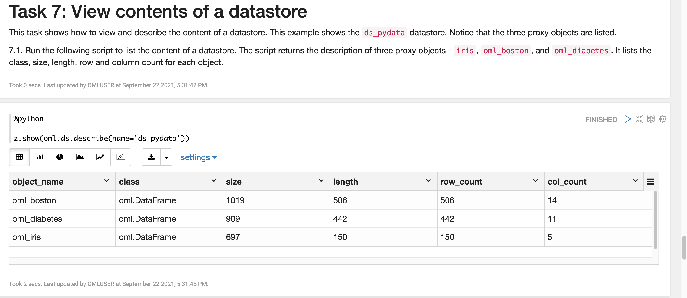     

## Task 8: Manage datastore privileges
Follow the flow of the notebook by scrolling to view and run each paragraph of this lab.

Scroll down to the beginning of Task 8.

  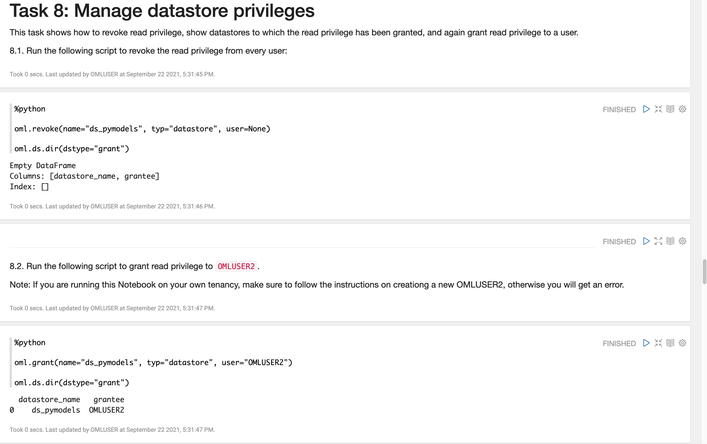  

## Task 9: Delete datastore content
Follow the flow of the notebook by scrolling to view and run each paragraph of this lab.

Scroll down to the beginning of Task 9.

  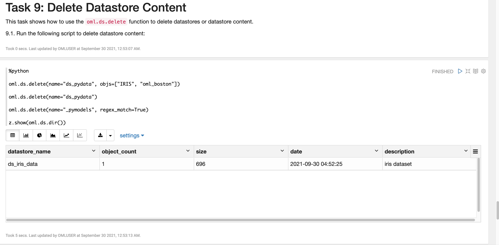

## Task 10: Use the Python Script Repository
Follow the flow of the notebook by scrolling to view and run each paragraph of this lab.

Scroll down to the beginning of Task 10.

  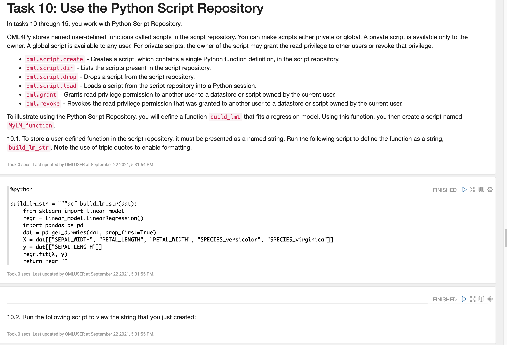  

## Task 11: Create scripts in repository
Follow the flow of the notebook by scrolling to view and run each paragraph of this lab.

Scroll down to the beginning of Task 11.

  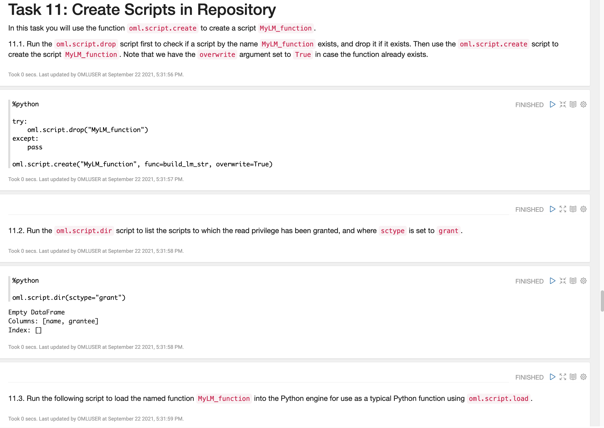  

## Task 12: Store a function as a global function
Follow the flow of the notebook by scrolling to view and run each paragraph of this lab.

Scroll down to the beginning of Task 12.

  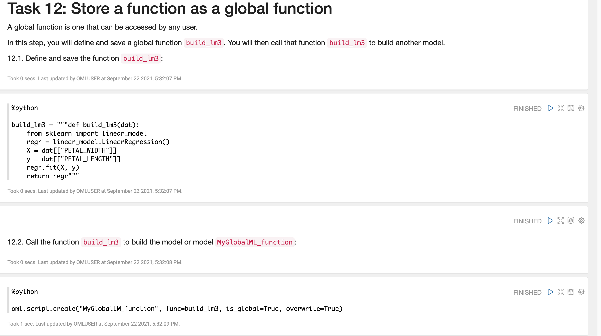  

## Task 13: Drop scripts from the script repository
Follow the flow of the notebook by scrolling to view and run each paragraph of this lab.

Scroll down to the beginning of Task 13.

  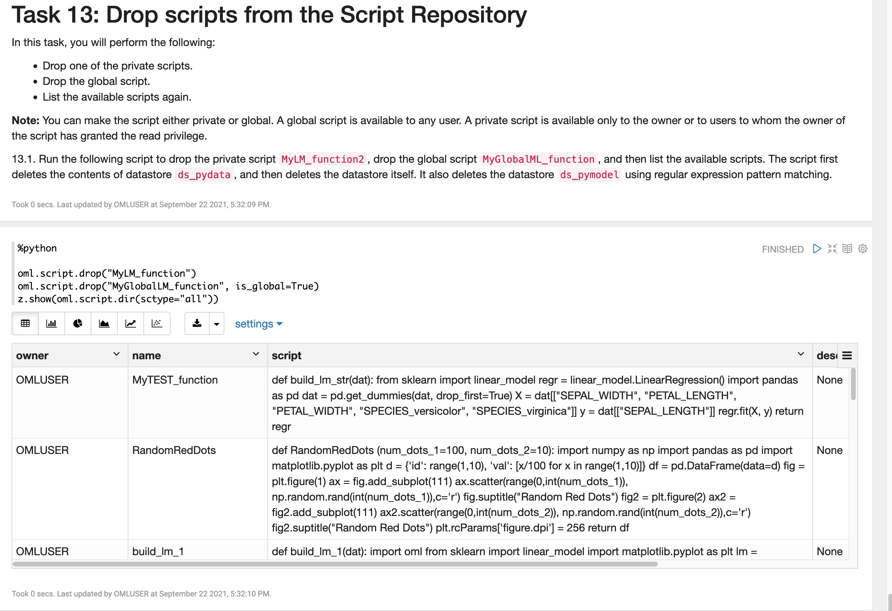  

After you reach the end of Lab 4, you can *proceed to the next lab*.

## Learn More

* [About OML4Py Datastores](https://docs.oracle.com/en/database/oracle/machine-learning/oml4py/1/mlpug/about-oml4py-datastores.html#GUID-9FFB5C75-F8DB-4947-844D-4771475A2B39)
* [Oracle Machine Learning Notebooks](https://docs.oracle.com/en/database/oracle/machine-learning/oml-notebooks/)

## Acknowledgements
* **Authors** - Marcos Arancibia, Product Manager, Machine Learning; Jie Liu, Data Scientist; Moitreyee Hazarika, Principal User Assistance Developer
* **Contributors** -  Mark Hornick, Senior Director, Data Science and Machine Learning; Sherry LaMonica, Principal Member of Tech Staff, Machine Learning
* **Last Updated By/Date** - Marcos Arancibia and Jie Liu, October 2021
