# Use Datastores to store Python objects

## Introduction

This lab walks you through the steps to use and work with datastores.

Estimated Lab Time: 20 minutes

### About Datastore
**Datastores** exist in the user’s Oracle Database schema. A datastore, and the objects it contains, persist in the database until explicitly deleted. By using a datastore, you can store Python objects in a named datastore entry. This named datastore can then be used in subsequent Python sessions, and even be made available to other users or programs by granting/revoking read permissions.

Python objects, including OML4Py proxy objects, exist for the duration of the current Python session unless you explicitly save them. You can save one or more Python objects, including OML proxy objects, to a named datastore and then load those objects in a later Python session. This is also useful when using embedded Python execution.
By using a datastore, you can:
* Save OML4Py and other Python objects for use across Python sessions
* Grant or revoke read privilege access to a datastore or its objects to one or more users. You can restore the saved objects in another Python session.
* Easily pass multiple and non-scalar arguments to Python functions for use in embedded Python execution from Python, REST, and SQL  API. **Note:** SQL and REST APIs support passing scalar values, such as datastore name or numeric values, only.
* List available datastores and explore datastore contents

### Objectives

In this lab, you will learn how to:
* Move objects between datastore and a Python sessions
* Save Python objects in a datastore
* Save model objects in a datastore
* Load datastore objects into memory
* View datastore and its details
* Manage datastore privileges
* Delete datastores


## (Optional) Download and View the Notebook File

To download the notebook version of this lab (without screenshots), click [here](./../notebooks/lab4_datastores.json?download=1).

[](include:import)

## **Step 1**: Import libraries supporting OML4Py and create data table

To use OML4Py, first import the package `oml`. Also import the pandas package for pandas-specific functionality.

>**Note:** This lab requires the `PYQADMIN` role to use some functionalities in this lab, and in the Embedded Python Execution.

1. Run the following commands to imports the `oml` module and the `Pandas` package. Import the Pandas package work with oml DataFrames.

    ```
    <copy>%python

    import pandas as pd
    import oml</copy>
    ```  

## **Step 2:** Create Pandas DataFrames and load them into Autonomous Database

In this step, you will work with three data set - IRIS data set, Diabetes data set, and Boston data set. You will learn how to:

* Load these three data sets and for each combine the target and predictors into a single DataFrame
* Create and display the columns for each data set
* Use the dataframe to explore the datastore functionality

1. Run the following command to sync the IRIS table in the OMLUSER schema to an OML DataFrame proxy object:

    ```
    %python
    <copy>
    IRIS = oml.sync("OMLUSER", view = "IRIS_VIEW")

    print(IRIS.columns)</copy>
    ```
  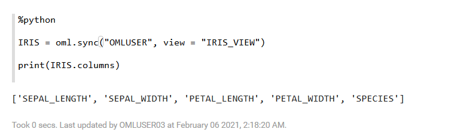

2. Run the following script to create the temporary Diabetes table:
    ```
    %python
    <copy>

    from sklearn import datasets
    diabetes = datasets.load_diabetes()
    x = pd.DataFrame(diabetes.data, columns=diabetes.feature_names)
    y = pd.DataFrame(diabetes.target, columns=['disease_progression'])

    DIABETES_TMP = oml.push(pd.concat([x, y], axis=1))
    print(DIABETES_TMP.columns)</copy>
    ```
     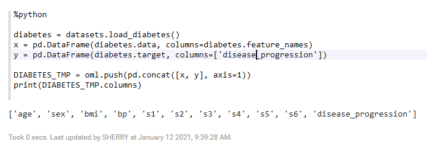  


3. Run the following script to create the Boston table:

    ```
    %python
    <copy>

    boston = datasets.load_boston()
    x = pd.DataFrame(boston.data, columns = boston.feature_names.tolist())
    y = pd.DataFrame(boston.target, columns = ['Value'])

    BOSTON_TMP = oml.push(pd.concat([x, y], axis=1))
    print(BOSTON_TMP.columns)</copy>
    ```
    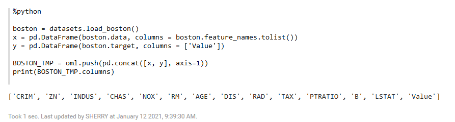

## **Step 3:** Save Python objects to datastore

In this step, you will save the actual Iris data set and the temporary BOSTON proxy object to a datastore named `ds_pydata`, overwriting if the named datastore already exists.

>**Note:** You can store actual data objects in a datastore, but large data objects should remain as database tables for performance and scalability.    

By storing the `BOSTON_TMP` object, the temporary table will not be deleted when the session terminates.

1. Run the following script to save the `IRIS` and `BOSTON_TMP` tables in the Autonomous Database:

    ```
    %python
    <copy>

    oml.ds.save(objs={'oml_iris':IRIS, 'oml_boston':BOSTON_TMP},
                name="ds_pydata", description = "python datasets",
                overwrite=True)</copy>
    ```
2. Save the `DIABETES_TMP` tables into the database.

    ```
    %python
    <copy>

    oml.ds.save(objs={'oml_diabetes':DIABETES_TMP}, name="ds_pydata", append=True)</copy>
    ```

  >**Note:** The condition `append=TRUE` adds the object to the datastore, if it already exists.  The default is `append=False`, and in that case, you will receive an error stating that the datastore exists and it won't be able to create it again.


3. Save the `IRIS` table to a new datastore, and then list the datastores. Notice that you see the datastore name, the number of objects in the datastore, the size in bytes consumed, when the datastore was create/updated, and any description provided by the user. The two datastores `ds_iris_data` and `ds_pydata` are present, with the latter containing the three objects you added.

    ```
    %python
    <copy>

    oml.ds.save(objs={'iris':IRIS},
    name="ds_iris_data", description = "iris dataset", overwrite=True)

    oml.ds.dir()</copy>
    ```
     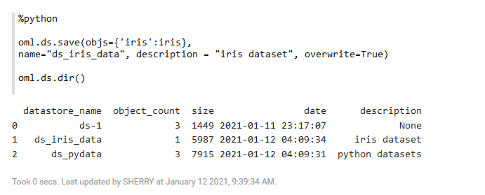

## **Step 4:** Save model objects in a datastore

This step illustrates how to store other types of objects in datastores. For this, you will create regression models using sklearn and OML4Py.

1. Run the following script to build two regression models - `regr1` and `regr2`. The `regr1` uses the open  source function `LinearRegression()` and the `regr2` uses the OML function `oml.glm()`.

    ```
    %python
    <copy>

    from sklearn import linear_model

    regr1 = linear_model.LinearRegression()
    regr1.fit(boston.data, boston.target)

    regr2 = oml.glm("regression")
    X = BOSTON_TMP.drop('Value')
    y = BOSTON_TMP['Value']
    regr2 = regr2.fit(X, y)</copy>
    ```

  >**Note:** This highlights that both open source models and in-database model proxy objects can be stored in a datastore. Like tables created using `oml.push` function, default-named model proxy objects are dropped at the end of the database connection unless they are saved in a datastore.

2. Run the following script to save the objects `regr1` and `regr2` to the datastore `ds_pymodels`, and allow the read privilege to be granted to them.

    ```
    %python
    <copy>

    oml.ds.save(objs={'regr1':regr1, 'regr2':regr2},
                name="ds_pymodels", grantable=True,
                overwrite=True)

    oml.ds.dir()</copy>
    ```
    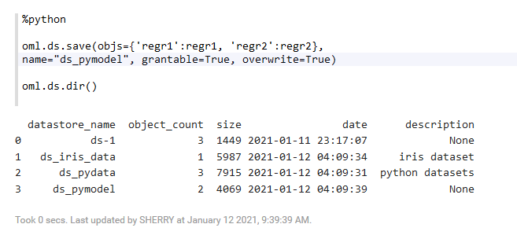  

  >**Note:** `overwrite=True` indicates that the contents of the datastore should be replaced.
    
3. Now grant the read privilege to all users by specifying `user=None`. Finally, list the datastores to which the read privilege has been granted.

    ```
    %python
    <copy>

    oml.grant(name="ds_pymodels", typ="datastore", user=None)

    oml.ds.dir(dstype="grant")</copy>
    ```
        

## **Step 5:**  Load datastore objects into memory

In this step, you load all Python objects from a datastore to the global workspace and sort the result by name. Notice that they have the name specified in the dictionary when saved.

1. Run the following script to load the datastore `ds_pydata` into memory:
    ```
    %python
    <copy>

    sorted(oml.ds.load(name="ds_pydata"))</copy>
    ```  

    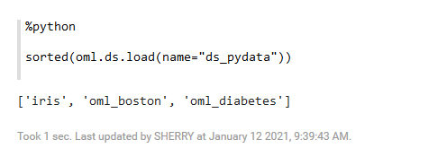      

2. Run the following script to load the named Python object `regr2` (regression model), from the datastore to the global workspace.

    >**Note:** Using the boolean `to_globals` parameter, you can specify whether the objects are loaded to a global workspace or to a dictionary object. If the argument is `to_globals=True`, then `oml.ds.load` function loads the objects into the global workspace. If the argument is `to_globals=False`, then the function returns a dict object that contains pairs of object names and values.

    ```
    %python
    <copy>

    oml.ds.load(name="ds_pymodels", objs=["regr2"], to_globals=True)</copy>
    ```

    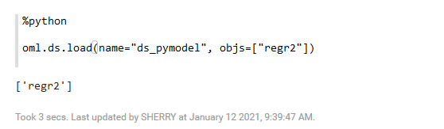

3. Run the following script to view the model details

    ```
    %python
    <copy>

    regr2</copy>
    ```
    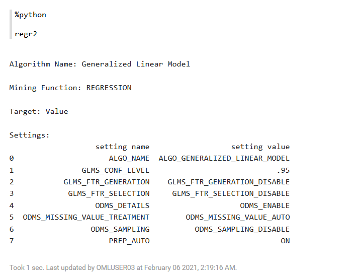
4. Run the following script to load the named Python object `regr1`, from the datastore to the user's workspace.

    >**Note:** Using the boolean `to_globals` parameter, you can specify whether the objects are loaded to a global workspace or to a dictionary object. If the argument is `to_globals=True`, then `oml.ds.load` function loads the objects into the global workspace. If the argument is `to_globals=False`, then the function returns a dict object that contains pairs of object names and values.

    ```
    %python
    <copy>

    oml.ds.load(name="ds_pymodels", objs=["regr1"], to_globals=False)</copy>
    ```
  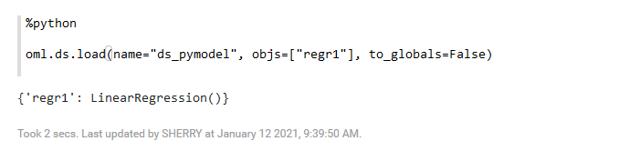

## **Step 6:** View datastores and other details

This step shows how to work with datastores.

1. Run the following script to get the list of datastore and a count of the objects in it:
    ```
    %python
    <copy>

    oml.ds.dir(dstype="all")[['owner', 'datastore_name', 'object_count']]</copy>
    ```
    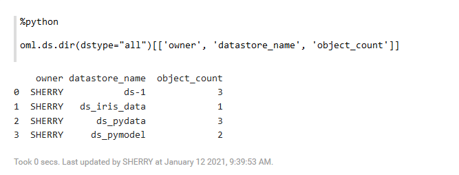

2. Run the following script to list the datastores to which other users have been granted the read privilege:

    ```
    %python
    <copy>

    oml.ds.dir(dstype="grant")</copy>
    ```
    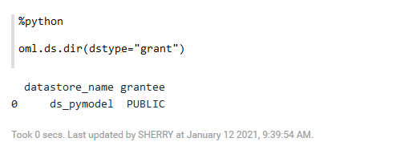

## **Step 7:** View contents of a datastore

This step shows how to view/describe the content of a datastore. This example shows the `ds_pydata` datastore. Notice that the three proxy objects are listed.

1. Run the following script to list the content of a datastore:
    ```
    %python
    <copy>

    oml.ds.describe(name='ds_pydata')</copy>
    ```

    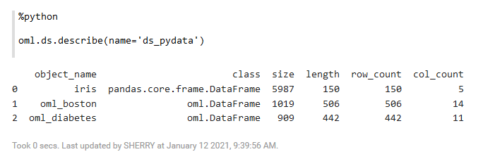

  The script returns the description of three proxy objects - `iris`, `oml_boston`, and `oml_diabetes`. It lists the class, size, length, row and column count for each object.     

## **Step 8:** Manage datastore privileges

This step shows how to revoke read privilege, show datastores to which the read privilege has been granted, and again grant read privilege to a user.

1. Run the following script to revoke the read privilege from every user:

    ```
    %python
    <copy>

    oml.revoke(name="ds_pymodels", typ="datastore", user=None)

    oml.ds.dir(dstype="grant")</copy>
    ```

    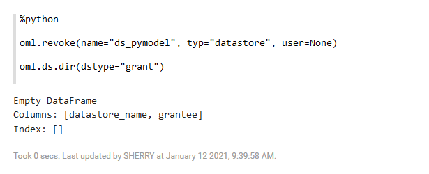        
2. Run the following script to grant read privilege to `OMLUSER2`:

    ```
    %python
    <copy>

    oml.grant(name="ds_pymodels", typ="datastore", user="OMLUSER2")

    oml.ds.dir(dstype="grant")</copy>
    ```
    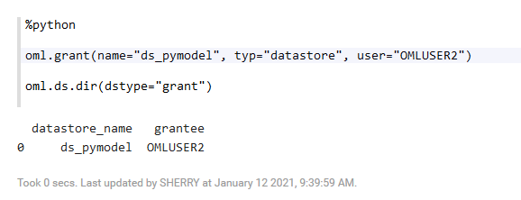        

## **Step 9:** Delete Datastore Content

This step shows how to use the `oml.ds.delete` function to delete datastores or datastore content.

1. Run the following script to delete datastore content:

    ```
    %python
    <copy>

    oml.ds.delete(name="ds_pydata", objs=["IRIS", "oml_boston"])

    oml.ds.delete(name="ds_pydata")

    oml.ds.delete(name="_pymodels", regex_match=True)

    oml.ds.dir()</copy>
    ```
    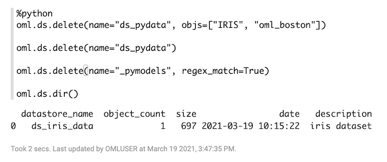

  The script first deletes the contents of datastore `ds_pydata`, and then deletes the datastore itself. It also deletes the datastore `ds_pymodel` using regular expression pattern matching.

## Learn More

* [About OML4Py Datastores](https://docs.oracle.com/en/database/oracle/machine-learning/oml4py/1/mlpug/about-oml4py-datastores.html#GUID-9FFB5C75-F8DB-4947-844D-4771475A2B39)
* [Oracle Machine Learning Notebooks](https://docs.oracle.com/en/database/oracle/machine-learning/oml-notebooks/)

## Acknowledgements
* **Author** - Moitreyee Hazarika, Principal User Assistance Developer
* **Contributors** -  Mark Hornick, Senior Director, Data Science and Machine Learning; Marcos Arancibia Coddou, Product Manager, Oracle Data Science; Sherry LaMonica, Principal Member of Tech Staff, Advanced Analytics, Machine Learning
* **Last Updated By/Date** - Moitreyee Hazarika, July 2021
