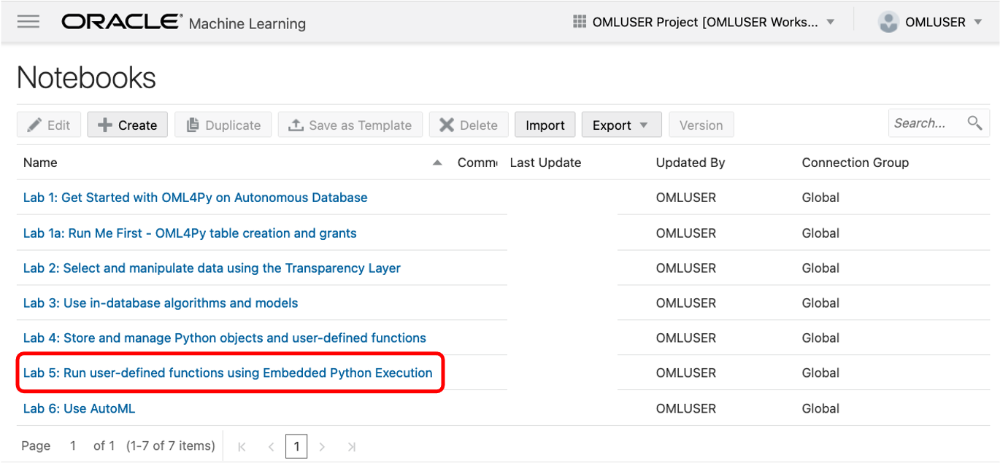
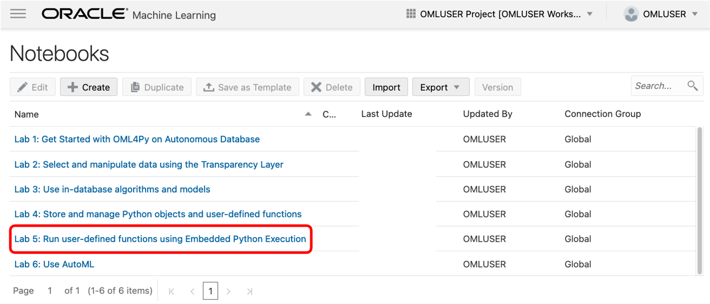
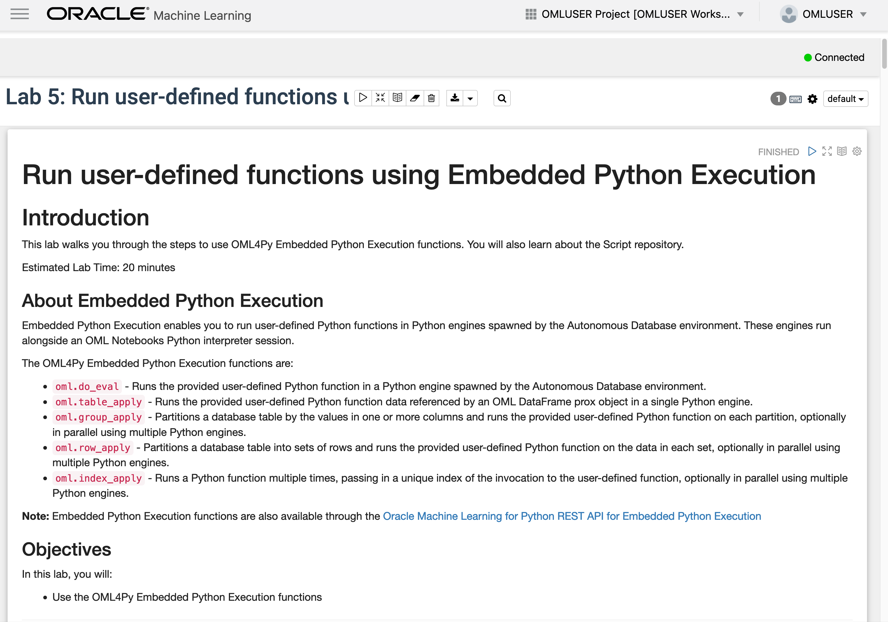
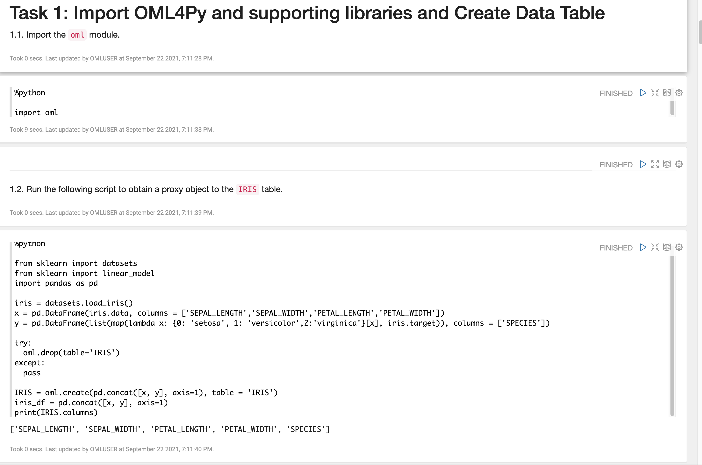
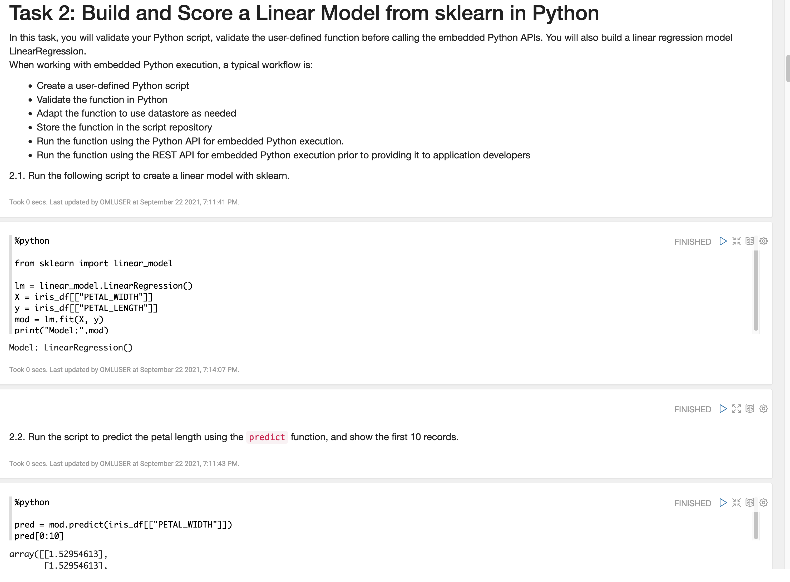
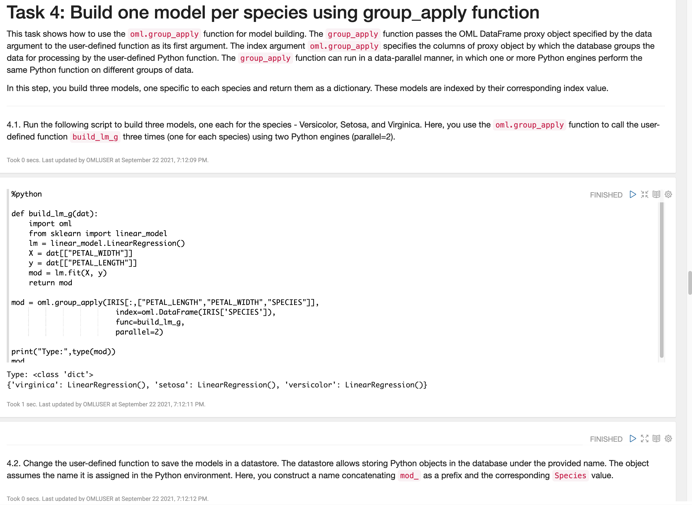
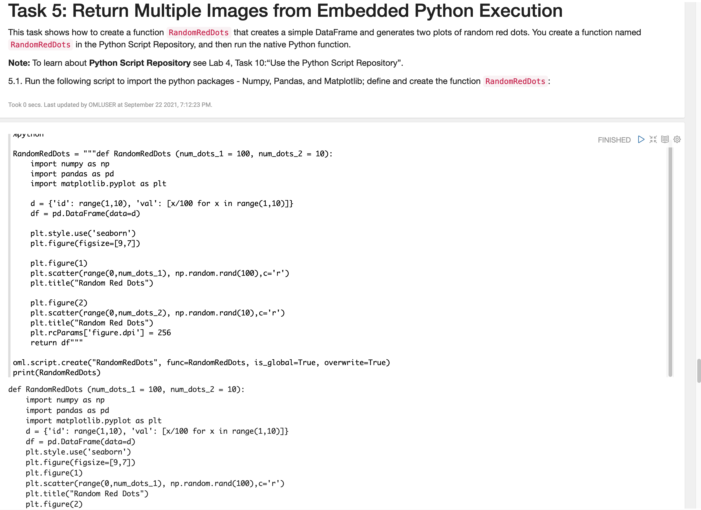

# Run user-defined functions using Embedded Python Execution

## Introduction

This lab walks you through the steps to use OML4Py Embedded Python Execution functions to run custom Python code.

Estimated Time: 20 minutes

Watch the video below for a quick walk through of the lab.

### About Embedded Python Execution
Embedded Python Execution enables you to run user-defined Python functions in Python engines spawned in the Oracle Autonomous Database environment. These engines run alongside an OML Notebooks Python interpreter session.

The OML4Py Embedded Python Execution functions are:

* `oml.do_eval`&mdash;Calls a Python function in Python engines spawned by the Oracle Autonomous Database environment.
* `oml.group_apply`&mdash;Partitions a database table by the values in one or more columns and runs the provided user-defined Python function on each partition.
* `oml.index_apply`&mdash;Calls a Python function multiple times, passing in a unique index of the invocation to the user-defined function.
* `oml.row_apply`&mdash;Partitions a database table into sets of rows and runs the provided user-defined Python function on the data in each set.
* `oml.table_apply`&mdash;Calls a Python function on data in the database as a single pandas.DataFrame in a single Python engine.

> **Note:** Embedded Python Execution functions are also available through the [Oracle Machine Learning for Python REST API for Embedded Python Execution](https://docs.oracle.com/en/database/oracle/machine-learning/oml4py/1/mlepe/rest-endpoints.html).

### Objectives

In this lab, you will:
* Build an open source scikit-learn linear model and scoring script
* Prepare the same script for use with Embedded Python Execution
* Build one model per group using the `group_apply` function
* Return multiple images as a result from Embedded Python Execution

## Access the notebook for this Lab

1. Go back to the main notebooks listing by clicking on the "hamburger" menu (the three lines) on the upper left of the screen, and then select **Notebooks**.

 

2. Click the **Lab 5 notebook name** to view it.
   <if type="freetier">
    </if>
   <if type="livelabs">
    </if>

  OML Notebooks will create a session and make the notebook available for editing.

  You can optionally click the **Run all paragraphs** () icon, and then click **OK** to confirm to refresh the content with your data, or just scroll down and read the pre-recorded results.  

  

> **NOTE:** If you had problems downloading and extracting the ZIP file for the labs, please [**CLICK HERE** to download the lab5\_embed\_python.json notebook file](./../notebooks/lab5_embed_python.json?download=1). Download the notebook file for this lab to your local machine and then import it like illustrated in **Lab 1, Task 2**.

## Task 1: Import OML4Py and supporting libraries and create data table

Follow the flow of the notebook by scrolling to view and run each paragraph of this lab.

Scroll down to the beginning of Task 1.

    

## Task 2: Build and score a linear model from sklearn in Python
Follow the flow of the notebook by scrolling to view and run each paragraph of this lab.

Scroll down to the beginning of Task 2.

  

## Task 3: Build the model using Embedded Python Execution
Follow the flow of the notebook by scrolling to view and run each paragraph of this lab.

Scroll down to the beginning of Task 3.

  

## Task 4: Build one model per species using group_apply function
Follow the flow of the notebook by scrolling to view and run each paragraph of this lab.

Scroll down to the beginning of Task 4.

  

## Task 5: Return multiple images from Embedded Python Execution
Follow the flow of the notebook by scrolling to view and run each paragraph of this lab.

Scroll down to the beginning of Task 5.

  

After you reach the end of Lab 5, you can *proceed to the next lab*.

## Learn more

* [Embedded Python Execution](https://docs.oracle.com/en/database/oracle/machine-learning/oml4py/1/mlpug/embedded-python-execution.html#GUID-4FF75B48-6135-4219-A663-AFFBC0F4E9B6)
* [Oracle Machine Learning Notebooks](https://docs.oracle.com/en/database/oracle/machine-learning/oml-notebooks/)

## Acknowledgements
* **Author** - Marcos Arancibia, Product Manager, Machine Learning; Jie Liu, Data Scientist; Moitreyee Hazarika, Principal User Assistance Developer
* **Contributors** -  Mark Hornick, Senior Director, Data Science and Machine Learning; Sherry LaMonica, Principal Member of Tech Staff, Advanced Analytics, Machine Learning
* **Last Updated By/Date** - Marcos Arancibia and Jie Liu, October 2021
