# Run user-defined functions using Embedded Python Execution

## Introduction

This lab walks you through the steps to use OML4Py Embedded Python Execution functions. You will also learn about the Script repository.

Estimated Lab Time: 30 minutes

### About Embedded Python Execution
Embedded Python Execution enables you to run user-defined Python functions in Python engines spawned in the Oracle Autonomous Database environment. These engines run alongside an OML Notebooks Python interpreter session.

The OML4Py Embedded Python Execution functions are:

* `oml.do_eval`&mdash;Calls a Python function in Python engines spawned by the Oracle Autonomous Database environment.
* `oml.group_apply`&mdash;Partitions a database table by the values in one or more columns and runs the provided user-defined Python function on each partition.
* `oml.index_apply`&mdash;Calls a Python function multiple times, passing in a unique index of the invocation to the user-defined function.
* `oml.row_apply`&mdash;Partitions a database table into sets of rows and runs the provided user-defined Python function on the data in each set.
* `oml.table_apply`&mdash;Calls a Python function on data in the database as a single pandas.DataFrame in a single Python engine.

> **Note:** Embedded Python Execution functions are also available through the Oracle Machine Learning for Python REST API for Embedded Python Execution.

### About the Python Script Repository
OML4Py stores named user-defined functions called scripts in the script repository.

* `oml.script.create`&mdash;Creates a script, which contains a single Python function definition, in the script repository.
* `oml.script.dir`&mdash;Lists the scripts present in the script repository.
* `oml.script.drop`&mdash;Drops a script from the script repository.
* `oml.script.load`&mdash;Loads a script from the script repository into a Python session.
* `oml.grant`&mdash;Grants read privilege permission to another user to a datastore or script owned by the current user.
* `oml.revoke`&mdash;Revokes the read privilege permission that was granted to another user to a datastore or script owned by the current user.

To illustrate using the Python Script Repository, you will define a function `build_lm1` that will fit a regression model. Using this function, you will then create a script named `MyLM_function`.

### Objectives

In this lab, you will:
* Use the OML4Py Embedded Python Execution functions
* Use the Python Script Repository


## (Optional) Download and View the Notebook File

To download the notebook version of this lab (without screenshots), click [here](./../notebooks/lab5_embed_python.json?download=1).

[](include:import)

## **Step 1**: Import OML4Py and supporting libraries and Create Data Table

In Step 1 to Step 5, you learn about Embedded Python Execution.
In step 6 to 15, you will work with Python Script Repository.

1. Import the `oml` module.
    ```
    <copy>%python

    import oml</copy>
    ```

2. Run the following script to create the `IRIS` table using the iris data set:
    ```
    %python
    <copy>

    from sklearn import datasets
    from sklearn import linear_model
    import pandas as pd

    iris = datasets.load_iris()
    x = pd.DataFrame(iris.data, columns = ['SEPAL_LENGTH','SEPAL_WIDTH','PETAL_LENGTH','PETAL_WIDTH'])
    y = pd.DataFrame(list(map(lambda x: {0: 'setosa', 1: 'versicolor',2:'virginica'}[x], iris.target)), columns = ['SPECIES'])

    try:
      oml.drop(table='IRIS')
    except:
      pass

    IRIS = oml.create(pd.concat([x, y], axis=1), table = 'IRIS')
    iris_df = pd.concat([x, y], axis=1)
    print(IRIS.columns)</copy>
    ```
    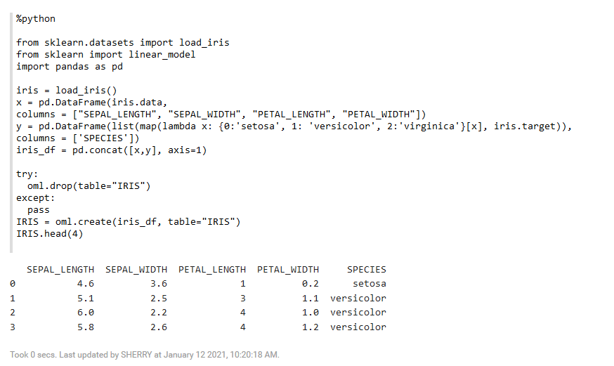

## **Step 2:** Build and Score a Linear Model from sklearn in Python
In this step, you will validate your Python script, validate the user-defined function before calling the embedded Python APIs.  You will also build a linear regression model LinearRegression.
When working with embedded Python execution, a typical workflow is:

  * Create a user-defined Python script
  * Validate the function in Python
  * Adapt the function to use datastore as needed
  * Store the function in the script repository
  * Run the function using the Python API for embedded Python execution.
  * Run the function using the REST API for embedded Python execution prior to providing it to application developers

1. Run the following script to create a linear model with sklearn.
    ```
    %python
    <copy>

    from sklearn import linear_model

    lm = linear_model.LinearRegression()
    X = iris_df[["PETAL_WIDTH"]]
    y = iris_df[["PETAL_LENGTH"]]
    mod = lm.fit(X, y)
    print("Model:",mod)</copy>
    ```
    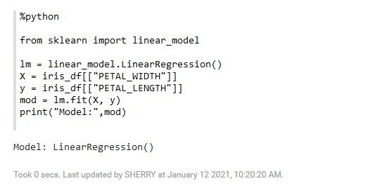

2. Run the script to predict the petal length using the `predict` function:
    ```
    %python
    <copy>

    pred = mod.predict(iris_df[["PETAL_WIDTH"]])
    pred[0:10]</copy>
    ```
    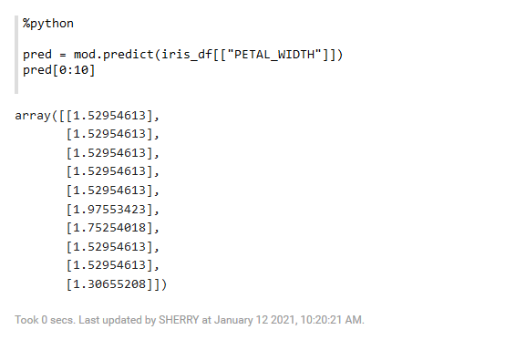

3. Run the following script to assess model quality using mean squared error and R^2:
    ```
    %python
    <copy>

    from sklearn.metrics import mean_squared_error, r2_score

    print('Coefficients: \n', mod.coef_)
    print("Mean squared error: %.2f"
    % mean_squared_error(iris_df[["PETAL_LENGTH"]], pred))

    print('Variance score (1 is perfect prediction): %.2f' % r2_score(iris_df[["PETAL_LENGTH"]], pred))</copy>
    ```
    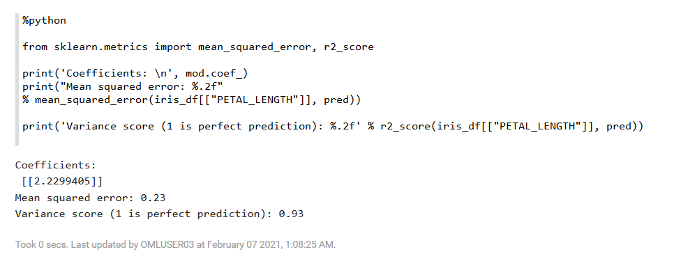

4. Run the following script to generate a scatterplot of the data along with a plot of the regression line:
    ```
    %python
    <copy>

    import matplotlib.pyplot as plt

    plt.scatter(iris_df.loc[:,"PETAL_WIDTH"], iris_df.loc[:,"PETAL_LENGTH"])
    plt.plot(iris_df[["PETAL_WIDTH"]], pred, color='blue', linewidth=3)
    plt.grid(True)
    plt.title('Prediction of Petal Length')
    plt.xlabel('Petal Width')
    plt.ylabel('Petal Length')

    plt.show()</copy>
    ```

   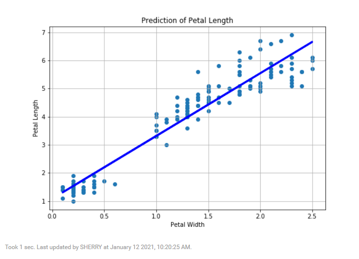

## **Step 3:** Build the model using Embedded Python Execution
In this step, you will build the same linear model, but using the embedded Python execution Python engines under control of the Oracle Autonomous Database environment. You will perform the following tasks:

* Define the function `build_lm_1`, that returns the model as the result. This is referred to as a user-defined function.
* Next, score the training data and plot the model against the data points.

  > **Note:**  The embedded Python execution can return images as well as structured content in the Python API. In the SQL API, as you'll see in another script, you choose between structured data, images, or XML output. Run this function to ensure it returns what is expected; - in this case, it is both an image and a model.

1. Run the script to define the user-defined function `build_lm_1`:   
    ```
    %python
    <copy>

    def build_lm_1(dat):
      import oml
      from sklearn import linear_model
      import matplotlib.pyplot as plt

      lm = linear_model.LinearRegression()
      X = dat[["PETAL_WIDTH"]]
      y = dat[["PETAL_LENGTH"]]
      mod = lm.fit(X, y)

      pred = mod.predict(dat[["PETAL_WIDTH"]])
      plt.scatter(dat.loc[:,"PETAL_WIDTH"], dat.loc[:,"PETAL_LENGTH"])
      plt.plot(dat[["PETAL_WIDTH"]], pred, color='blue', linewidth=3)
      plt.grid(True)
      plt.title('Prediction of Petal Length')

      plt.xlabel('Petal Width')
      plt.ylabel('Petal Length')
      plt.show()
      return mod</copy>
    ```
2. Now, call the user-defined function `build_lm_1` to build the model and plot the petal length predictions:

    ```
    %python
    <copy>

    build_lm_1(iris_df)</copy>
    ```
    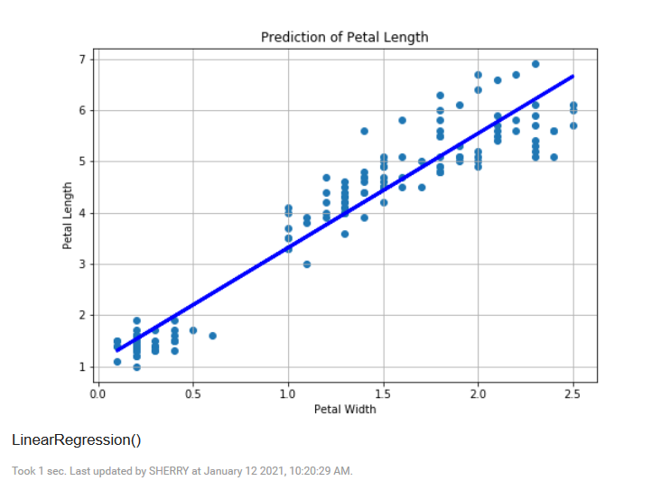

### Use the table_apply Function
3. The `oml.table_apply` function takes the proxy object IRIS as input data and loads that data to the user-defined function as a pandas DataFrame. In this example, the user-defined function is passed as a Python string. You see that the model comes back as an OML object, which you can pull to the client to view the linear model.

    ```
    %python
    <copy>

    import inspect

    build_lm_1 = """def build_lm_1(dat):
      import oml
      from sklearn import linear_model
      import matplotlib.pyplot as plt

      lm = linear_model.LinearRegression()
      X = dat[["PETAL_WIDTH"]]
      y = dat[["PETAL_LENGTH"]]
      mod = lm.fit(X, y)

      pred = mod.predict(dat[["PETAL_WIDTH"]])
      plt.scatter(dat.loc[:,"PETAL_WIDTH"], dat.loc[:,"PETAL_LENGTH"])
      plt.plot(dat[["PETAL_WIDTH"]], pred, color='blue', linewidth=3)
      plt.grid(True)
      plt.title('Prediction of Petal Length')

      plt.xlabel('Petal Width')
      plt.ylabel('Petal Length')
      plt.show()
      return mod"""</copy>
    ```

4. By calling the `table_apply`, a Python engine is spawned and the user-defined function `build_lm_1` is called on that engine with the data referenced by IRIS being passed in as a pandas DataFrame. Part of the return value is the image, which is automatically displayed. In this example, we are passing the function object to the `table_apply` function.

    ```
    %python
    <copy>

    mod = oml.table_apply(data=IRIS, func = build_lm_1)</copy>
    ```
    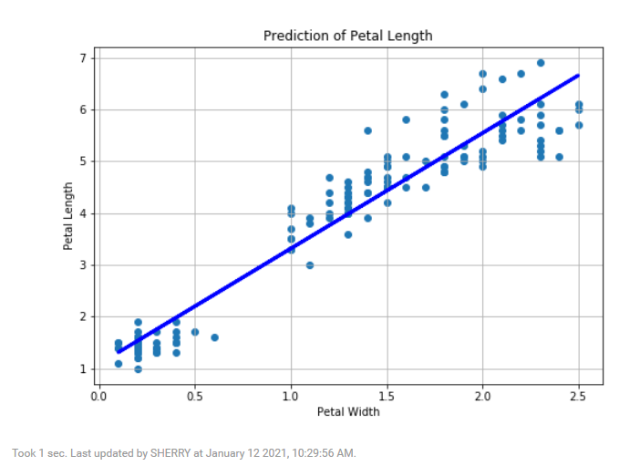

5. Run the following script to print the object, model, type and coefficient.

    ```
    %python
    <copy>

    print("Model:",mod)
    print("Type:",type(mod))
    print("Coefficient", mod.coef_)</copy>
    ```
    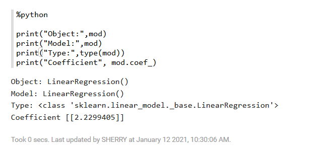

### Use the row_apply Function
6. Use the embedded Python execution function `oml.row_apply` to run a user-defined function on chunks of rows, which is useful to perform scoring in parallel for native Python models. In this example, you pass the function to `row_apply` as a Python function object. Run the following script to define the user-defined function `score_lm_1` to make predictions (score data) using the data set and model passed in as arguments. It returns the predictions as a DataFrame object.

    ```
    %python
    <copy>

    def score_lm_1(dat, model):
      import pandas as pd
      from sklearn import linear_model
      pred = model.predict(dat[["PETAL_WIDTH"]])
      return pd.concat([dat[['SPECIES', 'PETAL_LENGTH']],
      pd.DataFrame(pred, columns=['PRED_PETAL_LENGTH'])], axis=1)</copy>
    ```

7. Use the `row_apply` to call this user-defined function and return a single DataFrame proxy object as the result. The `row_apply` function takes as arguments the proxy object `IRIS`, that we want 10 rows scored at a time (resulting in 15 function calls), the user-defined function, the linear model object, and that we want the result to be returned as a single table by specifying the table definition.

    ```
    %python
    <copy>

    res = oml.row_apply(IRIS, rows=10, func=score_lm_1, model=mod,
                        func_value=pd.DataFrame([('a', 1, 1)],
                        columns=['SPECIES', 'PETAL_LENGTH', 'PRED_PETAL_LENGTH']))
    res.head()</copy>
    ```
    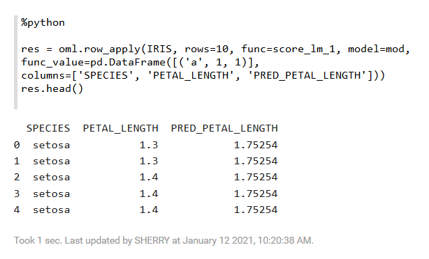

## **Step 4:** Build One Model per Species using Group_Apply Function
This step shows how to use the `oml.group_apply` function for model building. The `group_apply` function passes the `oml.DataFrame` specified by the data argument to the user-defined function as its first argument. The index argument `oml.group_apply` specifies the columns of `oml.DataFrame` by which the database groups the data for processing by the user-defined Python function. The `group_apply` function can use data-parallel execution, in which one or more Python engines perform the same Python function on different groups of data.

In this step, you build three models, one specific to each species and return them as a dictionary. These models are indexed by their corresponding index value.

1. Run the following script to build three models, one each for the species - Versicolor, Setosa, and Virginica. Here, you use the `oml.group_apply` function to call the user-defined function `build_lm_g` three times (one for each species) using two Python engines (parallel=2).
    ```
    %python
    <copy>

    def build_lm_g(dat):
      import oml
      from sklearn import linear_model
      lm = linear_model.LinearRegression()
      X = dat[["PETAL_WIDTH"]]
      y = dat[["PETAL_LENGTH"]]
      mod = lm.fit(X, y)
      return mod

    mod = oml.group_apply(IRIS[:,["PETAL_LENGTH","PETAL_WIDTH","SPECIES"]],
                          index=oml.DataFrame(IRIS['SPECIES']),
                          func=build_lm_g,
                          parallel=2)

    print("Type:",type(mod))
    mod</copy>
    ```
    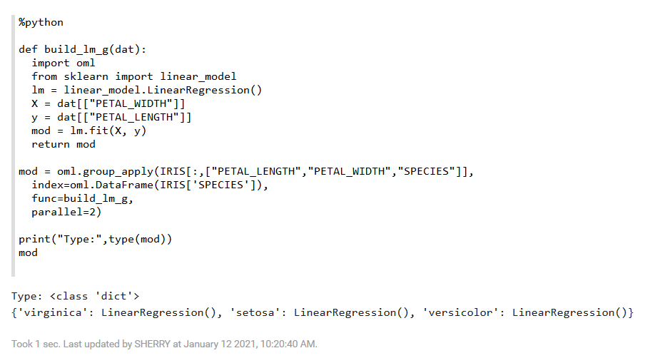


2. Change the user-defined function to save the models in a datastore. The datastore allows storing Python objects in the database under the provided name. The object assumes the name it is assigned in the Python environment. In this example, you construct a name by concatenating `mod_` as a prefix and the corresponding `Species` value.
    ```
    %python
    <copy>

    def build_lm_2(dat, dsname):
      import oml
      from sklearn import linear_model
      lm = linear_model.LinearRegression()
      X = dat[["PETAL_WIDTH"]]
      y = dat[["PETAL_LENGTH"]]
      lm.fit(X, y)
      name = "mod_" + dat.loc[dat.index[0],'SPECIES']
      oml.ds.save(objs = {name: lm}, name=dsname, append=True)
      return name</copy>
    ```
3. Use `group_apply` to call the user-defined function and list the resulting models, which are a dictionary of three elements each assigned the model object name. The `group_apply` function takes the data, the index parameter that specifies the column or columns to partition on, the user-defined function, and the database to which you connect from the Python engine. Connecting to the database is necessary when using the datastore functionality.

    ```
    %python
    <copy>

    try:
      oml.ds.delete('ds-1')
    except:
      print("Datastore not found")

    res = oml.group_apply(IRIS[:,["PETAL_LENGTH","PETAL_WIDTH","SPECIES"]],
                          index=oml.DataFrame(IRIS['SPECIES']),
                          func=build_lm_2, dsname="ds-1")

    print("Outcome:",res)</copy>
    ```

    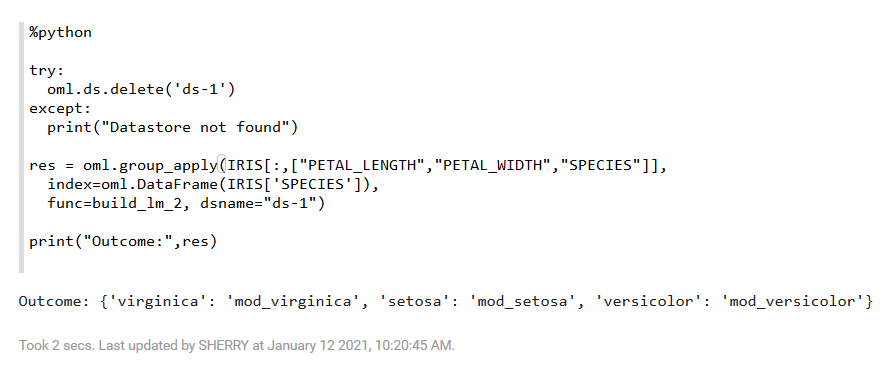

>**Note:** If the datastore exists, then delete it so that the `group_apply` function completes successfully.


Here, the model object names are `mod_versicolor`, `mod_virginica`, and `mod_setosa`.
When you load the datastore, you get the three models loaded into the client Python engine, assigned to their respective variables.
>**Note:** Embedded Python execution can also leverage functions from third-party packages. These packages need to be installed on the database server machine, but can then be used inside the user-defined function as shown here using LinearSVC.

Again, we create this script in the Python script repository and then call it by name using `table_apply`. We then pull the model to the client and view its type.
### **Try it yourself**
Use the `group_apply` function to count the number of each species in the data set.

### Call a function N times
4. The `index_apply` function allows the same function to be called a specified number of times. The first argument to the user-defined function is an index number for the function execution. For example, if the `times` argument is `10`, each function call will receive a distinct value between 1 and 10. This can be used, for instance, for selecting behavior within the function or setting a random seed for Monte Carlo analysis.
    ```
    %python
    <copy>

    def compute_random_mean(index):
        import numpy as np
        import scipy
        from statistics import mean
        np.random.seed(index)
        res = np.random.random((100,1))*10
        return mean(res[1])

    print("Test: ", compute_random_mean(3))

    res = oml.index_apply(times=12, func=compute_random_mean)
    res</copy>
    ```
    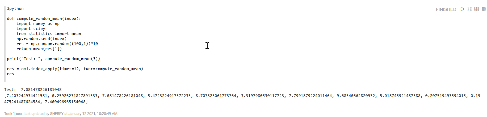

### **Try it yourself**
Use the `group_apply` function to count the number of each species in the data set.

## **Step 5:** Return Multiple Images from Embedded Python Execution
This step shows how to create a function `RandomRedDots` that creates a simple DataFrame and generates two plots of random red dots. You create a function named `RandomRedDots` in the Python Script Repository, and then run the native Python function.

>**Note:** To know about **Python Script Repository**, go to step 6 in this lab.

1. Run the following script to import the python packages - Numpy, Pandas, and Matplotlib; define and create the function `RandomRedDots`:

    ```
    %python
    <copy>RandomRedDots = """def RandomRedDots (num_dots_1 = 100, num_dots_2 = 10):
      import numpy as np
      import pandas as pd
      import matplotlib.pyplot as plt

      d = {'id': range(1,10), 'val': [x/100 for x in range(1,10)]}
      df = pd.DataFrame(data=d)

      plt.figure(1)
      plt.scatter(range(0,num_dots_1), np.random.rand(100),c='r')
      plt.title("Random Red Dots")

      plt.figure(2)  
      plt.scatter(range(0,num_dots_2), np.random.rand(10),c='r')
      plt.title("Random Red Dots")
      return df"""

    oml.script.create("RandomRedDots", func=RandomRedDots, is_global=True, overwrite=True)
    print(RandomRedDots)</copy>
    ```
    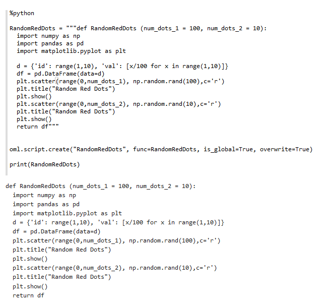

2. Use the `oml.do_eval` function to call the function `RandomRedDots` that you created in step 1:
    ```
    %python
    <copy>

    res = oml.do_eval(func="RandomRedDots", graphics = True)
    print("Type: ", type(res))

    res</copy>
    ```
    The function returns the following:
    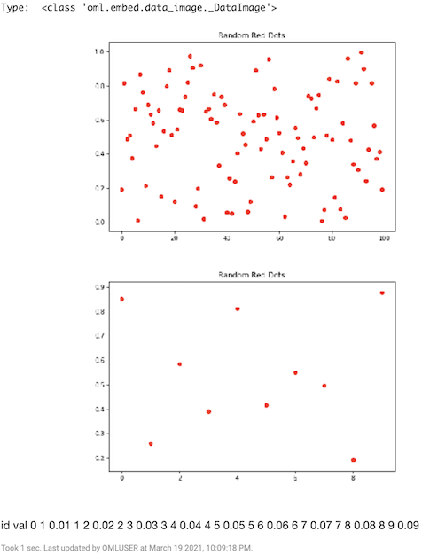

3. In this example, you modify the function to use subplots, thereby creating separate figure objects for the scatter plots. Store this in the script repository as `RandomRedDots2` and call the function to see the results. As expected, you get both plots.
Run the following script to define the `RandomRedDots2` function that generates two scatter plots, and returns a two column DataFrame. Note that you can pass arguments to these functions here, `num_dots_1` and `num_dots_2`.
    ```
    %python
    <copy>

    RandomRedDots2 = """def RandomRedDots2 (num_dots_1 = 100, num_dots_2 = 10):
      import numpy as np
      import pandas as pd
      import matplotlib.pyplot as plt

      d = {'id': range(1,10), 'val': [x/100 for x in range(1,10)]}
      df = pd.DataFrame(data=d)
      fig = plt.figure(1)
      ax = fig.add_subplot(111)
      ax.scatter(range(0,num_dots_1), np.random.rand(num_dots_1),c='r')
      fig.suptitle("Random Red Dots")

      fig2 = plt.figure(2)
      ax2 = fig2.add_subplot(111)
      ax2.scatter(range(0,num_dots_2), np.random.rand(num_dots_2),c='r')
      fig2.suptitle("Random Red Dots")
      return df"""

    oml.script.create("RandomRedDots2", func=RandomRedDots2, is_global=True, overwrite=True)

    print(RandomRedDots2)</copy>
    ```
    >**Note:** When you call `RandomRedDots2` using embedded Python execution, you will get both plots as shown in the result.

    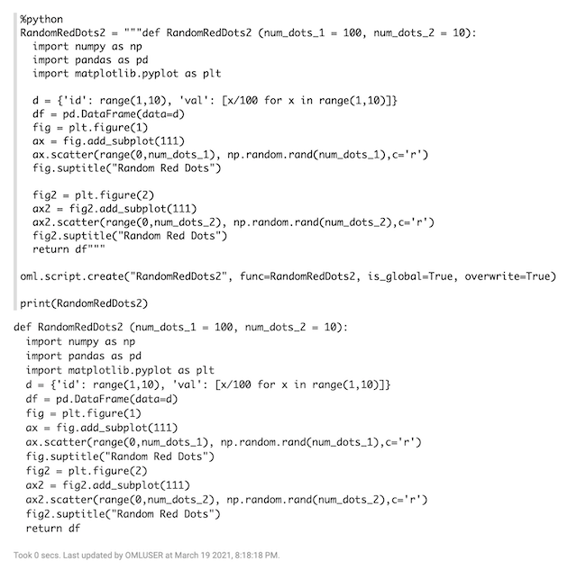


5. Use the `oml.do_eval` function to call the function `RandomRedDots2`. Here, you specify arguments to `do_eval` for `num_dots_1` and `num_dots_2`. These are specified as you would any other argument to `do_eval`. This applies to the other embedded Python functions as well.
    ```
    %python
    <copy>

    res = oml.do_eval(func="RandomRedDots2", graphics = True, num_dots_1 = 600, num_dots_2 = 200)
    print("Type: ", type(res))

    res</copy>
    ```

    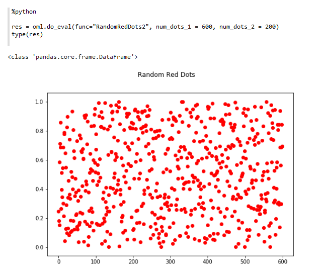


## **Step 6:** Use the Python Script Repository
Step 6 to 15, you will work with Python Script Repository.

OML4Py stores named user-defined functions called scripts in the script repository.  You can make scripts either private or global. A private script is available only to the owner. A global script is available to any user. For private scripts, the owner of the script may grant the read privilege to other users or revoke that privilege.

* `oml.script.create`&mdash;Creates a script, which contains a single Python function definition, in the script repository.
* `oml.script.dir`&mdash;Lists the scripts present in the script repository.
* `oml.script.drop`&mdash;Drops a script from the script repository.
* `oml.script.load`&mdash;Loads a script from the script repository into a Python session.
* `oml.grant`&mdash;Grants read privilege permission to another user to a datastore or script owned by the current user.
* `oml.revoke`&mdash;Revokes the read privilege permission that was granted to another user to a datastore or script owned by the current user.

To illustrate using the Python Script Repository, you will define a function `build_lm1` that will fit a regression model. Using this function, you will then create a script named `MyLM_function`.

1. To store a user-defined function in the script repository, it must be presented as a named string. Run the following script to define the function as a string, `build_lm_str`.

    ```
    %python
    <copy>

    build_lm_str = """def build_lm_str(dat):
      from sklearn import linear_model
      regr = linear_model.LinearRegression()
      import pandas as pd
      dat = pd.get_dummies(dat, drop_first=True)
      X = dat[["SEPAL_WIDTH", "PETAL_LENGTH", "PETAL_WIDTH", "SPECIES_versicolor", "SPECIES_virginica"]]
      y = dat[["SEPAL_LENGTH"]]
      regr.fit(X, y)
      return regr"""</copy>
    ```

>**Note:** The use of triple quotes to enable formatting.


2. Run the following script to view the string that you just created:

    ```
    %python
    <copy>

    print(build_lm_str)</copy>
    ```
    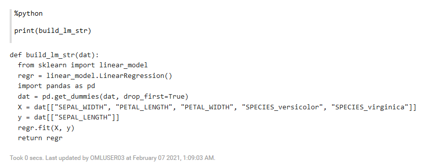

## **Step 7:** Create Scripts in Repository
In this step, you will use the function `oml.script.create` to create a script `MyLM_function`.

1. Run the `oml.script.drop` script first to check if a script by the name `MyLM_function` exists, and drop it if it exists. Then use the `oml.script.create` script to create the script `MyLM_function`. Note that we have the `overwrite` argument set to `True` in case the function already exists.
    ```
    %python
    <copy>    
    try:
      oml.script.drop("MyLM_function")
    except:
      pass

    oml.script.create("MyLM_function", func=build_lm_str, overwrite=True)</copy>
    ```

2. Run the `oml.script.dir` script to list the scripts to which the read privilege has been granted, and where `sctype` is set to `grant`.
    ```
    %python
    <copy>

    oml.script.dir(sctype="grant")</copy>
    ```
    The script returns the following information as shown in the screenshot:

    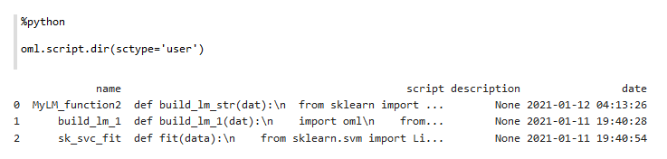

3. Run the following script to load the named function `MyLM_function` into the Python engine for use as a typical Python function using  `oml.script.load`.

    ```
    %python
    <copy>

    import inspect

    MyLM_function = oml.script.load("MyLM_function")
    print("Type", type(MyLM_function))
    MyLM_function.get_source()
    print(str(MyLM_function))
    print(MyLM_function.get_source().read())</copy>
    ```
    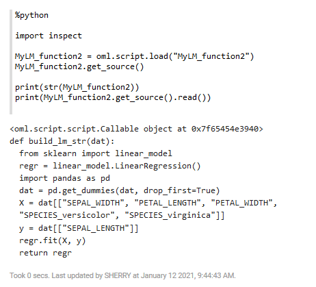
4. Extract the function text string from the function object and use this to save in the script repository using `get_source().read()`.

    ```
    %python
    <copy>

    loaded_str = MyLM_function.get_source().read()
    type(loaded_str)</copy>
    ```
    
5. Run the script `oml.script.create` to create a test function `MyTEST_function`:

    ```
    %python
    <copy>

    oml.script.create("MyTEST_function", func=loaded_str, overwrite=True)</copy>
    ```
6. Use `oml.script.dir` to list all the available scripts.

    ```
    %python
    <copy>

    oml.script.dir(sctype="all")</copy>
    ```
    

7. Call the `table_apply` on `build_lm_str` and `loaded_str` functions. Note that these strings represent the same function `build_lm_str` that was saved to the script repository after assigning the function to a string object. The `loaded_str` is the string representation of the function extracted using `get_source().read()`.

    ```
    %python
    <copy>

    mod1 = oml.table_apply(data=IRIS, func = build_lm_str)
    mod1.coef_</copy>
    ```
    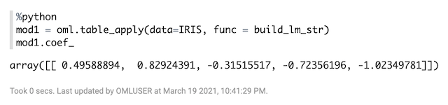

    Run the same function on `loaded_str`:

    ```
    %python
    <copy>

    mod2 = oml.table_apply(data=IRIS, func = loaded_str)
    mod2.coef_</copy>
    ```
    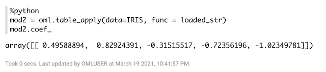

## **Step 8:** Store a function as a global  function

A global function is one that can be accessed by any user.

In this step, you will define and save a global function `build_lm3`. You will then call that function `build_lm3` to build another model.

1. Define and save the function `build_lm3`:
    ```
    %python
    <copy>

    build_lm3 = """def build_lm3(dat):
      from sklearn import linear_model
      regr = linear_model.LinearRegression()
      X = dat[["PETAL_WIDTH"]]
      y = dat[["PETAL_LENGTH"]]
      regr.fit(X, y)
      return regr"""</copy>
    ```

2. Call the function `build_lm3` to build the model or model `MyGlobalML_function`:

    ```
    %python
    <copy>

    oml.script.create("MyGlobalLM_function", func=build_lm3, is_global=True, overwrite=True)</copy>
    ```

3. Use the Embedded Python Execution function `table_apply` to run the user-defined function `MyGlobalML_function`:

    ```
    %python
    <copy>

    res = oml.table_apply(IRIS, func="MyGlobalLM_function", oml_input_type="pandas.DataFrame")
    print(res)
    print(res.coef_)</copy>
    ```
    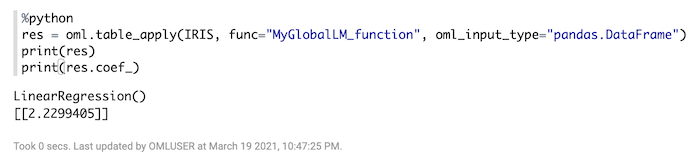

## **Step 9:** Drop scripts from the Script Repository
In this step, you will perform the following:

* Drop one of the private scripts.
* Drop the global script.
* List the available scripts again.

>**Note:** You can make the script either private or global. A global script is available to any user. A private script is available only to the owner or to users to whom the owner of the script has granted the read privilege.

1. Run the following script to drop the private script `MyLM_function2`, drop the global script `MyGlobalML_function`, and then list the available scripts:

    ```
    %python
    <copy>

    oml.script.drop("MyLM_function")
    oml.script.drop("MyGlobalLM_function", is_global=True)
    oml.script.dir(sctype="all")</copy>
    ```
    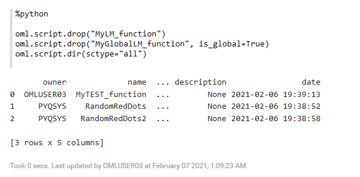

## Learn More

* [Embedded Python Execution](https://docs.oracle.com/en/database/oracle/machine-learning/oml4py/1/mlpug/embedded-python-execution.html#GUID-4FF75B48-6135-4219-A663-AFFBC0F4E9B6)
* [Oracle Machine Learning Notebooks](https://docs.oracle.com/en/database/oracle/machine-learning/oml-notebooks/)


## Acknowledgements
* **Author** - Moitreyee Hazarika, Principal User Assistance Developer
* **Contributors** -  Mark Hornick, Senior Director, Data Science and Machine Learning; Marcos Arancibia Coddou, Product Manager, Oracle Data Science; Sherry LaMonica, Principal Member of Tech Staff, Advanced Analytics, Machine Learning
* **Last Updated By/Date** - Moitreyee Hazarika, July 2021
