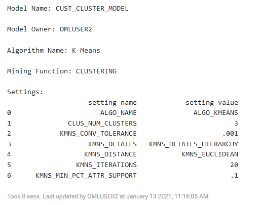
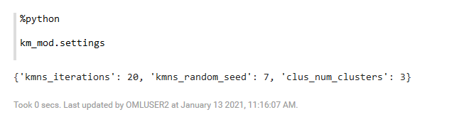

# Use in-database algorithms and models


## Introduction
This lab highlights a few of the machine learning algorithms available in OML4Py: generalized linear models, K-Means Clustering, partitioned models, and model explainability.


Estimated Lab Time: 120 minutes

### About in-database algorithms and models
Oracle Machine Learning for Python (OML4Py) makes the open source Python scripting language and environment ready for the enterprise and big data. Designed for problems involving both large and small data volumes, OML4Py integrates Python with Oracle Autonomous Database, allowing users to run Python commands and scripts for statistical, machine learning, and visualization analyses on database tables and views using Python syntax. Many familiar Python functions are overloaded that translate Python behavior into SQL for running in-database, as well as new automatic machine learning capabilities.

### Objectives

In this lab, you will:
*
*
*


### Prerequisites

* An Oracle Free Tier, Always Free, Paid or LiveLabs Cloud Account

## **STEP 1**: Use Regression to predict numerical values
This step shows how to predict numerical values using multiple regression. Given demographic, purchase, and affinity card data for a set of customers, predict the number of years a customer remains at the same residence, as found in column `YRS_RESIDENCE` - a continuous variable. This example uses the Generalized Linear Model algorithm.

**Note:** All processing occurs inside Oracle Autonomous Database.

1. Run the following script to import libraries and set display options.
    ```
    <copy>%python

    import pandas as pd
    import oml

    pd.set_option('display.max_rows', 500)
    pd.set_option('display.max_columns', 500)
    pd.set_option('display.width', 1000)</copy>
    ```
2. Prepare the dataset combining the `CUSTOMERS` table from the `SH` schema with the `SUPPLEMENTARY_DEMOGRAPHICS` table.
    ```
    <copy>%python

    CUSTOMERS = oml.sync(query = 'SELECT CUST_ID, CUST_GENDER, CUST_MARITAL_STATUS, CUST_YEAR_OF_BIRTH, CUST_INCOME_LEVEL, CUST_CREDIT_LIMIT FROM SH.CUSTOMERS')
    DEMO_DF = oml.sync(query = """SELECT CUST_ID, EDUCATION, AFFINITY_CARD, HOUSEHOLD_SIZE, OCCUPATION, YRS_RESIDENCE, Y_BOX_GAMES
                                  FROM SH.SUPPLEMENTARY_DEMOGRAPHICS""")
    CUST_DF = CUSTOMERS.merge(DEMO_DF, how = "inner", on = 'CUST_ID',suffixes = ["",""])</copy>
    ```
3. Run the following script to display the first few rows of table `CUST_DF` :
    ```
    <copy>%python

    z.show(CUST_DF.head())</copy>
    ```
    
4. Run the following script to randomly split and select the data into 60% for train and 40% for test.
    ```
    <copy>%python

    TRAIN, TEST = CUST_DF.split(ratio = (0.6,0.4))
    TRAIN_X = TRAIN.drop('YRS_RESIDENCE')
    TRAIN_Y = TRAIN['YRS_RESIDENCE']
    TEST_X = TEST.drop('YRS_RESIDENCE')
    TEST_Y = TEST['YRS_RESIDENCE']</copy>
    ```
5. Now, build a GLM regression model for predicting `YRS_RESIDENCE` using the `oml.glm` function.

    This method runs the `oml.glm` algorithm in-database using the given settings. The settings are supplied as key-value pairs. In this example, feature generation and feature selection are specified.

    **Note:** For a complete list of settings, refer to the OML4Py product documentation.

       ```
       <copy>%python

       settings = {'GLMS_FTR_GENERATION': 'dbms_data_mining.GLMS_FTR_GENERATION_ENABLE',
                  'GLMS_FTR_SELECTION':'dbms_data_mining.GLMS_FTR_SELECTION_ENABLE'}

       try:
           oml.drop(model = 'GLM_REGRESSION_MODEL')
       except:
           print('No such model')

       glm_mod = oml.glm("regression", **settings)
       glm_mod.fit(TRAIN_X, TRAIN_Y, model_name = 'GLM_REGRESSION_MODEL', case_id = 'CUST_ID')</copy>
       ```
6. Run the following script to view model fit details to understand the key statistics of the model. Locate the values of Root Mean Square Error `ROOT_MEAN_SQ` and R-squared `R_SQ` from the output. RMSE and R-squared are used to evaluate baseline performance of the model.

  **Note:**
  * RMSE is a measure of the differences between values predicted by a model and the values observed. A good model should have a low RMSE. But at the same time, a model with very low RMSE has the potential to overfit.
  * R-Squared is a statistical measure that represents the goodness of fit of a regression model. The ideal value for R-squared is 1. The closer the value of R-squared is to 1, the better the model fit. For instance, if the R-squared of a model is 0.50, then approximately half of the observed variation can be explained by the model's inputs

    ```
    <copy>%python

    z.show(glm_mod.fit_details)</copy>
    ```
    

7. Run the following to display and view the model coefficients:
    ```
    <copy>%python

    glm_mod.coef</copy>
    ```
    
8. Run the following script to make predictions using test data and display results:
    ```
    <copy>%python

    RES_DF = glm_mod.predict(TEST.drop('YRS_RESIDENCE'), supplemental_cols = TEST)

    z.show(RES_DF[['PREDICTION', 'YRS_RESIDENCE'] + RES_DF.columns])</copy>
    ```
    
9. Run the following script to plot the predicted and actual years of residence.
    ```
    <copy>%python

    z.show(RES_DF[['YRS_RESIDENCE', 'PREDICTION']])</copy>
    ```
    
    In the RES_DF table, the predicted values and the actual years of residence are displayed in the `PREDICTION` and `YRS_RESIDENCE` columns respectively, as shown in the screenshot.

10. Run the following script to plot the predicted and actual years of residence:
    ```
    <copy>%python

    z.show(RES_DF[['YRS_RESIDENCE', 'PREDICTION']])</copy>
    ```
11. Run the following script to plot the predicted and actual years of residence using matplotlib.
    ```
    <copy>%python

    import numpy as np
    import matplotlib.pyplot as plt
    plt.style.use('seaborn')
    plt.figure(figsize=[9,7])


    x = RES_DF[['PREDICTION']].pull()
    y = RES_DF[['YRS_RESIDENCE']].pull()
    n = len(x)
    refx = np.linspace(0, 15,n)
    plt.plot(refx, refx, '.')
    plt.plot(x, y, '.')

    plt.xlabel('PREDICTION')
    plt.ylabel('YRS_RESIDENCE')
    plt.title('The prediction and actual value for years of residence')
    plt.grid(True)
    plt.show()</copy>
    ```
    
12. Run the following script to plot the residuals using matplotlib.
    ```
    <copy>%python

    import numpy as np
    import matplotlib.pyplot as plt
    plt.style.use('seaborn')
    plt.figure(figsize=[9,7])

    x = np.matrix(RES_DF[['PREDICTION']].pull())
    y = np.matrix(RES_DF[['YRS_RESIDENCE']].pull())
    plt.plot(x, y-x, '.')

    plt.hlines(y=0, xmin=0, xmax=15,
               colors='black', linestyles='solid', alpha=0.8)
    plt.xlabel('PREDICTION')
    plt.ylabel('RESIDUAL')
    plt.title('Prediction vs. residuals')
    plt.grid(True)
    plt.show()</copy>
    ```
    
13. Run the following script to calculate the RMSE manually on the prediction results on the testing test and the R-  squared on the testing set using the score method.
    **Note:** Both the RMSE and R-squared calculations are similar to the values produced by `oml.glm`.
    ```
    <copy>%python

    print(((RES_DF['YRS_RESIDENCE'] - RES_DF['PREDICTION']) ** 2).mean() ** .5)

    print(glm_mod.score(TEST.drop('YRS_RESIDENCE'), TEST[:,['YRS_RESIDENCE']]))</copy>
    ```
    
## **STEP 2**: Use Clustering
OML4Py supports clustering using several algorithms: k-Means, O-Cluster, and Expectation Maximization. In this lab, we illustrate how to identify natural clusters of customers using the CUSTOMERS dataset and the unsupervised learning k-Means algorithm. The data exploration, preparation, and machine learning run inside Autonomous Database.

1. Run the following script to build a k-Means clustering model with 3 clusters. You first drop the model `CUST_CLUSTER_MODEL` if it exists.
    ```
    <copy>%python

    try:
        oml.drop(model="CUST_CLUSTER_MODEL")
    except:
        print("Model does not exist")

    setting = {'kmns_iterations': 20, 'KMNS_RANDOM_SEED': 7}
    km_mod = oml.km(n_clusters = 3, **setting).fit(CUST_DF, model_name = "CUST_CLUSTER_MODEL", case_id = 'CUST_ID')</copy>
    ```
2. Run the following command to display the K-means model details:
    ```
    <copy>%python

    km_mod</copy>
    ```
    

3. To view the model settings, run the following command:
    ```
    <copy>%python

    km_mod.settings</copy>
    ```
    

4. Run the following script to display cluster details for all clusters in the hierarchy with row counts and dispersion:
    ```
    <copy>%python

    z.show(km_mod.clusters)</copy>
    ```
    The script returns the following table
    
5. Run the following script to predict the cluster membership:
    ```
    <copy>%python

    pred = km_mod.predict(CUST_DF, supplemental_cols = CUST_DF)</copy>
    ```
6. Run the following script to view the cluster results using a matplotlib scatterplot:
    ```
    <copy>%python

    pred_df = pred[['CUST_ID', 'CLUSTER_ID', 'CUST_YEAR_OF_BIRTH', 'YRS_RESIDENCE', 'CUST_CREDIT_LIMIT']].pull()

    fig = plt.figure()
    ax=fig.add_axes([0.1,0.1,0.8,0.8])

    ids = pred_df['CLUSTER_ID']
    clusters = ids.drop_duplicates().values
    handles = []
    labs = []
    colors = ['r', 'b', 'g']
    for i, c in enumerate(clusters):
        xc = pred_df[pred_df['CLUSTER_ID'] == c]['YRS_RESIDENCE'].values
        yc = pred_df[pred_df['CLUSTER_ID'] == c]['CUST_YEAR_OF_BIRTH'].values

        h = ax.scatter(xc, yc, color= colors[i])
        handles.append(h)
        labs.append('CLUSTER' + str(c))
    ax.legend(handles, labs)
    plt.title('K-Means Clustering')

    plt.grid(True)

    plt.xlabel('YRS_RESIDENCE')
    plt.ylabel('CUST_YEAR_OF_BIRTH')
    plt.show()</copy>
    ```
    
## **STEP 3**: Work with partitioned models
OML4Py enables automatically building an ensemble model comprised of multiple sub-models, one for each data partition. Sub-models exist and are used as one model, which results in simplified scoring using the top-level model only. The proper sub-model is chosen by the system based on partition value(s) in the row of data to be scored. Partitioned models achieve potentially better accuracy through multiple targeted models.

In this lab, we build an SVM model to predict the number of years a customer resides at their residence but partitioned on customer gender. The model is then used to predict the target, then predict the target with prediction details.

1. Run the following script to create test and train data sets and drop missing values.
    ```
    <copy>%python

    dat = CUST_DF.split(ratio=(0.8, 0.2), seed = 6218945)

    dat[0] = dat[0].dropna()

    train_x = dat[0].drop('YRS_RESIDENCE')
    train_y = dat[0]['YRS_RESIDENCE']
    test_dat = dat[1]</copy>
    ```
2. Build Partitioned Model using the SVM algorithm to predict `YRS_RESIDENCE`, partitioned by `CUST_GENDER`:
    ```
    <copy>%python

    try:
        oml.drop(model = 'SVM_PARTITIONED_REGRESSION_MODEL')
    except:
        print("No such model")


    setting = {'svms_kernel_function'  :'dbms_data_mining.svms_linear',
               'odms_partition_columns':'CUST_GENDER'}
    svm_mod = oml.svm("regression", **setting)

    svm_mod.fit(train_x, train_y , model_name = 'SVM_PARTITIONED_REGRESSION_MODEL')</copy>
    ```
    The script builds a SVM partitioned model. Scroll down the notebook paragraph for complete details of the model.
    
3. Predict on the test set and display prediction result - note the use of the top level model only.
    ```
    <copy>%python

    y_pred_part = svm_mod.predict(test_dat, test_dat)

    z.show(y_pred_part[['PARTITION_NAME', 'PREDICTION'] + y_pred_part.columns].round(4).head())</copy>
    ```
    The script makes prediction based on the test data, and displays the result in a table, as shown in the screenshot. The predicted values are listed in the PREDICTION column in the table.
    
4. Run the following script to show the model global statistics for each partitioned sub-model:
    ```
    <copy>%python

    z.show(svm_mod.global_stats)</copy>
    ```
    

5. Run the following script to materialize the test dataset.
    ```
    <copy>%python

    try:
        oml.drop(table = 'TEST_DATA')
    except:
        print("Table not exist")
    _ = test_dat.materialize(table = 'TEST_DATA')</copy>
    ```

6. Use SQL to score data and display prediction details.
    ```
    <copy>%sql

    SELECT CUST_ID,
          round(PREDICTION_YRS_RES,3) PRED_YRS_RES,
          RTRIM(TRIM(SUBSTR(OUTPRED."Attribute1",17,100)),'rank="1"/>') FIRST_ATTRIBUTE,
          RTRIM(TRIM(SUBSTR(OUTPRED."Attribute2",17,100)),'rank="2"/>') SECOND_ATTRIBUTE,
          RTRIM(TRIM(SUBSTR(OUTPRED."Attribute3",17,100)),'rank="3"/>') THIRD_ATTRIBUTE
    FROM (SELECT CUST_ID,
                  PREDICTION(SVM_PARTITIONED_REGRESSION_MODEL USING *) PREDICTION_YRS_RES,
                  PREDICTION_DETAILS(SVM_PARTITIONED_REGRESSION_MODEL USING *) PD
                 FROM TEST_DATA
                 WHERE CUST_ID < 100015
                 ORDER BY CUST_ID) OUT,
                 XMLTABLE('/Details'
                          PASSING OUT.PD
                          COLUMNS
                          "Attribute1" XMLType PATH 'Attribute[1]',
                          "Attribute2" XMLType PATH 'Attribute[2]',
                          "Attribute3" XMLType PATH 'Attribute[3]')
          OUTPRED</copy>
    ```
    
## **STEP 4**: Import and run the GlobalFeatureImportance explainer
Machine Learning Explainability (MLX) is the process of explaining and interpreting machine learning models. The oml.mlx Python module supports the ability to help better understand a model's behavior and how it ranks predictors when making predictions. MLX currently provides model-agnostic explanations for classification and regression tasks where explanations treat the ML model as a black-box, instead of using properties from the model to guide the explanation.

The **GlobalFeatureImportance** explainer object is the interface to the MLX permutation importance explainer. The global feature importance explainer identifies the most important features for a given model and data set. The explainer is model-agnostic and currently supports tabular classification and regression data set with both numerical and categorical features.

This step walks you through the steps to the steps to use the Model Explainability feature. You will learn how to use this feature, run the **GlobalFeatureImportance** to explain and interpret machine learning models.

In this step, you will:
* Import the **GlobalFeatureImportance** explainer
* Load the data set into the database
* Split the data set into train and test variables
* Train an SVM model
* Create the MLX Global Feature Importance explainer `gfi`
* Run the explainer `gfi.explain` to generate the global feature importance for the test data

1. Run the following script to import the oml module, Pandas, Numpy packages, GlobalFeatureImportance explainer and load the data set into the database. The script also adds a unique Case ID column.

  ```
  import oml
  from oml.mlx import GlobalFeatureImportance
  import pandas as pd
  import numpy as np
  from sklearn import datasets

  iris_ds = datasets.load_iris()
  iris_data = iris_ds.data.astype(float)
  X = pd.DataFrame(iris_data, columns=iris_ds.feature_names)
  y = pd.DataFrame(iris_ds.target, columns=['TARGET'])
  row_id = pd.DataFrame(np.arange(iris_data.shape[0]),
  columns=['CASE_ID'])
  df = oml.create(pd.concat([X, y, row_id], axis=1), table='Iris')
  ```
2. Split the data set into train and test variables.

  ```
  train, test = df.split(ratio=(0.8, 0.2), hash_cols='CASE_ID', seed=32)
  X, y = train.drop('SPECIES'), train['SPECIES']
  X_test, y_test = test.drop('SPECIES'), test['SPECIES']
  ```

3. Train an SVM model.

    ```
    model = oml.algo.svm(ODMS_RANDOM_SEED=32).fit(X, y, case_id='CASE_ID')
    "SVM accuracy score = {:.2f}".format(model.score(X_test, y_test))
    ```

4. Create the MLX Global Feature Importance explainer gfi, using the `f1_weighted` metric.
    ```
    gfi = GlobalFeatureImportance(mining_function='classification',
                              score_metric='f1_weighted',
                              random_state=32, parallel=4)
    ```

5. Run the explainer gfi.explain to generate the global feature importance for the test data:
    ```
    explanation = gfi.explain(model, X_test, y_test,
      case_id='CASE_ID', n_iter=10)
      explanation
    ```  
   The explainer returns the following explanation:

   ```
   Global Feature Importance:
   [0] petal length (cm): Value: 0.3462, Error: 0.0824
   [1] petal width (cm): Value: 0.2417, Error: 0.0687
   [2] sepal width (cm): Value: 0.0926, Error: 0.0452
   [3] sepal length (cm): Value: 0.0253, Error: 0.0152
   ```


## **Try it yourself**

Build an in-db RandomForest model and compare the RF model's attribute importance ranking with that from MLX.

## Learn More


* [URL text 1](http://docs.oracle.com)
* [URL text 2](http://docs.oracle.com)

## Acknowledgements
* **Author** - <Name, Title, Group>
* **Contributors** -  <Name, Group> -- optional
* **Last Updated By/Date** - <Name, Group, Month Year>
* **Workshop (or Lab) Expiry Date** - <Month Year> -- optional, use this when you are using a Pre-Authorized Request (PAR) URL to an object in Oracle Object Store.

## Need Help?
Please submit feedback or ask for help using our [LiveLabs Support Forum](https://community.oracle.com/tech/developers/categories/livelabsdiscussions). Please click the **Log In** button and login using your Oracle Account. Click the **Ask A Question** button to the left to start a *New Discussion* or *Ask a Question*.  Please include your workshop name and lab name.  You can also include screenshots and attach files.  Engage directly with the author of the workshop.

If you do not have an Oracle Account, click [here](https://profile.oracle.com/myprofile/account/create-account.jspx) to create one.
