# Use in-database algorithms and models

## Introduction
This lab highlights a few of the machine learning algorithms and features available in OML4Py: Generalized Linear Models, K-Means Clustering, partitioned models, and model explainability.

Estimated Lab Time: 15 minutes

### About in-database algorithms and models
Oracle Machine Learning for Python (OML4Py) makes the open source Python scripting language and environment ready for the enterprise and big data. Designed for problems involving both large and small data volumes, OML4Py integrates Python with Oracle Autonomous Database, allowing users to run Python commands and scripts for statistical, machine learning, and visualization analyses on database tables and views using Python syntax. Many familiar Python functions are overloaded that translate Python behavior into SQL for running in-database, as well as new automatic machine learning capabilities.

### Objectives

In this lab, you will learn how to:
* Predict numerical values using multiple regression
* Work with Clustering using K-means
* Work with Partitioned Models
* Use the Model Explainability feature to rank attributes


## (Optional) Download and View the Notebook File

To download the notebook version of this lab (without screenshots), click [here](./../notebooks/lab3_in-db_algo.json?download=1).

[](include:import)

## **Step 1**: Import libraries

1. Run the following script to import the `oml` package, the python packages - Pandas, Numpy, and matplotlib:

    ```
    <copy>%python
    import pandas as pd
    import numpy as np
    import matplotlib.pyplot as plt
    import oml

    pd.set_option('display.max_rows', 500)
    pd.set_option('display.max_columns', 50)
    pd.set_option('display.width', 1000)</copy>
    ```

## **Step 2**: Work with Regression using GLM
This step shows how to predict numerical values using multiple regression. Given demographic, purchase, and affinity card data for a set of customers, predict the number of years a customer remains at the same residence, as found in column `YRS_RESIDENCE` - a continuous variable. This example uses the Generalized Linear Model algorithm.

>**Note:** All processing occurs inside Oracle Autonomous Database.

1. Run the following script to prepare the dataset combining the `CUSTOMERS` table from the `SH` schema with the `SUPPLEMENTARY_DEMOGRAPHICS` table.

    >**Note:** Here, it shows how to use the query specification with `oml.sync` and how to select the columns you want to include. However, you could also have used `oml.sync` on the `CUSTOMERS` and `SUPPLEMENTARY_DEMOGRAPHICS` tables and perform column filtering in Python prior to the merge.

    ```
    %python
    <copy>

    CUSTOMERS = oml.sync(query = 'SELECT CUST_ID, CUST_GENDER, CUST_MARITAL_STATUS, CUST_YEAR_OF_BIRTH, CUST_INCOME_LEVEL, CUST_CREDIT_LIMIT FROM SH.CUSTOMERS')
    DEMO_DF   = oml.sync(query = """SELECT CUST_ID, EDUCATION, AFFINITY_CARD, HOUSEHOLD_SIZE, OCCUPATION, YRS_RESIDENCE, Y_BOX_GAMES FROM SH.SUPPLEMENTARY_DEMOGRAPHICS""")
    CUST_DF   = CUSTOMERS.merge(DEMO_DF, how = "inner", on = 'CUST_ID',suffixes = ["",""])</copy>
    ```
2. Run the following script to display the first few rows of the table `CUST_DF` :
    ```
    %python
    <copy>

    z.show(CUST_DF.head())</copy>
    ```
    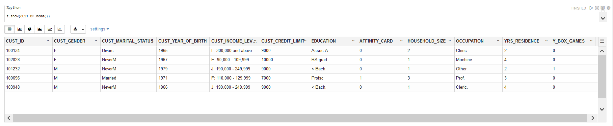

3. Run the following script to randomly split and select the data into 60% for train and 40% for test.

    ```
    %python
    <copy>

    TRAIN, TEST = CUST_DF.split(ratio = (0.6,0.4))
    TRAIN_X = TRAIN.drop('YRS_RESIDENCE')
    TRAIN_Y = TRAIN['YRS_RESIDENCE']
    TEST_X = TEST.drop('YRS_RESIDENCE')
    TEST_Y = TEST['YRS_RESIDENCE']</copy>
    ```
4. Now, build a GLM regression model for predicting `YRS_RESIDENCE` using the `oml.glm` function.

    This method runs the `oml.glm` algorithm in-database using the given settings. The settings are supplied as key-value pairs. In this example, feature generation and feature selection are specified.

    >**Note:** For a complete list of settings, refer to the OML4Py product documentation. You may also refer to the `oml.glm` help file.

    ```
    %python
    <copy>

    settings = {'GLMS_FTR_GENERATION': 'dbms_data_mining.GLMS_FTR_GENERATION_ENABLE',
                'GLMS_FTR_SELECTION':'dbms_data_mining.GLMS_FTR_SELECTION_ENABLE'}

    try:
        oml.drop(model = 'GLM_REGRESSION_MODEL')
    except:
        print('No such model')

    glm_mod = oml.glm("regression", **settings)
    glm_mod.fit(TRAIN_X, TRAIN_Y, model_name = 'GLM_REGRESSION_MODEL', case_id = 'CUST_ID')</copy>

    ```

    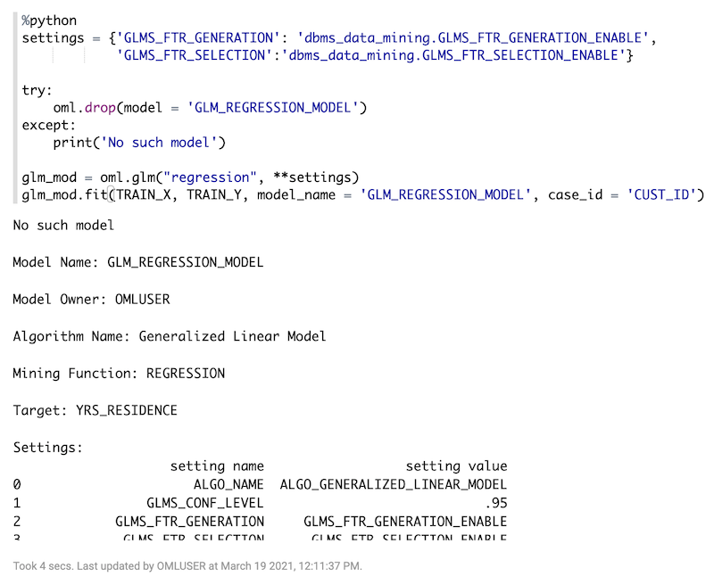

5. Run the following script to view model fit details to understand the key statistics of the model. Locate the values of Root Mean Square Error `ROOT_MEAN_SQ` and R-squared `R_SQ` from the output. RMSE and R-squared are used to evaluate baseline performance of the model.
    * RMSE is a measure of the differences between values predicted by a model and the values observed. A good model should have a low RMSE. But at the same time, a model with very low RMSE has the potential to overfit.
    * R-Squared is a statistical measure that represents the goodness of fit of a regression model. The ideal value for R-squared is 1. The closer the value of R-squared is to 1, the better the model fit. For instance, if the R-squared of a model is 0.50, then approximately half of the observed variation can be explained by the model's inputs

    ```
    %python
    <copy>

    z.show(glm_mod.fit_details)</copy>
    ```
    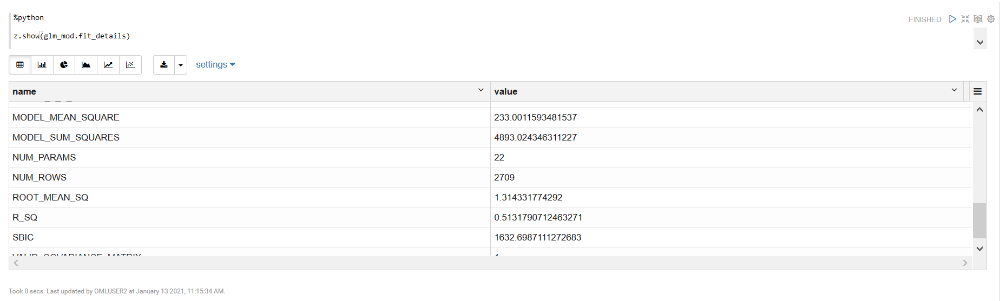

6. Run the following command to display and view the model coefficients:

    ```
    %python
    <copy>

    glm_mod.coef</copy>
    ```

    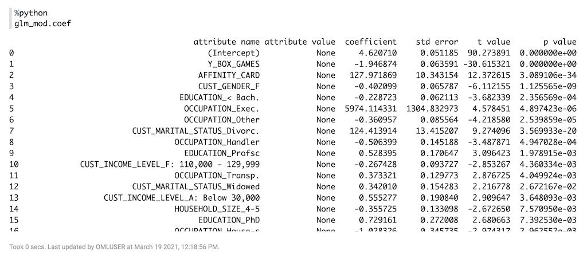
7. Run the following script to make predictions using the test data and display the results:

    ```
    %python
    <copy>
    RES_DF = glm_mod.predict(TEST.drop('YRS_RESIDENCE'), supplemental_cols = TEST['YRS_RESIDENCE'])

    z.show(RES_DF[['PREDICTION', 'YRS_RESIDENCE']])</copy>
    ```

    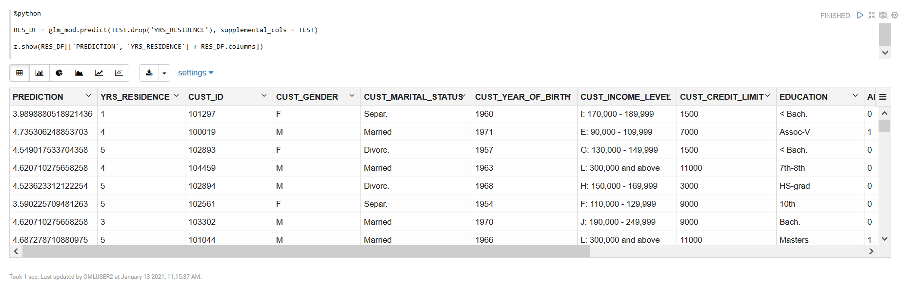
In the RES_DF table, the predicted values and the actual years of residence are displayed in the `PREDICTION` and `YRS_RESIDENCE` columns respectively, as shown in the screenshot.

8. Run the following command to plot the predicted years of residence versus the actual years of residence and then click the **Scatter Chart** icon to see the visualization. Click **Settings** to see how the plot was specified.
    ```
    %python
    <copy>

    z.show(RES_DF[['YRS_RESIDENCE', 'PREDICTION']])</copy>
    ```
    

9. Using matplotlib, plot the predicted and actual years of residence and visually compare it against the perfect fit line, `y=x`.  The plot indicates how far the prediction deviated from actual value, which is known as the prediction error. Ideally, the predictions will converge to the perfect fit line.

    ```
    %python
    <copy>

    plt.style.use('seaborn')
    plt.figure(figsize=[9,7])


    x = RES_DF[['PREDICTION']].pull()
    y = RES_DF[['YRS_RESIDENCE']].pull()
    n = len(x)
    refx = np.linspace(0, 15,n)
    plt.plot(refx, refx, '.')
    plt.plot(x, y, '.')

    plt.xlabel('PREDICTION')
    plt.ylabel('YRS_RESIDENCE')
    plt.title('The prediction and actual value for years of residence')
    plt.grid(True)
    plt.show()</copy>
    ```
    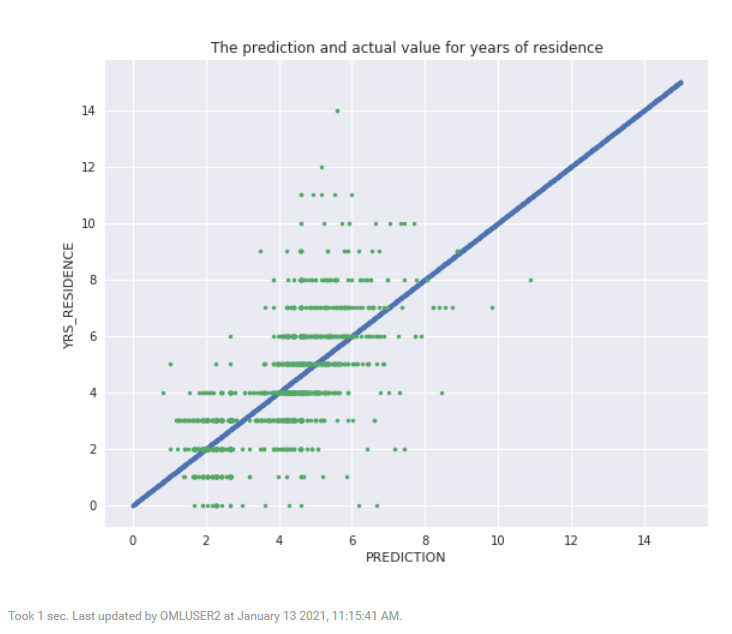
10. Run the following script to plot the residuals using matplotlib.

    ```
    %python
    <copy>

    plt.style.use('seaborn')
    plt.figure(figsize=[9,7])

    x = np.matrix(RES_DF[['PREDICTION']].pull())
    y = RES_DF[['YRS_RESIDENCE']].pull()
    plt.plot(x, y-x, '.')

    plt.hlines(y=0, xmin=0, xmax=15, colors='black', linestyles='solid', alpha=0.8)
    plt.xlabel('PREDICTION')
    plt.ylabel('RESIDUAL')
    plt.title('Prediction vs. residuals')
    plt.grid(True)
    plt.show()</copy>
    ```

    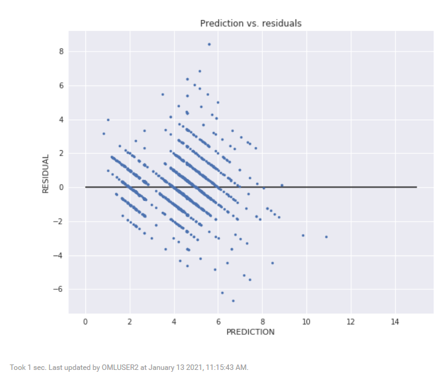
11. Run the following script to calculate the RMSE manually on the prediction results on the testing test and the R-  squared on the testing set using the score method.
    >**Note:** Both the RMSE and R-squared calculations are similar to the values produced by `oml.glm`.

    ```
    %python
    <copy>

    print(((RES_DF['YRS_RESIDENCE'] - RES_DF['PREDICTION']) ** 2).mean() ** .5)

    print(glm_mod.score(TEST.drop('YRS_RESIDENCE'), TEST[:,['YRS_RESIDENCE']]))</copy>
    ```

    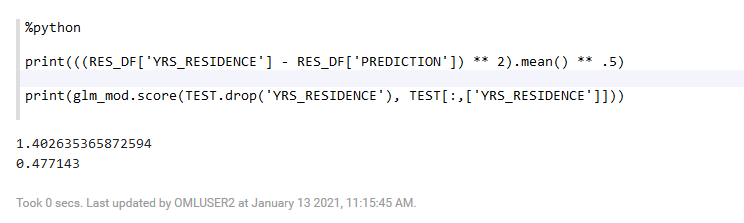

## **Step 3**: Work with Clustering using K-Means
OML4Py supports clustering using several algorithms: k-Means, O-Cluster, and Expectation Maximization. In this lab, we illustrate how to identify natural clusters of customers using the CUSTOMERS dataset and the unsupervised learning K-Means algorithm. Note that data exploration, preparation, and machine learning run inside Autonomous Database.

1. Run the following script to build a k-Means clustering model with 3 clusters. You do the following in this step:

    * Drop the model `CUST_CLUSTER_MODEL` if it exists.
    * Specify the number of iterations for building the cluster tree using the `KMNS_ITERATIONS` setting and the K-Means random seed generator using the `KMNS_RANDOM_SEED` setting. `KMNS_ITERATIONS` specifies the number of times the algorithm should iterate over the training data before it finalizes the selection of centroids. You can adjust this parameter to balance accuracy against training time. The `KMNS_RANDOM_SEED` value is used for cluster initialization and can have a significant effect on cluster selection.

    >**Note:** The `model_name` causes the model to be persisted across notebook sessions.

    ```
    %python
    <copy>

    try:
        oml.drop(model="CUST_CLUSTER_MODEL")
    except:
        print("Model does not exist")

    setting = {'KMNS_ITERATIONS': 20, 'KMNS_RANDOM_SEED': 7}
    km_mod = oml.km(n_clusters = 3, **setting).fit(CUST_DF, model_name = "CUST_CLUSTER_MODEL", case_id = 'CUST_ID')</copy>
    ```
2. To display and view the K-means model details, run the following command:
    ```
    %python
    <copy>

    km_mod</copy>
    ```
    

3. To view the cluster details, run the following command. The command displays the cluster details for all clusters in the hierarchy with row counts and dispersion.
The dispersion value is a measure of how compact or how spread out the data is within a cluster. The dispersion value is a number greater than 0.  The lower the dispersion value, the more compact the cluster, that is, the data points are closer to the centroid of the cluster. A larger dispersion value indicates that the data points are more disperse or spread out from the centroid.

    ```
    %python
    <copy>

    z.show(km_mod.clusters)</copy>
    ```

    

4. Run the following script to display the taxonomy. The taxonomy shows the hierarchy of the child clusters in relationship to the parent clusters.

    ```
    %python
    <copy>

    z.show(km_mod.taxonomy)</copy>
    ```
    The script returns the following table
    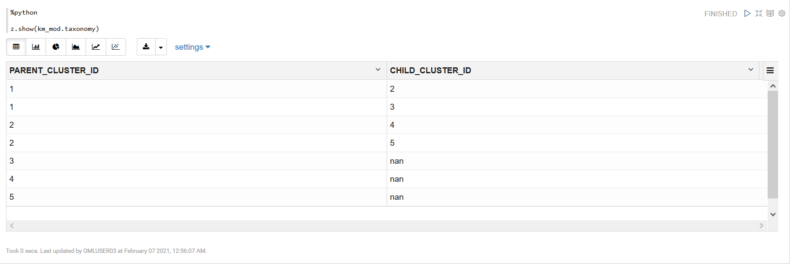

5. Run the following command to predict the cluster membership.  The `supplemental_cols` argument carries the target column to the output to retain the relationship between the predictions and their original preditor values. These predictors may include a case id, for example to join with other tables, or multiple (or all) columns of the scoring data. You should be aware that unlike Pandas DataFrames, which are explicitly ordered in memory, results from relational databases do not have a specific order unless explicitly specified by an `ORDER BY` clause. As such, you cannot rely on results to maintain the same order across different data sets (tables and DataFrame proxy objects).

    ```
    %python
    <copy>

    pred = km_mod.predict(CUST_DF, supplemental_cols = CUST_DF)</copy>
    ```
6. Run the following command to view the pred computed.

    ```
    %python
    <copy>

    z.show(pred)</copy>
    ```

    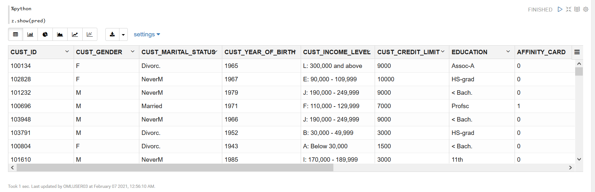

7. Run the following command to view the cluster results using a matplotlib scatterplot:
    ```
    %python
    <copy>

    pred_df = pred[['CUST_ID', 'CLUSTER_ID', 'CUST_YEAR_OF_BIRTH', 'YRS_RESIDENCE', 'CUST_CREDIT_LIMIT']].pull()

    fig = plt.figure()
    ax=fig.add_axes([0.1,0.1,0.8,0.8])

    ids = pred_df['CLUSTER_ID']
    clusters = ids.drop_duplicates().values
    handles = []
    labs = []
    colors = ['r', 'b', 'g']

    for i, c in enumerate(clusters):
        xc = pred_df[pred_df['CLUSTER_ID'] == c]['YRS_RESIDENCE'].values
        yc = pred_df[pred_df['CLUSTER_ID'] == c]['CUST_YEAR_OF_BIRTH'].values
        h = ax.scatter(xc, yc, color= colors[i])
        handles.append(h)
        labs.append('CLUSTER' + str(c))

    ax.legend(handles, labs)
    plt.title('K-Means Clustering')

    plt.grid(True)

    plt.xlabel('YRS_RESIDENCE')
    plt.ylabel('CUST_YEAR_OF_BIRTH')
    plt.show()</copy>
    ```
    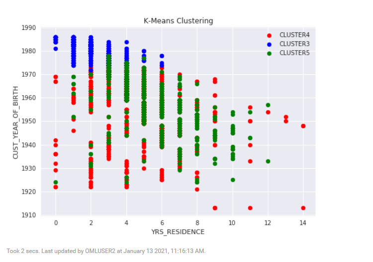

## **Step 4**: Work with Partitioned models
OML4Py enables automatically building an ensemble model comprised of multiple sub-models, one for each data partition. Sub-models exist and are used as one model, which results in simplified scoring using the top-level model only. The proper sub-model is chosen by the system based on partition value(s) in the row of data to be scored. Partitioned models achieve potentially better accuracy through multiple targeted models.

In this lab, we build an SVM model to predict the number of years a customer resides at their residence but partitioned on customer gender. The model is then used to predict the target, then predict the target with prediction details.

1. Run the following script to create test and train data sets and drop missing values.
    ```
    %python
    <copy>

    dat = CUST_DF.split(ratio=(0.8, 0.2), seed = 6218945)

    dat[0] = dat[0].dropna()

    train_x = dat[0].drop('YRS_RESIDENCE')
    train_y = dat[0]['YRS_RESIDENCE']
    test_dat = dat[1]</copy>
    ```
2. Build a partitioned model using the SVM algorithm to predict `YRS_RESIDENCE`, partitioned by `CUST_GENDER`:
    ```
    %python
    <copy>

    try:
        oml.drop(model = 'SVM_PARTITIONED_REGRESSION_MODEL')
    except:
        print("No such model")


    setting = {'svms_kernel_function'  :'dbms_data_mining.svms_linear', 'odms_partition_columns':'CUST_GENDER'}
    svm_mod = oml.svm("regression", **setting)

    svm_mod.fit(train_x, train_y , model_name = 'SVM_PARTITIONED_REGRESSION_MODEL')</copy>
    ```
    The script builds a SVM partitioned model. Scroll down the notebook paragraph for complete details of the model.

    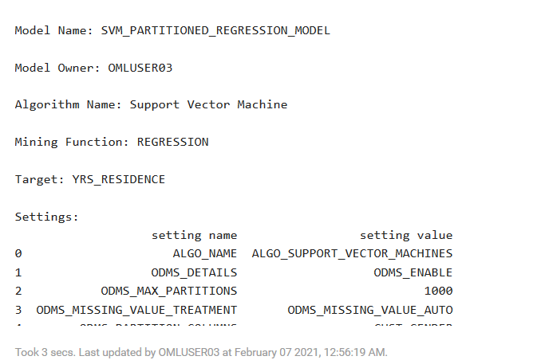        

3. Run the following script to predict on the test set and display prediction result. Note the use of the top level model only.

    ```
    %python
    <copy>

    y_pred_part = svm_mod.predict(test_dat, test_dat)

    z.show(y_pred_part[['PARTITION_NAME', 'PREDICTION'] + y_pred_part.columns].round(4).head())</copy>
    ```
    The script makes prediction based on the test data, and displays the result in a table, as shown in the screenshot. The predicted values are listed in the PREDICTION column in the table.

    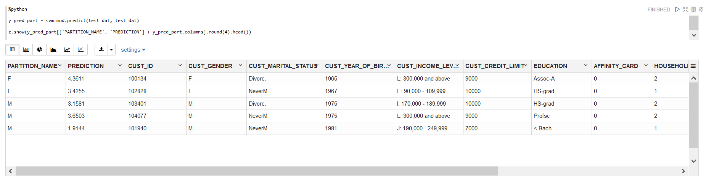

4. Run the following command to show the model global statistics for each partitioned sub-model. The partition name column contains the values from the partition column. If multiple columns were specified, then there would be one column for each with corresponding value.

    ```
    %python
    <copy>

    z.show(svm_mod.global_stats)</copy>
    ```
    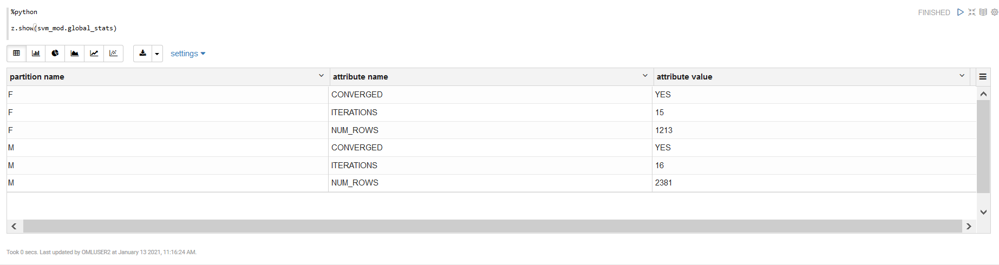

5. Run the following command to materialize the test dataset. The `materialize` method pushes the contents represented by an OML proxy object (a view, a table and so on) into a table in Oracle Database.
Here, the data is materialized to table `TEST_DATA` so that it can be queried from SQL.

    ```
    %python
    <copy>

    try:
        oml.drop(table = 'TEST_DATA')
    except:
        print("Table not exist")
    _ = test_dat.materialize(table = 'TEST_DATA')</copy>
    ```

6. Use SQL to score data and display prediction details.

    ```
    <copy>%sql

    SELECT CUST_ID,
      round(PREDICTION_YRS_RES,3) PRED_YRS_RES,
      RTRIM(TRIM(SUBSTR(OUTPRED."Attribute1",17,100)),'rank="1"/>') FIRST_ATTRIBUTE,
      RTRIM(TRIM(SUBSTR(OUTPRED."Attribute2",17,100)),'rank="2"/>') SECOND_ATTRIBUTE,
      RTRIM(TRIM(SUBSTR(OUTPRED."Attribute3",17,100)),'rank="3"/>') THIRD_ATTRIBUTE
    FROM (SELECT CUST_ID,
              PREDICTION(SVM_PARTITIONED_REGRESSION_MODEL USING *) PREDICTION_YRS_RES,
              PREDICTION_DETAILS(SVM_PARTITIONED_REGRESSION_MODEL USING *) PD
             FROM TEST_DATA
             WHERE CUST_ID < 100015
             ORDER BY CUST_ID) OUT,
             XMLTABLE('/Details'
                      PASSING OUT.PD
                      COLUMNS
                      "Attribute1" XMLType PATH 'Attribute[1]',
                      "Attribute2" XMLType PATH 'Attribute[2]',
                      "Attribute3" XMLType PATH 'Attribute[3]')
      OUTPRED</copy>
      ```

      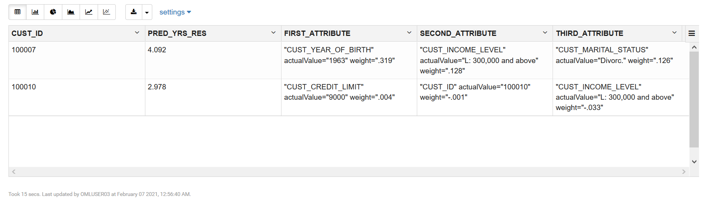

## **Step 5**: Rank Attribute Importance using Model Explainability

Machine Learning Explainability (MLX) is the process of explaining and interpreting machine learning models. The `oml.mlx` Python module supports the ability to help better understand a model's behavior and how it ranks predictors when making predictions. MLX currently provides model-agnostic explanations for classification and regression tasks where explanations treat the ML model as a black-box, instead of using properties from the model to guide the explanation.

The **GlobalFeatureImportance** explainer object is the interface to the MLX permutation importance explainer. The global feature importance explainer identifies the most important features for a given model and data set. The explainer is model-agnostic and currently supports tabular classification and regression data set with both numerical and categorical features.

This step walks you through the steps to the steps to use the Model Explainability feature. You will learn how to use this feature, run the **GlobalFeatureImportance** to explain and interpret machine learning models.

In this step, you will:
* Import the **GlobalFeatureImportance** explainer
* Load the data set into the database
* Split the data set into train and test variables
* Train an SVM model
* Create the MLX Global Feature Importance explainer `gfi`
* Run the explainer `gfi.explain` to generate the global feature importance for the test data

1. Run the following command to import import the GlobalFeatureImportance explainer, and load the IRIS data set into the database.

    ```
    <copy>%python

    from oml.mlx import GlobalFeatureImportance
    from sklearn import datasets

    iris_ds = datasets.load_iris()
    iris_data = iris_ds.data.astype(float)
    X = pd.DataFrame(iris_data, columns=iris_ds.feature_names)
    y = pd.DataFrame(iris_ds.target, columns=['TARGET'])
    row_id = pd.DataFrame(np.arange(iris_data.shape[0]),
    columns=['CASE_ID'])


    try:
      oml.drop(table="IRIS_ID")
    except:
      pass
    df = oml.create(pd.concat([X, y, row_id], axis=1), table='IRIS_ID')</copy>
    ```
2. Split the data set into train and test sets.

    ```
    %python
    <copy>

    train, test = df.split(ratio=(0.8, 0.2), hash_cols='CASE_ID', seed=32)
    X, y = train.drop('TARGET'), train['TARGET']
    X_test, y_test = test.drop('TARGET'), test['TARGET']</copy>
    ```

3. Train an SVM model.

    ```
    %python
    <copy>

    model = oml.algo.svm(ODMS_RANDOM_SEED=32).fit(X, y, case_id='CASE_ID')
    "SVM accuracy score = {:.2f}".format(model.score(X_test, y_test))</copy>
    ```

    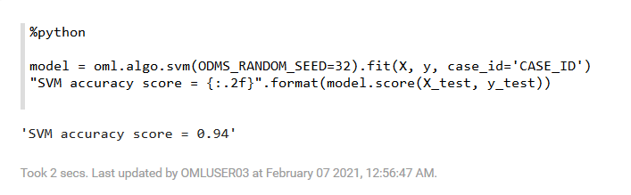

4. Create the MLX Global Feature Importance explainer gfi, using the `f1_weighted` metric.
    ```
    %python
    <copy>
    gfi = GlobalFeatureImportance(mining_function='classification',
                              score_metric='f1_weighted',
                              random_state=32, parallel=4)</copy>
    ```

    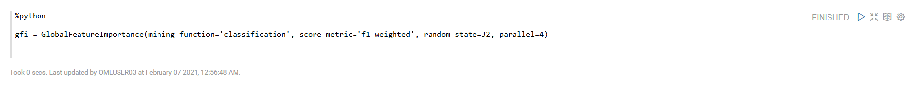
5. Run the explainer `gfi.explain` to generate the global feature importance for the test data:
    ```
    %python
    <copy>

    explanation = gfi.explain(model, X, y,
    case_id='CASE_ID', n_iter=10)
    explanation</copy>
    ```  
   The explainer returns the following explanation, as shown in the screenshot:

     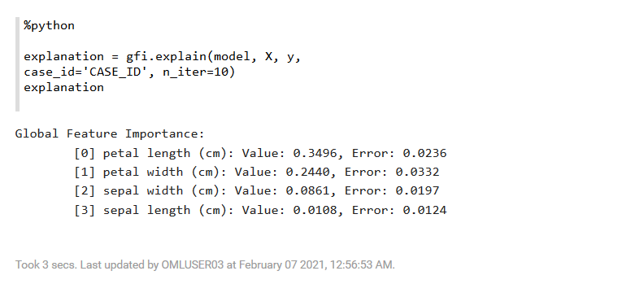

### **Try it yourself**

Build an in-db RandomForest model and compare the RF model's attribute importance ranking with that from MLX.

## Learn More

* [About Machine Learning Classes and Algorithms](https://docs.oracle.com/en/database/oracle/machine-learning/oml4py/1/mlpug/about-machine-learning-algorithms.html#GUID-00F8AF8F-6652-4161-BEEF-E737A68FB53C)
* [Oracle Machine Learning Notebooks](https://docs.oracle.com/en/database/oracle/machine-learning/oml-notebooks/)


## Acknowledgements
* **Author** - Moitreyee Hazarika, Principal User Assistance Developer
* **Contributors** -  Mark Hornick, Senior Director, Data Science and Machine Learning; Marcos Arancibia Coddou, Product Manager, Oracle Data Science; Sherry LaMonica, Principal Member of Tech Staff, Advanced Analytics, Machine Learning
* **Last Updated By/Date** - Moitreyee Hazarika, July 2021
