# Provision an Autonomous Data Warehouse with OML users

## Introduction

In just a few minutes, Autonomous Database lets you deploy a complete data warehousing platform that can scale to your requirements. You can also use its Database Actions interfaces to easily populate that warehouse from the data lake.

This lab walks you through the steps to get started using the Oracle Autonomous Database on Oracle Cloud Interface (OCI). 

In this lab, you will provision a new Autonomous Data Warehouse (ADW) instance and prepare a new set of users that have the correct roles for using the Oracle Machine Learning components.

Estimated Time: 10 minutes

Watch the video below for a quick walk through of the lab.

[](youtube:9S0MWzPGlkY)

### Objectives

In this lab, you will:

-   Create an Oracle Cloud Infrastructure compartment
-   Provision a new Autonomous Database
-   Use the Database Actions interface to create Oracle Machine Learning users

### Prerequisites

-   This lab requires completion of the **"Get Started with Oracle Cloud"** section in the contents menu on the left.

## Task 1: Create a compartment

A compartment is a collection of cloud assets, like compute instances, load balancers, databases, and so on. By default, a root compartment was created for you when you created your tenancy (that is, when you registered for the trial account). It is possible to create everything in the root compartment, but Oracle recommends that you create sub-compartments to help manage your resources more efficiently.

1. Click the three-line menu, which is on the top left of the OCI console. Scroll down till the bottom of the menu, click **Identity & Security -> Compartments**. 

  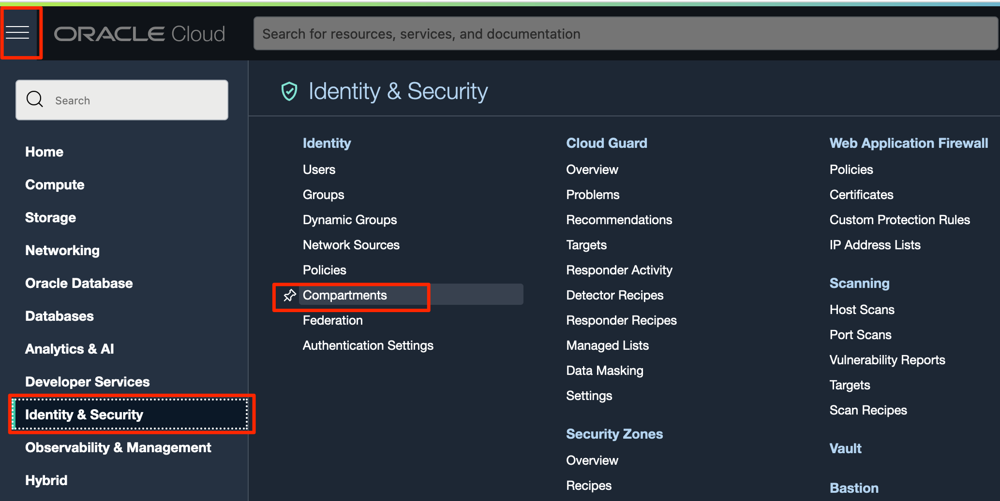
 
 Click the blue **Create Compartment** button to create a sub-compartment.

  

2. Give the compartment a name and description. Be sure your root compartment appears as the parent compartment. Press the blue **Create Compartment** button.

  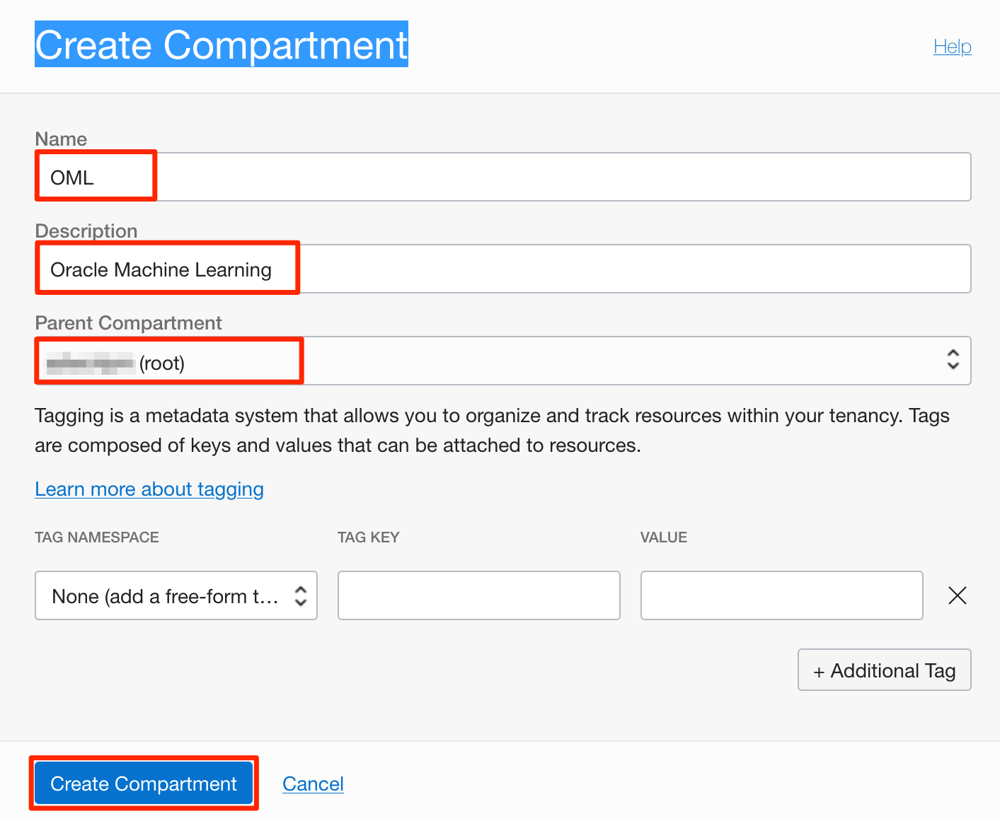

  Now, the compartment is created.  In the next task, you will create an Autonomous Database instance.

## Task 2: Choose Autonomous Data Warehouse from the Services Menu

1. From the three-line menu, which is on the top left of the OCI console, click the navigation menu in the upper left to show top level navigation choices.
   
  Click **Autonomous Database**.

  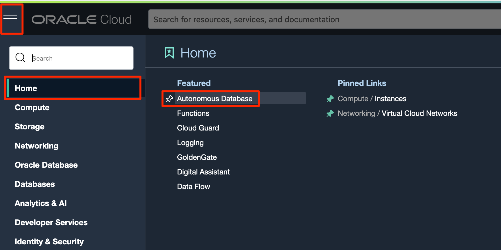

2. Make sure your workload type is __Data Warehouse__ or __All__ to see your Autonomous Data Warehouse instances. Use the __List Scope__ drop-down menu to select the compartment you just created.

  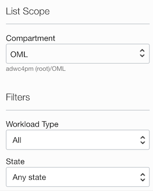

  > **Note:** Avoid the use of the `ManagedCompartmentforPaaS` compartment as this is an Oracle default used for Oracle Platform Services.


3. This console shows that no databases yet exist. If there were a long list of databases, you could filter the list by the **State** of the databases (Available, Stopped, Terminated, for example). You can also sort by __Workload Type__. The different options are shown below.

  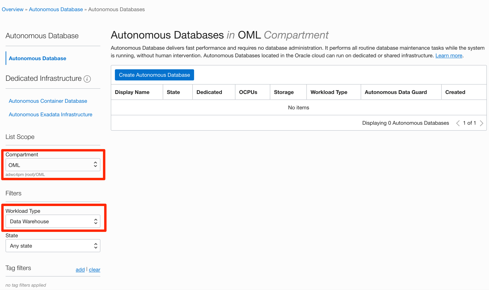

4. If you are using a Free Trial or Always Free account, and you want to use Always Free Resources, you need to be in a region where Always Free Resources are available. You can see your current **region** in the top, right hand corner of the page.  If you are on Free Tier you can only deploy services in your **Home Region**.

  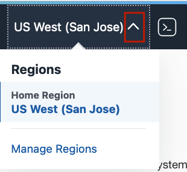

## Task 3: Create the Autonomous Database instance

1. Click **Create Autonomous Database** to start the instance creation process.

  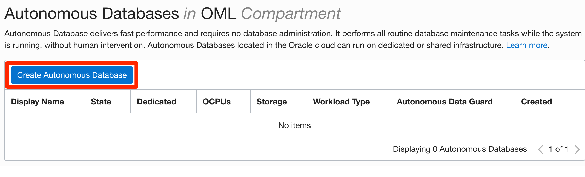

2.  This brings up the __Create Autonomous Database__ screen where you will configure the instance.

  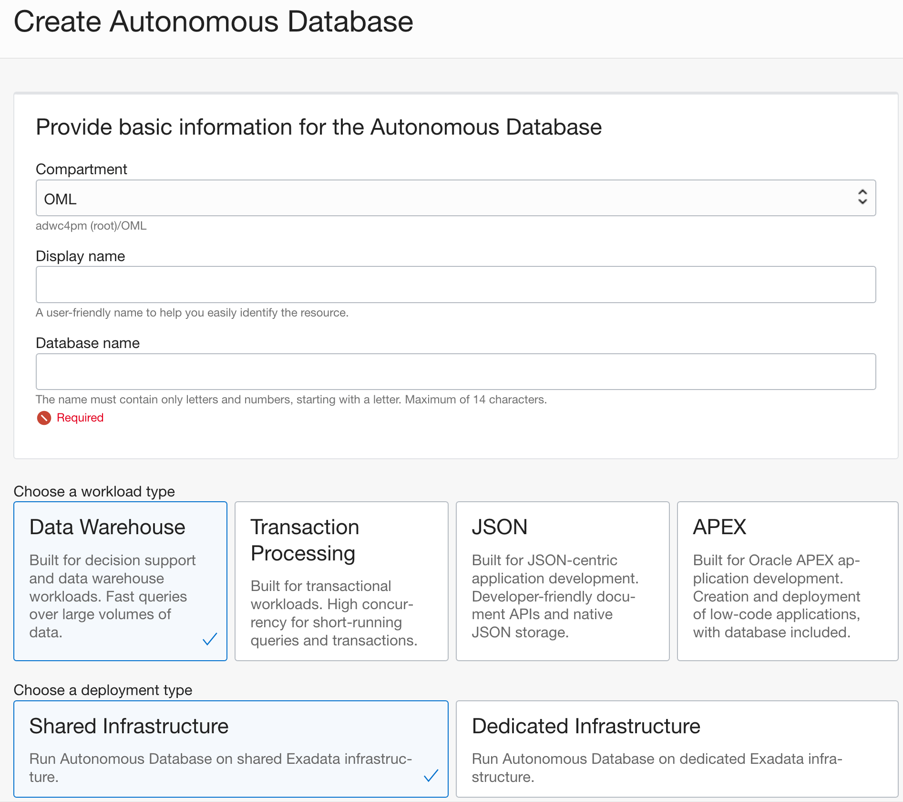

3. Give basic information for the autonomous database:

    - __Choose a compartment__ - Select the compartment you just created.
    - __Display Name__ - Enter a memorable name for the database for display purposes. For this lab, use __OML LABS__.
    - __Database Name__ - Use letters and numbers only, starting with a letter. Maximum length is 14 characters (no underscores). For this lab, use __OMLLABS__.

  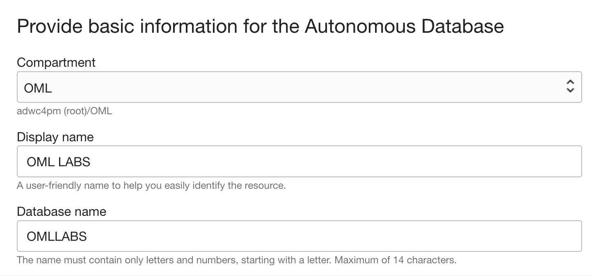

4. Choose a workload type. Select the workload type for your database from the choices:

    - __Data Warehouse__ - For this lab, choose __Data Warehouse__ as the workload type.  This workload is built for decision support and data warehouse workloads. Fast queries over large volumnes of data.
    - __Transaction Processing__ - Or, you could also choose __Transaction Processing__ as the workload type.  This workload is built for transactional workloads. High concurrency for short-running queries and transactions.

  

5. Choose a deployment type. Select the deployment type for your database from the choices:

    - __Shared Infrastructure__ - For this lab, choose __Shared Infrastructure__ as the deployment type.
 
  

6. Configure the database:

    - __Always Free__ - Oracle Cloud Infrastructure's Always Free Autonomous Database is part of Oracle Cloud Infrastructure's Free Tier of services. You can provision up to two Always Free Autonomous Databases (with 1 OCPU and 20 GB of storage) in the home region of your tenancy.  For this Workshop, select **Always Free**.
    - __Choose database version__ - Select 19c as the database version.
    - __OCPU count__ - Number of CPUs for your service. If you have not selected an Always Free configuration (which comes with 1 OCPU), specify __1 CPU__.
    - __Storage (TB)__ - Storage in terabytes. If you have not selected an Always Free configuration (which comes with 20 GB of free storage), select your storage capacity in terabytes. For this workshop, the default of __1 TB__ of storage is enough. 
    - __Auto Scaling__ - Enables the system to automatically use up to three times more CPU and IO resources to meet workload demand. If you have not selected an Always Free configuration (which automatically disables this option), then enable it.
  
    > **Note:** You cannot scale up/down an Always Free autonomous database, nor change its storage size.

    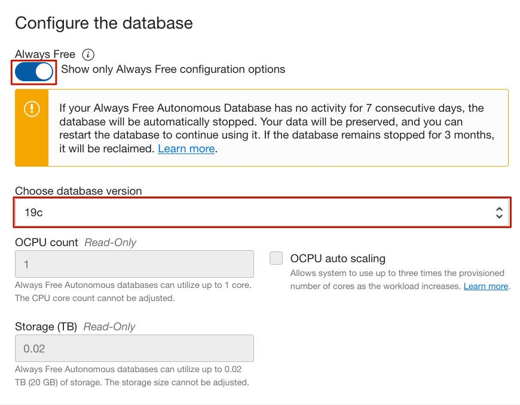

7. Create administrator credentials:

  __Password and Confirm Password__ - Specify the password for ADMIN user of the service instance. The password must meet the following requirements:
    - The password must be between 12 and 30 characters long and must include at least one uppercase letter, one lowercase letter, and one numeric character.
    - The password cannot contain the username.
    - The password cannot contain the double quote (") character.
    - The password must be different from the last 4 passwords used.
    - The password must not be the same password that you set less than 24 hours ago.
    - Re-enter the password to confirm it. Make a note of this password.

    

8. Choose network access:
    - For this lab, accept the default, "Allow secure access from everywhere."
    - If you wanted to use a private endpoint, it would allow traffic only from the VCN you specify, where access to the database from all public IPs or VCNs is blocked. You would then have to select "Virtual cloud network" in the __Choose network access__ area.
    - You can control and restrict access to your Autonomous Database by setting network access control lists (ACLs). You can select from 4 IP notation types: IP Address, CIDR Block, Virtual Cloud Network, Virtual Cloud Network OCID.

    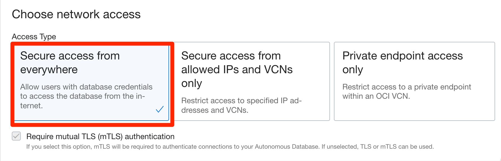

9. Choose a license type. <if type="freetier">For this workshop, we can choose the same default for Always Free, which is __License Included__.</if><if type="livelabs">For this workshop, choose __Bring Your Own License (BYOL)__.</if> The two license types are:
    - __Bring Your Own License (BYOL)__ - Select this type when your organization has existing database licenses.
    - __License Included__ - Select this type when you want to subscribe to new database software licenses and the database cloud service.

    

10. Click __Create Autonomous Database__.

11.  Your instance will begin provisioning. In a few minutes, the state will turn from Provisioning to Available. At this point, your Autonomous Data Warehouse database is ready to use! Have a look at your instance's details here including its name, database version, OCPU count, and storage size.

    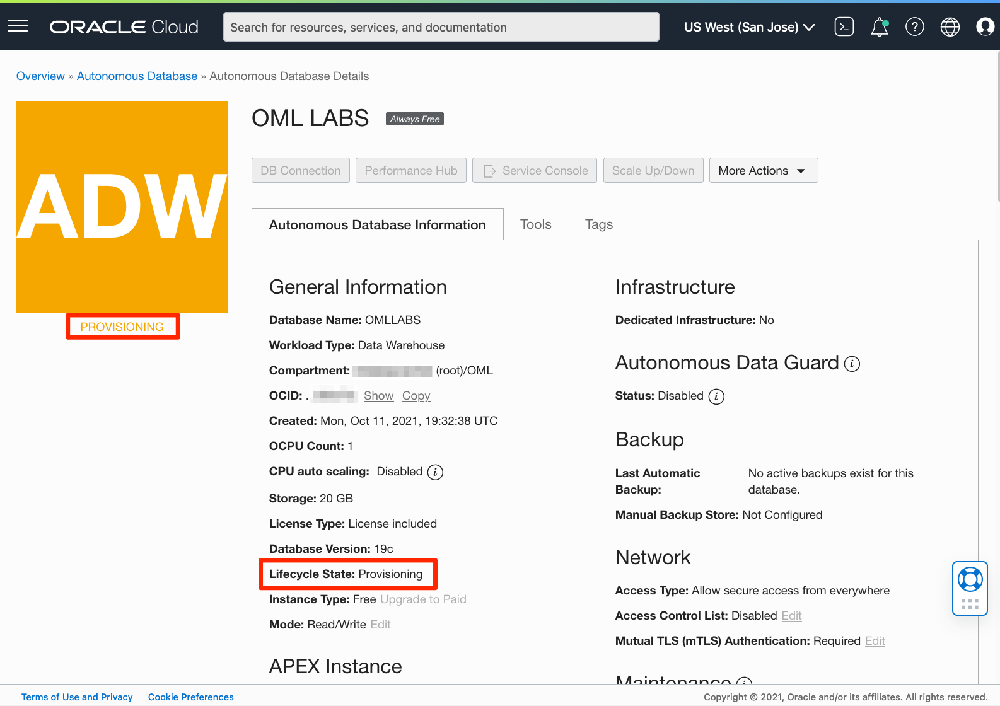

## Task 4: Access the Database Actions interface 

The labs in this workshop assume that Oracle Machine Learning users named **`OMLUSER`** and **`OMLUSER2`** have been created and configured for signing into OML Notebooks, so we need to create them. 

The user named **`OMLUSER2`** is needed for the appropriate demonstration of the permission grants to OML4Py Datastore and Script Repository from one user to another.

**IMPORTANT:** These users <span style="color:red">are not available</span> by default in any Autonomous Database tenancy and need to be created.  

Please follow the steps below to ensure these users are created in your tenancy prior to running the labs.

The SQL scripts will drop and recreate the `OMLUSER` and `OMLUSER2` user schemas.  This means that any data or objects in those users's schemas will be deleted and the account recreated.

>**<span style="color:red">Warning:</span>  Any work and notebooks that might have been stored previously by OMLUSER or OMLUSER2 users (if you had created them before) will be deleted - so save your work!**

1. To access the Autonomous Database Actions as the ADMIN user, in your Autonomous Database details page, click the **Database Actions** button.

    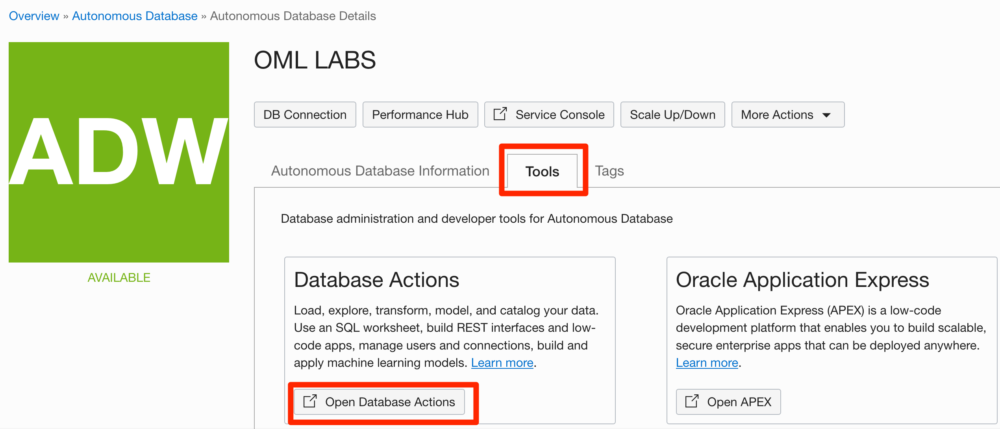

2. Open the SQL Worksheet from the Launchpad:

    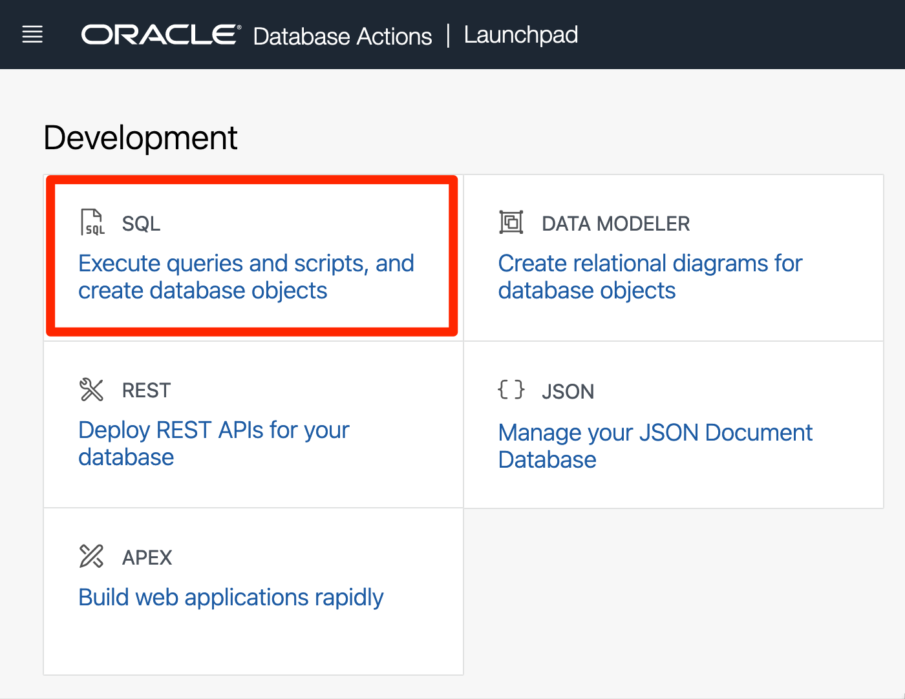

    You are now ready to enter the SQL code. Proceed to the next task.

## Task 5:  Create the Autonomous Database users that are a prerequisite for the labs

Now that you're in the SQL worksheet, you will run the code that will initialize the users required by the workshop.  

1. Copy the script below into the worksheet and click Run Script (F5).

    ```
    <copy>
    -- The following commands should be run before running the labs, 
    -- since it creates the OML users required to 
    -- sign-in to OML Notebooks 

    -- Click F5 to run all the scripts at once

    -- Drop the schema OMLUSER
    BEGIN
          EXECUTE IMMEDIATE 'DROP USER OMLUSER CASCADE';
          EXCEPTION WHEN OTHERS THEN NULL;
    END;
    /  

    -- Drop the schema OMLUSER2
    BEGIN
          EXECUTE IMMEDIATE 'DROP USER OMLUSER2 CASCADE';
          EXCEPTION WHEN OTHERS THEN NULL;
    END;
    /

    CREATE USER OMLUSER IDENTIFIED BY "AAbbcc123456";
    GRANT DWROLE TO OMLUSER;
    GRANT OML_DEVELOPER TO OMLUSER;
    ALTER USER OMLUSER GRANT CONNECT THROUGH OML$PROXY;
    ALTER USER OMLUSER QUOTA UNLIMITED on DATA;

    CREATE USER OMLUSER2 IDENTIFIED BY "AAbbcc123456";
    GRANT DWROLE TO OMLUSER2;
    GRANT OML_DEVELOPER TO OMLUSER2;
    ALTER USER OMLUSER2 GRANT CONNECT THROUGH OML$PROXY;
    ALTER USER OMLUSER2 QUOTA UNLIMITED on DATA;

    </copy>
    ```

2. The result of running the SQL steps is displayed in the bottom section of the screen (the Script Output), as shown below.

 

 The code is expected to run in a few seconds, depending on your tenancy. Once completed, users OMLUSER and OMLUSER2 are initialized, and you can continue to the next lab.    

Please *proceed to the next lab*.

## Learn more

See the [documentation](https://docs.oracle.com/en/cloud/paas/autonomous-data-warehouse-cloud/user/autonomous-workflow.html#GUID-5780368D-6D40-475C-8DEB-DBA14BA675C3) on the typical workflow for using Autonomous Data Warehouse.

## Acknowledgements

- **Author** - Marcos Arancibia, Senior Principal Product Manager, Machine Learning; Nilay Panchal, Oracle Autonomous Database Product Management
- **Adapted for Cloud by** - Richard Green, Principal Developer, Database User Assistance
- **Last Updated By/Date** - Marcos Arancibia, October 2021
