# Provision and Load Data into Autonomous Database Instance[Workshop Under Construction]

## Introduction

In this lab, you will provision the Oracle Autonomous Database, upload data file into Oracle Cloud Infrastructure(OCI) object storage, set up credentials, create table, load data into tables from files from OCI object storage files.

*Note: While this lab uses ADW, the steps are identical for creating and connecting to an ATP database.*

Estimated Lab Time: 5 minutes

### Objectives

In this lab, you will:
- Provision an Autonomous Database instance
- Upload files to the OCI Object Storage
- Define object store credentials for your Autonomous Database instance
- Setup SQL Developer Web to load data into an Autonomous Database table
- Create tables in your database
- Load data from the Object Store

### Prerequisites

- This lab requires an [Oracle Cloud account](https://www.oracle.com/cloud/free/). You may use your own cloud account, a cloud account that you obtained through a trial, a Free Tier account, or a LiveLabs account.

### Video Preview

Watch a video demonstration on getting started with Oracle Machine Learning and Oracle Autonomous Database.

[](youtube:UDwlTpbhPX0)

## **STEP 1**: Provision an ADW instance

1. Login to the Oracle Cloud, as shown in the previous lab.

2. If you are using a Free Trial or Always Free account, and you want to use Always Free Resources, you need to be in a region where Always Free Resources are available. You can see your current default **Region** in the top, right hand corner of the page.

    

3. Once you are logged in, you can view the cloud services dashboard where all the services available to you. Click on hamburger menu, search for Autonomous Data Warehouse and select it.

    **Note:** You can also directly access your Autonomous Data Warehouse or Autonomous Transaction Processing service in the **Quick Actions** section of the dashboard.

    

4. From the compartment drop-down menu select the **Compartment** where you want to create your ADB instance. This console shows that no databases yet exist. If there were a long list of databases, you could filter the list by the **State** of the databases (Available, Stopped, Terminated, and so on). You can also sort by **Workload Type**. Here, the **Data Warehouse** workload type is selected.

    

5. Click **Create Autonomous Database** to start the instance creation process.

    

6.  This brings up the **Create Autonomous Database** screen, specify the configuration of the instance:
    - **Compartment** - Select a compartment for the database from the drop-down list.
    - **Display Name** - Enter a memorable name for the database for display purposes. This lab uses **ADW Good Wine** as the ADB display name.
    - **Database Name** - Use letters and numbers only, starting with a letter. Maximum length is 14 characters. (Underscores not initially supported.) This lab uses **ADWWINE** as database name.

    

7. Choose a workload type, deployment type and configure the database:
    - **Choose a workload type** - For this lab, choose __Data Warehouse__ as the workload type.
    - **Choose a deployment type** - For this lab, choose **Shared Infrastructure** as the deployment type.
    - **Always Free** - If your Cloud Account is an Always Free account, you can select this option to create an always free autonomous database. An always free database comes with 1 CPU and 20 GB of storage. For this lab, we recommend you leave Always Free unchecked.
    - **Choose database version** - Select a database version from the available versions.
    - **OCPU count** - Number of CPUs for your service. Leave as it is, or if you choose an Always Free database, it comes with 1 CPU.
    - **Storage (TB)** - Select your storage capacity in terabytes. Leave as it is or, if you choose an Always Free database, it comes with 20 GB of storage.
    - **Auto Scaling** - For this lab, keep auto scaling enabled.

    

8. Create administrator credentials, choose network access and license type and click **Create Autonomous Database**.

    - **Password** - Specify the password for **ADMIN** user of the service instance.
    - **Confirm Password** - Re-enter the password to confirm it. Make a note of this password.
    - **Choose network access** - For this lab, accept the default, "Allow secure access from everywhere".
    - **Choose a license type** - For this lab, choose **License Included**.

    

9.  Your instance will begin provisioning. In a few minutes, the state will turn from Provisioning to Available. At this point, your Autonomous Data Warehouse database is ready to use! Have a look at your instance's details here including its name, database version, OCPU count, and storage size.

    

    

## **STEP 2:** Download the Credentials Wallet

1.  On the instance details page, click **Service Console**.

    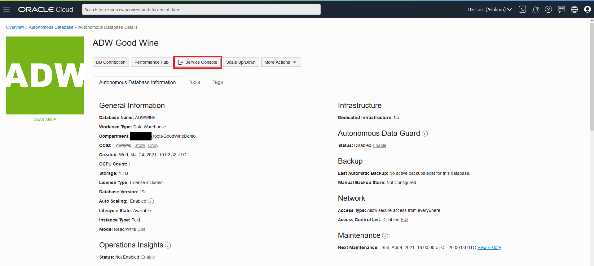

2.  Click on **Administration** on the left menu.

    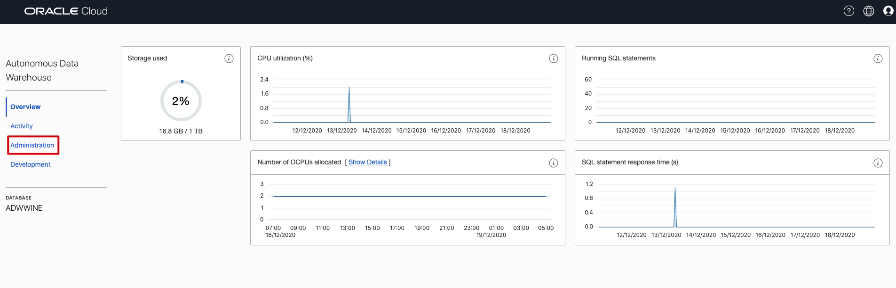

3. Now select **Download Client Credentials (Wallet)**.

    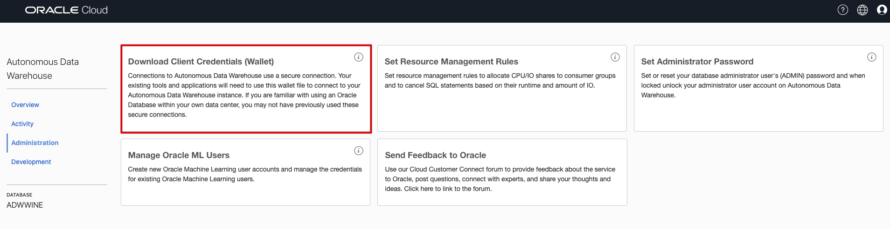

4.  Specify a password of your choice for the wallet. You will need this password when connecting to the database later. Click **Download** to download the wallet file to your client machine.

    

5.  Unzip the downloaded wallet file, note the cwallet.sso file, you will need it later in this lab.

    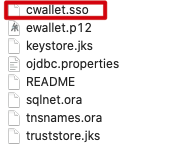

## **STEP 3:** Create a Bucket and Upload Your Data

1.  Click [here]() to download **WineReviews130K.csv** file.

2.  Click the hamburger menu and select **Object Storage**.

    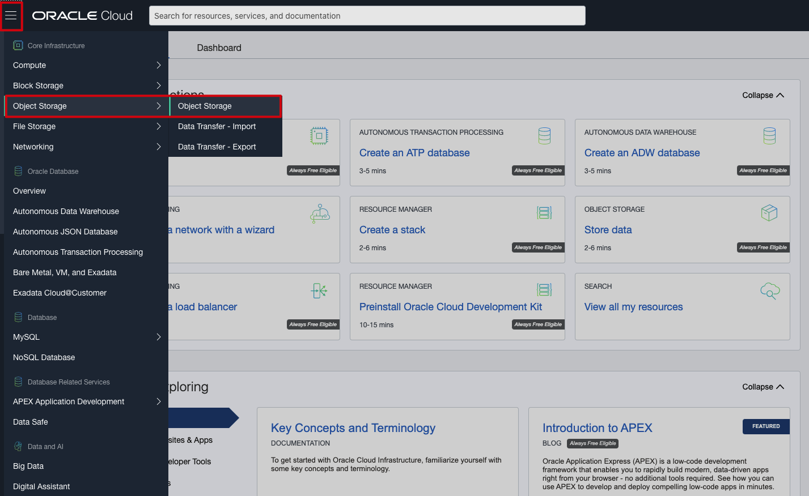

3.  Select the **Compartment** from the compartment drop-down and click **Create Bucket**.

    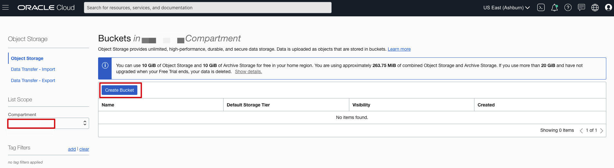

4. Provide the **Bucket Name** and click **Create**

    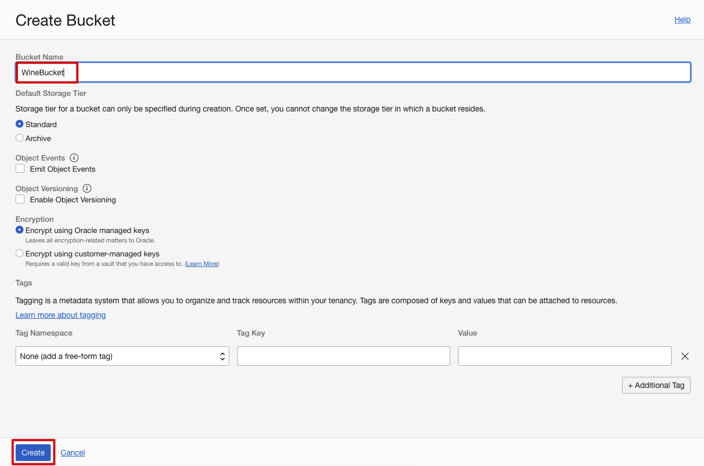

5. Once the bucket is created, click on the bucket you created.

    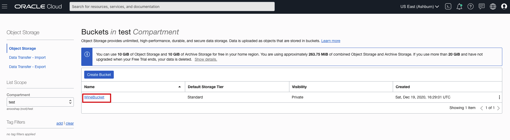

6. Click **Upload** under Objects and click **select files** to upload WineReviews130K.csv and cwallet.sso files that you just downloaded and click **Upload**.

    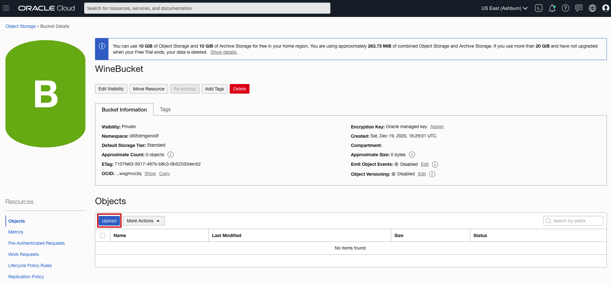

    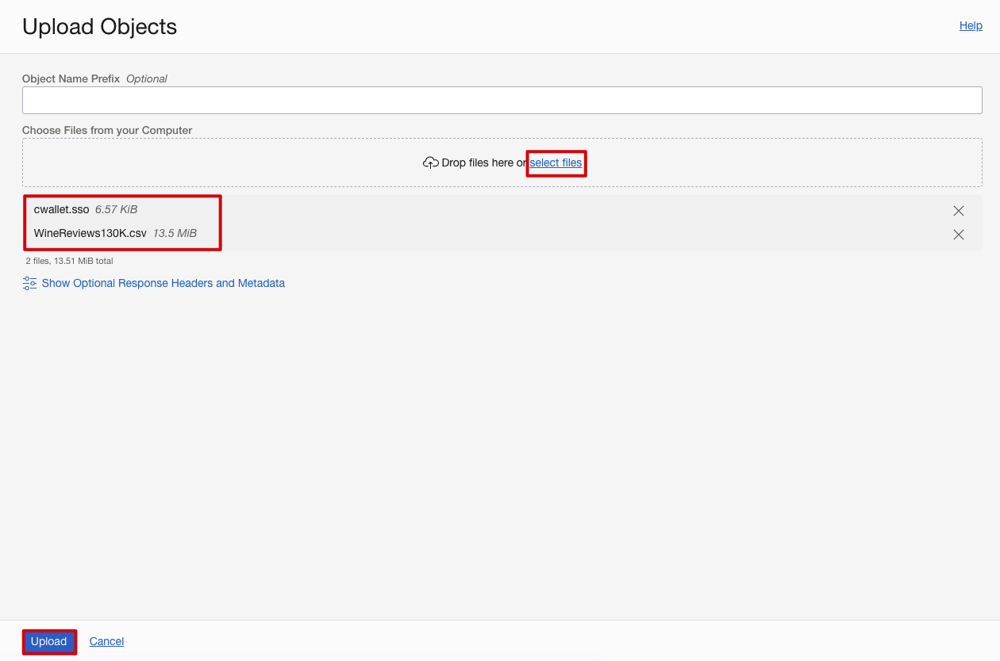

7.  For the WineReviews130K.csv object, click on the ellipses menu on the right  and click **View Object Details**. Copy the URL Path to a notepad and click Cancel. We will need the URL path later in this lab.

    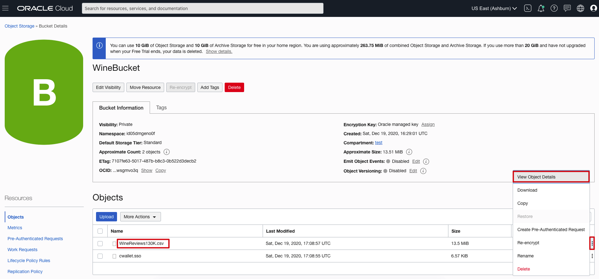

    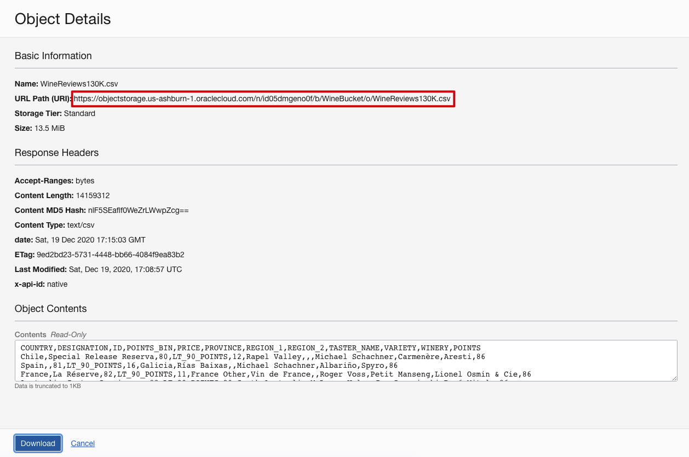

8. Take a look at the URL path you copied. In this example above, the region name is us-ashburn-1, the Namespace is id05dmgeno0f, and the bucket name is WineBucket.

    Note: The URL can also be constructed as below:

    `https://objectstorage.<region name>.oraclecloud.com/n/<namespace name>/b/<bucket name>/o`

## **STEP 4:** Creating an Object Store Auth Token

To load data from the Oracle Cloud Infrastructure(OCI) Object Storage you will need an OCI user with the appropriate privileges to read data (or upload) data to the Object Store. The communication between the database and the object store relies on the Swift protocol and the OCI user Auth Token.

1. Go to Profile menu, click **User Settings** to view user details.

    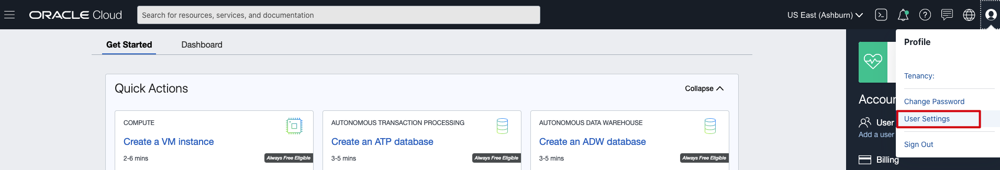

2.  Remember the username as you will need it in the next step.

    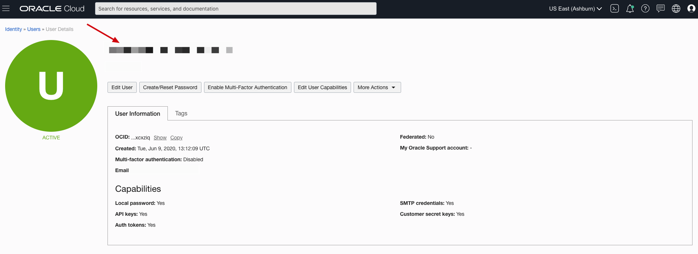

3.  On the left side of the User Details page, under Resources, click **Auth Tokens**, and then **Generate Token**.

    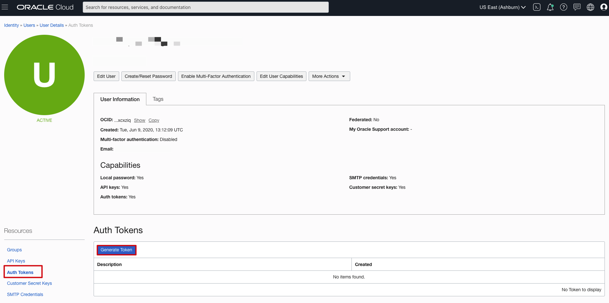

4. In the Generate Token description box, give the token a name and click **Generate Token**. In this lab, we call it **wine_token**. *Note: Be sure to copy it to notepad as you won't be able to see it again.*

    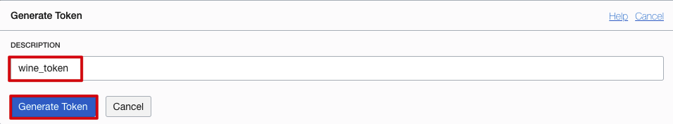

    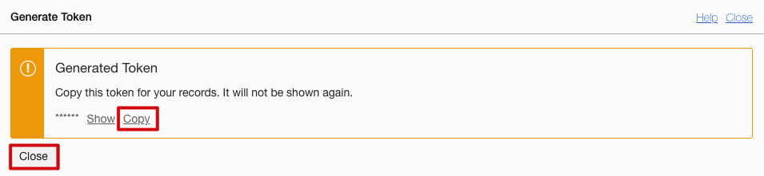

## **STEP 5:** Log in to SQL Developer Web

Now, let's log into the SQL Developer Web.

1.  Click on hamburger menu, search for Autonomous Data Warehouse and select it. Click on your ADB instance and navigate to  instance details page, and click on **Service Console**.

    

    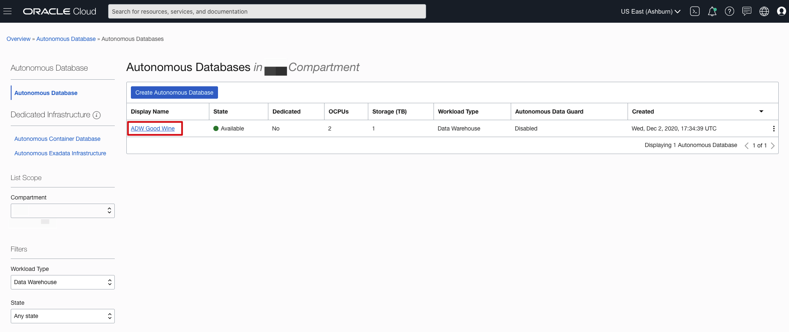

    

2.  Click on **Development**.

  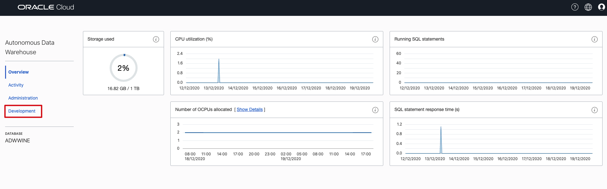

3.  Choose **SQL Developer Web**.

    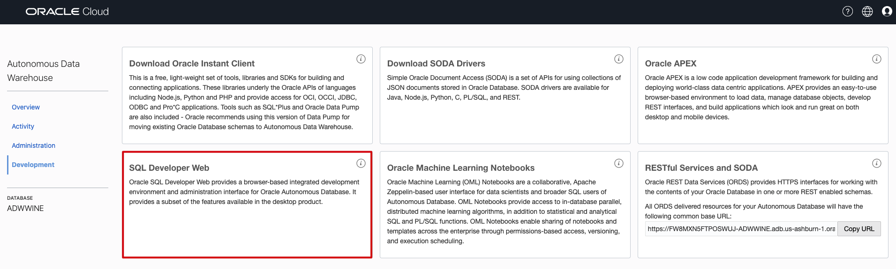

4.  Log into SQL Developer Web with **Username** - **admin**, and with the **password**, you created for the ADW Instance back in step 1 and click **Sign in**.

    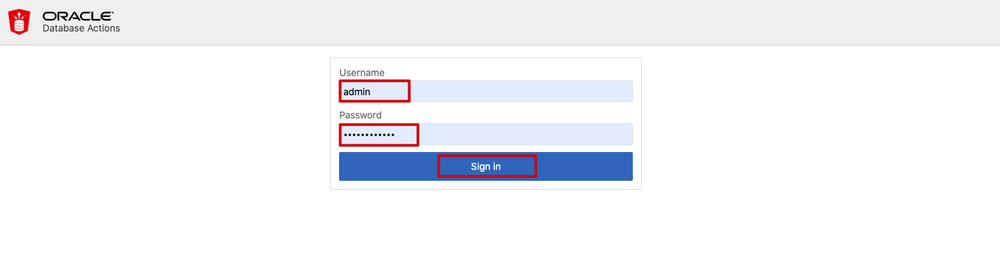

5. Once you log into SQL Developer Web from your ADW instance, your screen should look like the following:

    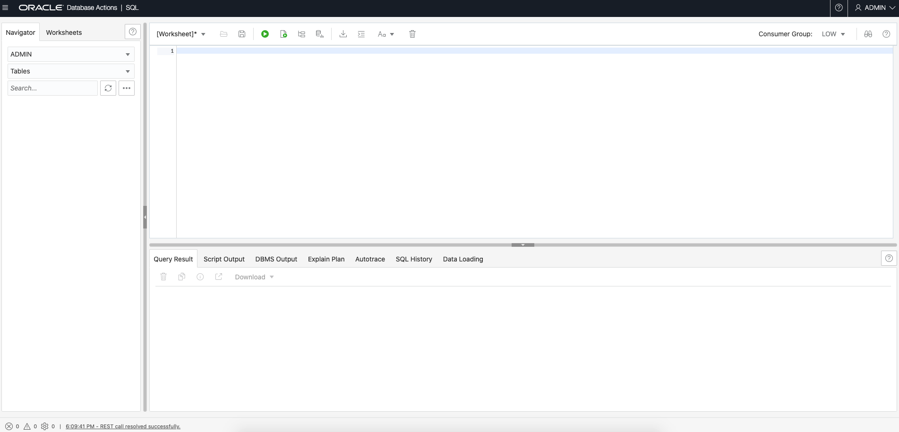

## **STEP 6:** Create Database Credential for your User

To access data in the Object Store you have to enable your database user to authenticate itself with the Object Store using your OCI object store account and Auth token. You do this by creating a private CREDENTIAL object for your user that stores this information encrypted in your Autonomous Data Warehouse. This information is only usable for your user schema.

1.  Connected as your ADMIN user in SQL Developer Web, copy and paste the code to SQL Developer worksheet. Specify the credentials for your Oracle Cloud Infrastructure Object Storage service and run the script:

    - **credential_name**: Replace `<your auth token name>` with your token name created in step 4.
    - **username**: Replace `<your cloud username>` with the OCI Username noted in step 4 (which is not the same as your database username).
    - **password**: Replace `<Auth Token>` with the OCI Object Store Auth Token you generated  generated in step 4.

    In this example, the credential object named wine_token is created. You reference this credential name in the following steps.

    ```
    <copy>
    BEGIN
      DBMS_CLOUD.CREATE_CREDENTIAL(
        credential_name => '< your auth token name >',
        username => '< your cloud username >',
        password => '< generated auth token >'
      );
    END;
    /
    </copy>
    ```

    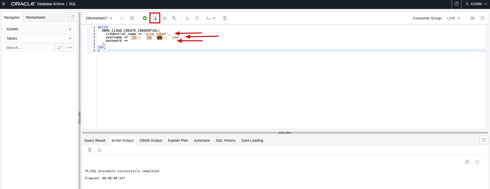

    Now you are ready to load data from the Object Store.

## **STEP 7:** Loading Data Using dbms\_cloud.copy\_data package

1.  First, create your table. Enter the following in the SQL Developer Web and run the script.

    ````
    <copy>
    create table admin.WINEREVIEWS130KTEXT
    ( id number(22),
        country varchar2(52),
        description clob,
        designation varchar2(200),
        points number(22),
        price number(22),
        province varchar2(52),
        region_1 varchar2(200),
        region_2 varchar2(52),
        taster_name varchar2(52),
        taster_twitter_handle varchar2(52),
        title varchar2(200),
        variety varchar2(200),
        winery varchar2(200)
    );

    grant select any table to public;
    </copy>
    ````

    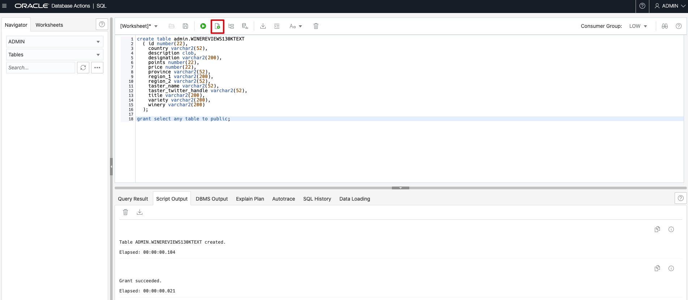

2.  Click on the refresh button.

    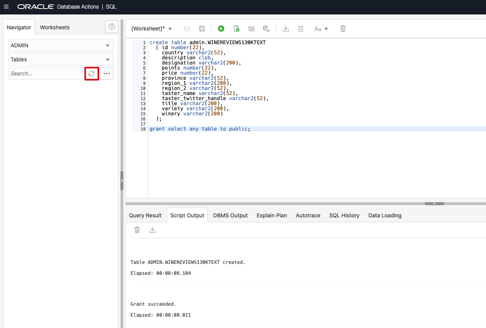

3. Notice that the table `WINEREVIEWS130KTEXT` is created. Click on the expand button to view all the columns created

    

4.  Copy the following code snippet, replace the fields with your values and then execute it:

    - **table_name**: Give the table name just created - WINEREVIEWS130KTEXT.
    - **credential_name**: Replace `<wine_token>` with your token name created in step 4.
    - **file\_uri\_list**: - Replace the file\_uri\_list with the `URL Path` for WineReviews130K object you copied earlier in step 3, from the Bucket created in Object Storage.

    ````
    <copy>
    begin
    dbms_cloud.copy_data(
        table_name =>'WINEREVIEWS130KTEXT',
        credential_name =>'wine_token',
        file_uri_list => 'https://objectstorage.<your data center - eg us-ashburn-1>/n/<your tenant - eg id05dmgeno0f>/WineBucket/o/WineReviews130K.csv',
        format => json_object('ignoremissingcolumns' value 'true', 'removequotes' value 'true', 'blankasnull' value 'true', 'delimiter' value ',', 'skipheaders' value '1')
    );
    end;
    /
    </copy>
    ````

4.  Given that you entered the correct URL path, the data should be loaded. To verify that the data is loaded, run the command:

    ```
    <copy>
    select * from WINEREVIEWS130KTEXT;
    </copy>
    ```

Please *proceed to the next lab*.

## Acknowledgements

* **Contributors** -  Anoosha Pilli, Database Product Management
* **Last Updated By/Date** - Anoosha Pilli, December 2020

## Need Help?
Please submit feedback or ask for help using our [LiveLabs Support Forum](https://community.oracle.com/tech/developers/categories/oracle-machine-learning). Please click the **Log In** button and login using your Oracle Account. Click the **Ask A Question** button to the left to start a *New Discussion* or *Ask a Question*.  Please include your workshop name and lab name.  You can also include screenshots and attach files.  Engage directly with the author of the workshop.

If you do not have an Oracle Account, click [here](https://profile.oracle.com/myprofile/account/create-account.jspx) to create one.
