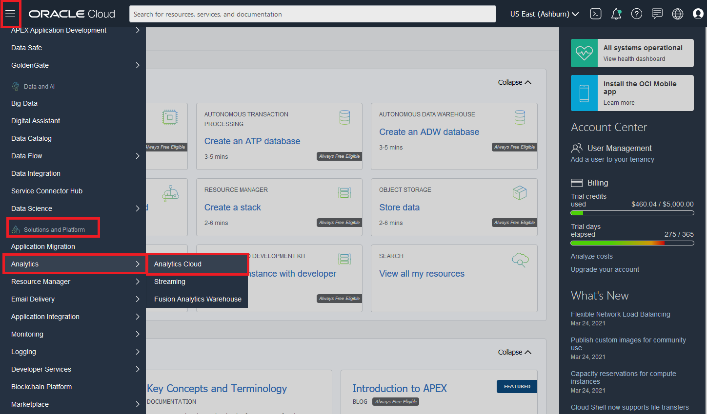

# Provision and Register an OML Model into Oracle Analytics Cloud[Workshop Under Construction]

## Introduction

This lab walks you through the steps provision an Oracle Analytics Cloud(OAC) instance, establish connection between the provisioned ADW and OAC. Then register the OML model created, in OAC to run our model on entire data set to get more insights by visualizations.

Estimated Lab Time: n minutes

### Objectives

In this lab, you will:
* Provision an Oracle Analytics Cloud instance
* Establish connection between the Autonomous Data Warehouse and Oracle Analytics Cloud
* Register the OML model created in the OAC.

### Prerequisites

* Provisioned ADW
* Created the Oracle Machine Learning Model

## **STEP 1**: Provision an Oracle Analytics Cloud Instance

1. In order to create an Oracle Analytics Cloud instance, you must login to the tenancy as a federated user. Log out of Oracle Cloud and login again using Single Sign-On (SSO).

    

2. Enter your **Username** and **Password** and click **Sign In**.

    

3. In the upper left, click the **Hamburger Button** and scroll down to **Solutions and Platform** in the menu. Then expand **Analytics** select **Analytics Cloud**.

    

4. Under **Compartment**, make sure you select the same compartment you created the Good Wine Autonomous Database instance in. Then click **Create Instance**. 

    

5. This bring up the **Create Analytics Instance** screen, specify the configuration of the instance:
    - **Compartment** - Select the compartment that houses the ADW Good Wine instance from Lab 1 in the drop-down list.
    - **Instance Name** - Use letters and numbers only, starting with a letter. Maximum length is 14 characters. (Underscores not initially supported.) This lab uses **OACWINE** as the instance name.
    - **Description** - This is an optional field to add a description or note to remind yourself of what the instance is for. We added **Oracle Analytics Instance for Good Wine Workshop** for our own reference.

    

6. Leave **Capabilities**, **Network Access** and **Tagging** as default. Under **Licensing**, select **Bring Your Own License**. Then click **Create**.

    

7. Your Oracle Analytics instance will be displayed as orange while it's provisioning. Once it turns green, it's finished and ready to use!

    

    

## **STEP 2**: Download the ADB Wallet

**Oracle Autonomous Database** only accepts secure connections to the database. This requires a *'wallet'* file that contains the SQL\*NET configuration files and the secure connection information. Wallets are used by client utilities such as SQL Developer, SQL\*Plus etc. For this workshop, you will use this same wallet mechanism to make a connection from OAC to the **Autonomous Database**.

1. You need first to download the wallet file containing your credentials. From the hamburger menu, select **Autonomous Data Warehouse** and navigate to your Autonomous Database instance.

### There are two types of wallet:

    - **Instance Wallet**: Wallet for a single database only; this provides a database-specific wallet

    - **Regional Wallet**: Wallet for all Autonomous Databases for a given tenant and region (this includes all service instances that a cloud account owns)

    > **Note**: Oracle recommends you provide a database-specific wallet, using Instance Wallet, to end users and for application use whenever possible. Regional wallets should only be used for administrative purposes that require potential access to all Autonomous Databases within a region.  

    

    

2. On the **Autonomous Database Details** page for your Autonomous Database, click the **DB Connection** button.

    

3. This will open a pop-up window. Select Wallet Type **Instance Wallet** and then **Download Wallet**.

    
    

4. You will be asked to provide a **Password** for the wallet. The password must meet the rules for the **Oracle Cloud Password** complexity. This password is a password that you need to remember for your wallet. You can use the **OMLUSER Password** that you created before. Click **Download** an save the wallet to a accessible location.

    
 
5. You can now **Close** the **Database Connection** pop up window.

    

## **STEP 3**: Establish Connection between the ADW and OAC

1. In the upper left, click the **Hamburger Button** and scroll down to **Solutions and Platform** in the menu. Then expand **Analytics** select **Analytics Cloud**.

    

2. Under **Compartment**, make sure you select the compartment **OACWINE** is located in. Then in the OACWINE instance row, click the **Three Dots** to expand out the menu and select **Analytics Home Page**. Feel free to bookmark this page to navigate back to it easier.

    

3. On the top right-hand side of the screen, click **Create**, and then **Connection**.

    

4. Choose **Oracle Autonomous Data Warehouse**.

    

5. Use the following information to configure your **Connection**.

    I recommend first selecting the Autonomous Database wallet zip file you just downloaded in ***Client Credentials*** field. It will automatically extract the required *cwallet.sso* and then **autocomplete** several of the fields for you. Later on you just have to review and modify them if need it.

    > **Connection Name**: GoodWineOAC
    >
    > **Description**: Leave it blank, or add whatever description you'd like.
    >
    > **Client Credentials**: Use the Browse button to upload the wallet zip > file that you downloaded. It will automatically extract the cwallet.sso file from this zip bundle.
    >
    > **Username**: OMLUSER - We created this user on the ADB instance.
    >
    > **Password**: The password to the wallet you created.
    > 
    > **Service Name**: Choose the name of your database followed by the \_high suffix.

    

    GoodWineOAC for name Make sure to use OMLUSER

6. Select **Save** to save your new connection **information**.

## **STEP 4**: Register the OML model created in the OAC

You may now [proceed to the next lab](#next).

## Acknowledgements
* **Author** - Charlie Berger & Siddesh Prabhu, Data Mining and Advanced Analytics
* **Contributors** -  Anoosha Pilli & Didi Han, Database Product Management
* **Last Updated By/Date** - Didi Han, Database Product Management,  March 2021