# Run the Machine Learning Notebook[Workshop Under Construction]

## Introduction


Estimated Lab Time: n minutes

### About Product/Technology

With the classification techniques, the business problem defined here is a good model with
- a good bottle of wine and a bad bottle of wine or not
- not so good greater than 90 points less than 90 point
 so we're into the area of

The data that we are using is not a standard structured data i.e we have wine reviews like "Oh this wine has a very robust flavor!", "It smelt the aroma of cherries" and so on.

So we are using Oracle textmining to filter all the unstructured data stored in the database as a 
(character large object).

Using Machine Learning SQL Model Build & Model Prediction
- Build machine learning (ML) model in ADW to predict good, inexpensive wines using in-Database OML algorithms

    ```
      BEGIN
      DBMS_DATA_MINING.CREATE_MODEL(
        model_name          => 'Wine_CLASS_MODEL',
        mining_function     => dbms_data_mining.classification,
        data_table_name     => 'Wine_TRAIN_DATA',
        case_id_column_name => 'ID',
        target_column_name  => 'POINTS_BIN',
        settings_table_name => 'Wine_build_settings');
    END;
    /
    ```

- Apply ML model using SQL query to predict a likely good, inexpensive wine

    ```
    SELECT PREDICTION_PROBABILITY(Wine_CLASS_MODEL, 'GT_90_POINTS' 	   USING 25 as PRICE, 'MALBEC' as VARIETY, 'SPAIN' as COUNTRY)
    FROM dual;
    ```

### Objectives

In this lab, you will:
* Objective 1
* Objective 2
* Objective 3

### Prerequisites

* Provisioned ADW
* Logged in as ML user and have uploaded the notebook.

## **STEP 1**: Business Problem, Methodogy

1. In the Picking a Good Wine using OML notebook, click on run button to run the Notebook.

    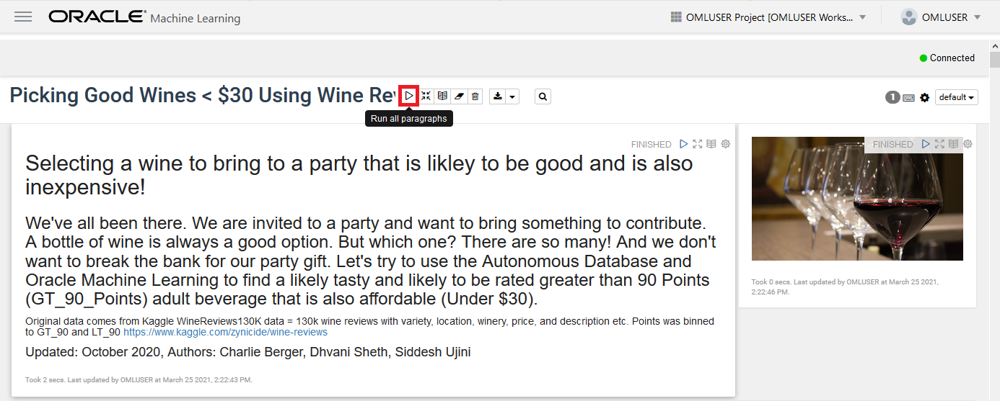

2. In the pop up click on **OK** to run the notebook.

    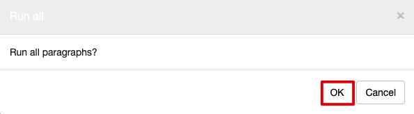

3. 
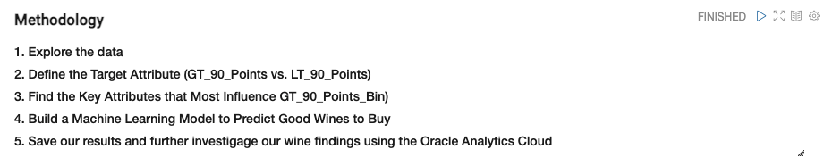
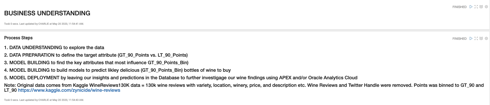

3. Explore the data with the focus on points, price, province, region, Taster\_Name, taster\_Twitter_handle.

--> notebook data understanding image select * from..

## **STEP 2:** Data Preparation

1. Before converting the description into a clob object, first, alter the table to add a points_bin column to the table

    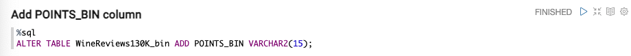

2. Populate the points_bin column to do a classification to know whether a wine is good or bad i.e., as greater than 90 points and less than 90 points.

    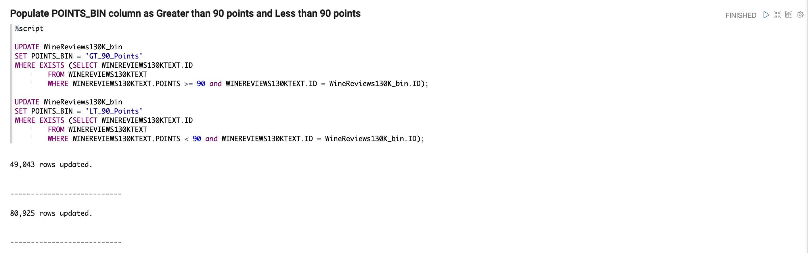

3. Divide the table to seggregate all of the wines to have points greater than 90 with a tag greater than 90 points and similarly less than 90 with the tag less than 90 points.

    Scroll right to the table to view the points_bin column with the tags .

    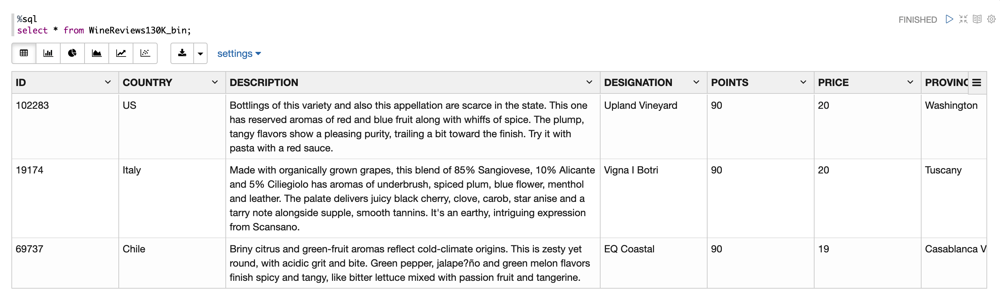

    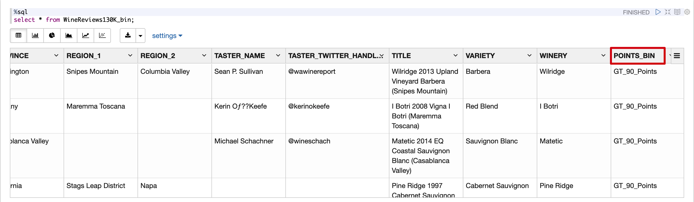

4. Then divide the table into trainer and test data set, to run or build our model on training data and then test model on tesing data.

    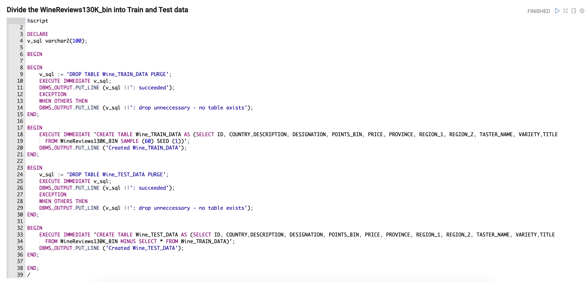

5. We will be converting the description column from varchar2 to clob object by adding a new column, setting the previous description column to a new coloumn and then dropping the column. This is to use in Oracle text minning.

    

6. Notice that the description is now clob data type.

    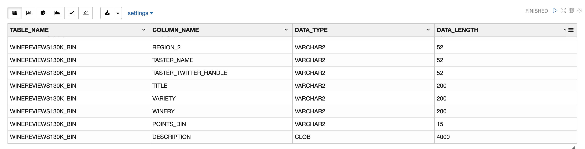

7. Change the Description attribute from varchar2 to clob for training data and display the metadata.

    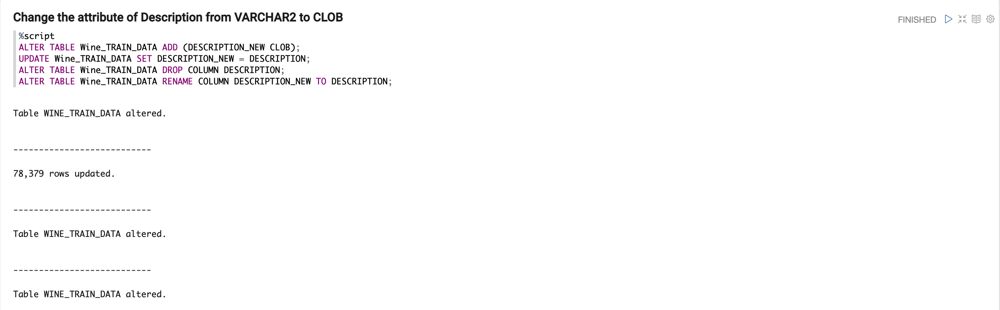

    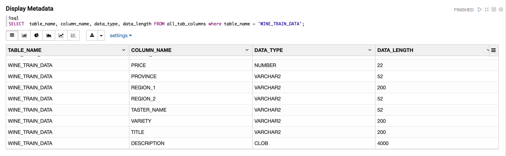

8. Change the Description attribute from varchar2 to clob for test data and display the metadata.

    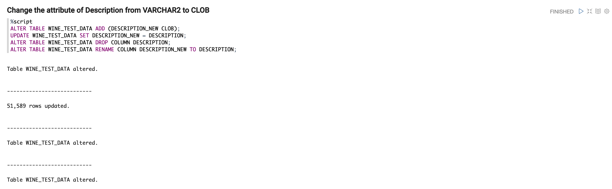

    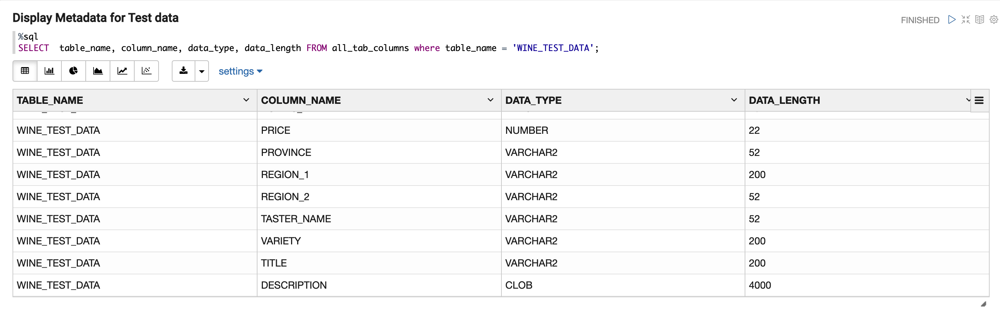

## **STEP 3:** Data Understanding

Now, let us understand how the data is distributed in our table to see how many reviews or how many wines in our data set, which wines are greater than 90 points and less than 90 points.

1. In the wine points ratings distribution, you can see that the lighter shade of blue are less than 90 points and darker shade of the blue are greater than 90 points.

    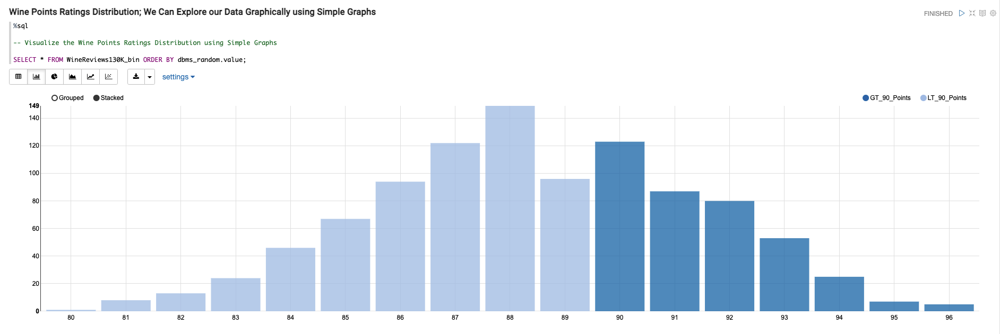

2.  If you hover over one of the bars in the graph it gives you the actual point and the total number of data that you have.

    In this example, when we hover over the 89 points bar we have about 96 records.

    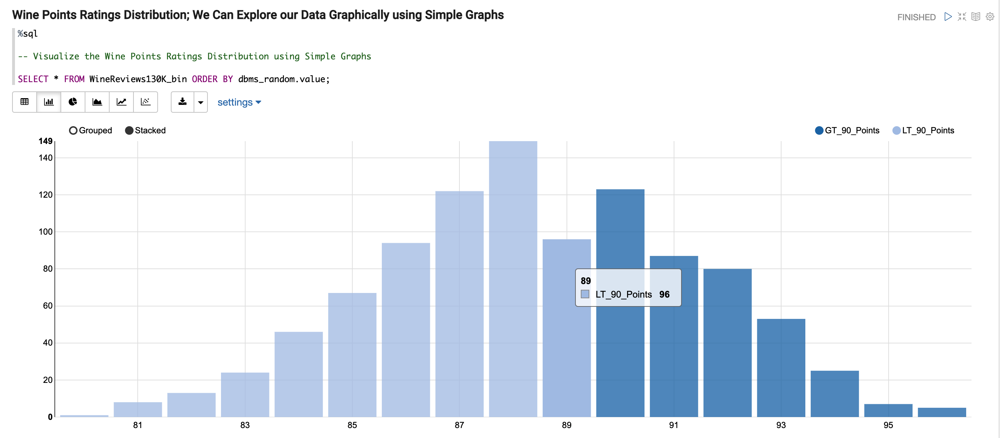

    Note that oracle machine notebooks by default uses zepplin graph to show a simple visualization that takes the top 1000 records. If the highly computational values are at the bottom of the database oracle machine notebook, the values may quite vary when compared to the accurate results.

3. Explore the data based on top 10 countries and display the count of wines. Note that US is leading followed by France and so on.

    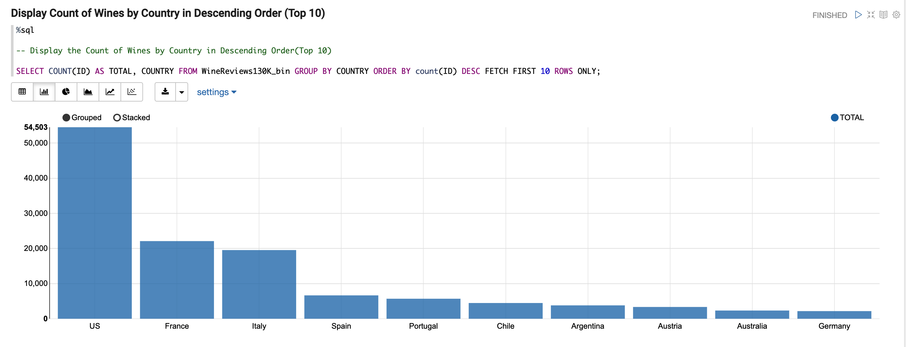

4. Apache zepplin notebook allows six different types of graphs - table, bar chart, pie chart, area chart, line chart and scatter chartto visualize.

    Here we are comparing wines from Australia, California and Spain countries by regions using pie chart.

    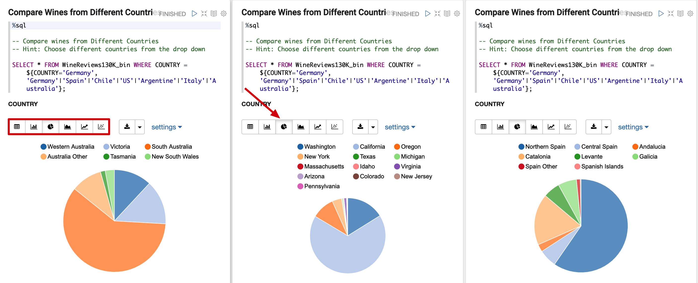

5.  We are doing this as a classification problem but the model we created has a classification column which is greater than 90 points and less than 90 points which we don't need. Create a new table WineReviews130KTarget without the points attribute from WineReviews130K.

    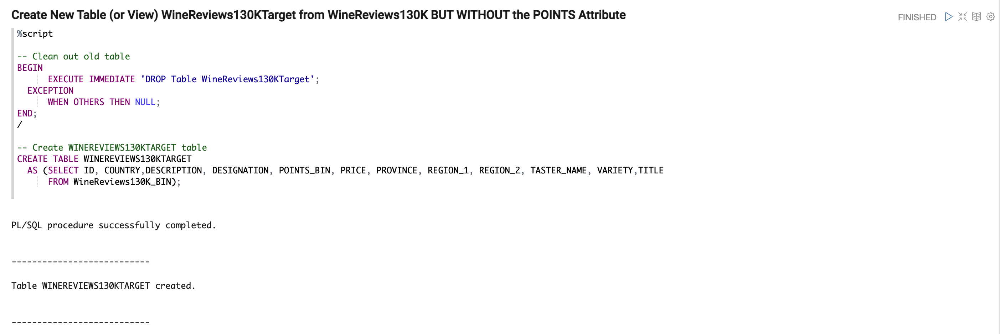

6. View the WineReviews130KTarget table.

    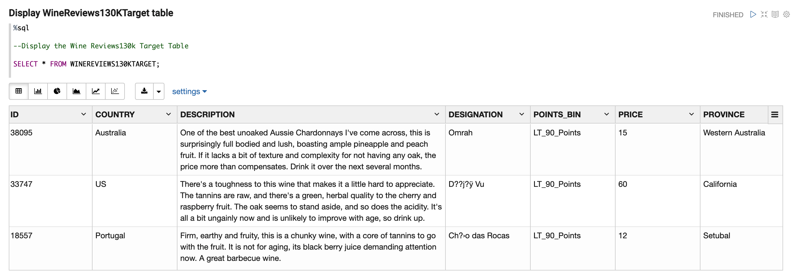

## **STEP 4:** Unstructured Data Preparation using Oracle Text

In order to use the reviews in the description column of the WineReviews130KTarget table in our machine model, we use oracle text to do mining of unstructured data. You can apply data mining techniques to text terms which are also called as text features or tokens. These text terms can be a group of words or words that have been extracted from text documents and their assigned numeric weights.

1. Drop the existing Lexer preference for repeatability

    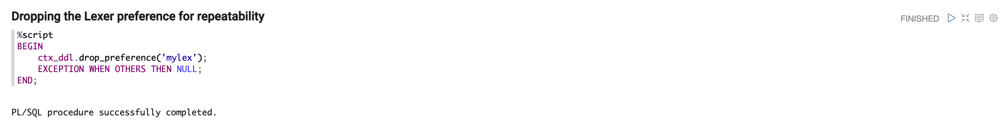

2. Create a new lexer preference for text mining by specifying the name of the preference you want to create, the type of lexer preference you want from the types Oracle has and the set of attributes for your preference.

    In this example, `mylex` is the name of the preference, `BASIC_LEXER` is the type of lexer preference and setting attributes as `index_themes`, `index_text`.

    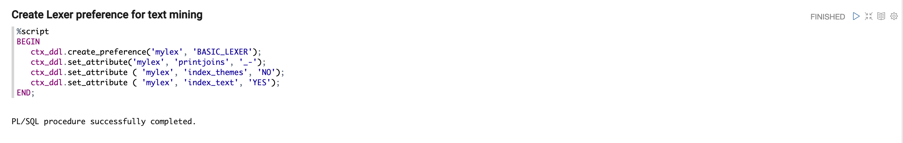

3. Create another preference for the basic wordlist and set the attributes for text mining.

    In this example, `mywordlist` is the name of `BASIC_WORDLIST` preference, with attributes set for language as english, score as 1, number of results as 5000.

    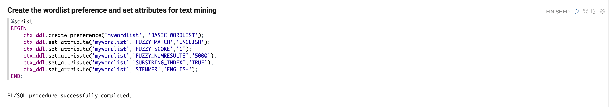

4. Drop an existng text policy for repeatability and create a new text policy for description for the lexer and wordlist preference that you just created.

    In this example, `my_policy` is the name of our policy for the `mylex` and `mywordlist`

    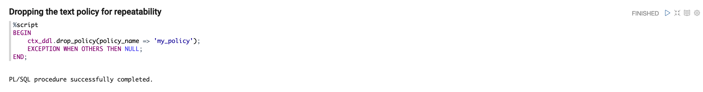

    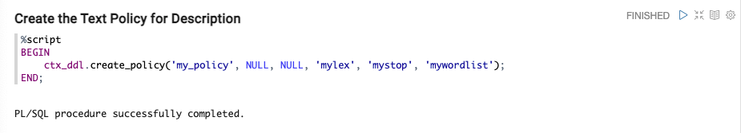

## **STEP 5:** Model Building

### Build Attribute Importance Model

Now, let's build attribute importance model using both structured and unstructured (wine reviews) data.

1. Give the `ALGO_NAME`. We're using a minimum descriptor length for doing the attribute importance. Then specify the text policy name  you created i.e , the maximum of features you want your model to use, the default value is 3000 which tells the maximum number of features to use from the document set.

    Note that it just took 54 sec to show the actual words from the 130k records of unstructured text mining data.

    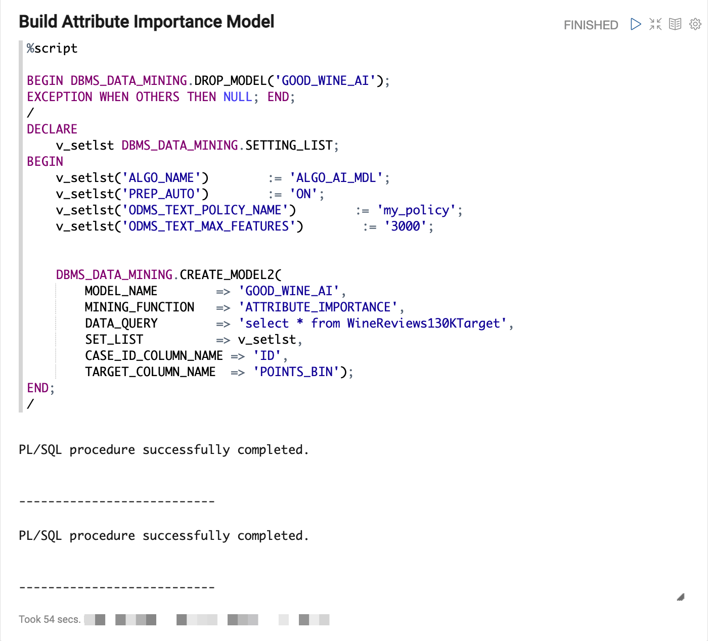

2. Once you run the attribute importance model,
notice that we have our attribute importance ranked based on the ascending order of the rank i.e by price, province, variety etc.

    Here specific words like palate, wine, aromas, acidity, finish, rich etc are the tokens from the table that influence the attributes to get a rich wine.

    The attribute importance values are the coefficiensts that show how strong each individual word is.

    In this example, PALATE is ranked 4 from description with coefficient value 0.0311229.

    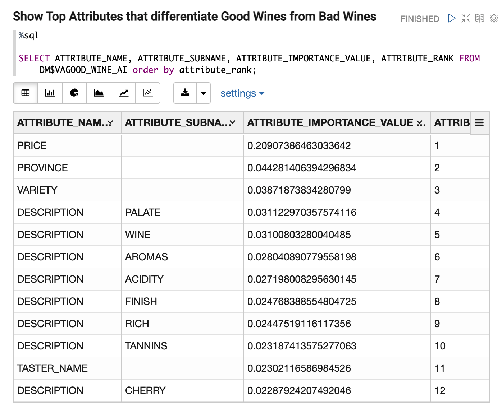

### Build Classificaiton Model

As we built our attribute importance model, we will build a classification model using both structured and unstructured(wine\_reviews) data.

3. Build a supervised learning classificaton model - "Wine\_CLASS\_MODEL\_SVM" that predicts good wine (GT\_90\_POINTS) using Oracle Machine Learning Support Vector Machine Algorithm.

    

## **STEP 6:** Model Evaluation

Now that we have built a machine learning model, let's evaluate the model.

1. We score the data by applying the model we just created - "Wine\_CLASS\_MODEL\_SVM" to the test data - "WINE\_TEST\_DATA" and the results are stored in - "Wine\_APPLY\_RESULT".

    To see how good or bad the model is, we compute a lift chart using COMPUTE_LIFT to see how our model is performing against the RANDOM_GUESS.

    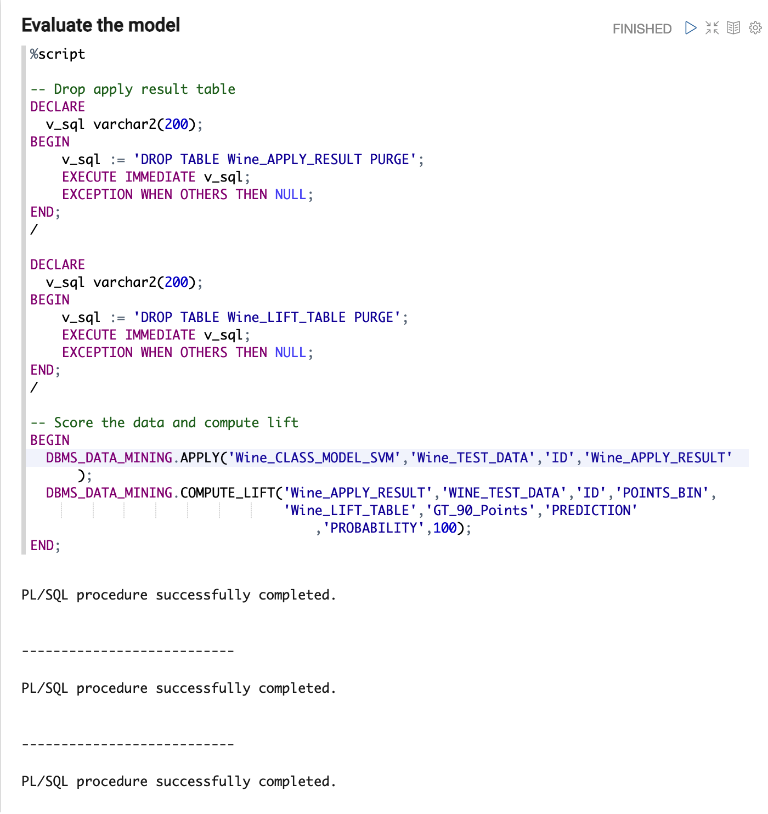

    

2. Here is the result of the data mining model we just created with the TARGET\_VALUE, ATTRIBUTE\_NAME, COEFFICIENT, REVERSED\_COEFFICIENT.

    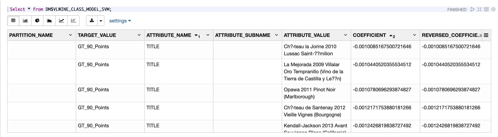

## **STEP 7:** Model Deployment

Now let's apply the model to a specific data points.

1. Explore the wines that are predicted to be good wines based on the classification we did i.e., greater than 90 points and less than 90 points. Each row in our test table displays the predicted result.

    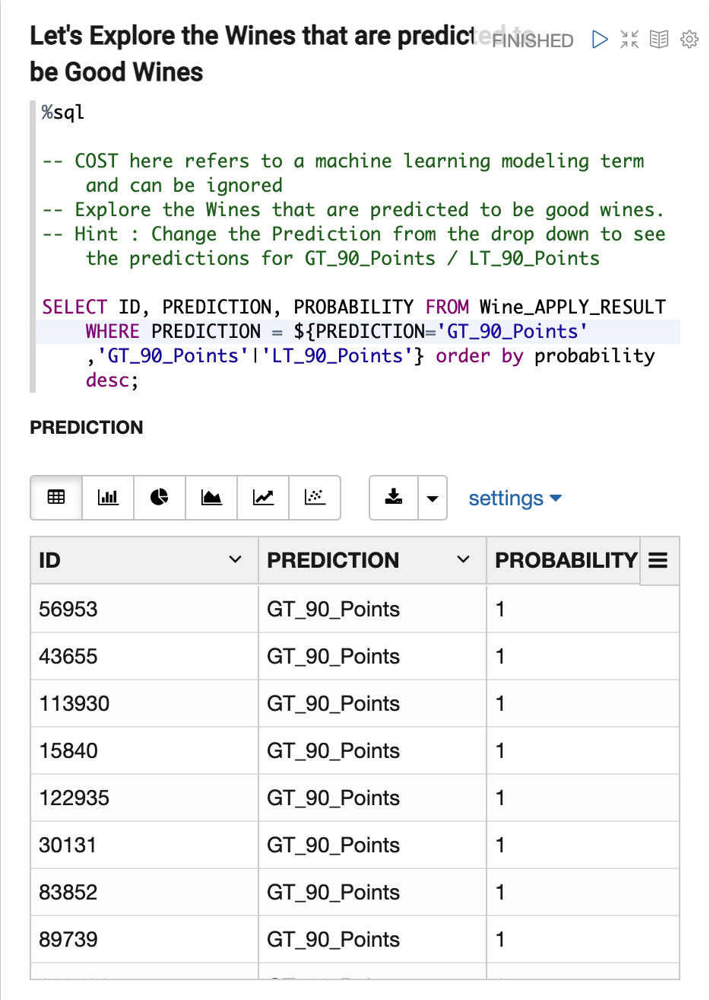

2. Focusing on the wines that have been predictied to be the good wines i.e., greater than 90 points and comparing them with the bad wines i.e., lower than 90 points, we are applying our model result on the actual dataset and then predicting it.

    As we are applying the model, we get a prediction result of which wine falls into which category, it's probability of being greater than 90, shows the actual description and country along with few other parameters.

    For example, the first record in the screenshot, ID - 127518 shows the prediction to be greater than 90 points and has the probability - 0.905(approximately) which is greater then 90 points. Notice that the description for this record mentions all the characteristics of a good wine.

    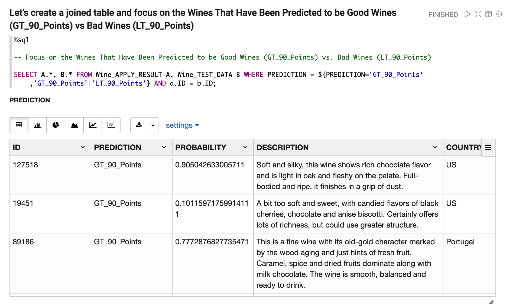

3. As we wanted inexpensive wines, this graphs shows 1000 good wines that are less than $15 and their predictions greater than 90 points by countries based on our data set and model.

    From the graph, notice that France has a good number of wines that are good as well as cheap and then US followed by Italy and Chile.

    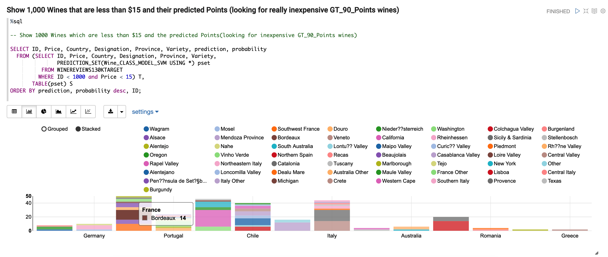

    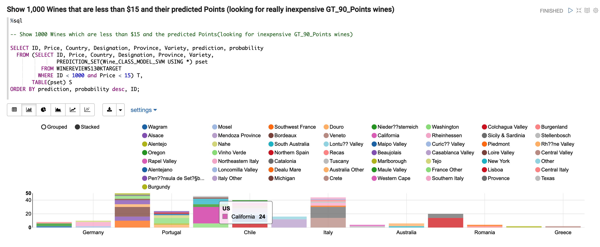


4. In order to investigate wine insights and predictions a bit further using Oracle Analytics Cloud, we remove any previous "WinePredictions" table.

    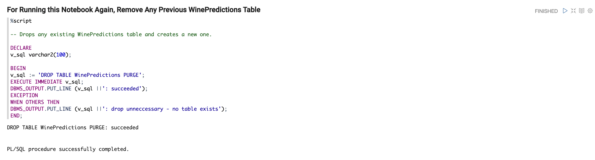

5. Create a new "WinePredictions" table in ADW to be accessed by Oracle Analytics Cloud and run our model on entire data set to get more visual insights.

    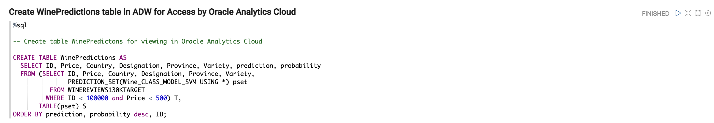

6. View the "WinePredictions" table created.

    

You may now [proceed to the next lab](#next).


## Acknowledgements
* **Author** - <Name, Title, Group>
* **Contributors** -  <Name, Group> -- optional
* **Last Updated By/Date** - <Name, Group, Month Year>
* **Workshop (or Lab) Expiry Date** - <Month Year> -- optional, use this when you are using a Pre-Authorized Request (PAR) URL to an object in Oracle Object Store.

## Need Help?
Please submit feedback or ask for help using our [LiveLabs Support Forum](https://community.oracle.com/tech/developers/categories/livelabsdiscussions). Please click the **Log In** button and login using your Oracle Account. Click the **Ask A Question** button to the left to start a *New Discussion* or *Ask a Question*.  Please include your workshop name and lab name.  You can also include screenshots and attach files.  Engage directly with the author of the workshop.

If you do not have an Oracle Account, click [here](https://profile.oracle.com/myprofile/account/create-account.jspx) to create one.
