# Import and Run the Machine Learning Notebook

## Introduction

Oracle Machine Learning notebook Apache Zeppelin comes with your Autonomous Database. Once data is loaded into the Autonomous Database, you can start using Oracle Machine Learning notebooks to investigate the data and run machine learning models with it. In this lab, you will import, run and explore the Oracle Machine Learning notebook. We'll walk through each step in the notebook and explain the processes used to create a useful model in solving our business problem.

Estimated Lab Time: 15 minutes

Quick walk through on how to import and run the Machine Learning notebook.

*Note: The OCI Cloud Service Console navigation may look different then what you see in the video as it is subject to change.*

### About Product/Technology

The business problem defined here is to find a good wine that is less than 30 dollars using Oracle Machine Learning models to predict a wine's score.
- Good wine have a score of greater than 90 points (GT\_90\_Points)
- Bad wine have a score of less than 90 points (LT\_90\_Points)
- Predict probability of a wine being GT\_90\_Points based on attributes

The data that we are using is not a standard structured data set. For example, we have wine reviews that say "Oh this wine has a very robust flavor!", "It smelt the aroma of cherries" and so on. So, we are using Oracle Machine Learning with text mining to filter all the unstructured data stored in the database as Character Large Object (CLOB) data types.

As an brief summary of the process we'll be following within the notebook: we will prepare our data, use 60% of our dataset to train our machine learning model, test the trained model on the remaining 40% of our dataset, compare the test results with a random guess model to determine the accuracy of our trained model and if we're happy with the results we'll apply the model to the entire dataset and use it to solve our business problem.

### Objectives

In this lab, you will:
* Upload an OML notebook
* Run the notebook
* Explore the notebook

### Prerequisites

* Provisioned an Autonomous Database instance
* Created an OMLUSER account
* Uploaded data

## **STEP 1**: Upload Notebook to Oracle Machine Learning

1.  From the hamburger menu, select **Autonomous Data Warehouse** and navigate to your Autonomous Database instance.

	

    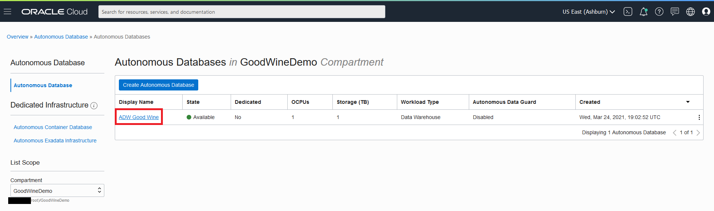

2.  Select **Tools** on the Autonomous Database Details page.

    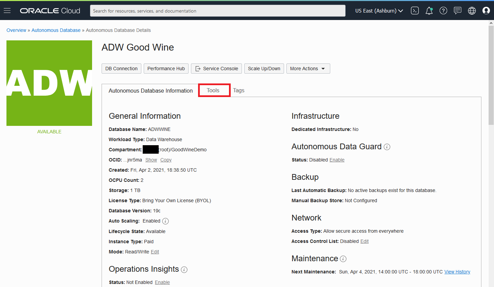

3.  Select **Open Oracle ML User Administration** under the tools menu.

    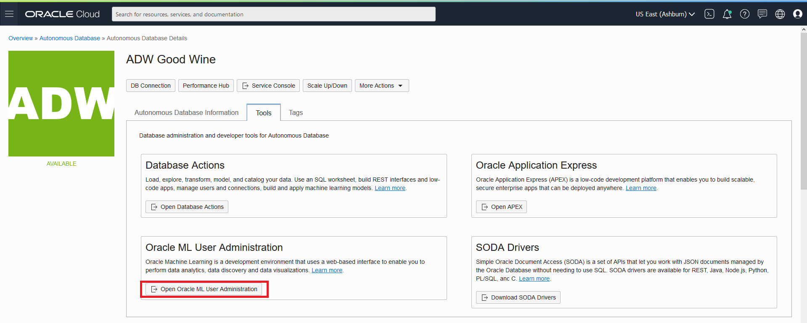

4. Sign in as **Username - ADMIN** with the password you used when you created your Autonomous Database instance.

    

5.  Click the **Home Icon** in the top right corner.

    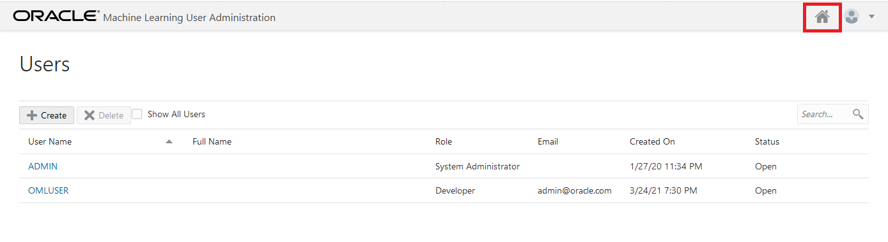

6. Sign in as **Username - OMLUSER** and with the password you used when you created the OMLUSER account.

    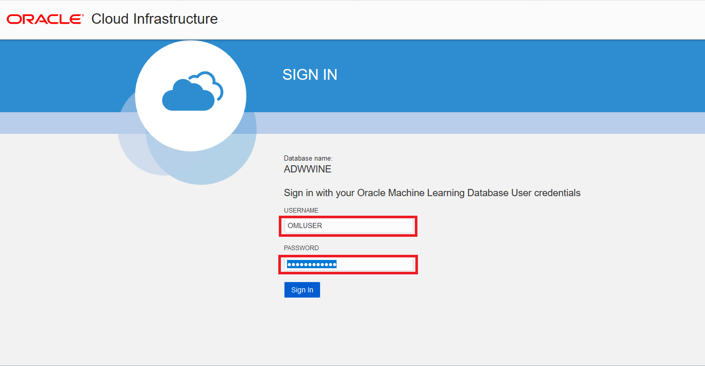

7.  We will be importing a **Picking-Good-Wines-$30-Using-Wine-Reviews.json** ML notebook in this lab. Click the link below to download the notebook. 

    [Picking-Good-Wines-$30-Using-Wine-Reviews.json](files/Picking-Good-Wines-$30-Using-Wine-Reviews.json?download=1)

8. Click on the upper-left hamburger menu and select **Notebooks**.

    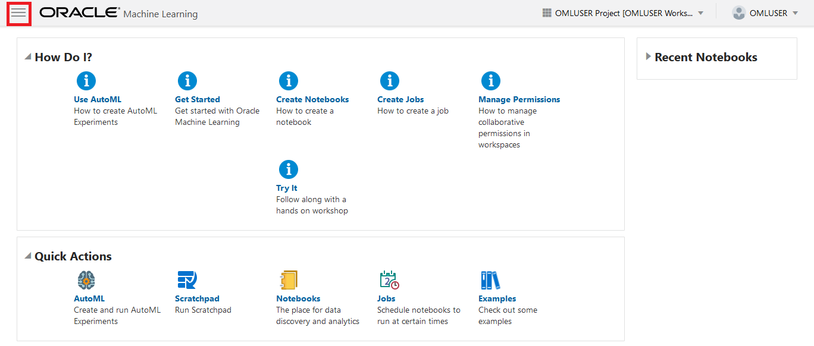

    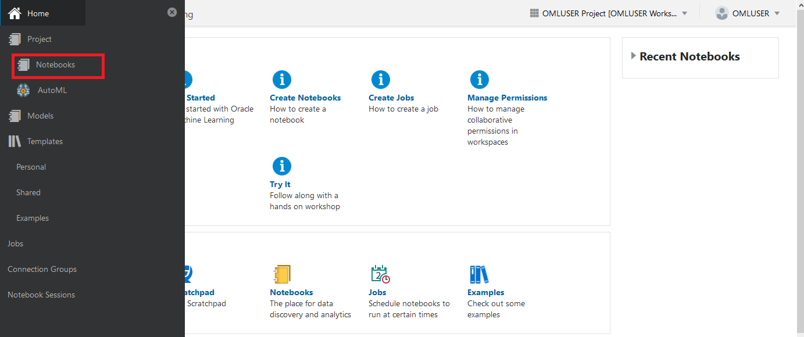

9. Click on **Import** and upload the notebook downloaded earlier.

    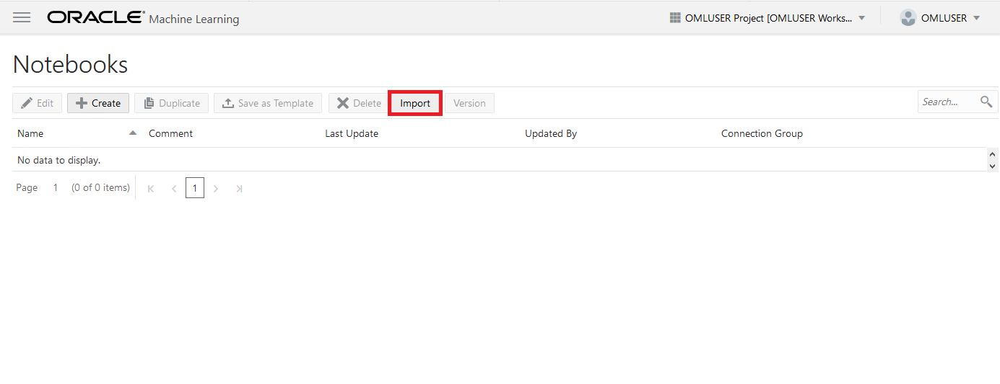

10. Once the notebook is uploaded, click on the **Picking Good Wines < $30 Using Wine Reviews** notebook to view.

    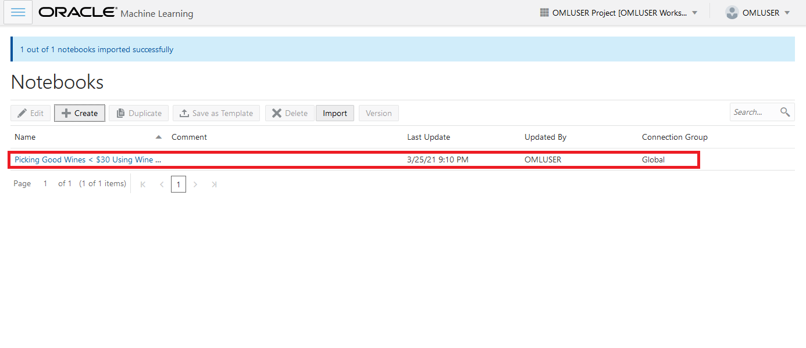

    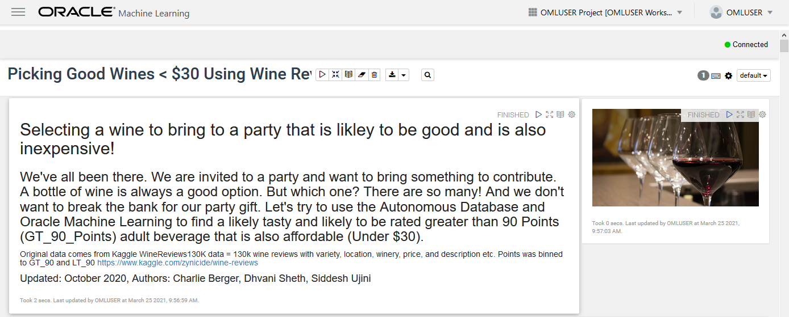

## **STEP 2**: Run the Notebook

1. In the Picking Good Wines < $30 Using Wine Reviews notebook, click on the **gear** icon in the upper right. 

    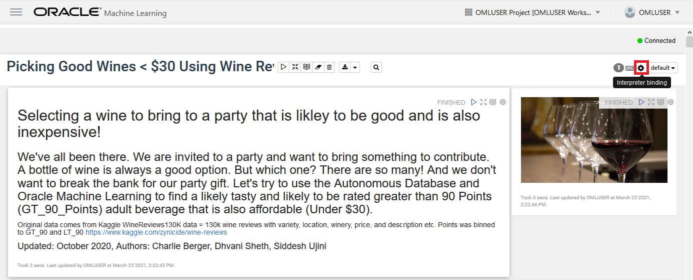

2. We must set the interpreter binding if we're going to connect to the Autonomous Database instance and run queries. Ensure at least one of the bindings is selected, then click save.

    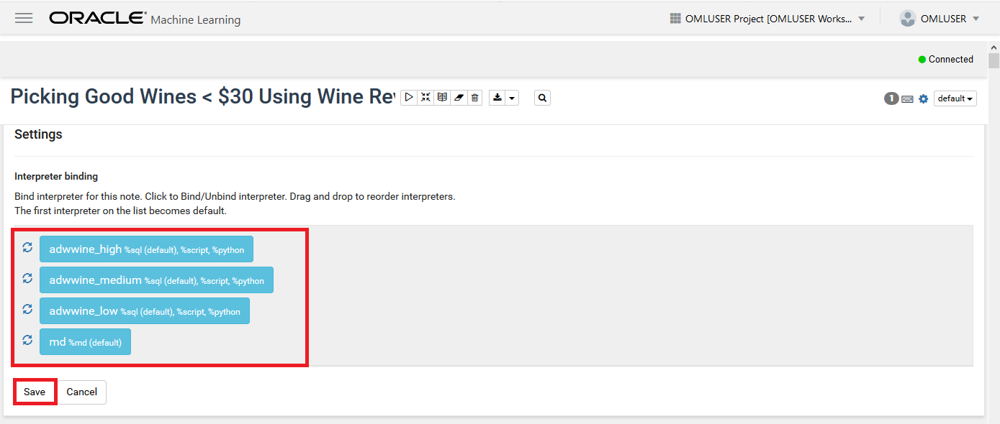

3. Click on run button. 

    

4. In the pop up click on **OK** to run the notebook. If any paragraphs have an error, click the **run** button for them individually until they are finished.

    

## **STEP 3**: Explore the Notebook
### Explore the data with the focus on points, price, province, region, Taster\_Name, taster\_Twitter_handle.

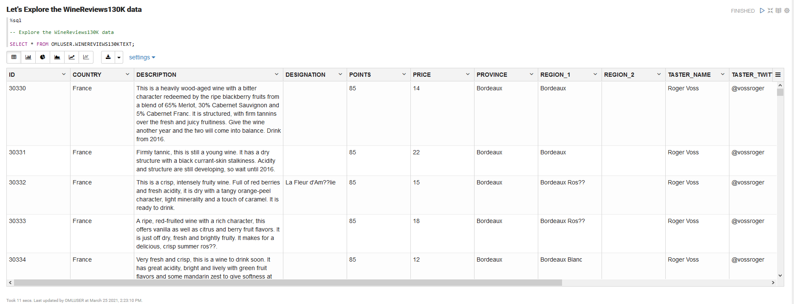

1. Before converting the description into a CLOB object, first, alter the table to add a POINTS_BIN column to the table.

    

2. Populate the points\_bin column with a classification derived from the value of the POINTS column to know whether a wine is good or bad i.e., GT\_90\_Points vs LT\_90\_Points.

    

3. View the updated WineReviews130k_bin table.

    Scroll right on the table to view the added POINTS_BIN column.

    

    

4. Next, we use 60% of our dataset to construct a model and reserve the other 40% of our data to test the accuracy of the model we created. We don't use stratified sampling here because the amount of data we have is relatively balanced, the data is not overwhelmingly weighted toward GT\_90\_Points or LT\_90\_Points such that it would be impossible for Oracle Machine Learning to correlate attributes with scores.

    

5. We will be converting the description column from VARCHAR2 to CLOB by adding a new column, setting the previous description column to a new column and then dropping the old column. We can't perform sampling on CLOB due to limitations, which is why we're converting from VARCHAR2 to CLOB after that is complete.

    

6. Notice that the description is now CLOB data type.

    

7. Change the Description attribute from VARCHAR2 to CLOB for training data and display the metadata.

    

    

8. Change the Description attribute from VARCHAR2 to CLOB for test data and display the metadata.

    

    

### Data Understanding

Now, let us understand how the data is distributed in our table to see how many reviews or how many wines are in our data set, and which wines are GT\_90\_Points or LT\_90\_Points.

1. In the wine points ratings distribution, you can see that the lighter shade of blue are LT\_90\_Points and darker shade of the blue are GT\_90\_Points.

    

2.  If you hover over one of the bars in the graph it gives you the actual point value and the total number of records that you have for that value.

    In this example, when we hover over the 89 points bar we have 96 records.

    

    Note that Oracle Machine Learning notebooks by default uses Zepplin graph to show a simple visualization that takes the top 1000 records. If the highly computational values are at the bottom of the database Oracle Machine Learning notebook, the values may vary when compared to the actual results.

3. Explore the data based on top 10 countries and display the count of wines. Note that the U.S. is leading, followed by France and so on.

    

4. Apache Zepplin notebook allows six different types of graphs - table, bar chart, pie chart, area chart, line chart and scatter chart to visualize.

    Here we are displaying various graphs from Australia, Italy and Spain. Feel free to play around with the settings in this handy tool to display information pertinent to us.

    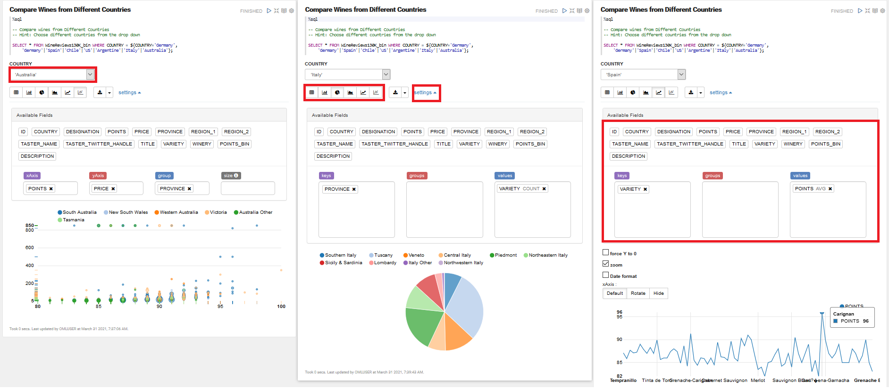

5.  We are doing this as a classification problem but the model we created has a attribute column POINTS we derived GT\_90\_Points or LT\_90\_Points from, which we don't need anymore. Create a new table WineReviews130KTarget without the POINTS attribute from WineReviews130K.

    

6. View the WineReviews130KTarget table.

    

### Unstructured Data Preparation using Oracle Text

In order to use the reviews in the description column of the WineReviews130KTarget table in our machine model, we use Oracle Machine Learning with text mining to process the unstructured data. You can apply data mining techniques to text terms which are also called text features or tokens. These text terms can be a group of words or words that have been extracted from text documents and their assigned numeric weights.

1. Drop the existing lexer preference for repeatability.

    

2. Create a new lexer preference for text mining by specifying the name of the preference you want to create, the type of lexer preference you want from the types Oracle has and the set of attributes for your preference.

    In this example, `mylex` is the name of the preference, `BASIC_LEXER` is the type of lexer preference and setting attributes as `index_themes`, `index_text`.

    

3. Create another preference for the basic word list and set the attributes for text mining.

    In this example, `mywordlist` is the name of the `BASIC_WORDLIST` preference, with attributes set for language as english, score as 1, number of results as 5000.

    

4. Drop an existing text policy for repeatability and create a new text policy for description for the lexer and word list preference that you just created.

    In this example, `my_policy` is the name of our policy for `mylex` and `mywordlist`

    

    

### Build Attribute Importance Model

Now, let's build an attribute importance model using both structured and unstructured (wine reviews) data.

1. Give the `ALGO_NAME`. We're using Minimum Descriptor Length (MDL) for attribute importance. Then specify the text policy name you created i.e , the maximum number of features you want your model to use, the default value is 3000.

    Note that it just took 54 sec to determine the weight or importance of each attribute from the 130k records of unstructured text mining data.

    

2. Once you run the attribute importance model, notice that we have our attribute importance is ranked based on the ascending order of the rank i.e by price, province, variety etc.

    Here specific words like palate, wine, aromas, acidity, finish, rich etc are the tokens from the table that influence the attributes to get a rich wine.

    The attribute importance values are the coefficients that show how strong each individual word is.

    In this example, PALATE is ranked 4 from description with coefficient value 0.0311229.

    

### Build Classification Model

After we built our attribute importance model, we will build a classification model using both structured and unstructured (wine\_reviews) data.

1. Build a supervised learning classification model - "Wine\_CLASS\_MODEL\_SVM" that predicts good wine (GT\_90\_Points) using Oracle Machine Learning Support Vector Machine Algorithm.

    

### Model Evaluation

Now that we have built a machine learning model, let's evaluate the model.

1. We score the data by applying the model we just created - "Wine\_CLASS\_MODEL\_SVM" to the test data - "WINE\_TEST\_DATA" and the results are stored in - "Wine\_APPLY\_RESULT".

    To see how good or bad the model is, we compute a lift chart using COMPUTE\_LIFT to see how our model is performing against the RANDOM\_GUESS.

    

    

2. Here is the result of the data mining model we just created with the TARGET\_VALUE, ATTRIBUTE\_NAME, COEFFICIENT, REVERSED\_COEFFICIENT.  

    You may be wondering where DM$VLWINE\_CLASS\_MODEL\_SVM came from. DM$VLmodel\_name is Oracle Machine Learning's Model Detail View for Support Vector Machine which describes linear coefficient views. To learn more, click [this link](https://docs.oracle.com/en/database/oracle/machine-learning/oml4sql/21/dmprg/model-detail-views.html#GUID-E40F3A3A-0158-45B4-8FD9-ADF6CA3FB9A6).

    

### Model Deployment

Now let's apply the model to specific data points.

1. Explore the wines that are predicted to be good wines based on the classification we preformed i.e., GT\_90\_Points or LT\_90\_Points. Each row in our test table displays the predicted result.

    

2. Focusing on the wines that have been predicted to be the good wines i.e., GT\_90\_Points, and comparing them with the bad wines i.e., LT\_90\_Points., we are apply our model result on the actual dataset and then predict the result.

    As we are applying the model, we get a prediction result of: which wine falls into which category, it's probability of being GT\_90\_Points, the actual wine description and country along with a few other parameters.

    For example, the first record in the screenshot, ID - 127518 shows the prediction to be greater than 90 points and has the probability - 0.905 (approximately 90%) in which it is GT\_90\_Points. Notice that the description for this record mentions all the characteristics of a good wine.

    

3. As we wanted inexpensive wines, this graphs shows 1000 good wines that are less than $15 and with predictions of being GT\_90\_Points by countries, based on our data set and model.

    From the graph, notice that France has a good number of wines that are good as well as cheap and then US followed by Italy and Chile.

    

    

4. In order to investigate wine insights and predictions a bit further using Oracle Analytics Cloud, we remove any previous "WinePredictions" table.

    

5. Create a new "WinePredictions" table in ADB to be accessed by Oracle Analytics Cloud and run our model on the entire data set to gain more visual insights.

    

6. View the "WinePredictions" table created.

    

7. View the "Best_Wines" table created.

    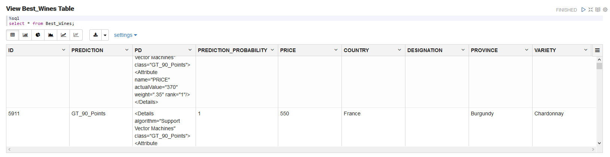

### Notebook Complete ###

Whew! That was a lot of information to work through, but now you've successfully created, tested, and implemented an Oracle Machine Learning model! Grab a glass of wine and celebrate!

You may now [proceed to the next lab](#next).

## Acknowledgements
* **Author** - Charlie Berger, Senior Director of Product Management, Machine Learning, AI and Cognitive Analytics & Dhvani Sheth, Senior Cloud Engineer, Emerging Cloud Solution
* **Contributors** -  Anoosha Pilli & Didi Han, Database Product Management
* **Last Updated By/Date** - Didi Han, Database Product Management, April 2021
