# Getting Started with Machine Learning Notebook[Workshop Under Construction]

## Introduction

Oracle machine learning notebook apache zeppelin comes with your Autonomous Data Warehouse. Once the data is in ADW, you can start using oracle machine learning notebooks to investigate the data and run machine learning models with it. In this lab, you will set up users, log in and load the Oracle Machine Learning notebook.

Estimated Lab Time: n minutes

### Objectives

In this lab, you will:
* Set up Oracle Machine Learning users

### Prerequisites

* Should have successfully provisoned an Autonomous instance

## **STEP 1:** Create ML User and Log In

1.  Login to Oracle Cloud, click on hamburger menu and select **Autonomous Data Warehouse**.

    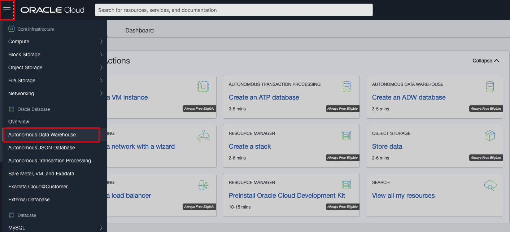

2. Select the compartment where your ADW instance is created and click on your ADW instance.

    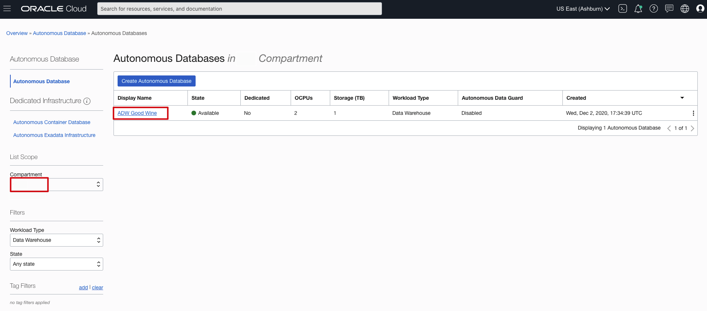

2.  Select **Service Console** of your ADW instance.

    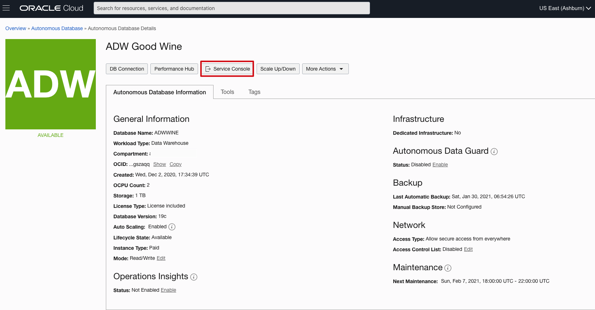

3.  Select **Administration**.

    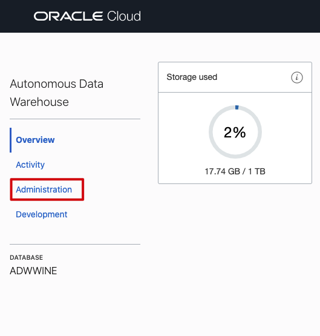

4.  Select **Manage Oracle ML Users**.

    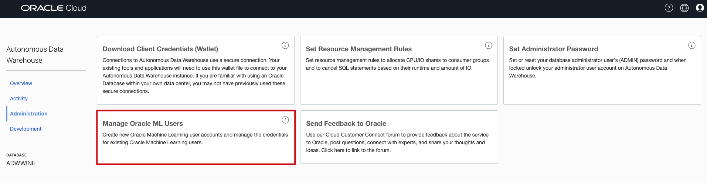

5.  Login with your ADW instance admin userid. Enter **Username - admin** and **Password** that you assigned when you created the ADW instance and click **Sign In**.

    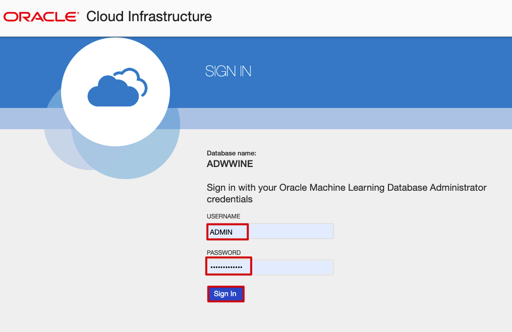

6.  Click **Create** to create a new ML user.

    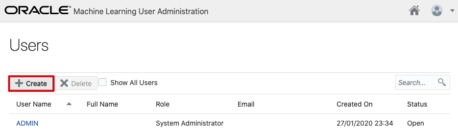

7. Enter **Username - ml\_user**, provide your account **Email Address**, uncheck the box - `Generate password and email account details to the user` and give your ml\_user a **Password** and click **Create**.

    

8.  Once the user is created, select the **home icon** on the upper right.

    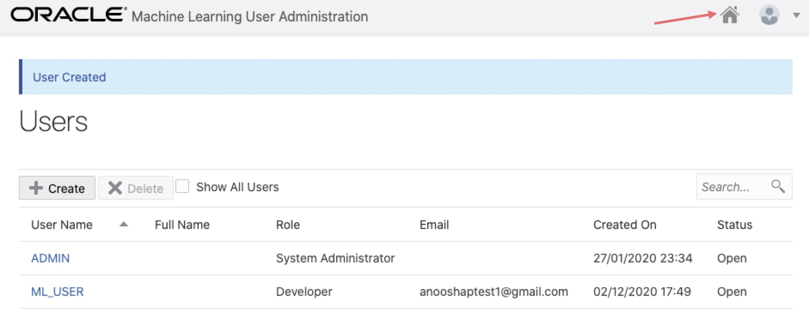

9.  Log in as **Username: ml\_user** and provide the **Password** you just for the ml\_user. Before you log in, you may wish to bookmark this page.

    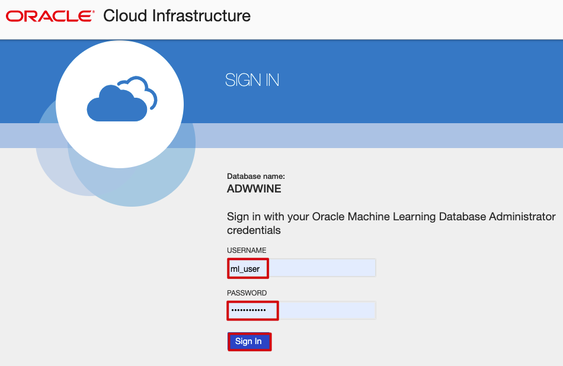

## **STEP 2:** Import the Notebook

1.  We will be importing a **Picking a Good Wine using OML_1 (4).json** ML notebook in this lab. Click [here]() to download the notebook.

2. Click on the upper-left hamburger menu and select **Notebooks**.

    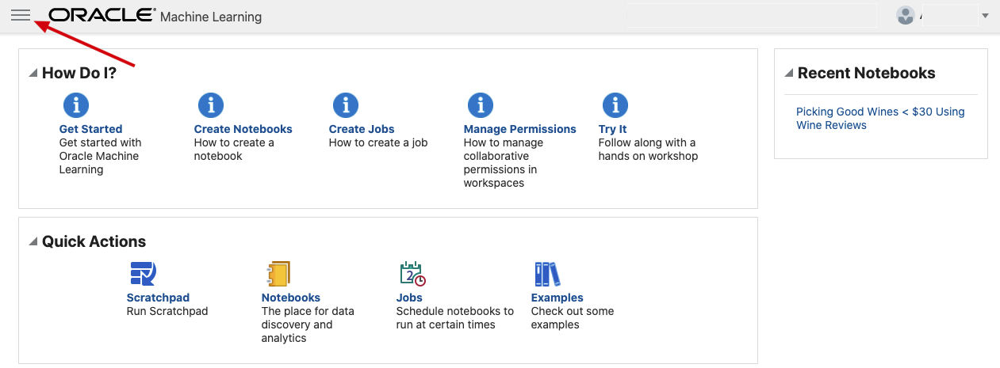

    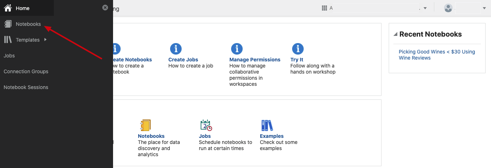

3. Click on **Import** and upload the notebook downloaded earlier.

    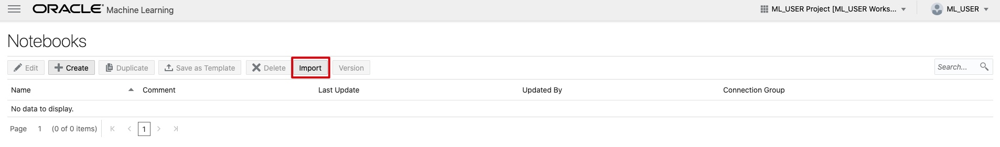

4. Once the notebook is uploaded, click on the **Picking a Good Wine using OML_1** notebook to view.

    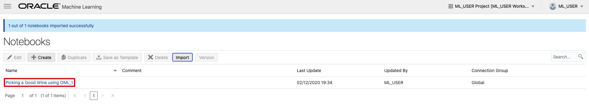

    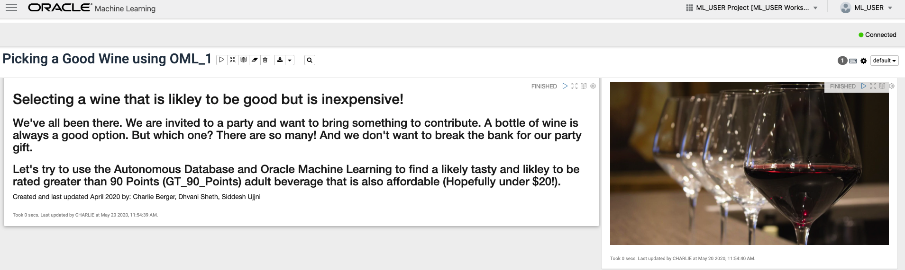

You may now [proceed to the next lab](#next).

## Acknowledgements

* **Author** -  Anoosha Pilli, Database Product Management
* **Last Updated By/Date** - Anoosha Pilli, December 2020
* **Lab Expiry Date** -

## Need Help?
Please submit feedback or ask for help using our [LiveLabs Support Forum](https://community.oracle.com/tech/developers/categories/oracle-machine-learning). Please click the **Log In** button and login using your Oracle Account. Click the **Ask A Question** button to the left to start a *New Discussion* or *Ask a Question*.  Please include your workshop name and lab name.  You can also include screenshots and attach files.  Engage directly with the author of the workshop.

If you do not have an Oracle Account, click [here](https://profile.oracle.com/myprofile/account/create-account.jspx) to create one.