# Visualize Your Data

## Introduction
We connected to our ADB instance **ADWWINE**, registered the Machine Learning Model and added the datasets from the ADB instance to Oracle Cloud Analytics instance in the previous Lab. This lab walks you through the steps to visualize the data we're processed into easily digestible canvases using the functionalities of Oracle Cloud Analytics projects for visualization.

Estimated Lab Time: 30 minutes

Quick walk through on how to visualize your data.

*Note: The OCI Cloud Service Console navigation may look different then what you see in the video as it is subject to change.*

### About Product/Technology

Oracle Analytics Cloud is a scalable and secure public cloud service that provides a full set of capabilities to explore and perform collaborative analytics for you, your workgroup, and your enterprise.

In this workshop, we'll be utilizing Oracle Analytics Cloud's robust data preparation and visualization features to quickly digest the data from our Oracle Machine Learning model in order to solve our business problem: Picking a good wine under 30$.

### Objectives

In this lab, you will:
* Import Project
* Utilize Project Canvases
* Interpret Data

### Prerequisites

- Have successfully completed all the previous labs

## Task 1: Import Project

1. Download the project DVA file from the link below.

  [Picking-a-Good-Wine.dva](https://objectstorage.us-ashburn-1.oraclecloud.com/p/VEKec7t0mGwBkJX92Jn0nMptuXIlEpJ5XJA-A6C9PymRgY2LhKbjWqHeB5rVBbaV/n/c4u04/b/livelabsfiles/o/data-management-library-files/oracle-machine-learning/Picking%20a%20Good%20Wine.dva)

2. Click the **Navigation Menu** in the upper left, navigate to **Analytics**, and select **Analytics Cloud**.

	

3. Under **Compartment**, make sure you select the compartment **OACWINE** is located in. Then in the OACWINE instance row, click the **Three Dots** to expand out the menu and select **Analytics Home Page**. Feel free to bookmark this page to navigate back to it easier.

  

4. Click the **Page Menu** in the upper left, and select **Import Project/Flow**.

  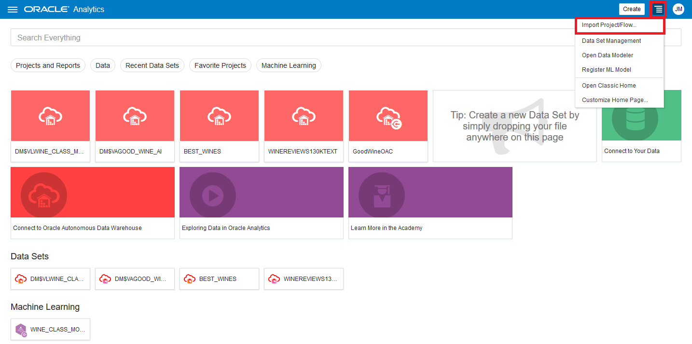

5. Click **Select File** and select the DVA file you downloaded from step 1. Then, click **Import**.

  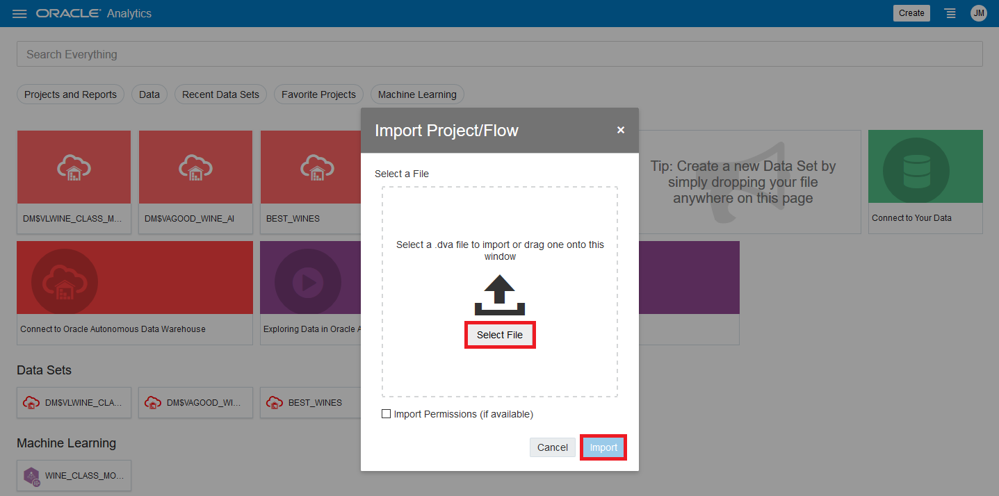

6. You will be prompted to enter a password, paste in **WELcome__1234** and click **OK**.

  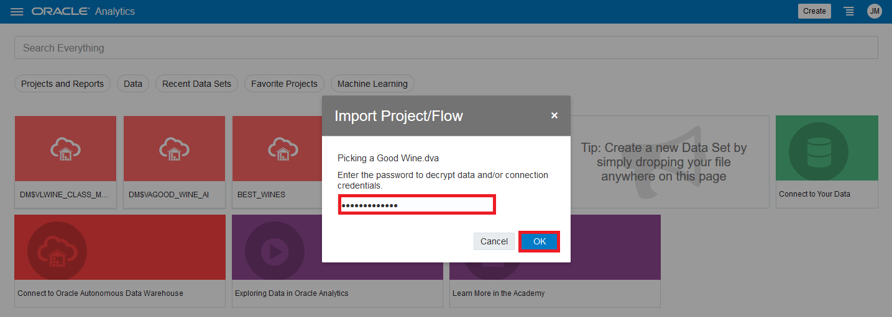

7. Import successful! Click **OK**.

  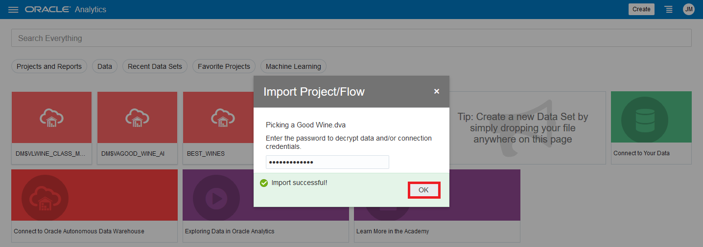

## Task 2: Project Setup

1. Open up the imported project called **Picking a Good Wine** by clicking the picture.

  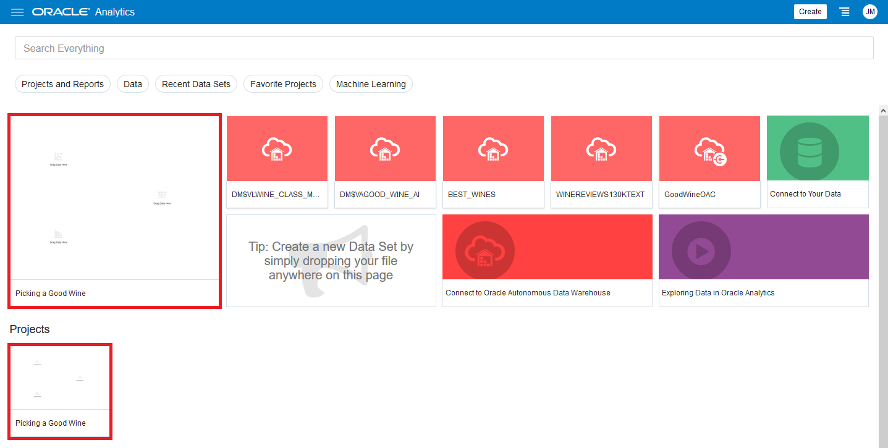

2. This project contains 6 empty canvases that have been prepared for you, we have to add the datasets from Lab 3 to the project in order to make use of them.

  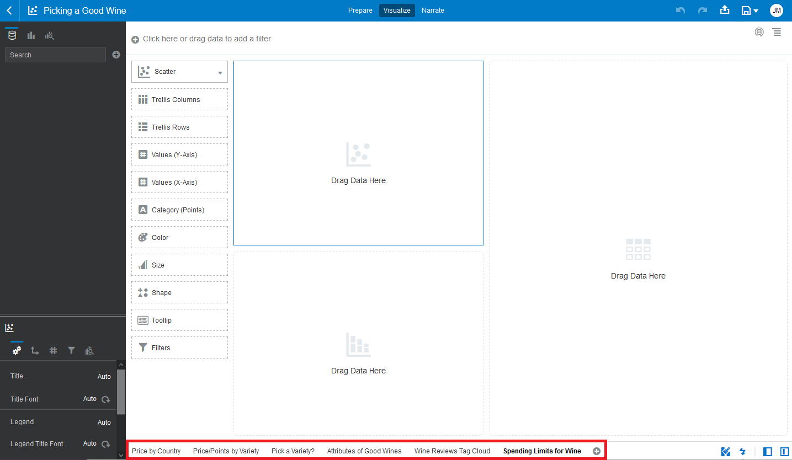

3. In the top bar, click **Prepare** and then click the **+** sign in the middle of the page to add datasets to the project.

  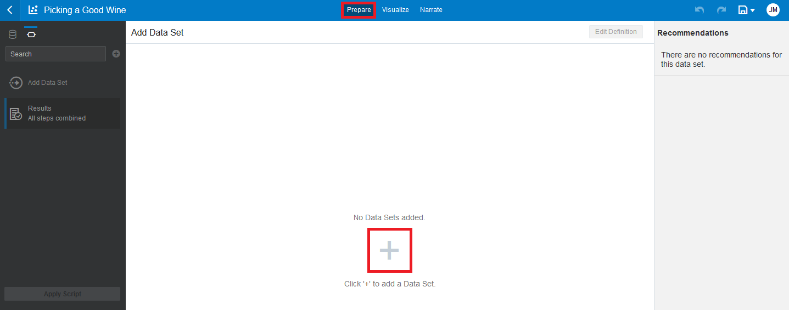

4. Select **all 4** of the datasets we added previously by holding control or shift, and then click **Add to Project**.

  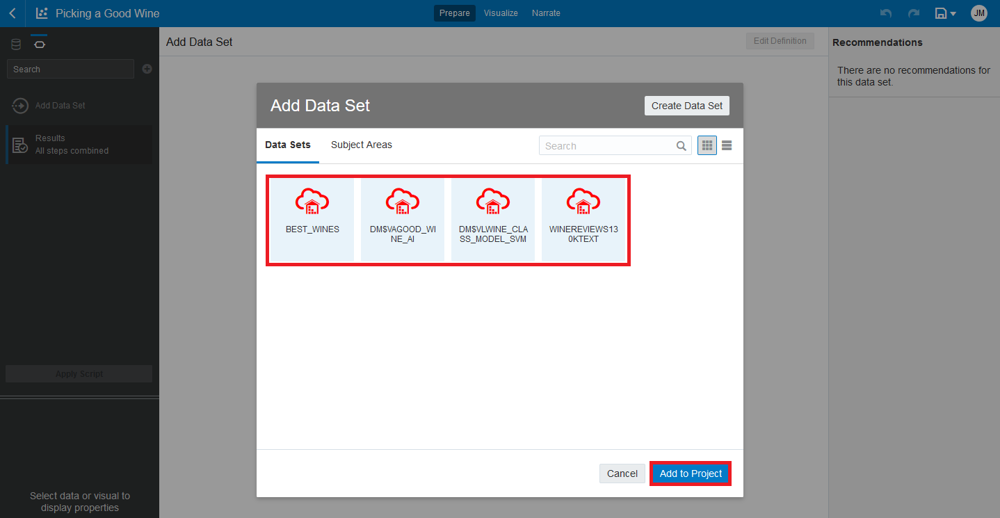

5. Select the **Data Diagram** tab at the bottom on the page. You should see all the datasets and their respective column data as individual items in the panel to the left. We'll need to correct some data types here in order to correctly display the data.

    * WINEREVIEWS130KTEXT:
        - Select **ID** and in the bottom panel, switch **Treat As** from Measure -> **Attribute**
        - Select **Points** and in the bottom panel, switch **Treat As** from Measure -> **Attribute**
        - Select **Price** and in the bottom panel, switch **Aggregation** from Sum -> **Average**

    * BEST\_WINES:
        - Select **ID** and in the bottom panel, switch **Treat As** from Measure -> **Attribute**
        - Select **Price** and in the bottom panel, switch **Aggregation** from Sum -> **Average**
        - Select **PREDICTION_PROBABILITY** and in the bottom panel, switch **Aggregation** from Sum -> **Average**

  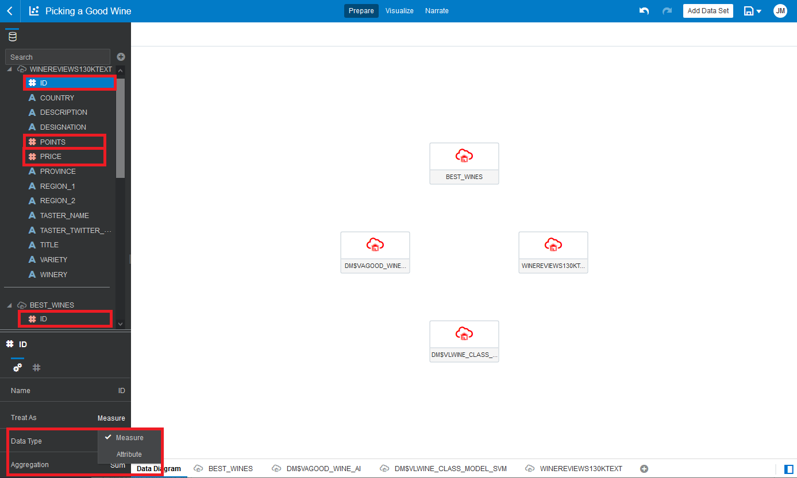

6. Next, we need to blend the WINEREVIEWS130KTEXT and BEST\_WINES datasets together by matching their identical columns. This will enable us to pull columns from both datasets for our canvases. Hover your cursor over the area between the two diagrams and click the link between them.

  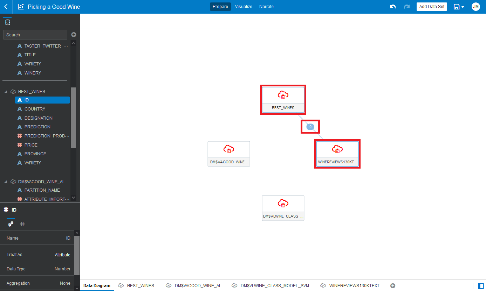

7. Click **Add Another Match**.

  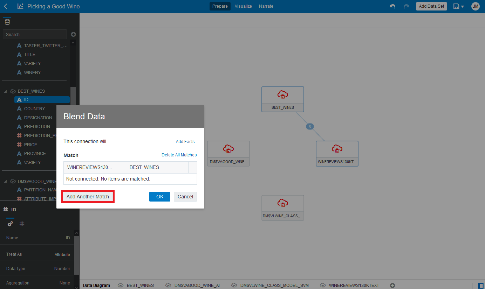

8. In the left column, select **ID**.

  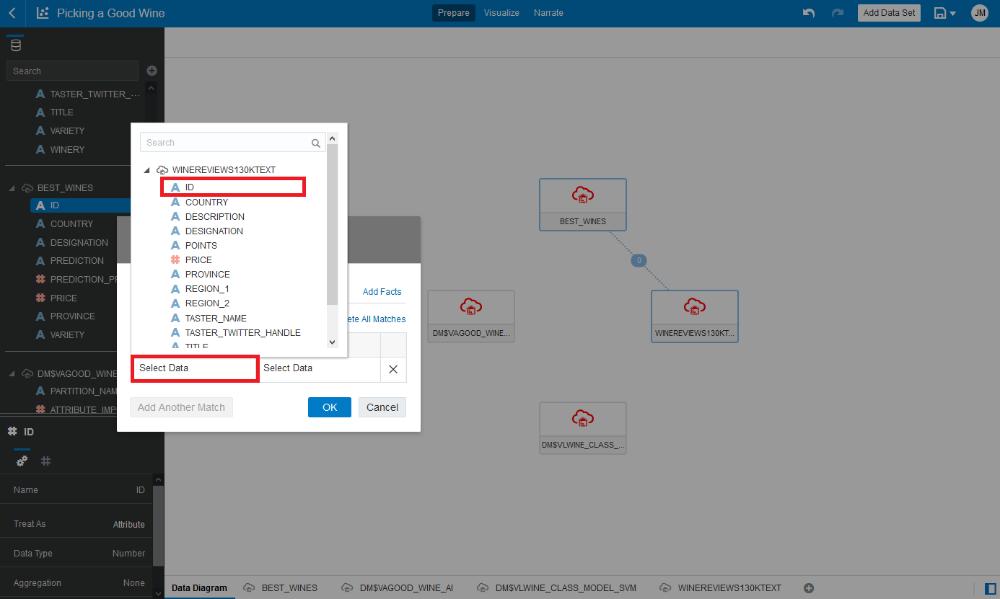

9. In the right column, select **ID** as well. Then click **OK**.

  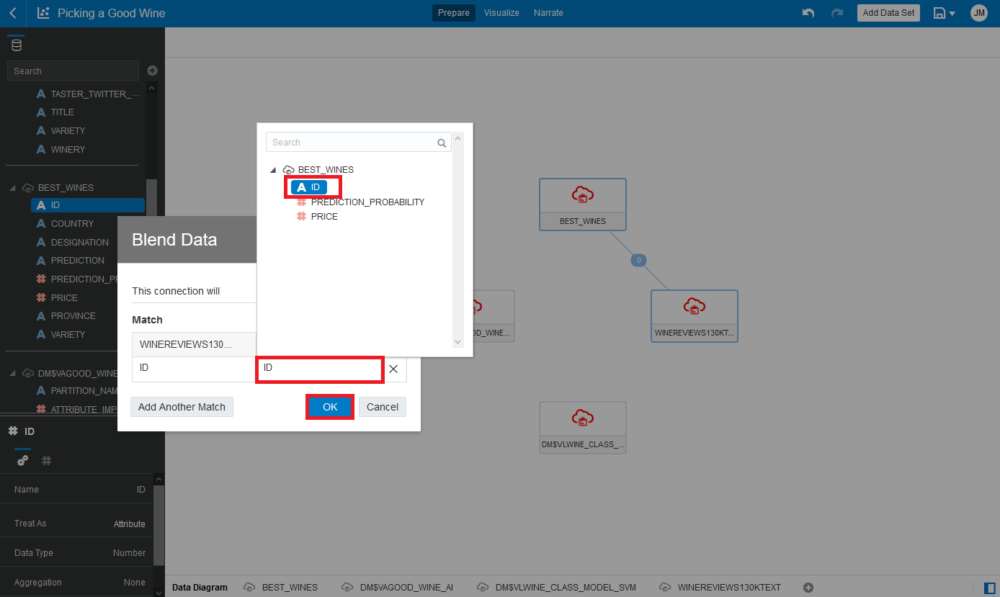

10. WINEREVIEWS130KTEXT and BEST\_WINES should now be grouped together in the the panel to the left. In the top bar, click back to **Visualize**.

  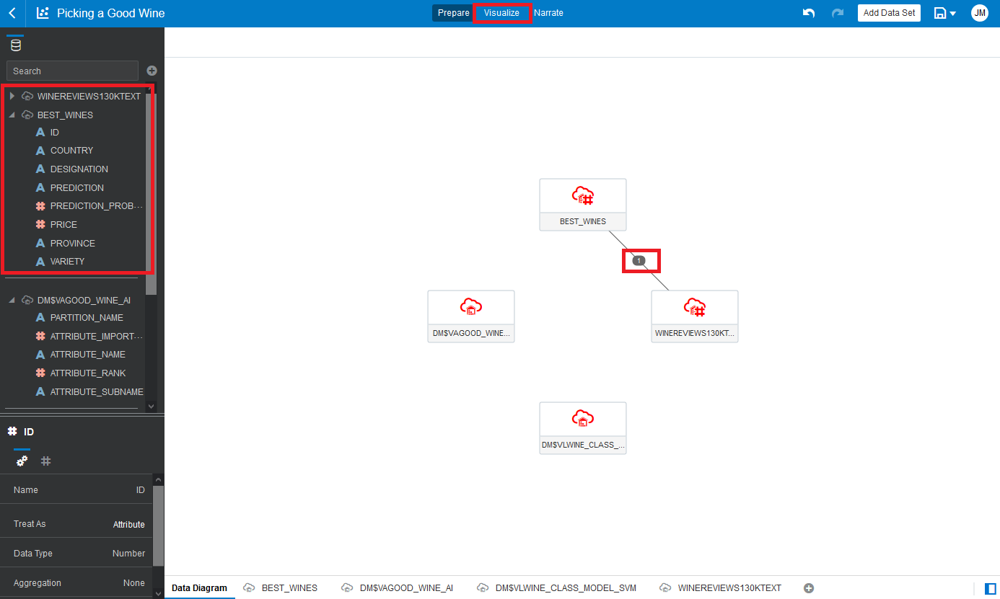

## Task 3: Populate the Canvases

  In this section, we will be adding data to the 6 prepared canvases in order to visualize the data we processed into useful presentations. Feel free to skip around or modify any of the canvases to suit your own needs or curiosities.  We will only be going in depth for the first canvas.

### **Canvas 1:** Price by Country

1. Left Visualization (Map)
    * BEST\_WINES
        - Drag **COUNTRY** to **Category (Location)**
        - Drag **PRICE** to **Color**

2. Top Right Visualization (Table)
    * BEST\_WINES
        - Drag **ID** to **Rows**
        - Drag **COUNTRY** to **Rows**
        - Drag **PREDICTION_PROBABILITY** to **Rows**
        - Drag **PRICE** to **Rows**
        - Drag **VARIETY** to **Rows**

    * WINEREVIEWS130KTEXT
        - Drag **POINTS** to **Rows**

3. Bottom Right Visualization (Scatter)
      * BEST\_WINES
        - Drag **PREDICTION_PROBABILITY** to **Values (Y-Axis)**
        - Drag **PRICE** to **Values (X-Axis)**
        - Drag **VARIETY** to **Shape**

  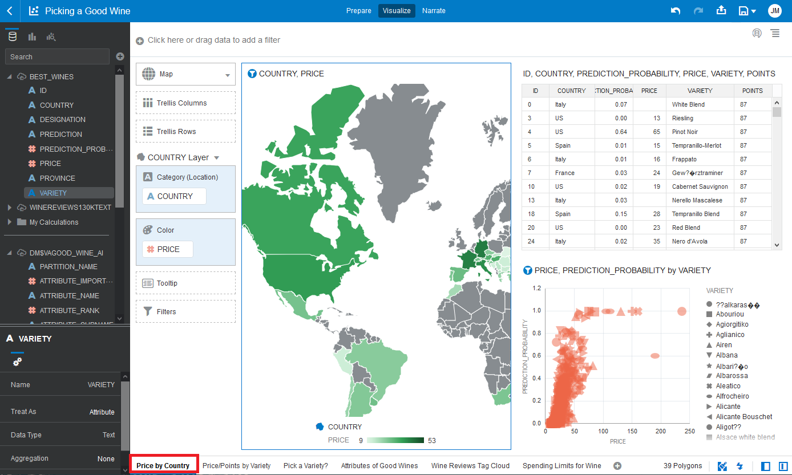

4. First thing we will do is set a global filter across all canvases limiting our results to wines that are predicted to be GT\_90\_Points. In this way, PREDICTION_PROBABILITY becomes a measure of probability for which wine with be good. From BEST\_WINES, drag **PREDICTION** to the top filter bar and select **GT\_90\_Points**. The top filter bar will apply the filter to all visualizations in a particular canvas, but you can also put filters for individual visualizations in their respective Filters property at the bottom of their panel. Click the **Pin** to the left of PREDICTION, this will apply the filter across all 6 of our canvases.

  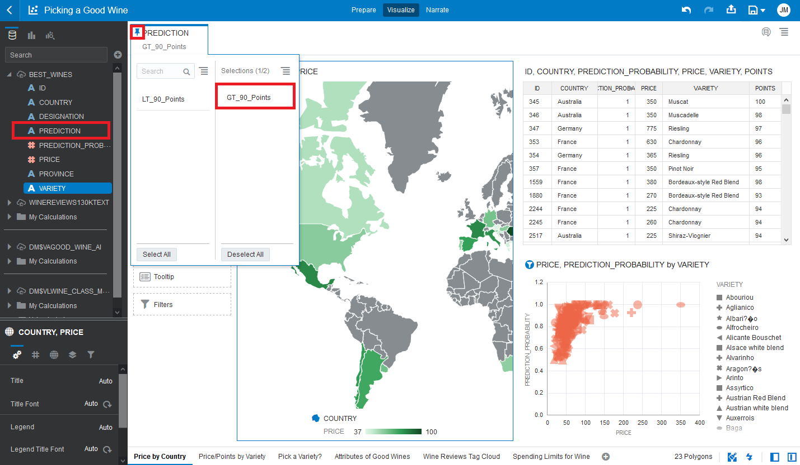

5. Take a look at your visualizations. The map visualization gives you a quick snapshot of the average price of all wines for each country. The table visualization gives you detailed information for each individual wine based on their ID. The scatter plot graph shows the average of a wine's average probability of being good over their average cost, filtered by variety. There is some good information to be gleamed from them right now, but the there is too much data for it to really be useful.

  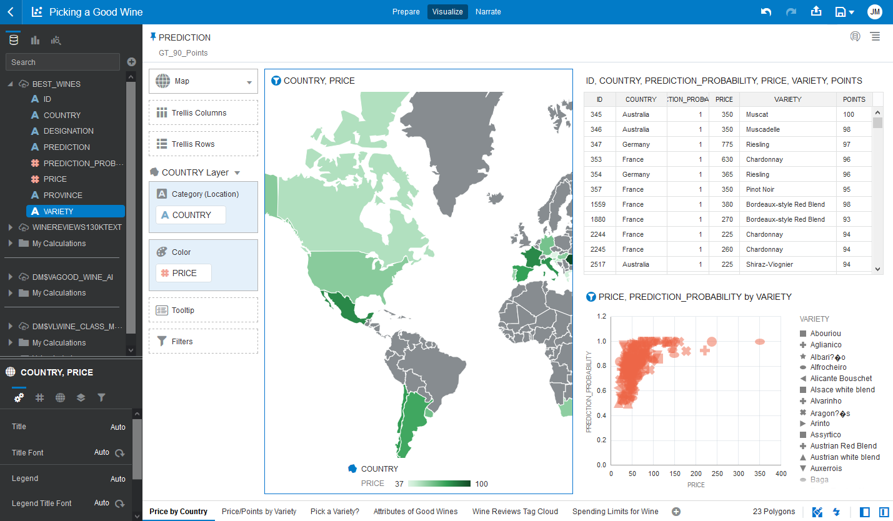

6. If you know what you're looking for, you can make your visualizations ever more relevant and valuable by utilizing filters. You may have noticed that the map and graph visualization have a blue filter symbol in the top left. This can be toggled by right clicking the visualization and selecting **Use as Filter**.  Leave them checked for now, it will enable us to quickly set filters for other visualizations in the canvas by simply selecting the elements in a visualization.

  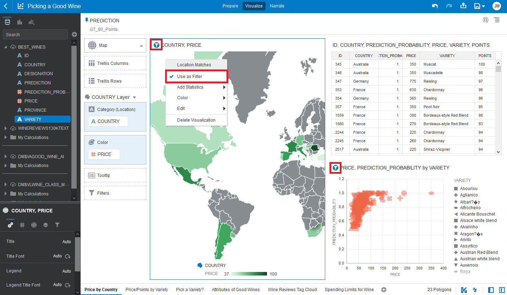

7. In this example, we're going to narrow our search to the United States. Click the **United States** in the map visualization which will automatically filter the data in the other visualizations within the canvas.

  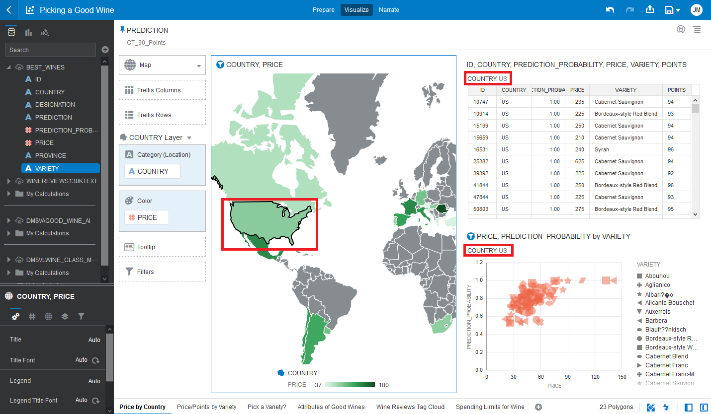

8. Next, in the bottom right graph visualization, we can select a variety to filter with by selecting it in the legend. Scroll through the legend, and select **Chardonnay** or any other variety you'd like.

  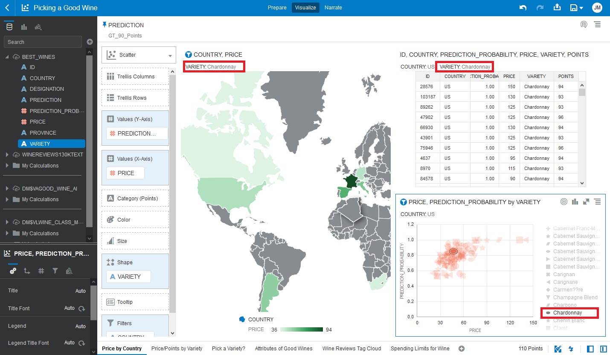

9. Looking good, the map visualization is now showing you the average prices of Chardonnay wine for each country. The bottom right scatter graph is showing you the average probability of each variety of wine being good based on their price. And the top right table is showing you the individual statistics for all Chardonnays or the alternative wine variety you've picked in the United States. Lets bring in global filters to narrow our search even more. From BEST\_WINES, drag **PRICE** to the top filter bar and select the range from **0-30**. From BEST\_WINES, drag **PREDICTION_PROBABILITY** to the top filter bar and select a range, we selected from **.7-MAX**.

  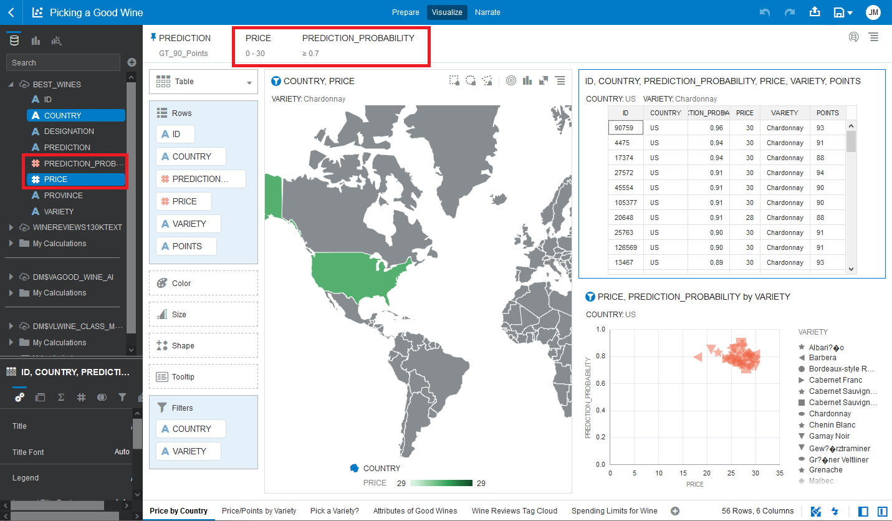

10. Play around with the properties and filters to find the data you want. For example, if we drag **PROVINCE** from BEST\_WINES to the map visualization **Category (Location)**, we view even more specific information on the visualization. Dragging **TITLE** from WINEREVIEWS130KTEXT to **Rows** in the table visualization will let you quickly view the names of the wines we just narrowed down. Deleting the **US** filter on the visualizations will allow us to view data from all countries again. Deleting the **PREDICTION** filter will widen our scope to all wines listed within the reviews. Overwriting VARIETY with **COUNTRY** from BEST\_WINES for **Shape** displays the average quality over average price for wines under $30 for each country, regardless of wine variety.

  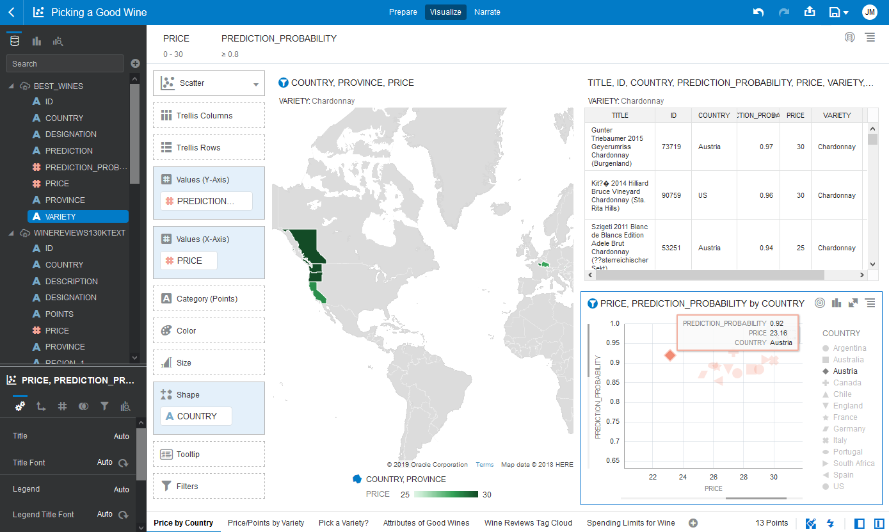

### **Canvas 2:** Price/Points by Variety

1. Left Visualization (Tag Cloud)
    * BEST\_WINES
        - Drag **PRICE** to **Values (Size)**
        - Drag **VARIETY** to **Category**
        - Drag **VARIETY** to **Filters**, right click and select Filter Type -> **Top Bottom N** and select **Bottom 50** by **PRICE**

2. Right Visualization (Tag Cloud)
    * WINEREVIEWS130KTEXT
        - Drag **PRICE** to **Values (Size)**
        - Drag **REGION_2** to **Category**

  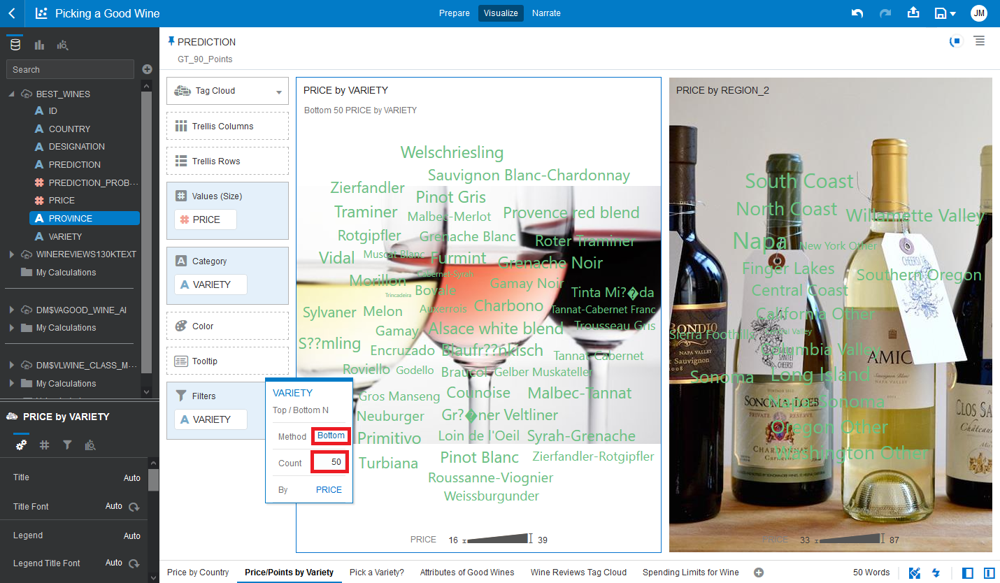

  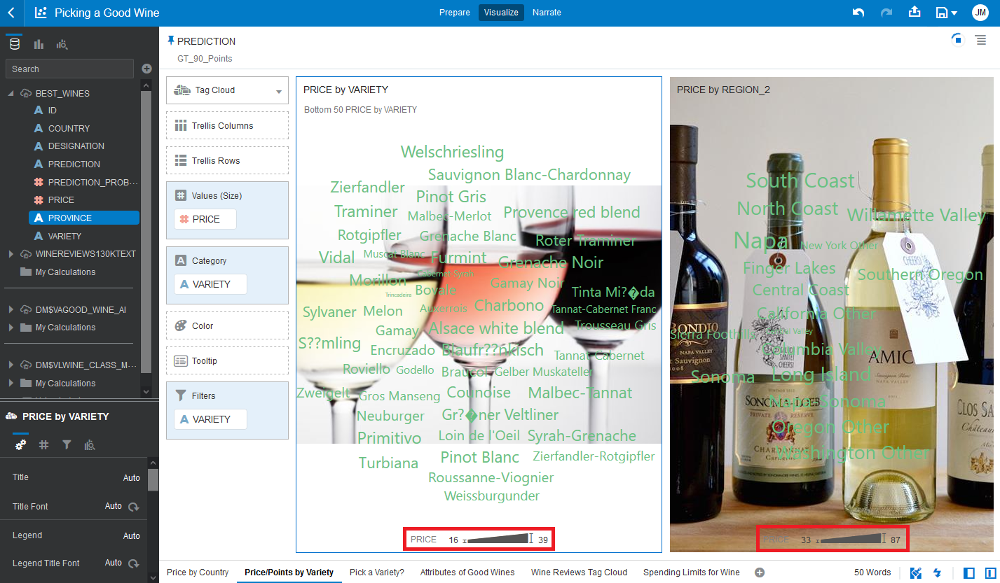

3. The left tag cloud visualization lists wine varieties and scales their size based on the average price, filtered to show only the cheapest 50 varieties by price.

4. The right tag cloud visualization lists regions and scales their size based on the average price of wines from their respective regions.

### **Canvas 3:** Pick a Variety

1. Top Visualization (List Box)
    * BEST\_WINES
        - Drag **VARIETY** to **Category**

2. Left Visualization (Horizontal Stacked)
    * BEST\_WINES
        - Drag **PRICE** to **Values (X-Axis)**
        - Drag **COUNTRY** to **Category (Y-AXIS)**
        - Drag **PREDICTION_PROBABILITY** to **Color**

3. Right Visualization (Horizontal Stacked)
    * BEST\_WINES
        - Drag **PRICE** to **Values (X-Axis)**
        - Drag **COUNTRY** to **Category (Y-AXIS)**

  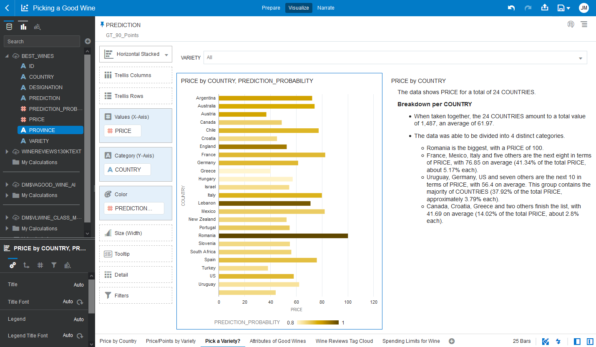

4. These two bottom visualizations may seem redundant, and that's because they are at the moment. But with the use of **Sort By**, we can bring value to these identical datasets by brining focus to the most prominent points. Right click the left visualization, select **Sort By** and select **PREDICTION\_PROBABILITY** -> **High to Low**.  Right click the right visualization, select **Sort By** and select **PRICE** -> **Low to High**.

  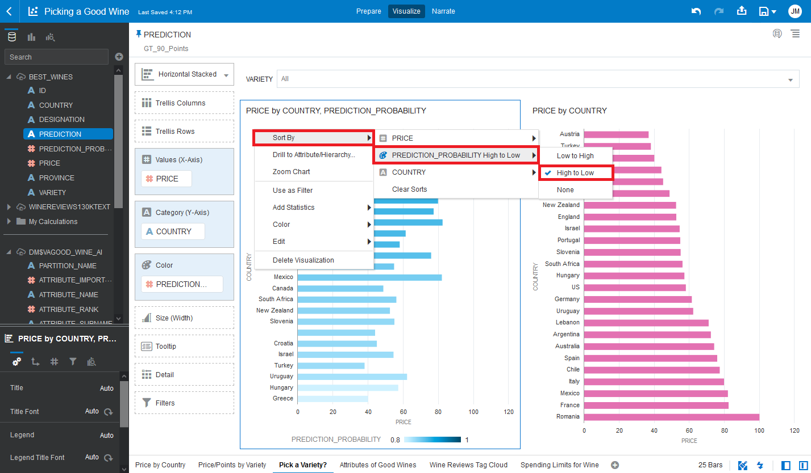

5. The top drop down list is essentially an in visualization filter that allows you to quickly and clearly select a condition for your other two visualizations. In these example, we selected **Cabernet Blend**.

  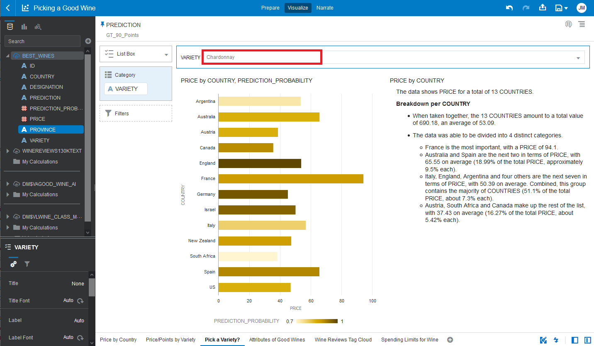

6. The bottom left horizontal bar chart displays average wine price by country, and their respective average probabilities of being good by color. It's sorted by their average probabilities, from highest at the top to the lowest at the bottom. This allows you to easily determine which countries have cabernet blends with the highest average probabilities of being good.

7. The bottom right horizontal bar chart displays average wine price by country as well, but it's sorted by price with the cheapest at the top and the most expensive at the bottom. This allows you to quickly determine which countries have the cheapest cabernet blends on average.  Based on the 2 visualizations, we can see that a Cabernet Blend from Israel is the winner here in terms of probability and price.

### **Canvas 4:** Attributes of Good Wine

1. Visualization (Tag Cloud)
    * DM$VAGOOD\_WINE\_AI
        - Drag **ATTRIBUTE_IMPORTANCE** to **Values (Size)**
        - Drag **ATTRIBUTE_SUBNAME** to **Category**
        - Drag **ATTRIBUTE_NAME** to the top **Filter** and select **DESCRIPTION**
        - Drag **ATTRIBUTE_RANK** to the top **Filter**, right click and select Filter Type -> **Top Bottom N** and select **Bottom 50** by **All Attribute in Visual**

  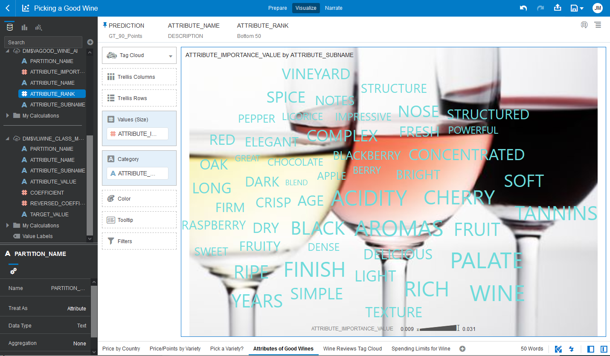

2. This visualization provides a word cloud of attributes in the wine review descriptions that contribute to the probability of a wine being greater than 90 points in our Oracle Machine Learning model. We've filtered it to the bottom 50, which are actually the highest ranked attributes based on ATTRIBUTE_RANK. You can see the word sizes are scaled based off of their respective ATTRIBUTE\_IMPORTANCE\_VALUE numbers.

### **Canvas 5:** Wine Reviews Tag Cloud

1. Left Visualization (Tag Cloud)
    * DM$VLWINE\_CLASS\_MODEL\_SVM
        - Drag **COEFFICIENT** to **Values (Size)**
        - Drag **ATTRIBUTE_SUBNAME** to **Category**
        - Drag **COEFFICIENT** to the bottom **Filters**, right click and select Filter Type -> **Top Bottom N** and select **Bottom 25** by **All Attribute in Visual**

2. Right Visualization (Tag Cloud)
    * DM$VLWINE\_CLASS\_MODEL\_SVM
        - Drag **COEFFICIENT** to **Values (Size)**
        - Drag **ATTRIBUTE_SUBNAME** to **Category**
        - Drag **COEFFICIENT** to the bottom **Filters**, right click and select Filter Type -> **Top Bottom N** and select **Top 25** by **All Attribute in Visual**

  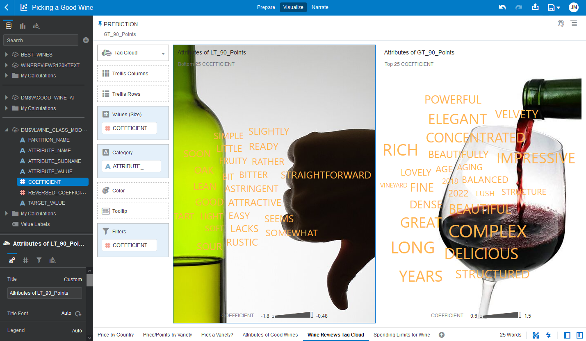

3. The visualization on the left is a word cloud of the 25 most negative attributes in a wine review description that lowers it's probability of being rated greater than 90 points.

4. The visualization on the right is a word cloud of the 25 most positive attributes in a wine review description that raises it's probability of being rated greater than 90 points.

### **Canvas 6:** Spending Limits for Wine

1. Top Left Visualization (Scatter)
    * BEST\_WINES
        - Drag **PREDICTION_PROBABILITY** to **Values (Y-Axis)**
        - Drag **PRICE** to **Values (X-Axis)**
        - Drag **VARIETY** to **Shape**

2. Bottom Left Visualization (Stacked Bar)
    * BEST\_WINES
        - Drag **PRICE** to **Values (Y-Axis)**
        - Drag **COUNTRY** and **PROVINCE** to **Category (X-Axis)**

3. Right Visualization (Table)
    * BEST\_WINES
        - Drag **ID** to **Rows**
        - Drag **COUNTRY** to **Rows**
        - Drag **PREDICTION_PROBABILITY** to **Rows**
        - Drag **PRICE** to **Rows**
        - Drag **VARIETY** to **Rows**

    * WINEREVIEWS130KTEXT
        - Drag **DESCRIPTION** to **Rows**

4. From BEST\_WINES, drag **PRICE** to the top filter bar and select the range from **0-30**. From BEST\_WINES, drag **PREDICTION_PROBABILITY** to the top filter bar and select a range, we selected from **.9-MAX**. For both these filters, make sure only **ID** is selected in the **By** field.

  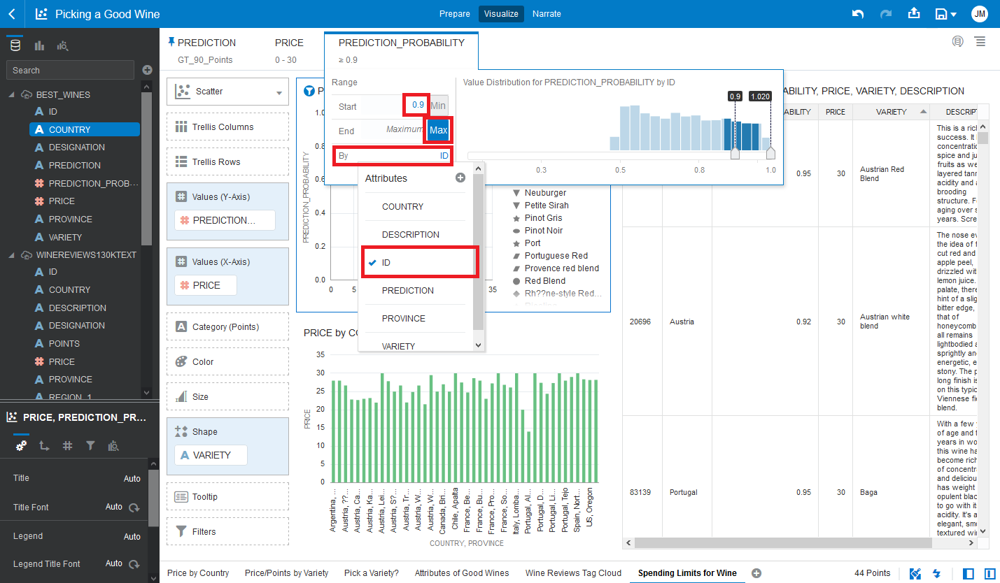

5. Wrapping it all together, this canvas allows you to select a wine variety in the top left scatter plot visualization and filter the other 2 visualizations. So if you select **RED BLEND**, the bottom left visualization will show you the average prices for red blend wine separated by provinces, and the table on the right will give you detailed information to choose your wine. At this point, we've found 4 Red Blends that are under $30 and have a greater than 90 percent chance of being good. It's up to you to pick!

  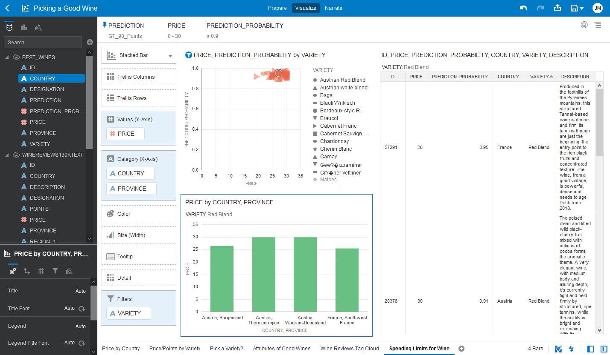

## Task 4: Summary

To recap, we first took the top-down approach in the initial canvas where we take a global perspective to identify the wines based on the price and quality worldwide, which is achieved using the map visualization.

Then, we drilled down further in the next canvas in order to find wines based on average price by variety and by region as each person has different preferences.

Next, we dedicated a canvas page on displaying wine prices by country with coloring to depict how likely those wines were to be good. We also demonstrated the handiness of having a dedicated list box in which to filter wine variety, and the use of sorting to distinguish the individual usefulness of two visualizations that were very similar.

An important feature while making any data driven decisions is to know how important each attribute is in comparison to the bigger picture. In the following 2 canvases, we first created a tag cloud visualization to show the top 50 most important attributes, then we used 2 more tag clouds to distinguish between the Top 25 best (positive) attributes and Bottom 25 worst (negative) attributes that contributed to our prediction of whether a wine is good or bad.  Knowing these attributes can assist you making the decision to buy after reading wine descriptions.

Lastly, we created a canvas to provide us price and location insights when we select a variety from the scatter plot, and put in filters to help us find a wine under $30 that has a high probability of being good.  This enabled us to narrow down our wine choices from over 130 thousand to just 4 that met our criteria.

To conclude, from canvas to canvas we gather more and more information about wines and eventually were able to answer questions that someone such as yourself might have. What are the best wines? Where can I find the wines which I like ? What's the price that I am willing to pay? What are the attributes of a good wine? etc. From a technical standpoint, we saw how we can leverage Oracle's two major products, Oracle Autonomous Database and Oracle Analytics Cloud, to make more informed decisions.

Congratulations!!! You've completed this workshop!

As you have experienced, the development of the canvases and visualizations is pretty simple and straightforward. Oracle Analytics Cloud has other features included which we encourage you to try out for both your work related and personal activities. They will help you make effective decisions based on data while reducing personal bias.

## Acknowledgements
* **Author** - Charlie Berger, Senior Director of Product Management, Machine Learning, AI and Cognitive Analytics & Siddesh Ujjni, Staff Cloud Engineer, Analytics to Cloud
* **Contributors** -  Anoosha Pilli & Didi Han, Database Product Management
* **Last Updated By/Date** - Didi Han, Database Product Management, April 2021
