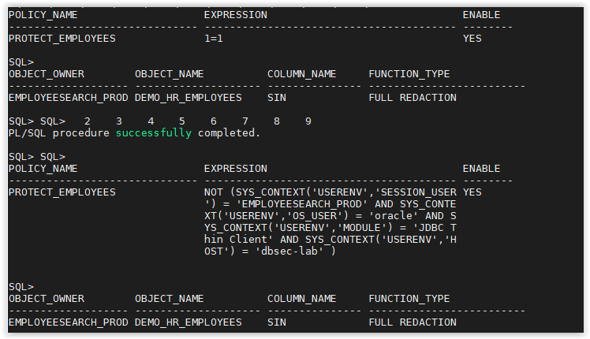
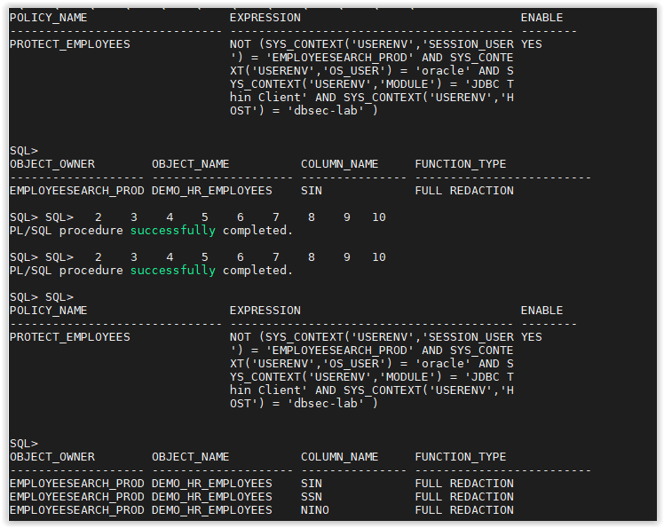

# [Lab] Data Redaction

Version tested in this lab: `Oracle DB 19.5`

In this lab you will redact sensitive data in the `EMPLOYEESEARCH_PROD` schema. 
 

- Open a SSH session on your DBSec-Lab VM as Oracle User

        sudo su - oracle

- Go to the scripts directory

        cd /home/oracle/DBSecLab/workshops/Database_Security_Labs/Advanced_Security/Data_Redaction/Redact_EMPLOYEESEARCH_Data

- First, let's view the data before we redact it

        ./01_query_employee_data.sh        
 
  
    
- Create a redaction policy for the `DEMO_HR_EMPLOYEES` table to redact data for all queries
    
        ./02_redact_for_all.sh
    
  

- Re-run the query to see the redacted data

        ./03_query_employee_data.sh

  

- Now, modify the redaction policy to only redact non-Glassfish queries

        ./04_redact_nonapp_queries.sh

  

- Add additional columns to the redaction policy
    
        ./05_add_redacted_columns.sh
    
  

- Run the query to see the redact data again
    
        ./06_query_employee_data.sh
    
  

- When you are finished with the lab, you can drop the redaction policy

        ./07_drop_redaction_policy.sh
    
  

---
Move up one [directory](../README.md)

Click to return [home](/README.md)
