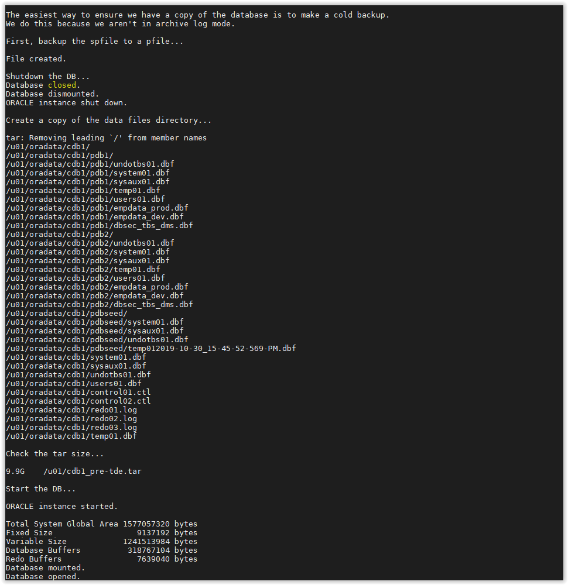

# [Lab] TDE - Allow Database Restore

To restore your database to a pre-TDE point in time, this lab will enable archive redo log mode and set a restore point. Since this database is not in Archive Log mode and doesn't have the Flash Recovery Area enabled, a "Cold Backup" of the database will be created. 
Hence, this requires stopping the database, creating a tape archive file (tar) and restarting it.
  

- Open a SSH session on your DBSec-Lab VM as Oracle User

        sudo su - oracle

- Go to the scripts directory

        cd /home/oracle/DBSecLab/workshops/Database_Security_Labs/Advanced_Security/TDE/Allow_DB_Restore
    
- Run the backup command:

        ./01_backup_db.sh

     

- Once it has completed, it will automatically restart the container and pluggable databases

---
**Note:** If you have executed this script before and there is an existing backup file, the script will not complete. You must manually manage the existing backup (delete or move) before running this script again.

---
Move up one [directory](../README.md)

Click to return [home](/README.md)
