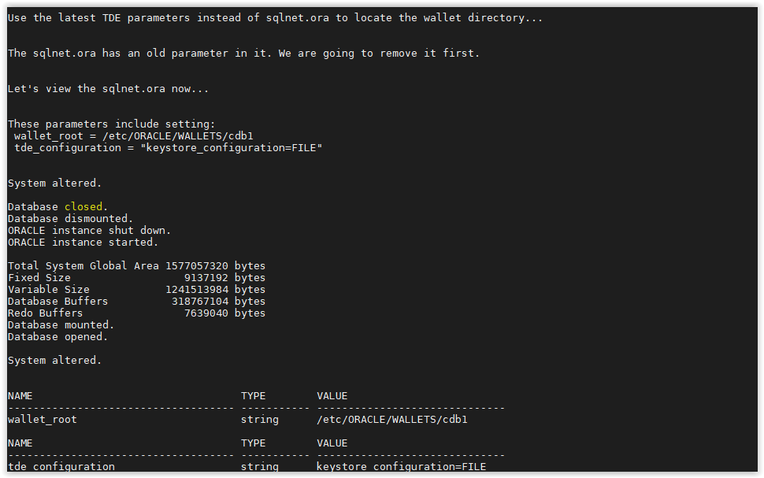

# [Lab] TDE - Create Software Keystore

The first thing you must do for Transparent Data Encryption is to create a software keystore. 
We often refer to this as an Oracle Wallet.

---

- Open a SSH session on your DBSec-Lab VM as Oracle User

        sudo su - oracle

- Go to the scripts directory

        cd /home/oracle/DBSecLab/workshops/Database_Security_Labs/Advanced_Security/TDE/Create_Software_Keystore

- Run this script to create the directory on the operating system:

        ./01_create_os_directory.sh

    

- Use the database parameters to manage TDE. This will require a database restart for one of the parameters to take effect. 
The script will perform the reboot for you. 

        ./02_set_tde_parameters.sh

    

- Create the software keystore (Oracle Wallet) for the container database. 
You will see the status result goes from `NOT_AVAILABLE` to `OPEN_NO_MASTER_KEY`. 

        ./03_create_wallet.sh

    
    
- Now, your wallet has been created

---
Move up one [directory](../README.md)

Click to return [home](/README.md)
