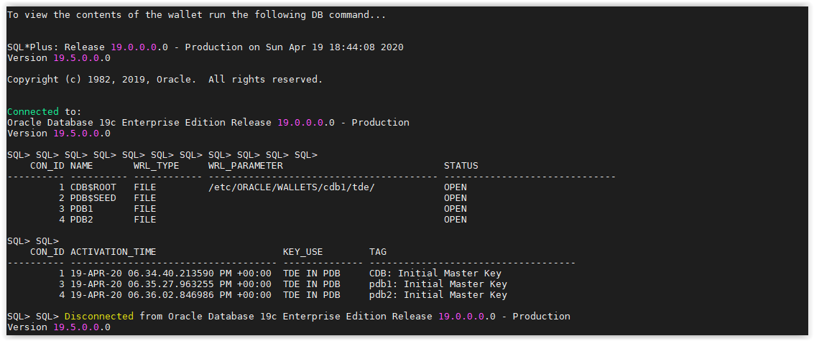
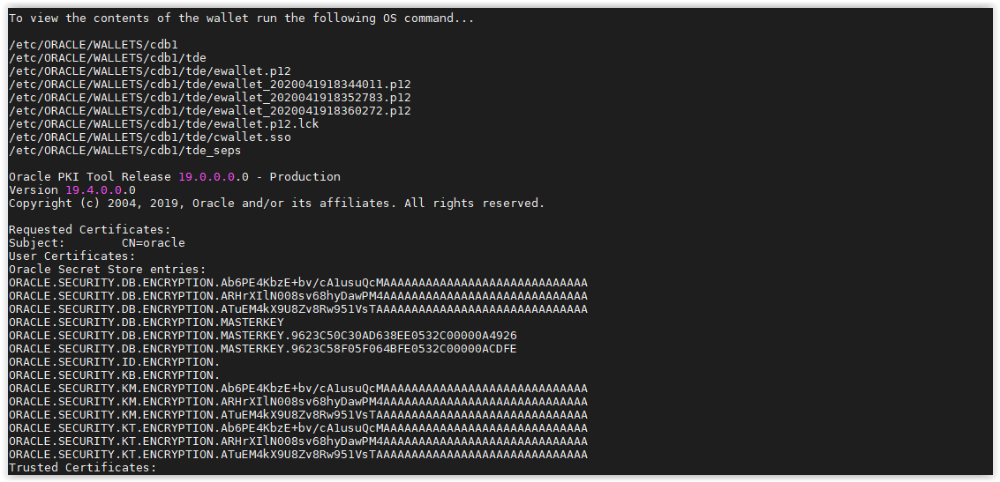

## Create Autologin Wallet

This step is recommended so the DBAs do not have to manually open the wallet each time the database is restarted. This is very helpful in RAC, Data Guard, or Golden Gate environments.

- Open a SSH session on your DBSec-Lab VM as Oracle User

        sudo su - oracle

- Go to the scripts directory

    	cd /home/oracle/DBSecLab/workshops/Database_Security_Labs/Advanced_Security/TDE/Create_Autologin_Wallet
	
- Then run the script to view the wallet on the operating system. 
Notice there is no `cwallet.sso`, there will be when we create the auto login wallet.

        ./01_view_wallet_on_os.sh
    
    

- You can view what the wallet looks like in the database

        ./02_view_wallet_in_db.sh
    
    

- Now, create the autologin wallet

        ./03_create_autologin_wallet.sh
    
    

- Run the same queries... You should now see the `cwallet.sso` file:
    
        ./04_view_wallet_on_os.sh
    
    

    ---
    **Note:** Now you should see the *.sso file

    ---

- And no changes to the wallet in the database

        ./05_view_wallet_in_db.sh

    

- Now your Autologin is created!

---
Move up one [directory](../README.md)

Click to return [home](/README.md)
