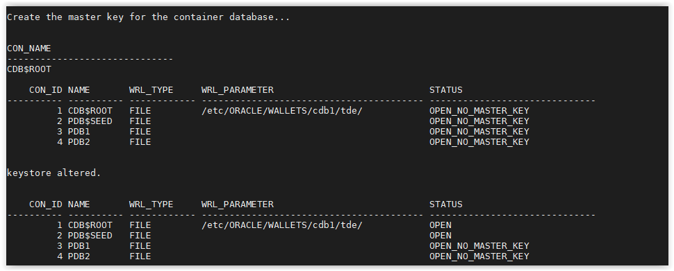
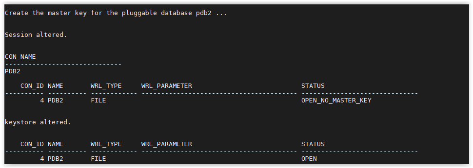

## Create Master Key

You must create a master key for the container database before continuing. 
Each pluggable database must have their own master key as well (except for PDB$SEED).  

- Open a SSH session on your DBSec-Lab VM as Oracle User

        sudo su - oracle

- Go to the scripts directory

        cd /home/oracle/DBSecLab/workshops/Database_Security_Labs/Advanced_Security/TDE/Create_Master_Key

- To create the container database TDE master key, run the following command

       ./01_create_cdb_mkey.sh

    

- To create a master key for the pluggable database, PDB1, run the following command:

      ./02_create_pdb_mkey.sh pdb1

    

- If you want, you can do the same for PDB2. 
This is not a requirement though. It might be helpful to show some databases with TDE and some without.

        ./02_create_pdb_mkey.sh pdb2

    

- Now, you have a master key and you can begin encrypting tablespaces or column!

---
Move up one [directory](../README.md)

Click to return [home](/README.md)
