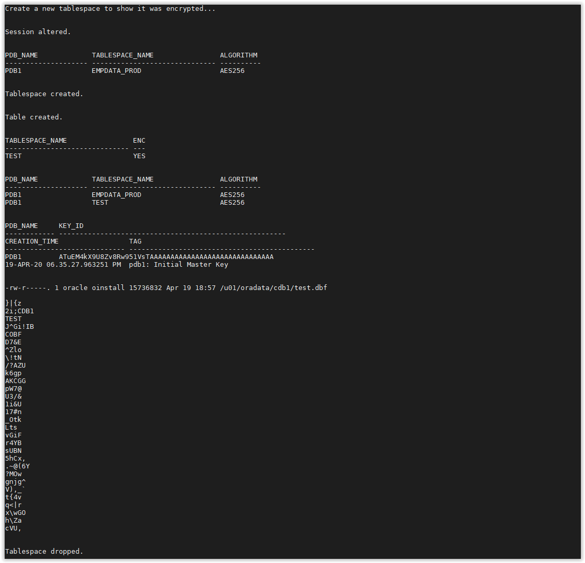

# [Lab] TDE - Encrypt All New Tablespaces

This will ensure that any new tablespace (in the container or pluggable) you create will be encrypted. 

- Open a SSH session on your DBSec-Lab VM as Oracle User

        sudo su - oracle

- Go to the scripts directory

        cd /home/oracle/DBSecLab/workshops/Database_Security_Labs/Advanced_Security/TDE/Encrypt_All_New_Tablespaces

- First, check the existing initialization parameters

        ./01_Check_Init_Params.sh

    

- Next, change the init parameter `encrypt_new_tablespaces` to be `ALWAYS` so all new tablespaces are encrypted.

        ./02_Encrypt_All_New_Tablespaces.sh

    

- Finally, create a tablespace to test it. 
The tablespace `TEST` will be created without specifying the encryption parameters (the default encryption is AES128) and will be dropped after

        ./03_Create_New_Tablespace.sh

    

- Now, your new Tablespaces will be encrypted by default!

---
Move up one [directory](../README.md)

Click to return [home](/README.md)
