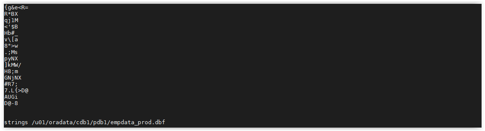

## TDE - Encrypt Existing Tablespace

The easiest way to get started is to encrypt the `EMPLOYEESEARCH_DATA` tablespace.

Open a SSH session on your DBSec-Lab VM as Oracle User

````
<copy>sudo su - oracle</copy>
````

Go to the scripts directory

````
<copy>cd /home/oracle/DBSecLab/workshops/Database_Security_Labs/Advanced_Security/TDE/Encrypt_Existing_Tablespace</copy>
````

First, use the Linux command, strings, to view the data in the data file.<br>

This is an operating system command that bypasses the database to view the data. This is called a 'side-channel attack' because the database is unaware of it.

````
<copy>./01_Search_Strings_Plain_Text.sh</copy>
````

   

Second, encrypt the data by encrypting the entire tablespace:

````
<copy>./02_Encrypt_Tablespace.sh</copy>
````

   

And finally, try the side-channel attack again

````
<copy>./03_Search_Strings_Encrypted.sh</copy>
````

   

You will see that all of the data is now encrypted!

---
**Note:** This lab has been executed against the pluggable database, PDB1.<br>
You can repeat this, manually, or by using Enterprise Manager, for PDB2 if you want more practice.

---
Move up one [directory](../README.md)

Click to return [home](/README.md)
