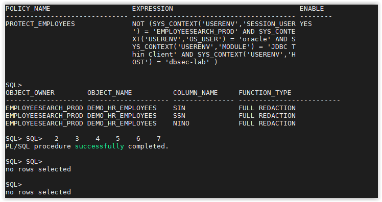

# Oracle Data Redaction

## Introduction
This workshop introduces the various features and functionality of Data Redaction.

It gives the user an opportunity to learn how to configure those features in order to protect access to sensitive data by redacting them on-the-fly.

- *Version tested in this lab:* Oracle DB 19.8
- *Estimated Lab Time:* 15 minutes

### Objectives
Dynamically redact sensitive data preventing it from being displayed outside the application

### Prerequisites
This lab assumes you have completed:
   - Lab: Generate SSH Keys
   - Lab: Prepare Setup
   - Lab: Environment Setup
   - Lab: Initialize and Start the DBSecLab Environment

### Video Preview
- Watch a preview of "*Understanding Oracle Data Redaction (July 2020)*" [](youtube:ssy6Hov-MAs)

### Lab Timing (estimated)
| Step No. | Feature | Approx. Time |
|--|------------------------------------------------------------|-------------|
| 1 | Create a basic Data Redaction policy | 5 minutes |
| 2 | Contextualize an existing Data Redaction policy | 5 minutes |
| 3 | (Optional) Drop the Data Redaction policy | <5 minutes |

## **STEP 1**: Create a basic Data Redaction policy

1. Open a SSH session on your DBSec-Lab VM as Oracle User

      ````
      <copy>sudo su - oracle</copy>
      ````

2. Go to the scripts directory

      ````
      <copy>cd /home/oracle/DBSecLab/workshops/Database_Security_Labs/Advanced_Security/Data_Redaction/Redact_EMPLOYEESEARCH_Data</copy>
      ````

3. First, let's view the data before we redact it

      ````
      <copy>./01_query_employee_data.sh</copy>
      ````

   

4. Create a redaction policy for the `DEMO_HR_EMPLOYEES` table to redact data for all queries

      ````
      <copy>./02_redact_for_all.sh</copy>
      ````

   

5. Re-run the query to see the redacted data

      ````
      <copy>./03_query_employee_data.sh</copy>
      ````

   

## **STEP 2**: Contextualize an existing Data Redaction policy

1. Now, modify the redaction policy to only redact non-Glassfish queries

      ````
      <copy>./04_redact_nonapp_queries.sh</copy>
      ````

   

2. Add additional columns to the redaction policy

      ````
      <copy>./05_add_redacted_columns.sh</copy>
      ````

   

3. Run the query to see the redact data again

      ````
      <copy>./06_query_employee_data.sh</copy>
      ````

   

## **STEP 3**: (Optional) Drop the Data Redaction policy

1. When you are finished with the lab, you can drop the redaction policy

      ````
      <copy>./07_drop_redaction_policy.sh</copy>
      ````

   

You may now proceed to the next lab.

## **Appendix**: About the Product
- **Overview**

    Hard-coded within the Oracle Database core product, this features is part of the *Advanced Security Option (ASO)*

    Data Redaction enables you to mask (redact) data that is returned from queries issued by applications. We can also talk about Dynamic Data Masking.

    You can redact column data by using one of the following methods:

    - **Full redaction**
    You redact all of the contents of the column data. The redacted value that is returned to the querying user depends on the data type of the column. For example, columns of the NUMBER data type are redacted with a zero (0) and character data types are redacted with a blank space.

    - **Partial redaction**
    You redact a portion of the column data. For example, you can redact most of a Social Security number with asterisks (*), except for the last 4 digits.

    - **Regular expressions**
    You can use regular expressions in both full and partial redaction. This enables you to redact data based on a search pattern for the data. For example, you can use regular expressions to redact specific phone numbers or email addresses in your data.

    - **Random redaction**
    The redacted data presented to the querying user appears as randomly generated values each time it is displayed, depending on the data type of the column.

    - **No redaction**
    This option enables you to test the internal operation of your redaction policies, with no effect on the results of queries against tables with policies defined on them. You can use this option to test the redaction policy definitions before applying them to a production environment.

    Data Redaction performs the redaction at runtime, that is, the moment that the user tries to view the data. This functionality is ideally suited for dynamic production systems in which data constantly changes. While the data is being redacted, Oracle Database is able to process all of the data normally and to preserve the back-end referential integrity constraints. Data redaction can help you to comply with industry regulations such as Payment Card Industry Data Security Standard (PCI DSS) and the Sarbanes-Oxley Act.

   

- **Benefits of Using Oracle Data Redaction**
    - You have different styles of redaction from which to choose
    - Because the data is redacted at runtime, Data Redaction is well suited to environments in which data is constantly changing
    - You can create the Data Redaction policies in one central location and easily manage them from there
    - The Data Redaction policies enable you to create a wide variety of function conditions based on `SYS_CONTEXT` values, which can be used at runtime to decide when the Data Redaction policies will apply to the results of the application user's query

## Want to Learn More?
Technical Documentation: [Data Redaction 19c](https://docs.oracle.com/en/database/oracle/oracle-database/19/asoag/asopart1.html)

## Acknowledgements
- **Author** - Hakim Loumi, Database Security PM
- **Contributors** - Gian Sartor, Rene Fontcha
- **Last Updated By/Date** - Hakim Loumi, 20th October 2020

## Need Help?
Please submit feedback or ask for help using our [LiveLabs Support Forum](https://community.oracle.com/tech/developers/categories/livelabsdiscussions). Please click the **Log In** button and login using your Oracle Account. Click the **Ask A Question** button to the left to start a *New Discussion* or *Ask a Question*.  Please include your workshop name and lab name.  You can also include screenshots and attach files.  Engage directly with the author of the workshop.

If you do not have an Oracle Account, click [here](https://profile.oracle.com/myprofile/account/create-account.jspx) to create one.