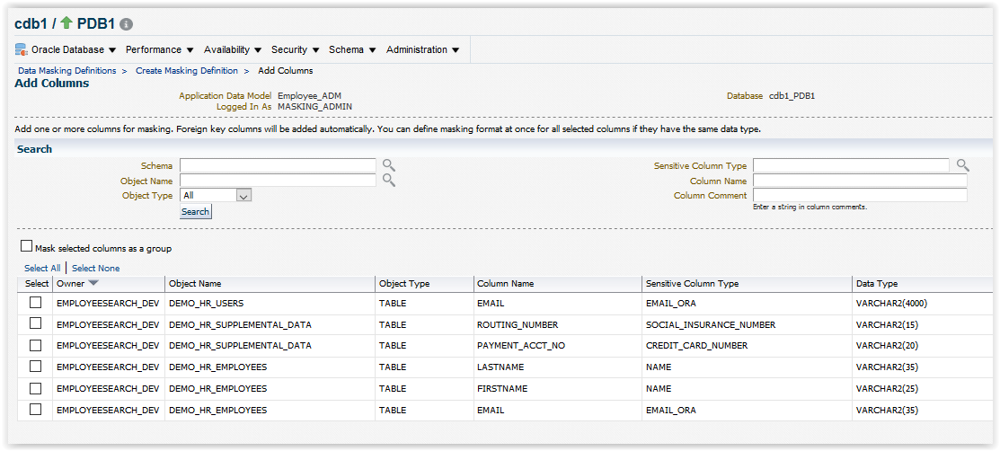
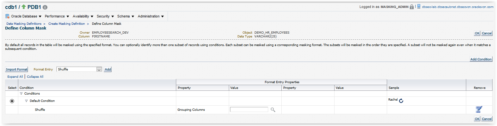
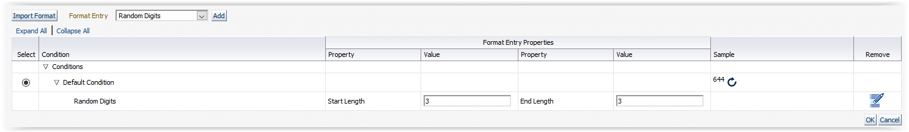
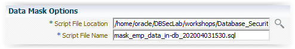
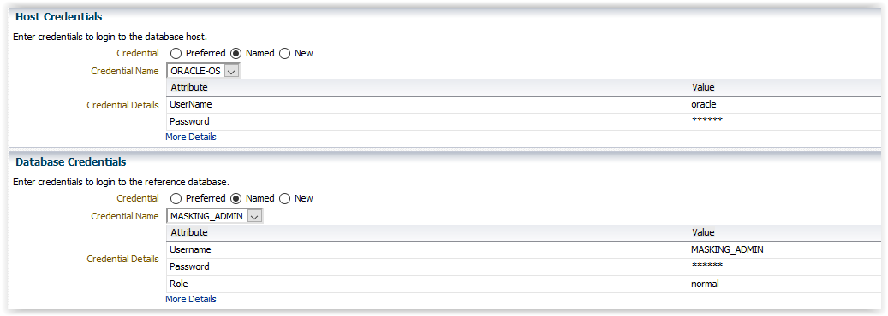
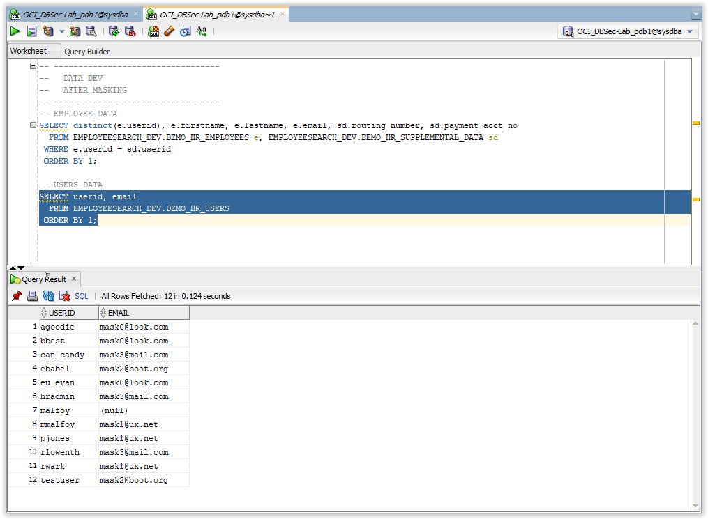

# Oracle Data Masking and Subsetting (DMS)

## Introduction
This workshop introduces the various features and functionality of Oracle Data Masking and Subsetting (DMS) pack for Enterprise Manager.<br>
It gives the user an opportunity to learn how to configure those features in order to secure their sensitive data in a Non-Production environment.

- Version tested in this lab: *Oracle Enterprise Manager 13.4*
- Estimated Workshop Time: *65 minutes*

### About the Product
- **Overview**<br>
    Oracle Data Masking pack for Enterprise Manager, part of Oracle's comprehensive portfolio of database security solutions, helps organizations comply with data privacy and protection mandates such as Sarbanes-Oxley (SOX), Payment Card Industry (PCI) Data Security Standard (DSS), Health Insurance Portability and Accountability Act (HIPAA), EU General Data Protection Regulation (GDPR), and the upcoming California Consumer Privacy Act (CCPA), and numerous laws that restrict the use of actual customer data. With Oracle Data Masking, sensitive information such as credit card or social security numbers can be replaced with realistic values, allowing production data to be safely used for development, testing, or sharing with out-sourced or off-shore partners for other non-production purposes. Oracle Data Masking uses a library of templates and format rules, consistently transforming data in order to maintain referential integrity for applications.

    Data masking (also known as data scrambling and data anonymization) is the process of replacing sensitive information copied from production databases to test or non-production databases with realistic, but scrubbed, data based on masking rules. Data masking is ideal for virtually any situation when confidential or regulated data needs to be shared with other non-production users; for instance, internal users such as application developers, or external business partners, like offshore testing companies or suppliers and customers. These non-production users need to access some of the original data, but do not need to see every column of every table, especially when the information is protected by government regulations.

    Data masking allows organizations to generate realistic and fully functional data with similar characteristics as the original data to replace sensitive or confidential information. This contrasts with encryption or Virtual Private Database, which simply hide data, allowing the original data to be retrieved with the appropriate access or key. With data masking, the original sensitive data cannot be retrieved or accessed. Names, addresses, phone numbers, and credit card details are examples of data that require protection of the information content from inappropriate visibility. Live production database environments contain valuable and confidential data — access to this information is tightly controlled. However, each production system usually has replicated development copies, and the controls on such test environments are less stringent. This greatly increases the risks that the data might be used inappropriately. Data masking can modify sensitive database records so that they remain usable, but contain no confidential or personally identifiable information. Yet, the masked test data resembles the original in appearance to ensure the integrity of the application.

    

- **Why do I need Data Masking?**<br>
    There are several reasons why you would need it, based on challenges like the ones below
    - Personally Identifiable and sensitive data is being shared with parties that do not have a business need-to-know in development and testing groups.
    - The use of operational databases containing personal information or any other sensitive information is being used for testing purposes. All identified sensitive details and content should be removed or modified beyond recognition before use.
    - There is no established, documented procedure and enforcement of data cleansing standards in masking and cleansing of sensitive production data before distribution to development and QA environments.
    - The steps and process necessary to provide development and QA environments with properly masked data are very time consuming, manual and inconsistent.

- **Benefits of using DMS**
    - Maximize the business value of data by masking sensitive information
    - Minimize the compliance boundary by not proliferating the sensitive production information
    - Lower the storage costs on test and development environments by subsetting data
    - Automate the discovery of sensitive data and parent-child relationships
    - Provide a comprehensive library of masking formats, masking transformations, subsetting techniques, and select application templates
    - Mask and subset data in-Database or on-the-file by extracting the data from a source database
    - Mask and subset both Oracle and non-Oracle databases
    - Mask and subset Oracle Databases hosted on the Oracle cloud
    - Preserve data integrity during masking and subsetting and offers many more unique features
    - Integrate with select Oracle testing, security, and integration products.

### Prerequisites
This lab assumes you have completed:
   - Lab: Generate SSH Keys
   - Lab: Prepare Setup
   - Lab: Environment Setup

### Video Preview

- Watch a preview of "*Understanding Oracle Data Masking & Subsetting (April 2019)*" [](youtube:3zi0Bs_bgEw)

- Watch a preview of "*Oracle Data Masking & Subsetting - Advanced Use Cases (June 2019)*" [](youtube:06EzV-TM4f4)

### Lab Timing (estimated)

| Step No. | Feature                                                    | Approx. Time | Details                                                                                                                                                                    | Value Proposition |
|----------------------|------------------------------------------------------------|-------------|----------------------------------------------------------------------------------------------------------------------------------------------------------------------------|-------------------|
| 1                    | Import schema structure                             | 5 minutes  |                                                                                                                 |                   |
| 2                    | Enhance the meta-model | 5 minutes  |  |                   |
| 3                    | Use Pre-Defined Sensitive Column Types | 5 minutes  |  |                   |
| 4                    | Create a new Sensitive Column Type | 5 minutes  |  |                   |
| 5                    | Create a new Sensitive Column Type using Pre-Defined Templates | 5 minutes  |  |                   |
| 6                    | Create a new Masking Format | 5 minutes  |  |                   |
| 7                    | Manually Identify Sensitive Columns | 5 minutes  |  |                   |
| 8                    | Create Data Masking Definitions | 5 minutes  |  |                   |
| 9                    | Format Columns Using the Format Library and Masking Primitive | 10 minutes  |  |                   |
| 10                    | Generate Data Masking Scripts | 5 minutes  |  |                   |
| 11                    | Execute the Data Masking Script | 5 minutes  |  |                   |
| 12                    | Compare the Pre-Masked Data vs. the Post-Masked Data | 5 minutes  |  |                   |


## **STEP 1**: Import schema structure

1. Open a Web Browser at the URL **https://**`<DBSecLab-VM_@IP-Public>`**:7803/em**

2. Login to Enterprise Manager Console as `SYSMAN/Oracle123`

    

3. Navigate to the Application Data Models page from the Quality Management submenu by selecting the menu **Enterprise > Quality Management > Application Data Models** as follow:

    

4. Briefly review the Secure **Test Data Management diagram** to familiarize yourself with the process

    

5. Click [**Create**] to add a new ADM called `Employee_ADM` on the `cdb1_pdb1` database:
    - Name the ADM: `EmpSearch_ADM`
    - Click the spyglass for Source Database and select `cdb_PDB1`
    - Chose the option type **Custom Application Suite**
    - Checkbox the option **Create One Application For Each Schema (default)**

    

    ---
    **Note:** Notice the options to create ADMs for Oracle Enterprise Business Suite (EBS) and Fusion Applications

    ---

6. Click [**Continue**]

7. Select the "Named" radio button, choose the Credential Name `DMS_ADMIN` (pwd: `Oracle123`) and click [**Login**]

    

    ---
    **Note:** Alternatively, SYS can be used as well... In a production environment, you could limit the privileges of DMS_ADMIN to only the packages necessary to perform their duties

    ---

8. Select the **EMPLOYEESEARCH_DEV** schema for the application data model

    

9. Click [**Continue**]

10. Click [**Submit**] to schedule the job

    

11. The job collect the ADM has been submitted.<br>
_(Tips: Right click on "View Job Details" link and select "Open Link in New Tab" to follow the process)_

    

12. Once the job completes, the `EMPLOYEE_ADM` will no longer be in a locked, uneditable status<br>
Check the status by refreshing this page (refresh icon) and move forward when the Most Recent Jobs Status of the `Employee_ADM` has "**Succeeded**"!

## **STEP 2**: Enhance the meta-model

1. Highlight the `Employee_ADM` Model and click the [**Edit**] button

    

2. You may be asked for the database credentials<br>
If so, select the "Named" radio button, choose the default credential using the `DMS_ADMIN` username and click [**Continue**]

    

3. In the **Edit Application Data Model**: `Employee_ADM` screen, notice the applications for `EMPLOYEESEARCH_DEV` have been created based on the schema<br>
Expand the entire list of tables associated with these applications (Menu **View** and Submenu **Expand All**)

    

4. Now view the referential relationships captured in the ADM by clicking the tab **Referential Relationships**<br>
Expand the entire list of applications (Menu **View** and Submenu **Expand All**) to examine the referential relationships under each application. Now that Cloud Control is aware of the foreign keys, it will automatically apply the same format masks to child tables

    

5. **NOTE: THIS PORTION IS FOR WORKBOOK REVIEW ONLY AND SHOW THE STEPS NEEDED TO MANUALLY ASSIGN A FOREIGN KEY. YOU DO NOT NEEED TO PERFORM THIS.**<br>
    - If the database manages the referential relationships, the ADM will automatically capture these. However, if these are managed by the application, you will need to define these manually.<br>

    - If it is necessary to define a Referential Relationships, click the [**Add**] button provide the details. In your case, there is an additional table named `DEMO_HR_USERS` that is part of the `EMPLOYEESEARCH_DEV` application, but all of its constraints are enforced by the application and NOT in the database.

        

    - The DEMO_HR_USERS table uses **USERID**, but the relationship is not registered in the database as a foreign key constraint. Therefore, you must add a Dependent column on the USERID column.

        

    - The new relation is available in the referential relationships view of your ADM, and now that Cloud Control is aware of the foreign keys, it will automatically apply the same format masks to child tables.

        

6. Now, your ADM is created

## **STEP 3**: Use Pre-Defined Sensitive Column Types

1. Open a Web Browser at the URL **https://**`<DBSecLab-VM_@IP-Public>`**:7803/em**

2. Login to Enterprise Manager Console as `SYSMAN/Oracle123`

    

3. Navigate to the Application Data Models page from the Quality Management submenu by selecting the menu **Enterprise > Quality Management > Application Data Models** as follow:

    

4. Look at the list of Sensitive column types<br>
Click the menu **Actions** and select the sub-menu **Sensitive Column Types**

    

5. Review the Sensitive Column Discovery Templates that are shipped by default with the Data Masking Pack. As an example, review the `EMAIL_ID` template by hovering over the name `EMAIL_ID`. When using this Sensitive Column Type will:
    - Search for '`EMAIL`' or '`MAIL`' in the Column Name
    - Search for '`EMAIL`' or '`MAIL`' in the Column Comment
    - Apply a regular expression pattern match to all of the Column Data if the user (i.e. `DMS_ADMIN`) has access to the data

    ---
    **Note**: This process uses Oracle Regular Expressions which is compatible with the IEEE Portable Operating System Interface (POSIX) regular expression standard and to the Unicode Regular Expression Guidelines of the Unicode Consortium. In this case, the **Search Type** has been set as an **Or** condition, so if any of the conditions listed above are met, it will result in a match.

    ---

    

## **STEP 4**: Create a new Sensitive Column Type

1. Click [**Create...**] to add a custom Sensitive Column Type

    

2. Create a Sensitive Column Type that will look for the wildcard "**NAME**" as part of the Column Name or the Column Comment:
    - Name: `NAME`
    - Description: `Search for NAME in either the Column Name or in the Column Comment`
    - Column Name: `*NAME*`
    - Column Comment: `*NAME*`

        
 
    - Click [**OK**]
    - Here is the newly created Sensitive Column Type

        

## **STEP 5**: Create a new Sensitive Column Type using Pre-Defined Templates

1. Select your Sensitive Column Type template (here `EMAIL_ID`) and click [**Create Like...**]

    

2. Create the customized Sensitive Column Type "`EMAIL_ORA`" to identify the email from oracle.com
    - Name: `EMAIL_ORA`
    - Description: `Search for EMAIL from Oracle Corp`
    - Column Name: `EMAIL.*;MAIL.*`
    - Column Comment: `EMAIL.*;MAIL.*`
    - Column Data: `^[a-zA-Z0-9._%+-]+@oracle[a-zA-Z0-9.-]+\.[a-zA-Z]{2,4}$`

        
 
    - Click [**OK**]
    - Here is the newly created Sensitive Column Type

        

## **STEP 6**: Create a new Masking Format

1. To create a masking format in the format library, navigate to the Data Masking Formats page from the menu **Enterprise > Quality Management > Data Masking Formats Library** as follow:

    

    ---
    **Note:** Alternatively if you are in Database Home page, select "**Data Masking Format Library**" from the schema menu

    ---

2. **Format library** appears with predefined formats that Oracle Enterprise Manager Provides

    

3. Click [**Create**] to define a new use defined masking format

    

4. Provide required information for the new format:
    - Name: `Mask Oracle Corp EMail`
    - Sensitive Colum Type: `EMAIL_ORA`
    
        
    
    - Add the formats entries types from the Add list and click [**Go**], here:
        - **Random Strings**
        
        
        
        Mention the **start length** (`6`) and **end length** (`8`) in the Edit Format screen of Format Library and click [**OK**]
        
        

        - **Fixed String**

        
        
        Mention the string you want to add (here `@elcaro.com`) and click [**OK**]
        
        
        
        ---
        **Note:** When you will use this masking algorithm, it will replace the initial value by a new value generated from the concatenation of a random string of 6 to 8 characters at the beginning, followed by the fixed value @elcaro.com. At the bottom, you can see examples of the new values will be used.

        ---
        
        
        
    - Click [**OK**]
    - Here is the newly created Masking Format

    

## **STEP 7**: Manually Identify Sensitive Columns

1. Navigate to the Application Data Models page from the Quality Management submenu by selecting the menu **Enterprise > Quality Management > Application Data Models** as follow:

    

2. Select the `Employee_ADM` Model and click [**Edit...**]

    

3. You may be asked for the database credentials<br>
If so, select the **Named** radio button, choose the default credential using the `DMS_ADMIN` username and click [**Continue**]

    

4. Select the **Sensitive Columns** tab

    

5. Currently, there are no sensitive columns discovered so you must initiate a search<br>
Click the option to **Create Discovery Job...**

6. Provide the parameters for the sensitive columns discovery job<br>
Choose the `EMPLOYEESEARCH_DEV` schema and choose the all of them except `EMAIL_ID`, `ISBN_10`, `ISBN_13`, and `UNIVERSAL_PRODUCT_CODE` Sensitive Column Types

    

7. Click [**Continue**] to perform the search

8. And click [**Submit**] to run the job

    

9. The job discover the Sensitive Data has been submitted<br>
_(Tips: Right click on "View Job Details" link and select "Open Link in New Tab" to follow the process)_

    

10. Once the job completes, click "**Discover Results...**"

    

11. Click "**View**" the "**Expand All**" to review the Sensitive Column Discovery Results

    

12. Notice that the Sensitive Status of these columns is currently set to **Undefined**. Set the sensitive status of all columns to "Sensitive" that you want to mask.<br>
Select each identified sensitive column entry and click "**Set Sensitive Status**" menu item and then pick "**Sensitive**" sub menu item.<br>
Upon successful completion, you should see all "Undefined" labels toggle to "Sensitive".<br>
For this lab, select the `PAYMENT_ACCT_NO`, `EMAIL`, `FIRST_NAME`, `LAST_NAME` and `ROUTING_NUMBER`.

    

13. Click [**OK**]

14. Here is the result expected:

    

15. Click [**Save and Return**]

16. Your sensitive data are now identified!

## **STEP 8**: Create Data Masking Definitions

1. Open a Web Browser at the URL **https://**`<DBSecLab-VM_@IP-Public>`**:7803/em**

2. Login to Enterprise Manager Console as `SYSMAN/Oracle123`

    

3. Navigate to the Application Data Models page from the Quality Management submenu by selecting the menu **Enterprise > Quality Management > Data Masking Definitions** as follow:

    

4. From the Data Masking Definitions Dialog, we will create a new definition<br>
Click on the [**Create**] button to begin the process of masking data

5. From the **Create Masking Definition** screen, fill it as follow:
    - Name: `EMPLOYEE_DATA_MASK`
    - Application Data Model: `Employee_ADM` (generated in the lab exercise [Creating an Application Data Model](../create-adm/create-adm.md))
    - Reference Database: `cdb1_pdb1`
    - Description: `Mask Employee Data`

    

6. Click [**Add**]

7. You may be asked for the database credentials. If so, select the **Named** radio button, choose the default credential using the `DMS_ADMIN` username and click [**Login**]

    

8. We are going to search for all of the identified and tagged "**Sensitive**" columns in the lab exercise [Identifying Sensitive Data](../search-sensitive-data/search-sensitive-data.md)<br>
Click [**Search**]

    

9. Tick the checkboxes to select the all the columns

    

10. Click [**Add**]

11. All the columns appear in the Masking Definition page

    

12. The next step is to format columns by clicking the **Define Format** icon:<br>

    

    ---
    **Note** Colums that have this icon do not have a masking format defined

    ---

## **STEP 9**: Format Columns Using the Format Library and Masking Primitive

1. Select `DEMO_HR_EMPLOYEES.EMAIL` and click the icon

2.  As previously discussed, there are many different options to format the column of data to ensure the quality of the data masking

    

3.  To use an existing format from the Format Library, click on the [**Import Format**] button

    

4. In this particular example, we are going to select the Masking Format "**Mask Oracle Corp Email**" we've defined ourselves previously (see Lab [Create a New Masking Format](../search-sensitive-data/search-sensitive-data.md#create-a-new-masking-format))

    

5. Click [**Import**]

    

6. You can see the algorythmic sequence and click [**OK**]

7. Once a format is defined, the **Define Format** icon disappears and it means you will be able modify the format later is you want

    

8. Now, let's do it for another column: select `DEMO_HR_EMPLOYEES.FIRSTNAME` to define its masking format

9. Select **Shuffle** from the drop down list box

    

10. Click [**Add**]

11. Click on the **Sample** icon to check the generated masked value

    

    ---
    **Note** Here, we will take a random value from the same column

    ---

    

12. Click [**OK**]

13. We’ll now use the same algorythm for the `DEMO_HR_EMPLOYEES.LASTNAME` column but this one according to the FIRSTNAME column value in order to keep the consistence of the employee identity for the app. Of course in real life we won't do that, but here we only want to show you how to associate a masking value to another. Select `LASTNAME` row and click on **Define Format** icon.

14. Select **Shuffle** from the drop down list box

    

15. Click [**Add**]

16. Enter `FIRSTNAME` as value in the Grouping Columns and click on the **Sample** icon to check the generated masked value

    

    ---
    **Note** Here, we take the value of `LASTNAME` associated to the `FIRSTNAME` value which has been attributed randomly previoulsy

    ---

17. Click [**OK**]

18. We’ll now apply a format to the `DEMO_HR_SUPPLEMENTAL_DATA.PAYMENT_ACCT_NO` column<br>
Select the row and click on the **Define Format** icon.

19. In this example we are going to use one of the formats that Oracle provides - the **Generic Credit Card**<br>
Click on the [**Import Format**] button

    

19. Select the **Generic Credit Card Number** radio button

    

20. Click [**Import**]

    

21. You can see the algorythmic sequence and click [**OK**]

22. We’ll define a customised format to the `DEMO_HR_SUPPLEMENTAL_DATA.ROUTING_NUMBER` column as the format `999-999-999` where digits are randomly attributed<br>
Select the row and click on the **Define Format** icon

23. Select **Random Digits** from the drop down list box

    

24. Click [**Add**]

25. Enter `3` for **Start Length** and **End Length**

    

26. Select **Fixed String** from the drop down list box

    

27. Click [**Add**]

28. Enter "`-`" for value

    

29. Select **Random Digits** from the drop down list box

    

30. Click [**Add**]

31. Enter `3` for **Start Length** and **End Length**

    

32. Select **Fixed String** from the drop down list box

    

33. Click [**Add**]

34. Enter "`-`" for value

    

35. Select **Random Digits** from the drop down list box

    

36. Click [**Add**]

37. Enter `3` for **Start Length** and **End Length**

    

38. Click on the **Sample** icon to check if the generated value conforms to the format you want

    

39. Click [**OK**]

40. Finally, we’ll define a format to the `DEMO_HR_USERS.EMAIL` column<br>
Select the row and click on the **Define Format** icon

41. Select **Array List** from the drop down list box

    

41. Click [**Add**]

42. Enter `mask0,mask1,mask2,mask3` as **List of Values**

    

43. Select **Fixed String** from the drop down list box

    

44. Click [**Add**]

45. Enter "`@`" for value

    

46. Select **Array List** from the drop down list box

    

47. Click [**Add**]

48. Enter `mail.com,look.com,ux.net,boot.org` as **List of Values**

    

49. Click on the **Sample** icon to check if the generated value conforms to the format you want

    

50. Click [**OK**]

    

51. Now click [**OK**] to complete the creation of a Masking Definition

    

## **STEP 10**: Generate Data Masking Scripts

1. Once you've defined formats, the status of your masking definition is:

    

    ---
    **Note**: This status means that you have to generate now the script before executing the masking of your sensitive data

    ---

2. Select the masking definition `EMPLOYEE_DATA_MASK` and click on the [**Generate Script**] button

    

    ---
    **Note**: Enterprise Manager Cloud Control 13c may route the submission as a submitted Job, in that event you will see a screen that looks like the one below. Submit the job with Named Credentials.

    ---

3. At the Database Login screen, choose the Named Credential for `DMS_ADMIN`

    

4. Click [**Login**]

5. Thick the masking mode you want:<br>
    - **Mask In-Database** to replace sensitive directly inside the database. Usually, you will execute this script into a copy of the Production DB
    - **Mask In-Export** to generate from the source database an Oracle Data Pump file including the masked data. Usually, you will execute this script from Production DB
    
        

    Here, select **Mask In-Database**
    
6. Select the `DMS_ADMIN` for Credential Name

    

7. Click [**Submit**]

8. To view the status of your job, you can follow the prompts provided by Enterprise Manager Cloud Control 13c<br>
Once the job has been successfully generated, navigate back to your Data Masking job, you are ready to submit it

    

    ---
    **Tips**:<br>
    You can refresh the screen by clicking [**Go**]<br>
        

    ---

9. Once generating the script, the status will change from "Script Generation Job Scheduled" to "**Script Generated**"

    

10. You may be forwarded to the **Script Generation Results** page. There are a number of areas to explore and drill into.
Make sure the radio button next to `EMPLOYEE_DATA_MASK` is selected. From **Actions** select **View Script** and click [**Go**]

    

11. Have a look over the PL/SQL generated script

    

    - Oracle Data Masking Pack **performs a series of validation steps** to ensure that the data masking process proceeds to a successful completion without errors. One of the checks that it performs is **validating the masking formats**. This is a necessary step in the data masking process to ensure that the chosen masking formats meet the database and application integrity requirements.
    - These requirements may include generating unique values for the column being masked because of uniqueness constraints or generating values that meet the column length or type requirements.
    - Upon successful completion of the validation check, Oracle Data Masking Pack **generates the PL/SQL-based masking script that is transferred to the target database for execution**.
    - Oracle Data Masking Pack uses a highly efficient and robust mechanism to create masked data.
    - Oracle Data Masking Pack **performs bulk operations** to rapidly replace the table containing sensitive data with an identical table containing masked data while retaining the original database constraints, referential integrity and associated access structures, such as INDEXs and PARTITIONs, and access permissions, such as GRANTs.
    - Unlike masking processes that are traditionally slow because they perform table updates, Oracle Data Masking Pack takes advantage of the built-in optimizations in the database to **disable database logging** and **execute in parallel** to quickly create a masked replacement for the original table.
    - The original table containing sensitive data is dropped from the database completely and is no longer accessible.

    ---
    **Tips**: You have the ability to save the script by clicking [**Save Script**]
    
    

    This script could be taken and executed on other targets

    ---

12. Click [**Return**] to return to the Data Masking Definitions screen


## **STEP 11**: Execute the Data Masking Script

1. Make sure the radio button next to `EMPLOYEE_DATA_MASK` is selected and click [**Schedule Job**] to immediately schedule and run the masking operation

    

2. Select the masking mode used during the script generating phase previoulsy (here, select **Mask In-Database**) and tick **The select target is not a production database**

    

3. Go to **Data Mask Options** and enter:
    - Script File Location: `/home/oracle/DBSecLab/workshops/Database_Security_Labs/Data_Masking_Subsetting/scripts`
    - Script File Name: `mask_emp_data_in-db_<timestamp>.sql`

        

    ---
    **Note**: The masking script file will be stored in this directory on **DBSecLab VM** and can be reused as many times as you need

    ---

4. Configure access permissions
    - Go to **Host Credentials** and select the Named credentials `ORACLE-OS`
    - Go to **Database Credentials** and select the Named credentials `DMS_ADMIN`
    
        

5. Click [**Submit**]

6. Once you submit the job, you will be forwarded to a confirmation page that the job was submitted successfully<br>
Right-click on **Masking Job Executing** link and open it in a new tab

    

7. Once the job is successfully completed, go back to the Data Masking Definitions screen and click [**Go**] to refresh the status of the job<br>
It will become **Masking Job Succeeded**

    

## **STEP 12**: Compare the Pre-Masked Data vs. the Post-Masked Data

1. Once the job successfully completes, query the masked data in the Development and Production environments for a before and after comparison

2. Open **SQL Developer** on your PC and connect to `pdb1 as sysdba`

    

3. Press [**Alt**]+[**F10**] to open a SQL Worksheet and select `pdb1@sysdba`

    

4. Do it again in order to have two tabs and put a comment to differenciate them as follow:

    - The first one for the original data in Production before masking

        

    - The second one for the masked data in Dev after masking
    
        

5. Copy the following queries for the **PROD**

      ````
      <copy>-- EMPLOYEE_DATA
      SELECT distinct(e.userid), e.firstname, e.lastname, e.email, sd.routing_number, sd.payment_acct_no
        FROM EMPLOYEESEARCH_PROD.DEMO_HR_EMPLOYEES e, EMPLOYEESEARCH_PROD.DEMO_HR_SUPPLEMENTAL_DATA sd
       WHERE e.userid = sd.userid
       ORDER BY 1;
 
      -- USERS_DATA
      SELECT userid, email
        FROM EMPLOYEESEARCH_PROD.DEMO_HR_USERS
       ORDER BY 1;</copy>
      ````

    

6. And these one for the **DEV**

      ````
      <copy>-- EMPLOYEE_DATA
      SELECT distinct(e.userid), e.firstname, e.lastname, e.email, sd.routing_number, sd.payment_acct_no
        FROM EMPLOYEESEARCH_DEV.DEMO_HR_EMPLOYEES e, EMPLOYEESEARCH_DEV.DEMO_HR_SUPPLEMENTAL_DATA sd
       WHERE e.userid = sd.userid
       ORDER BY 1;
         
      -- USERS_DATA
      SELECT userid, email
        FROM EMPLOYEESEARCH_DEV.DEMO_HR_USERS
       ORDER BY 1;</copy>
      ````

    

7. **Execute all these queries** and **compare the results** to confirm your sensitives data have been masked

    - Employee Data:
    
        ... **Before masking** (in PROD)

        

        ... **After masking** (in DEV)

        

    - Users Data:
    
        ... **Before masking** (in PROD)

        

        ... **After masking** (in DEV)

        

8. **Now, your sensitive data has been masked!**

You may now proceed to the next lab.

## Want to Learn More?
Technical Documentation: [Oracle Data Masking & Subsetting Pack 12.2](https://docs.oracle.com/en/database/oracle/oracle-database/12.2/dmksb/intro.html#GUID-24B241AF-F77F-46ED-BEAE-3919BF1BBD80)

## Acknowledgements
- **Author** - Hakim Loumi, Database Security PM
- **Contributors** - Manish Choudhary, Database Security PM
- **Last Updated By/Date** - Hakim Loumi, October 2020

## See an issue?
Please submit feedback using this [form](https://apexapps.oracle.com/pls/apex/f?p=133:1:::::P1_FEEDBACK:1). Please include the *workshop name*, *lab* and *step* in your request.  If you don't see the workshop name listed, please enter it manually. If you would like for us to follow up with you, enter your email in the *Feedback Comments* section.
