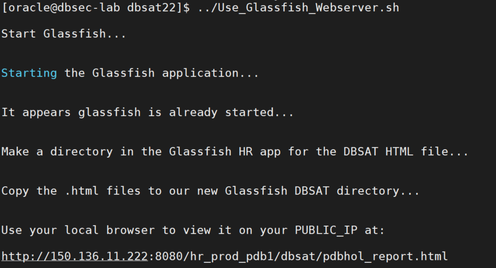
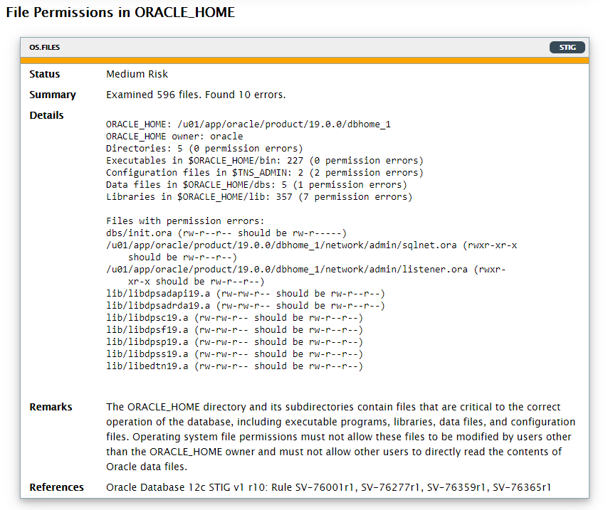

# [Lab] Collector and Reporter

## **1. DBSAT Collector**

In this exercise, you will learn how to execute DBSAT collector. DBSAT collector will connect to the database and collect data needed for analysis. DBSAT will not create any objects in the database. DBSAT only executes queries similar to the ones a Database Administrator would be executing in his daily tasks.

---
**NOTE:** In order to collect complete data, as it executes operating system commands to collect process and file system information, the DBSAT collector must run on the server that contains the database. In addition, the DBSAT collector must be run as an OS user with read permissions on files and directories under ORACLE_HOME, and if set up, TNS_ADMIN.

---

- Open a SSH session on your DBSec-Lab VM as Oracle User

````
<copy>

        sudo su - oracle
</copy>
````

- Go to the scripts directory

````
<copy>
        cd $DBSEC_HOME/workshops/Database_Security_Labs/DBSAT/dbsat22
</copy>
````
 - Let's start by examining all DBSAT execution parameters. Please type:

````
<copy>
        ./dbsat
</copy>
````
- You'll see this:

    
       
- Let’s run dbsat to collect data from the pdb1 PDB

````
<copy>
        ./dbsat collect dbsat_admin@pdb1 pdbhol
</copy>
````

- When prompted, enter **Oracle123** as the password
    
    ---
    **NOTE:** Please note that dbsat_admin user is pre-seeded in this database. In case you need to create it on a different environment, you’ll find the required privileges and roles in the product documentation.

    ---

- This is the expected output:

    

    ---
    **NOTE:**
    The time it takes to complete depends on the hardware and the metadata that needs to be collected. This lab was created to provide some findings for analysis and depending on the available hardware it might take between 1 to 3 minutes.

    ---

- A file named **pdbhol.zip** is created in the directory.
It is not required to unzip the file. DBSAT reporter will take either the JSON file (if –n was used) or the zip file.

The next step is to analyze the collected data using dbsat reporter. 

        
## **2. DBSAT Reporter**
In this exercise, you will learn how to execute the dbsat reporter. DBSAT reporter will take as input the file generated by the collector (json or zip file) and will produce one zip file containing four reports in different formats: HTML, spreadsheet, JSON, and text. If you choose not to encrypt data, the four report files are generated in the specified directory

- Let’s run dbsat to analyze data from the pdbhol file

````
<copy>
        ./dbsat report pdbhol
</copy>
````        
    ---
    **NOTE:** You do not need to include the .zip extension
    
    ---
    
- DBSAT will prompt the user for one password – the password used when running the collector so it can unzip the file – followed by another password prompt that will be used to protect the reports zip file, plus the password confirmation. Stick to **Oracle123**.
    
- This is the expected output:

    

- You will end up with the results of the analysis inside a password protected zip file named **pdbhol_report.zip**

- Let’s unzip the file to view the reports

````
<copy>
        unzip pdbhol_report.zip
</copy>
````

- This is the output you should get:

    

- For the purpose of this lab, and as we are not using a desktop environment, copy the html file to the glassfish server directory by executing the script. This will make the html report accessible by your laptop browser.

````
<copy>
         ../Use_Glassfish_Webserver.sh
</copy>
````

    This script will copy the html report to the glassfish webserver to make it easier for you to see the report.
    
- This is the output:

    
 
 - Open your web browser and copy-paste the URL provided as the output

 - For real life cases you won’t need to copy file to glassfish. Just unzip the files and open the html.
<br><br>

## **3. Analyze the Report - Summary**

In this exercise, you will learn how to how to analyze the **Database Security Risk Assessment Report**. We will dive into the summary table, different types of risks, the anatomy of a finding and the actual findings.

Please take a couple of minutes to scroll through the HTML report. You can click the links in the summary table to go to a specific section or use the navigation arrows at the bottom right.

The report contains informational tables, like the one shown below and findings. We will get back to the findings later. Informational tables provide either summary information or additional context to the findings in the same section.

 


- At the top of the report, you will find information about the Collector and Reporter run details as the date of data collection and the date of report generation along with the reporter version

- Follows the Database Identity information where you will find details about the target database
- Then the Summary table. The Summary table presents all the findings per section/domain along with their severity level.

---
**NOTE:**
Having a “Total” of less than 80 findings might indicate that there were some issues collecting data. You’ll find more details about the reasons at the bottom of the HTML report. The collector generated *.json* file can also be used for further troubleshooting. If you run DBSAT against ADW/ATP or run the collector remotely you will get less than 80 findings. The main reason for this is that we skip the collection of OS related findings and findings that depend on reading files from the operating system.

---
<br><br>

## **4. Analyze the Report - Findings**
In this exercise, you will learn what a **Finding** is. The DBSAT reporter resulting analysis is reported in units called Findings. In each Finding you see:
- **Unique ID for the Rule**

    The ID has two parts: the prefix identifies the report section, and the suffix identifies the specific rule.

- **Status** 

    You can use the status values as guidelines for implementing DBSAT recommendations. They can be used to prioritize and schedule changes based on the level of risk, and what it might mean to your organization. High risk might require immediate remedial action, whereas other risks might be fixed during scheduled downtime, or bundled together with other maintenance activities.

    – Pass: no error found

    – Evaluate: needs manual analysis

    – Low Risk

    – Medium Risk

    – High Risk

    – Advisory: improve security posture by enabling additional security features and technology. Poses and opportunity for improvement.
- **Summary** 

    Provides a brief summary of the finding. When the finding is informational, the summary typically reports only the number of data elements that were examined.
- **Details** 

    Provides detailed information to explain the finding summary, typically results from the assessed database, followed by any recommendations for changes.
- **Remarks** 

    Explains the reason for the rule and recommended actions for remediation.
- **References**

    If the finding is related to a CIS Oracle Database Benchmark 12c v2.0.0 recommendation, Oracle Database 12c STIG v1 r10 or related to a GDPR Article/Recitals, it will be mentioned here.

<br><br>
## **5. Anatomy of a Finding**


 

<br><br>

## Analyze the Report - Details

In this exercise, you will be guided by relevant DBSAT findings. This will provide you with knowledge on what DBSAT validates and the value it provides

- Let’s have a look at the “Basic Information” and look after the “High Risk“ finding (red line)

    Click “Basic Information” in the Summary table and scroll to **INFO.PATCH**.


     


    It seems that the database needs to be patched. This is an important finding as it is one of the most common ways hackers get into databases. They exploit vulnerable, unpatched, databases.

    This is a **Finding**.

    ---
    **Note:** You can always return to the Summary table. Click **TOP** on the navigation panel  (bottom right).

    ---

- Let’s have a look at “User Accounts” and search for the finding marked as “Medium Risk” (orange line). Click the “User Accounts” link in the Summary table and scroll to **USER.SAMPLE**.

     


    Great! DBSAT pointed out that we have users sample schemas **HR** and **SCOTT**. Should **HR** and **SCOTT** be around in this database? These sample schemas should not be in production databases. Keep this in mind.

- What else can DBSAT show me on users? I’m curious about **SCOTT** and **HR**. Scroll down or search for **USER.INACTIVE**:

     

    There are several user accounts with unlimited **INACTIVE_ACCOUNT_TIME** 
     [](https://docs.oracle.com/en/database/oracle/oracle-database/19/sqlrf/CREATE-PROFILE.html#GUID-ABC7AE4D-64A8-4EA9-857D-BEF7300B64C3__INACTIVE_ACCOUNT_TIME-585837A4), including **SCOTT**. Maybe we should investigate further? Is it the case that these users have a user profile that do not impose limits on **INACTIVE_ACCOUT_TIME**? You can scroll up to the **USER ACCOUNTS** Table and have a look at the profile that is set for these users – DEFAULT.

    

    All Users belong to the **DEFAULT** Profile.


- Search for “User Profiles” (or scroll down to that table):

   


    All database users are on the **DEFAULT** profile which has **INACTIVE_ACCOUNT_TIME = UNLIMITED**. 

---
**NOTE:** The **INACTIVE_ACCOUNT_TIME** profile parameter locks a user account that has not logged in to the database instance in a specified number of days. 

---

- See the next finding – **USER.NOEXPIRE**

   


    Findings in this section will provide a view on who are the users in my database, their status, password settings and user profiles.

- Let’s get back to the top, but this time we will review what is going on in the **“Privileges and Roles”** section. This section shows the largest number of findings (22). Click TOP on the navigation panel (bottom right). Followed by clicking the “Privileges and Roles” link.

    This section provides information about System Privileges, Roles, Account Management Privileges, Privilege Management Privileges, Database Management Privileges, Audit Management Privileges, Data Access Privileges, Access Control Exemption Privileges, Access to Password Verifier Tables, Access to Restricted Objects, Users with DBA role, Users with Administrative privileges among others.

    You should see this:

    
    

    This provides a powerful insight into what can users do that typically is not addressed in everyday vulnerability management products.

- Look at the **PRIV.SYSTEM** finding. It seems that **SCOTT** has some powerful privileges. Does he have the DBA role? Good Question! DBSAT provides an answer to that (hint: PRIV.DBA finding).

- Where applicable, DBSAT also shows the grant path (if a privilege was directly granted or indirectly granted) to make it easier to spot wrong grants:

    - **(D)** next to a user means that user got that privilege via a direct grant.
    - If granted with admin option DBSAT will show it as **(*)**.
    - If commonly granted (grant to a common user to all pdbs) it will show as a **(C)**.

        e.g.:

            SQL> grant advisor to C##DBA_DEBRA container=all;

    - Combinations are also possible **(D)(*)** means, directly granted with admin option.
        
    Scroll down to “Account Management Privileges” (you can also search for **PRIV.ACCT** in the browser).

    You will see this:

    
    
    This finding will present **direct** or **indirect grants** of account management privileges – ALTER USER, CREATE USER, DROP USER – and will show the grant path. Either **direct as JSCHAFFER: ALTER USER, CREATE USER, DROP USER** or **indirect as SCOTT <- APPROLE1 <- APPROLE2 <- APPROLE3 <- DBA: ALTER USER, CREATE USER, DROP USER**. **SCOTT** received those privileges via the **DBA** grant to **APPROLE3**, that was granted to **APPROLE2** and then to **APPROLE1**. Finally, **APPROLE1** was granted to **SCOTT**.


- Let’s have a look at another example. This time on “DBA Role” – PRIV.DBA. Scroll down or search.

    You will see this:

    


    Database User Accounts **DBA_DEBRA**, **DBA_HARVEY**, **DBA_NICOLE**, **DMS_ADMIN**, **EVIL_RICH**, **JTAYLOR**, **MASKING_ADMIN**, **SCOTT** have been granted the powerful **DBA** Role.

    Do these users need it? This is something that DBSAT can’t define as it lacks organizational and processes awareness. That is why it is marked for review (Status = Evaluate).

    ---
    **NOTE:**
    As a best practice the usage of the out-of-the-box DBA role should be avoided. Customers are encouraged to create their own DBA-like role with the exact set of privileges required for the administrators to execute their daily tasks. 

    ---

- We have spent some time now looking into users, privileges, and roles. What about “Authorization Control”? Click **TOP** and in the summary table go to “Authorization Control.”

    


    The **AUTH.DV** Finding is marked Blue (Advisory) as it presents an opportunity for improvement. Database Vault (DBV) enables to define Realms around sensitive data to prevent unauthorized access, even from privileged users. Database Vault also enables to control command execution according to a particular factor(s). As an example, you can disable DROP TABLE in your production database or ALTER SYSTEM if not coming from a specific IP ADDRESS or day/time of day.

    Database Vault may help address the Articles and Recitals mentioned above. **DBV help address GDPR topics related to pseudonymization, restriction of processing and security of processing.**

    **AUTH.PRIV** relates to Privilege Analysis. This finding is showing that DBSAT_ADMIN and PA_ADMIN can start the capture process. However it was never run.


    ---
    **NOTE:** Privilege Analysis was first introduced with Oracle Database 12c and licensed as part of the Oracle Database Vault option. Since then, Privilege Analysis has been used by many customers to reduce their attack surface area by helping them implement least privilege model. 

    **Privilege Analysis is now included with Oracle Database Enterprise Edition for no additional license fee**. This change applies to all supported versions of the Oracle Database.

    **Privilege Analysis** allows to:
    - Report on actual privileges and roles used in the database. 
   
        E.g. To capture privilege and role usage for a period and report on the usage.
    - Identify unused privileges and roles by users and applications. 

        E.g. Privileges used by DBA.

    - Reduce risk by helping enforce least privilege for users and applications

- Go to “Fine-Grained Access Control” – CTRL + F **“ACCESS.REDACT”**

    You will see this:

    

    This section displays information on Data Redaction, VPD, RAS Policies, Label Security and Transparent Sensitive Data Protection (TSDP) policies. In case there are policies in place, these findings will show them. Users not impacted by policies and that can manage or create them are listed in the findings.


- Have a look and when finished move to the next section – **“Auditing.”**

    

    There are Unified Audit trail records. To know more about the actual auditing policies in place, we need to have a look at the next findings. Just enabling auditing does not generate any audit records. Audit policies need to be in place.

    When **Unified Audit** is in place, all information about Traditional Auditing is ignored and it is not displayed in the findings.

- Moving to the next finding – **AUDIT.ADMIN** – and we find out that auditing for administrative actions by **SYS** is not being performed.

    

- Scroll down to “Data Encryption” – CTRL + F **“CRYPT.TDE”**

    You should see this:

    

    No encrypted tablespaces and no encrypted columns. Is this database storing sensitive data? Is the data it holds subject to any regulation? Make sure that you understand the data that it is stored in your databases - if it is sensitive and subject to any regulation. DBSAT Discoverer can help gather more details about the sensitive data in this database.
    
    As an example, GDPR considers encryption as one of the core techniques to render the data unintelligible to any person who is not authorized to access the personal data.

        … the controller, and the processor shall implement appropriate technical and organisational measures, to ensure a level of security appropriate to the risk, including inter alia, as appropriate: (a) The pseudonymisation and encryption of personal data; -- Article 32

    We will discover sensitive data with DBSAT Discoverer in one of the next labs.
    
- Let’s get to the next section – “Database Configuration”- and have a look at some of the findings. This section starts with an informational table that provides a summary of relevant security-related database initialization parameters. 

    

- Scroll down or search for **CONF.DIR**. It is also marked as posing a “Medium Risk.”

    


    A special look needs to be taken into these **DIRECTORY** Objects as they allow access to the server's file system from PL/SQL code within the database.

    Access to files that are used by the database kernel itself should not be permitted. **Directories with both write and execute** will be flagged.

    Make sure all **DIRECTORY** objects are needed and for the ones that are, point them to other directories rather than inside $ORACLE_HOME, $ORACLE_BASE.

    ---
    **NOTE:** This finding detail list all the directories (**DIRECTORY** objects) in the database (17) and then the directories that pose risk. In this particular case, the last line of the details show **“Access to $ORACLE_HOME: ORACLE_HOME”**, meaning that the **DIRECTORY** object that point to **$ORACLE_HOME path** is called **“ORACLE_HOME”**.

    ---


- No backups were found in the past 90 days.

    


- Click **TOP** on the navigation panel (bottom right).

    


- Let’s have a look at the “Operating System” section and search for the finding marked as “Medium Risk” (orange line). Click the “Operating System” link in the Summary table.

- Scroll down to **"OS.FILES"**

    

    In this finding, DBSAT will identified operating system file permissions that are wrongly set. In this case, 10 files have wrong permission settings.

    Make sure OS file permissions are rightly setup to avoid having database binaries and files modified by users other than the ORACLE_HOME owner.
<br><br>

---
**Congratulations! So far you have learned how to use DBSAT collector and reporter to Assess your Database Security. DBSAT discoverer Lab is next!**

---
Move up one [directory](../README.md)

Click to return [home](/README.md)
