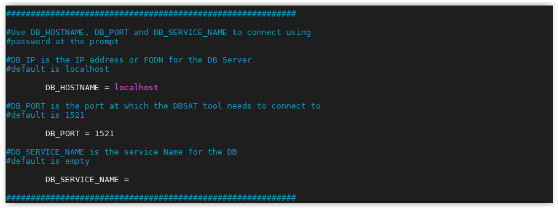
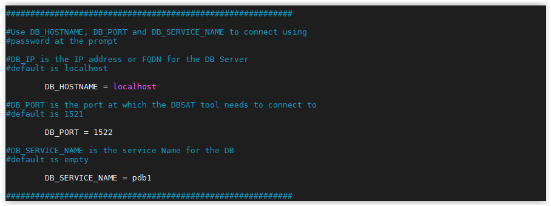
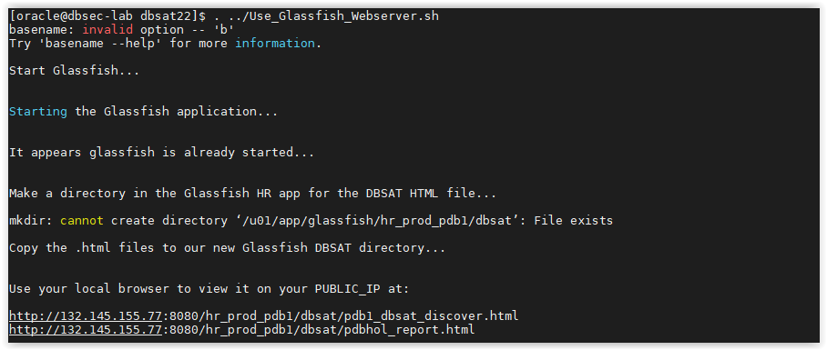
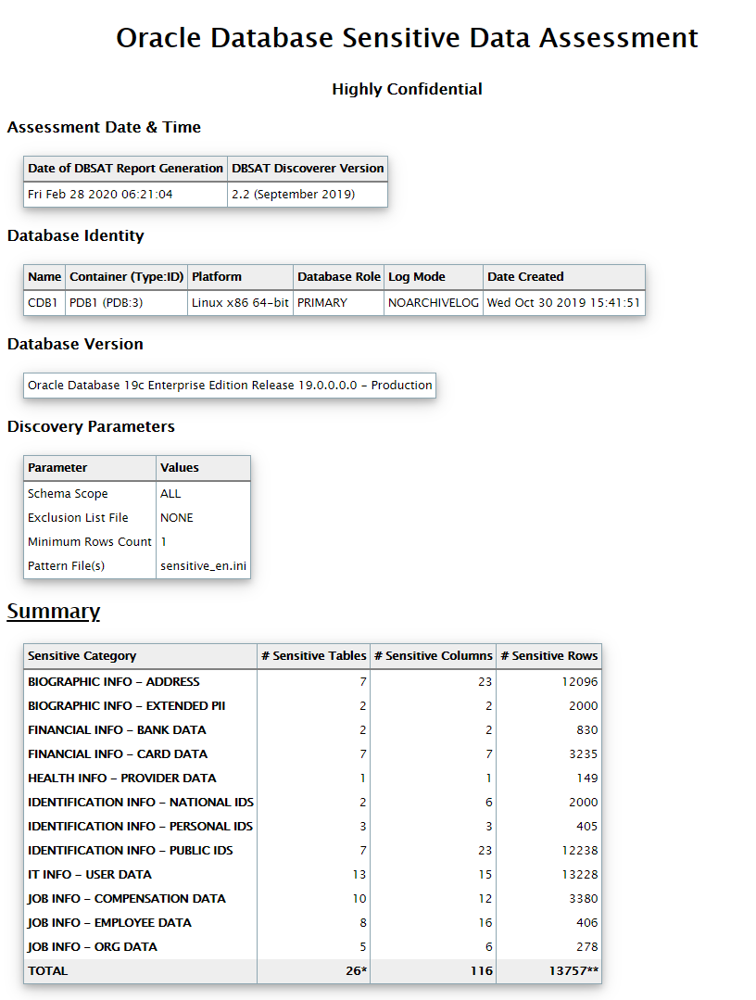

# Discover Sensitive Data

## **1. Database Sensitive Data Assessment - Discoverer**

In this exercise, you will learn how to execute DBSAT discoverer. DBSAT discoverer will connect to the database and collect data needed for analysis based on settings specified in the configuration and sensitive pattern files.
<br><br>

- Open a SSH session on your DBSec-Lab VM as Oracle User
````
<copy>
        sudo su - oracle

</copy>
````
- Go to the scripts directory
````
<copy>
        cd $DBSEC_HOME/workshops/Database_Security_Labs/DBSAT/dbsat22/Discover/conf

</copy>
````        
- Copy the provided sample_dbsat.config, make the copy writable and open it for editing
````
<copy>
        cp sample_dbsat.config dbsat.config
        chmod +w dbsat.config
        vi dbsat.config

</copy>
````        
2. You should see this:

        ...
    

        ...


    The configuration file includes comments that should be sufficient to understand what the various parameters do. **In summary, the dbsat.config file is where you can set up the**:

    - Database connection details
    - SSL parameters
    - Discovery parameters
    - Sensitive Categories and related risk level
 
- Change the following parameters to:
````
<copy>
        DB_PORT = 1522
        DB_SERVICE_NAME = pdb1

</copy>
````
    
 
    ---
    **NOTE:** When using `vi`, you can type ‘i’ to enter insert mode and edit the file. To save, type ‘`:wq[enter]`’

    ---

- Save the file and go back to the shell

- Let’s give it a try. Go back to the terminal and change directory to the dbsat home:
````
<copy>
        cd ../..   

</copy>
````
- Execute the DBSAT discoverer :
````
<copy>
        ./dbsat discover -c Discover/conf/dbsat.config pdb1_dbsat
 
</copy>
````       
- Pass **DBSAT_ADMIN** as the username and **Oracle123** as the password.

    

    At the end of the process, you’ll be asked to provide a password twice (please use **Oracle123**).

- A file named pdb1_dbsat_report.zip is created in the directory (/home/oracle/dbsat/)

- Unzip the file and check the contents by opening the HTML report in firefox
````
<copy>
        unzip pdb1_dbsat_report.zip

</copy>
````        
- This is the output you should get:

    

- For the purpose of this lab, and as we are not using a desktop environment, copy the html file to the glassfish server directory by executing the script. This will make the html report accessible by your laptop browser.
````
<copy>
        ../Use_Glassfish_Webserver.sh

</copy>
````    
    This script will copy the html report to the glassfish webserver to make it easier for you to see the report.

- This is the output:

    
    
 - Open your web browser, and copy-paste the URL provided for the discoverer html report as the output
 
        For real life cases you won’t need to copy file to glassfish. Just unzip the files and open the html.

- You should see the **Database Sensitive Data Assessment** report as shown below:

    

<br><br>

## **2. Analyze the Discoverer Report - Summary**

In this exercise, you will learn how to analyze the **Sensitive Data Assessment Report**. We will dive into the different sections of the report and in subsequent exercises in more detail about the value the discovery parameters provide.

Please take a couple of minutes to scroll through the HTML report. You can use the navigation arrows at the bottom right to navigate between different sections.


- Initial Section

    


- At the top of the report, you will find information about the Discoverer run details as the Date of DBSAT Report Generation along with the DBSAT Discoverer version.
- Follows the Database Identity information where you will find details about the target database.
This section may vary depending on whether dbsat connects to a non-CDB, CDB or PDB.
- Then the Discovery Parameters table. The Discover Parameters table shows the parameters in use from the dbsat.config file.

    - Schemas Scope=ALL
    
        Enables to choose if the search takes all schemas into account (except SYS, SYSTEM and other Oracle maintained schemas) or a limited set of comma-separated schemas. By default, ALL will target all schemas and will discover accordingly. 

    - Exclusion List File = NONE
    
        Allows to exclude from the results all tables from a schema (schemaD), a whole table (schemaA.tableA), or certain columns (schemaA.tableB.columnA ; schemaB.tableA.columnC).

    - Minimum Rows Count = [1 (default)]
    
        Exclude tables with less than X rows from the result set. This enables to exclude tables with less than a certain number of rows. This argument is used to define the weight of tables to be considered by the discoverer. It enables to produce a smaller and more focused report.

    - Pattern File(s) = [sensitive.ini (default), other.ini, …]
    
        By default, sensitive_en.ini is used, and it contains patterns in English and will look for English based sensitive columns/comments. This parameter enables the end user to choose which sensitive pattern files to add to the search. 

        If you want to search the data model in other languages, please reach out to your Oracle Account Manager. Oracle can help you to get a head start by providing sample pattern files in other languages. 

        You can create your own pattern files.

        ---
        **Note:** Pattern files need to be located in the same directory sat the dbsat.config file

        ---

- Summary Table

    The Summary will show you, organized by Sensitive Category, the number of tables, the number of columns and the number of rows.
    

    

    ---
    **NOTE:** Keep in mind that one Table might contain columns/or column comments that might match more than one category, and that makes the total for #Sensitive Tables and #Sensitive rows not to add up. In the Total line, DBSAT presents unique number of tables and unique number of rows.

    ---


- Sensitive Data section

    In this section, you will see a list of findings. Each finding is comprised of:

    - Risk Level – High Risk, Medium Risk, and Low Risk
    - Summary – A brief summary of what was found - the number of schemas or tables/columns
    - Location – In which SCHEMA.TABLE sensitive data was found


    The first one lists the Schemas with Sensitive Data and then follows, by Risk Level, a recommendation on which security controls should be in place to protect this type of data followed by findings per Sensitive Category. As you can see in the example below, the report shows a recommendation after **Risk Level: High Risk** and then **Tables Detected within Sensitive Category: Personal Financial Info – Card Info**.

    Sample findings:

    


- Schema View

    Here you will get the **Schema View**. The **Table Summary** shows the list of Schemas, Table names, number of total columns and sensitive columns, along with the number of rows and Sensitive Category.

    


    Then the list of **Sensitive Column Details** with the Schema Name, Table Name, Column Name, Sensitive Category and Sensitive Type details and Risk Level.

    


    DBSAT helped discovering Sensitive Types in different categories!

    ---
    **NOTE:** DBSAT discoverer csv output file can be used to help Oracle Audit Vault and Database Firewall understand what sensitive data you have and provide you with reports on who is accessing sensitive data – Privacy reports.

    ---
<br><br>

Move up one [directory](../README.md)

Click to return [home](/README.md)
