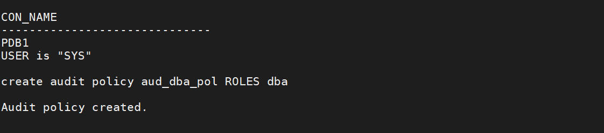

# Unified Auditing - Audit Database Role Usage

---

In this lab you will use Unified Audit's ability to audit by role. 

When you audit a role, Oracle Database audits all system privileges that are directly granted to the role.

You can audit any role, including user-defined roles. If you create a common unified audit policy for roles with the ROLES audit option, then you must specify only common roles in the role list. When such a policy is enabled, Oracle Database audits all system privileges that are commonly and directly granted to the common role. The system privileges that are locally granted to the common role will not be audited. To find if a role was commonly granted, query the DBA_ROLES data dictionary view. To find if the privileges granted to the role were commonly granted, query the ROLE_SYS_PRIVS view.

To get started, run the first script to create the role, `MGR_ROLE` and grant it the `CREATE TABLESPACE` system privilege. Then it will grant the role to the database user, `DBA_NICOLE`. 
````
<copy>
    ./01_create_role.sh
</copy>
````


The next script will create the audit policy to audit the use of the role `MGR_ROLE`. 
````
<copy>
    ./02_create_role_audit_policy.sh
</copy>
````


Next, create the `DBA_JUNIOR` user who will be granted the `DBA` role. 
````
<copy>
    ./03_create_junior_dba.sh
</copy>
````


Create the policy associated with auditing the use of the `DBA` role.
````
<copy>
    ./04_create_dba_audit_policy.sh
</copy>
````


Enable the audit policies for `MGR_ROLE` and `DBA` role usage. 
````
<copy>
    ./05_enable_audit_policies.sh
</copy>
````


View the audit policies that are enabled.
````
<copy>
    ./06_view_audit_policies.sh
</copy>
````


Execute SQL statements that will show up in the Unified Audit Trail.
````
<copy>
    ./07_generate_audits.sh
</copy>
````


View the Unified Audit Trail output associated with the two audit policies.
````
<copy>
    ./08_review_generated_audits.sh
</copy>
````


When you have completed the lab, you can run the cleanup script.
````
<copy>
    ./09_cleanup.sh
 </copy>
````   
    


---

Move up one [directory](../README.md)

Click to return [home](/README.md)


