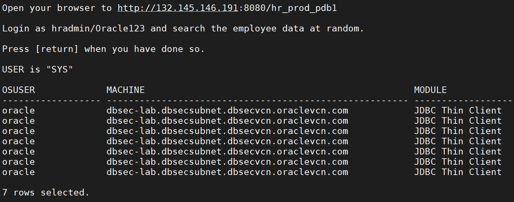

# Unified Auditing - Audit NonApp Usage 

---

In this lab, we will audit who is using the `EMPLOYEESEARCH_PROD` objects outside of the application. 

The first step is to identify the connections we trust. We will generate some activity from the Glassfish application and view the session-related information.   
````
<copy>
    ./01_query_employeesearch_usage.sh
 </copy>
````   
- Login to the Glassfish app as `hradmin/Oracle123`  
- Click Search Employees
- Click Search
- Change some of the criteria and Search again.
- Repeat 2-3 times to ensure you have enough traffic
- Press `return` when you are ready to see the results. 
      
    

Next, run a query to generate traffic from `SQL*Plus` on the host OS. 
````
<copy>
    ./02_query_employeesearch.sh
 </copy>
````   


Now, create the Unified Audit Policy. The Unified Audit Policy will capture your machine-related details to create the  `WHEN` clause.  Take a look 
````
<copy>
    ./03_create_audit_policy.sh  
 </copy>
```` 
 

After creating the Unified Audit Policy you must enable it. 
````
<copy>
    ./04_enable_audit_policy.sh


</copy>
````
Using the Glassfish App, run additional queries to generate traffic and to see if Audit records are generated.  They should not be generated based on this Unified Audit Policy because we are **excluding** application audit data. 
````
<copy>
    ./05_query_employeesearch_usage.sh
</copy>
````


Query the `EMPLOYEESEARCH_PROD.DEMO_HR_EMPLOYEES` table again using `SQL*Plus` to generate audit data.
````
<copy>
    ./06_query_employeesearch.sh
</copy>
````


View the results of the audit output. You can see we have an entry that corresponds with our use of `SQL*Plus` while not capturing queries from the Glassfish application.  We trust the application to execute queries as `EMPLOYEESEARCH_PROD` but we do not trust anyone else. We want to audit everyone else. 
````
<copy>
    ./07_query_audit_records.sh
</copy>
````


When you have completed this lab, you can remove the Unified Audit Policy. 
````
<copy>
    ./08_delete_audit_policy.sh
</copy>
````
---

Move up one [directory](../README.md)

Click to return [home](/README.md)

