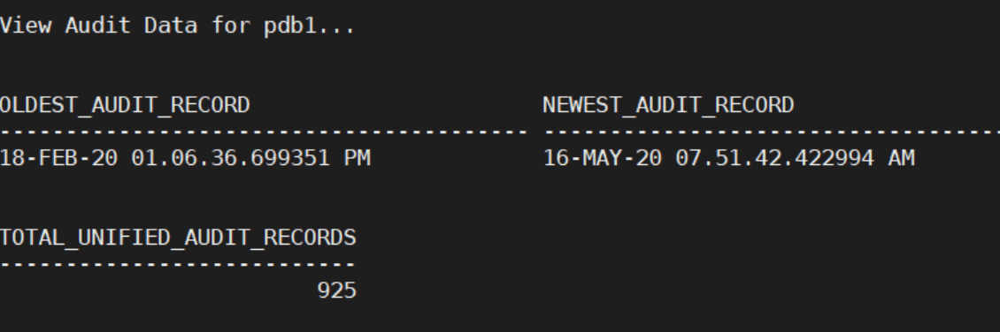
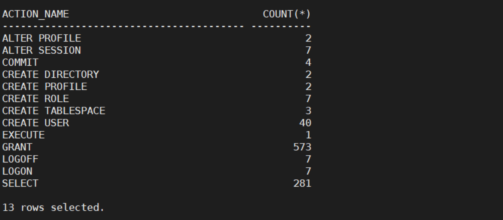

# Unified Auditing 

---


First, display the current audit settings.  The environment should show that pure Unified Auditing mode is enabled. This means we are no longer utilize the traditional auditing capabilities. 

    ./01_current_audit_settings.sh

You will see that Unified Audit is set to `TRUE`. This means our database is in "pure" unified auditing mode. 


The section will show you how many Unified Audit Policies exist and how many audit-related attributes are associated with each policy. The attributes are what is being auditing. 


The third query of this script shows you which Unified Audit policies are **enabled**. 


Just because the policy exists in the previous query does not mean it's enabled. It is a two-step process to using a Unified Audit policy:  

    1. create the policy: create audit policy <policy_name> ... ;
    2. enable the policy: audit policy <policy_name>;

The fourth query will show you auditing based on context. We have one policy called `TICKETINFO` that captures an attribute named `TICKET_ID`. This information will be viewable in the `APPLICATION_CONTEXTS` column of the `UNIFIED_AUDIT_TRAIL` view.


The second script to run shows you who has the `AUDIT_ADMIN` and `AUDIT_VIEWER` roles. 
````
<copy>
    ./02_has_audit_roles.sh
</copy>
````


The third section will show you the existing audit records for the database you connect to. By default, the script will choose `pdb1` as the database to query.
````
<copy>
    ./03_query_existing_audit_records.sh
</copy>
````




Script four, shows some of the details of the `DBMS_AUDIT_MGMT` package. 

The function, `DBMS_AUDIT_MGMT.GET_AUDIT_COMMIT_DELAY`, returns the audit commit delay time as the number of seconds. audit commit delay time is the maximum time that it takes to COMMIT an audit record to the database audit trail. If it takes more time to COMMIT an audit record than defined by the audit commit delay time, then a copy of the audit record is written to the operating system (OS) audit trail.


This completes the first lab.


---

Move up one [directory](../README.md)

Click to return [home](/README.md)


