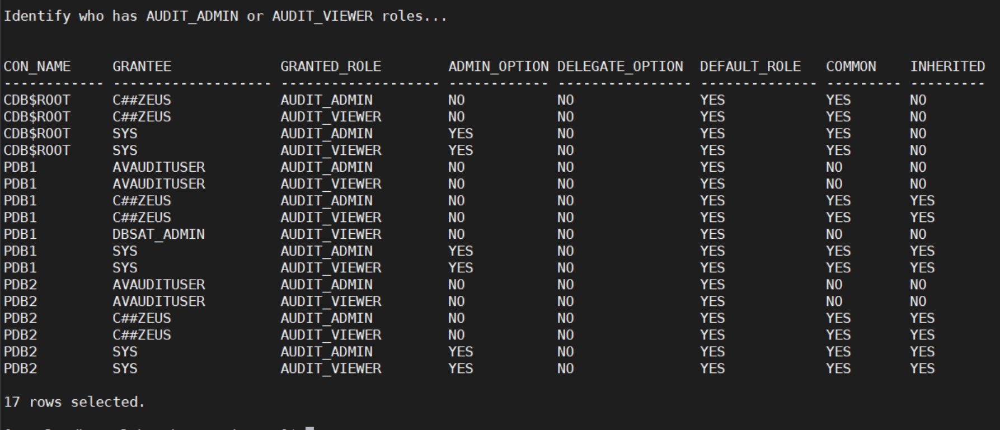
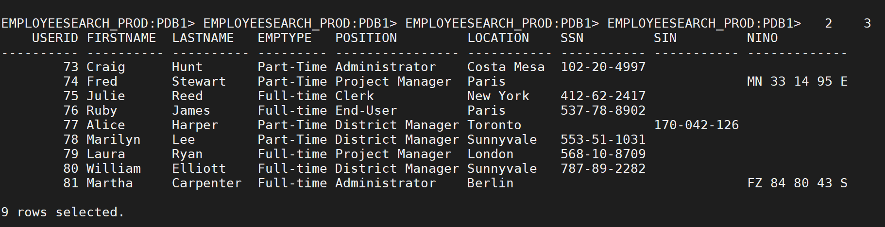
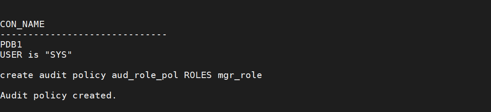

# Oracle Unified Auditing

## Introduction
This workshop introduces the functionality of Unified Auditing.

It gives the user an opportunity to learn how to configure this feature to audit the database activity.

- *Version tested in this lab:* Oracle DB 19.8
- *Estimated Lab Time:* 30 minutes

**Note**:
- Mixed mode auditing is the default auditing in a newly installed database. Mixed mode auditing enables both traditional (that is, the audit facility from releases earlier than release 12c) and the new audit facilities (unified auditing).
- Mixed mode is intended to introduce unified auditing, so that you can have a feel of how it works and what its nuances and benefits are. Mixed mode enables you to migrate your existing applications and scripts to use unified auditing. Once you have decided to use pure unified auditing, you can relink the oracle binary with the unified audit option turned on and thereby enable it as the one and only audit facility the Oracle database runs. If you decide to revert back to mixed mode, you can.
- In this environment, we have already migrated this Oracle Database to pure unified auditing mode.

### Objectives
- Enable/Disable Unified Auditing on your database
- See different auditing use cases

### Prerequisites
This lab assumes you have completed:
   - Lab: Generate SSH Keys
   - Lab: Prepare Setup
   - Lab: Environment Setup
   - Lab: Initialize and Start the DBSecLab Environment

### Video Preview
- Watch a preview of "*Understanding Unified Auditing (February 2019)*" [](youtube:8spLhyj3iC0)

### Lab Timing (estimated)
| Step No. | Feature | Approx. Time |
|--|------------------------------------------------------------|-------------|
| 1 | Display the current audit settings | 5 minutes |
| 2 | Audit Non App Usage | 10 minutes |
| 3 | Audit Database Role Usage | 10 minutes |
| 4 | Audit Data Pump Usage | 5 minutes |


## **STEP 1**: Display the current audit settings

1. Open a SSH session on your DBSec-Lab VM as Oracle User

      ````
      <copy>sudo su - oracle</copy>
      ````

2. Go to the scripts directory

      ````
      <copy>cd $DBSEC_HOME/workshops/Database_Security_Labs/Unified_Auditing/First_Steps</copy>
      ````

3. Display the audit settings

      ````
      <copy>./01_current_audit_settings.sh</copy>
      ````

    - We have already set the environment for you in pure Unified Auditing mode, hence you should see that Unified Audit is set to `TRUE`

   

      **Note**: This means our database is in "pure" unified auditing mode and you are no longer utilize the traditional auditing capabilities

    - The 2nd query shows you how many Unified Audit Policies exist and how many audit-related attributes are associated with each policy

   

    - The 3rd query of this script shows you which Unified Audit policies are **enabled**

      

      **Note**:
      - Just because the policy exists in the previous query does not mean it's enabled
      - It is a two-step process to using a Unified Audit policy:
            - create the policy: create audit policy <policy_name> ...
            - enable the policy: audit policy <policy_name>

    - The 4th query shows you auditing based on context

       

        **Note**:
        - We have one policy called `TICKETINFO` that captures an attribute named `TICKET_ID`
        - This information will be viewable in the `APPLICATION_CONTEXTS` column of the `UNIFIED_AUDIT_TRAIL` view

4. Display who has the `AUDIT_ADMIN` and `AUDIT_VIEWER` roles

      ````
      <copy>./02_has_audit_roles.sh</copy>
      ````

   

5. Display the existing audit records for the database you connect to (by default, the script will choose `pdb1` as the database to query)

      ````
      <copy>./03_query_existing_audit_records.sh</copy>
      ````

   
   

6. Finally, shows some of the details of the `DBMS_AUDIT_MGMT` package

      ````
      <copy>./04_dbms_audit_mgmt_settings.sh</copy>
      ````

    **Note**:
    - The function, `DBMS_AUDIT_MGMT.GET_AUDIT_COMMIT_DELAY`, returns the audit commit delay time as the number of seconds
    - Audit commit delay time is the maximum time that it takes to COMMIT an audit record to the database audit trail
    - If it takes more time to COMMIT an audit record than defined by the audit commit delay time, then a copy of the audit record is written to the operating system (OS) audit trail

## **STEP 2**: Audit Non App Usage

In this lab, you will audit who is using the `EMPLOYEESEARCH_PROD` objects outside of the application

1. Go to the scripts directory

      ````
      <copy>cd $DBSEC_HOME/workshops/Database_Security_Labs/Unified_Auditing/Audit_EmpSearch_Usage</copy>
      ````

2. Identify the connections we trust. We will generate some activity from the Glassfish application and view the session-related information

      ````
      <copy>./01_query_employeesearch_usage.sh</copy>
      ````

   

3. On your Glassfish App, perform the the following steps:
    
    - Open a web browser window to `http://<YOUR_DBSEC-LAB_VM_PUBLIC_IP>:8080/hr_prod_pdb1`
    - Login to the HR Application as `hradmin` with the password `Oracle123`
    
   

   

    - Click on **Search Employees**

   

    - Click [**Search**]

   

    - Change some of the criteria and Search again.
    - Repeat 2-3 times to ensure you have enough traffic
    - Press [**Return**] when you are ready to see the results

4. Go back to your terminal session and run a query to generate traffic from `SQL*Plus` on the host OS

      ````
      <copy>./02_query_employeesearch.sh</copy>
      ````

   

5. Now, create the Unified Audit Policy

      ````
      <copy>./03_create_audit_policy.sh</copy>
      ````

   

    **Note**: The Unified Audit Policy will capture your machine-related details to create the  `WHEN` clause

6. After creating the Unified Audit Policy you must enable it!

      ````
      <copy>./04_enable_audit_policy.sh</copy>
      ````

   

7. Using the Glassfish App, run additional queries to generate traffic and to see if Audit records are generated

      ````
      <copy>./05_query_employeesearch_usage.sh</copy>
      ````

   

    **Note**: They should not be generated based on this Unified Audit Policy because we are **excluding** application audit data

8. Query the `EMPLOYEESEARCH_PROD.DEMO_HR_EMPLOYEES` table again using `SQL*Plus` to generate audit data

      ````
      <copy>./06_query_employeesearch.sh</copy>
      ````

   

9. View the results of the audit output

      ````
      <copy>./07_query_audit_records.sh</copy>
      ````

   

    **Note**:
    - You can see we have an entry that corresponds with our use of `SQL*Plus` while not capturing queries from the Glassfish application
    - We trust the application to execute queries as `EMPLOYEESEARCH_PROD` but we do not trust anyone else
    - We want to audit everyone else

10. When you have completed this lab, you can remove the Unified Audit Policy

      ````
      <copy>./08_delete_audit_policy.sh</copy>
      ````

## **STEP 3**: Audit Database Role Usage

**Before Started**

When you audit a role, Oracle Database audits all system privileges that are directly granted to the role. You can audit any role, including user-defined roles. If you create a common unified audit policy for roles with the ROLES audit option, then you must specify only common roles in the role list. When such a policy is enabled, Oracle Database audits all system privileges that are commonly and directly granted to the common role. The system privileges that are locally granted to the common role will not be audited. To find if a role was commonly granted, query the `DBA_ROLES` data dictionary view. To find if the privileges granted to the role were commonly granted, query the `ROLE_SYS_PRIVS` view.

**The Labs**

1. Go to the scripts directory

      ````
      <copy>cd $DBSEC_HOME/workshops/Database_Security_Labs/Unified_Auditing/Audit_DB_Role</copy>
      ````

2. Create the role `MGR_ROLE` and grant it the `CREATE TABLESPACE` system privilege. Then it will grant the role to the database user `DBA_NICOLE`

      ````
      <copy>./01_create_role.sh</copy>
      ````

   

3. Create the audit policy to audit the use of the role `MGR_ROLE`

      ````
      <copy>./02_create_role_audit_policy.sh</copy>
      ````

   

4. Next, create the `DBA_JUNIOR` user who will be granted the `DBA` role

      ````
      <copy>./03_create_junior_dba.sh</copy>
      ````

   

5. Create the policy associated with auditing the use of the `DBA` role

      ````
      <copy>./04_create_dba_audit_policy.sh</copy>
      ````

   

6. Enable the audit policies for `MGR_ROLE` and `DBA` role usage

      ````
      <copy>./05_enable_audit_policies.sh</copy>
      ````

   

7. View the audit policies that are enabled

      ````
      <copy>./06_view_audit_policies.sh</copy>
      ````

   

8. Execute SQL statements that will show up in the Unified Audit Trail

      ````
      <copy>./07_generate_audits.sh</copy>
      ````

   

9. View the Unified Audit Trail output associated with the two audit policies

      ````
      <copy>./08_review_generated_audits.sh</copy>
      ````

   

10. When you have completed the lab, you can run the cleanup script

      ````
      <copy>./09_cleanup.sh</copy>
      ````

## **STEP 4**: Audit Data Pump Usage

In this lab you will configure the Unified Audit Trail and review an audit of Oracle Data Pump export. This is a feature of Unified Audit that is not available in traditional auditing.

1. Go to the scripts directory

      ````
      <copy>cd $DBSEC_HOME/workshops/Database_Security_Labs/Unified_Auditing/Audit_DataPump</copy>
      ````

2. Switch to pure Unified Audit mode

      ````
      <copy>./01_configure_unified_audit_trail.sh</copy>
      ````

    **Note**: This involves shutting down the database, making a change to the binary, and restarting it
    
3. Review the audit settings

      ````
      <copy>./02_current_audit_settings.sh</copy>
      ````

4. Generate Audit activity

      ````
      <copy>./03_generate_audit_workload.sh</copy>
      ````

5. View the audit records from the activity

      ````
      <copy>./04_review_audit_output.sh</copy>
      ````

6. Create a Unified Audit policy to audit Data Pump activities

      ````
      <copy>./05_audit_datapump_export.sh</copy>
      ````

7. Perform a test Data Pump Export

      ````
      <copy>./06_datapump_export_hr_table.sh</copy>
      ````

8. Review the Unified Audit Trail for the Data Pump activity

      ````
      <copy>./07_review_datapump_audit_events.sh</copy>
      ````

You may proceed to the next lab.

## **Appendix**: About the Product
- **Overview**

    In unified auditing, the unified audit trail captures audit information from a variety of sources.

    Unified auditing enables you to capture audit records from the following sources:
    - Audit records (including SYS audit records) from unified audit policies and AUDIT settings
    - Fine-grained audit records from the DBMS_FGA PL/SQL package
    - Oracle Database Real Application Security audit records
    - Oracle Recovery Manager audit records
    - Oracle Database Vault audit records
    - Oracle Label Security audit records
    - Oracle Data Mining records
    - Oracle Data Pump
    - Oracle SQL*Loader Direct Load

    The unified audit trail, which resides in a read-only table in the AUDSYS schema in the SYSAUX tablespace, makes this information available in a uniform format in the UNIFIED_AUDIT_TRAIL data dictionary view, and is available in both single-instance and Oracle Database Real Application Clusters environments. In addition to the user SYS, users who have been granted the AUDIT_ADMIN and AUDIT_VIEWER roles can query these views. If your users only need to query the views but not create audit policies, then grant them the AUDIT_VIEWER role.

    When the database is writeable, audit records are written to the unified audit trail. If the database is not writable, then audit records are written to new format operating system files in the $ORACLE_BASE/audit/$ORACLE_SID directory.

- **Benefits of the Unified Audit Trail**
    - After unified auditing is enabled, it does not depend on the initialization parameters that were used in previous releases.
    - The audit records, including records from the SYS audit trail, for all the audited components of your Oracle Database installation are placed in one location and in one format, rather than your having to look in different places to find audit trails in varying formats.
    - The management and security of the audit trail is also improved by having it in single audit trail.
    - Overall auditing performance is greatly improved. By default, the audit records are automatically written to an internal relational table in the AUDSYS schema.
    - You can create named audit policies that enable you to audit the supported components listed at the beginning of this section, as well as SYS administrative users. Furthermore, you can build conditions and exclusions into your policies.
    - If you are using an Oracle Audit Vault and Database Firewall environment, then the unified audit trail greatly facilitates the collection of audit data, because all of this data will come from one location.

## Want to Learn More?
Technical Documentation:
- [Introduction to Auditing](https://docs.oracle.com/en/database/oracle/oracle-database/19/dbseg/introduction-to-auditing.html)  
- [Monitoring Database Activity with Auditing](https://docs.oracle.com/en/database/oracle/oracle-database/19/dbseg/part_6.html)

## Acknowledgements
- **Author** - Hakim Loumi, Database Security PM
- **Contributors** - Gian Sartor, Rene Fontcha
- **Last Updated By/Date** - Hakim Loumi, 20th October 2020

## Need Help?
Please submit feedback or ask for help using our [LiveLabs Support Forum](https://community.oracle.com/tech/developers/categories/livelabsdiscussions). Please click the **Log In** button and login using your Oracle Account. Click the **Ask A Question** button to the left to start a *New Discussion* or *Ask a Question*.  Please include your workshop name and lab name.  You can also include screenshots and attach files.  Engage directly with the author of the workshop.

If you do not have an Oracle Account, click [here](https://profile.oracle.com/myprofile/account/create-account.jspx) to create one.