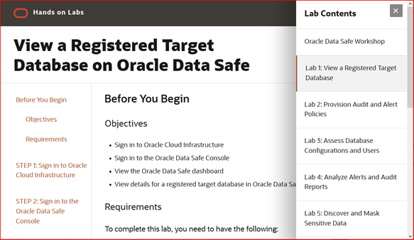

# Welcome to Oracle Data Safe Content
The workshop lets you practice the main features in Oracle Data Safe, including Activity Auditing, Data Discovery, Data Masking, User Assessment, and Security Assessment.

## Access the Workshop Using Our Web Interface
**Click the image to use our easy to navigate HTML format:**

### Access the Individual Labs on the Repo
Alternatively, you can follow the labs on this repo:
- [About this lab](./workshop/about-this-lab/about-this-lab.md)
- [View a Registered Target Database](./workshop/view-registered-target-db/view-registered-target-db.md)
- [Provision Audit and Alert Policies](./workshop/provision-audit-alert-policies/provision-audit-alert-policies.md)
- [Assess Database Configurations and Users](./workshop/assess-db-config-users/assess-db-config-users.md)
- [Analyze Alerts and Audit Reports](./workshop/analyze-alerts-audit-reports/analyze-alerts-audit-reports.md)
- [Discover and Mask Sensitive Data](./workshop/discover-mask-data/discover-mask-data.md)

## Get an Oracle Cloud Account

### Trial Account
If you don't have an Oracle Cloud account then you can quickly and easily sign up for a free trial account that provides:
- $300 of free credits good for up to 3500 hours of Oracle Cloud usage
- Credits can be used on all eligible Cloud Platform and Infrastructure services for the next 30 days
- Your credit card will only be used for verification purposes and will not be charged unless you 'Upgrade to Paid' in My Services

Click here to request your trial account: [https://cloud.oracle.com/tryit](https://cloud.oracle.com/tryit)

### Self-Paced Labs
Self-paced labs provide hands-on experience with Oracle Cloud Infrastructure in real cloud environments. You can try self-paced labs here: [https://ocitraining.qloudable.com/](https://ocitraining.qloudable.com/)
