# Assess Database Configurations and Users

## Introduction
This lab shows you how to assess database configurations and users in your database by using the User Assessment feature in Oracle Data Safe.

**Note**: The values on your screen will be different than those shown in the screenshots.

Estimated Lab Time: 30 minutes

### Objectives

In this lab, you'll:

- Sign in to the Oracle Data Safe Console
- Run a Security Assessment job against a target database
- Run a User Assessment job against a target database
- Analyze the user assessment results
- Analyze the security assessment results

### Prerequisites

To complete this lab, you need to have the following:

- An Oracle Cloud account
- Access to an Autonomous Database, sample data for Oracle Data Safe loaded into the database, and the Activity Auditing feature enabled on the database
- Access to an Oracle Data Safe service in a region of your tenancy
- Privileges to use the Activity Auditing feature on your database
- Audit collection started on your target database in Oracle Data Safe. If not, see [Provision Audit and Alert Policies](../provision-audit-alert-policies/provision-audit-alert-policies.md).

### Assumptions

- You are signed in to the Oracle Cloud Infrastructure Console. If not, refer to the prerequisites for this workshop.
- Your data values will be different than those shown in the screenshots in this lab.

## **STEP 1**: (If needed) Sign in to the Oracle Data Safe Console

- From the navigation menu in the Oracle Cloud Infrastructure Console, select **Data Safe**. The **Overview** page for the Oracle Data Safe service is displayed.

- Click **Service Console**. The **Home** page in the Oracle Data Safe Console is displayed.

## **STEP 2**: Run a Security Assessment job against a target database

You can use Security Assessment to evaluate the current security state of your target databases and receive recommendations on how to mitigate the identified risks.

- Click the **Security Assessment** tab.

- On the **Security Assessment** page, select the check box for your target database, and then click **Assess**.

  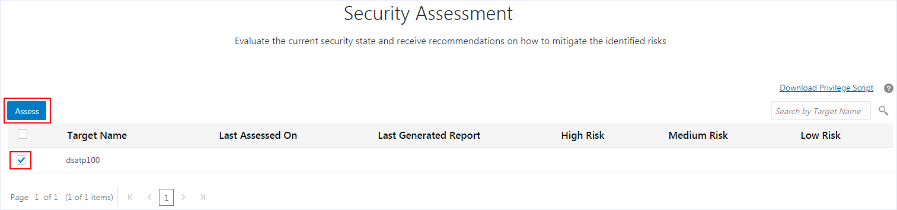

- While the assessment is running, continue to the next step. The assessment takes approximately 2-3 minutes to complete.

## **STEP 3**: Run a User Assessment job against a target database

You can use User Assessment to identify user settings and risks on your target databases.

- Click the **User Assessment** tab.

- On the **User Assessment** page, select the check box for your target database, and then click **Assess**. The assessment takes approximately 10 seconds.

  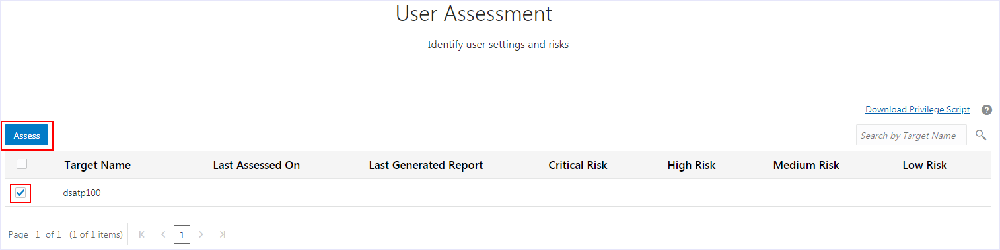

## **STEP 4**: Analyze the user assessment results

- When the user assessment is completed, notice the following on the **User Assessment** page:
    - A green check mark is displayed in the **Last Generated Report** column.
    - You can view the number of **Critical Risk**, **High Risk**, **Medium Risk**, and **Low Risk** users.

    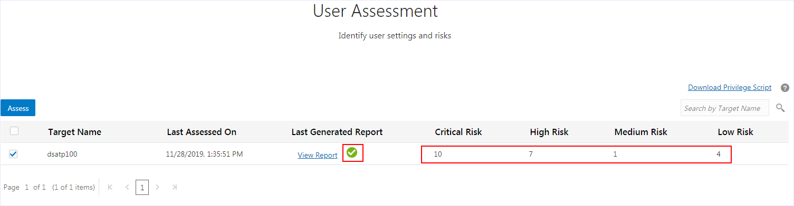

- In the **Last Generated Report** column, click **View Report**.

  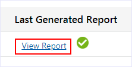

- On the **Users** page, review the 4 charts. You can click the small circles below the charts to navigate between them.

  - The **User Risk** chart shows you the percent of users who are **Critical Risk**, **High Risk**, **Medium Risk**, and **Low Risk**.

  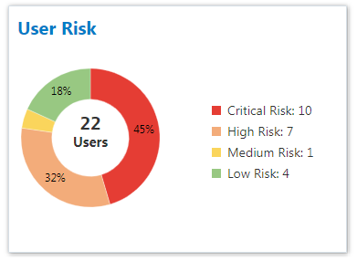

  - The **User Roles** chart shows you the number of users with the **DBA**, **DV Admin**, and **Audit Admin** roles.

    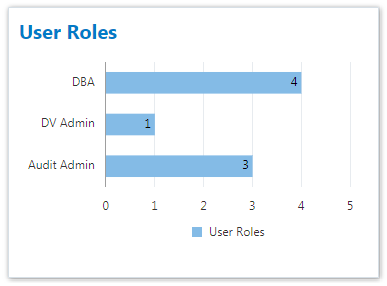

  - The **Last Password Change** chart shows you the number of users who have changed their passwords in the last 30 days, the last 30-90 days, and 90 days ago or more.

  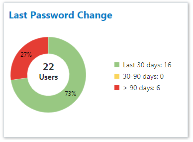

  - The **Last Login** chart shows you the number of users that signed in to the database within the last 24 hours, within the last week, within the current month, within the current year, and a year ago or more.

  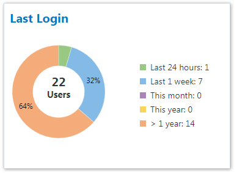

  - Review the table below the charts. This table lets you quickly identify critical and high risk users, such as DBAs, DV Admins, and Audit Admins.

  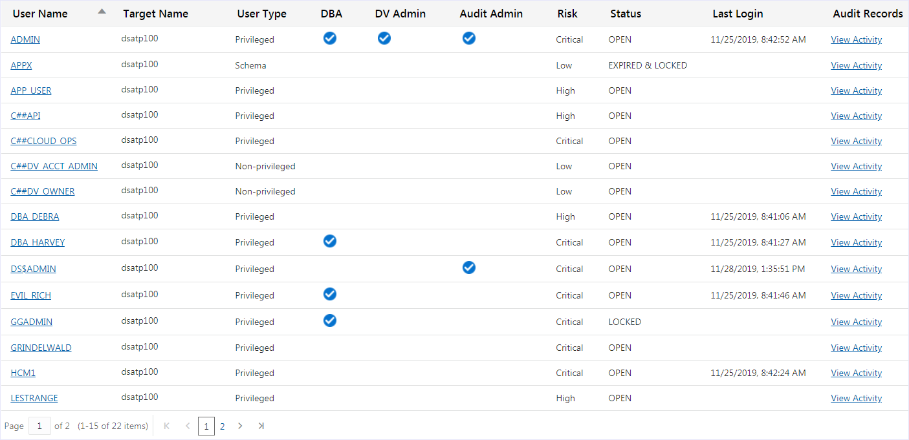

- View audit records for the `admin` user. To do that, identify the row for the 'ADMIN' user and scroll to the right. In the **Audit Records** column, click **View Activity**.

  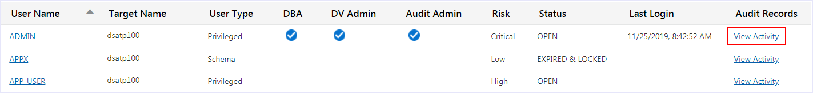

- Examine the **All Activity** report for the `ADMIN` user.
  - This report is automatically filtered to show you the audit records for the `ADMIN` user, for the past week, and for your target database.
  - At the top of the report, you can view totals for **Targets**, **DB Users**, **Client Hosts**, **Login Success**, **Login Failures**, **User Changes**, **Privilege Changes**, **DDLs**, and **DMLs**.
  - The **Event** column shows you the type of activities performed.

  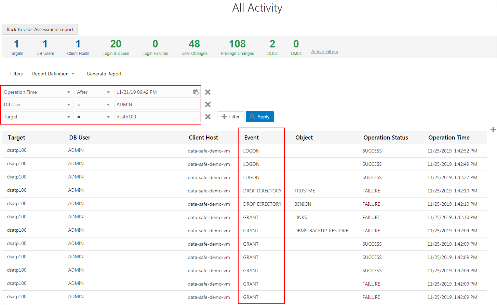

- At the bottom of the page, click the page numbers to view more audit records.

- At the top of the report, click **Back to User Assessment report**.

- At the bottom of the **User Assessment** page, click **2** to view page 2.

- Identify an expired user, and then click **View Activity** for that user to view the user's audit records. The following example shows `VOLDEMORT` as expired.

  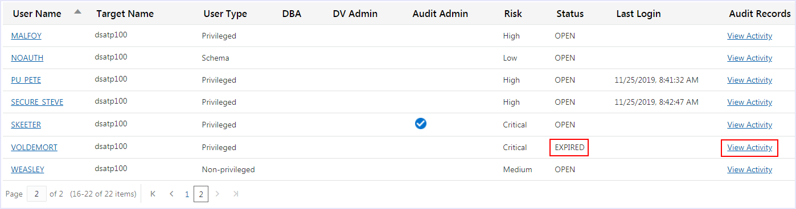

- Notice that `VOLDEMORT` has no activity on the target database. Here is a case where you might consider removing this user from the target database.

  

## **STEP 5**: Analyze the security assessment results

- Click the **Home** tab, and then click the **Security Assessment** tab.

- On the **Security Assessment** page, find out when you last assessed the security of your target database, and the number of **High Risk**, **Medium Risk**, and **Low Risk** users.

- To view the **Comprehensive Assessment** report, in the **Last Generated Report** column, click **View Report**.

- At the top of the **Comprehensive Assessment** report, you can view the target database name, when the database was assessed, and the database version.

  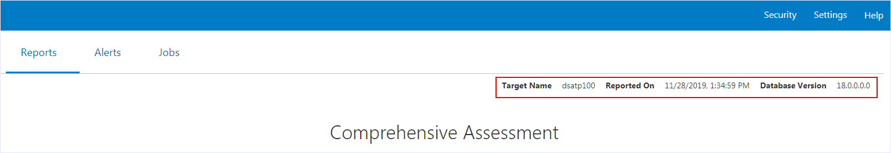

- Also at the top of the report, you can view totals for the following:
  - Risk levels (**High Risk**, **Medium Risk**, **Low Risk**, **Advisory**, **Evaluate**, and **Pass**). These totals give you an idea of how secure your database is. The risk levels are color coded to make the risk levels easier to identify.
  - **Security Controls**, **User Security**, and **Security Configurations**. These totals show you the number of findings for each high-level category in the report.

   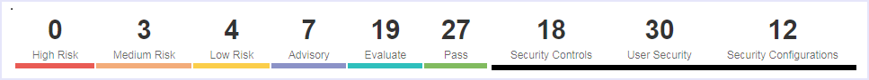

-  In the **Summary** category, you can view a table that compares the number of findings for each category and counts the number of findings per risk level. These values help you to identify areas that need attention.

  

- Expand **User Accounts** to view a list of all user accounts in the target database. You can view each user's status, profile, and tablespace; whether the user is Oracle defined; and the authentication type for the user.

  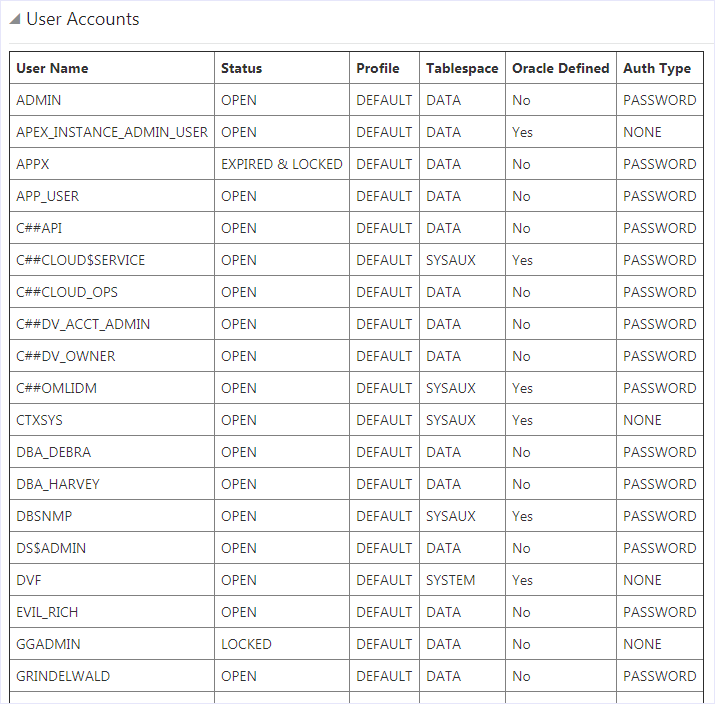

- Expand **User Profiles** to view a list of profile names, parameters, and values.

  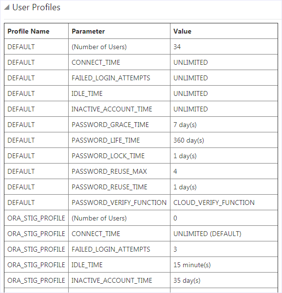

- Scroll down and expand categories. Each category lists related findings about your database and how you can make changes to improve its security.

- On the right, indicators show whether a finding is recommended by the Center for Internet Security (**CIS**), European Union's General Data Protection Regulation (**GDPR**), and/or Security Technical Implementation Guide (**STIG**). These indications make it easy for you to identify the recommended security controls.

  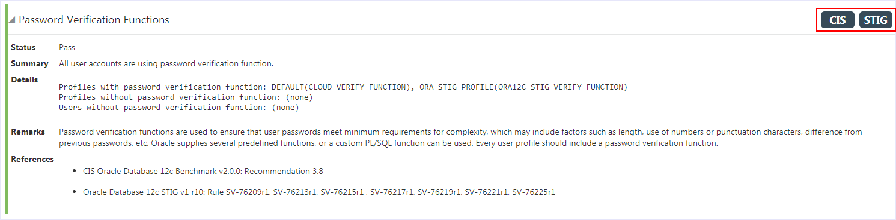

- Scroll to the top of the report. Click the various filter options and review the findings. Each filter is a toggle. For example, if you click **Medium Risk**, only medium risk findings are displayed. If you click **Medium Risk** again, the filter on is removed.

   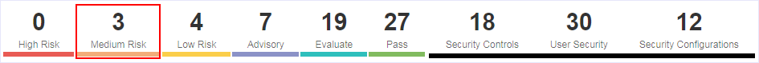

You may proceed to the next lab.

## Learn More

* [User Assessment Overview](https://docs.cloud.oracle.com/en-us/iaas/data-safe/doc/user-assessment-overview.html)
* [Security Assessment Overview](https://docs.cloud.oracle.com/en-us/iaas/data-safe/doc/security-assessment-overview.html)

## Acknowledgements
* **Author** - Jody glover, UA Developer, Oracle Data Safe Team
* **Last Updated By/Date** - Jody Glover, Oracle Data Safe Team, October 2, 2020

## Need Help?
Please submit feedback or ask for help using our [LiveLabs Support Forum](https://community.oracle.com/tech/developers/categories/livelabsdiscussions). Please click the **Log In** button and login using your Oracle Account. Click the **Ask A Question** button to the left to start a *New Discussion* or *Ask a Question*.  Please include your workshop name and lab name.  You can also include screenshots and attach files.  Engage directly with the author of the workshop.

If you do not have an Oracle Account, click [here](https://profile.oracle.com/myprofile/account/create-account.jspx) to create one.
