# Provision Audit and Alert Policies

## Introduction
This lab shows you how to provision audit and alert policies on your Autonomous Database by using the Activity Auditing feature in Oracle Data Safe.

Estimated Lab Time: 30 minutes

### Objectives

In this lab, you'll:

- Sign in to the Oracle Data Safe Console
- Provision audit and alert policies on your target database by using the Activity Auditing wizard
- View details for an audit trail
- Enable a custom audit policy on your target database

### Prerequisites

To complete this lab, you need to the following:

- An Oracle Cloud account
- Access to an Autonomous Database, sample data for Oracle Data Safe loaded into the database, and the Activity Auditing feature enabled on the database
- Access to an Oracle Data Safe service in a region of your tenancy
- Privileges to use the Activity Auditing feature on your database

### Assumptions

- This lab assumes that you are already signed in to the Oracle Cloud Infrastructure Console.

## **STEP 1**: Sign in to the Oracle Data Safe Console

- From the navigation menu in the Oracle Cloud Infrastructure Console, select **Data Safe**. The **Overview** page for the Oracle Data Safe service is displayed.

- Click **Service Console**. The Home page in the Oracle Data Safe Console is displayed.

## **STEP 2**: Provision audit and alert policies on your target database by using the Activity Auditing wizard

- In the Oracle Data Safe Console, click the **Activity Auditing** tab.

- On the **Select Targets for Auditing** page, select the check box for your target database, and then click **Continue**.

  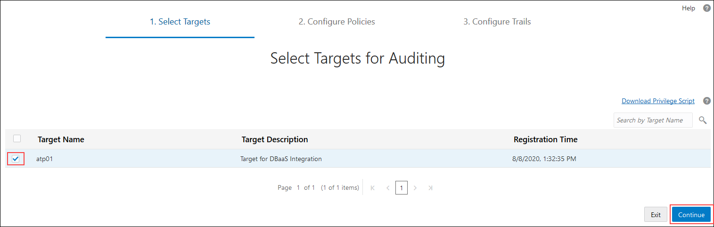

- On the **Retrieve Audit Policies** page, select the check box for your target database, and then click **Retrieve** to retrieve the currently deployed audit policies from your database.

  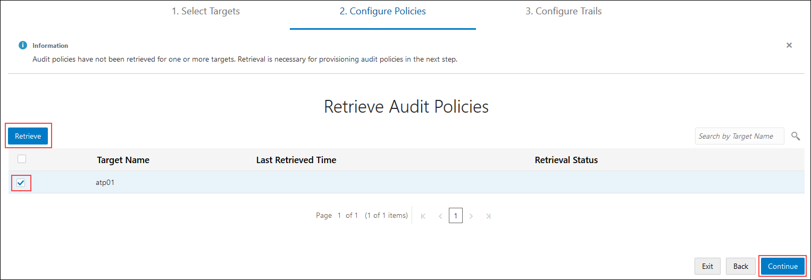

- Wait until a green check mark is displayed in the **Retrieval Status** column, and then click **Continue**. The check mark means that all of the audit policies are successfully retrieved.

  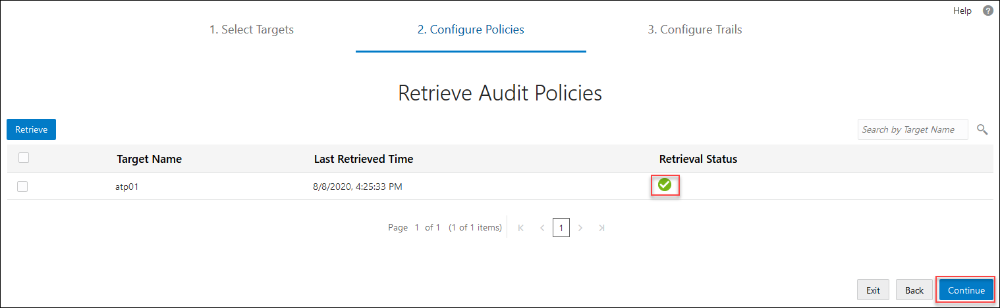

- On the **Review and Provision Audit and Alert Policies** page, review the types of audit policies already enabled on your target database, and then click your target database name to provision more policies.

  - The check mark under **Additional Policies** means that the Autonomous Database has predefined audit policies enabled on it.
  - **CIS** under **Compliance Standards** means that the Autonomous Database has the Center for Internet Security (CIS) Configuration audit policy enabled on it.
  - Currently, there are no basic, admin activity, or user activity audit policies provisioned on your target database, nor are there any alert policies.

    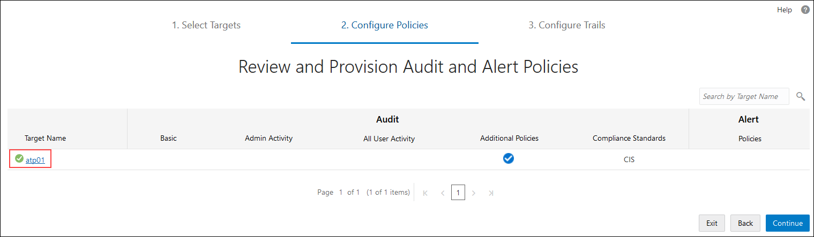

- On the **Audit Policies** tab in the **Edit Policies** dialog box, notice that the following **Basic Auditing** and **Admin Activity Auditing** policies are selected by default. Oracle recommends that you create and enable (provision) these policies. They are not provisioned by default.
    - Critical Database Activity
    - Login Events
    - Database Schema Changes (DDL)
    - Admin Activity

      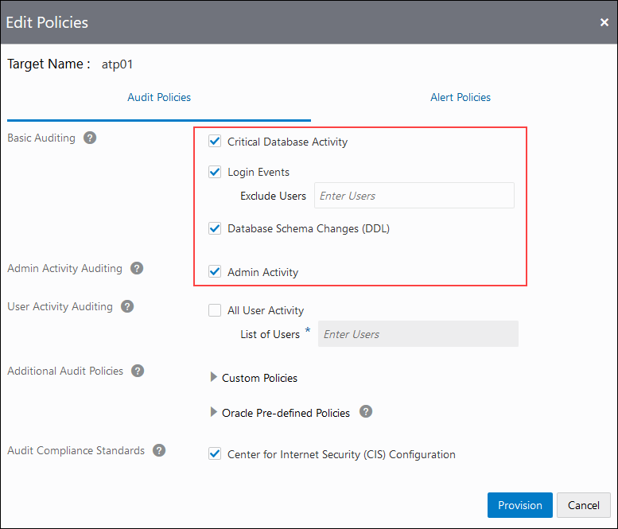

- Expand **Custom Policies**.

  - If a custom policy is selected, it means that it is already created and enabled on your target database. There is one such policy: `EMPSEARCH_SELECT_USAGE_BY_PETE`.

  - If a custom policy is deselected, it means that you can select it to enable it on your target database. There is one such policy: `APP_USER_NOT_APP_SERVER`.

   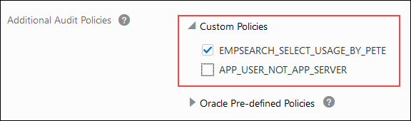

- Expand **Oracle Pre-defined Policies** to view the list of Oracle predefined audit policies available on your target database. By default, the following policies are provisioned on an Autonomous Data Warehouse with Shared Exadata Infrastructure instance:
  - `ORA_ACCOUNT_MGMT`
  - `ORA_DATABASE_PARAMETER`
  - `ORA_SECURECONFIG`
  - `ORA_DV_AUDPOL`
  - `ORA_DV_AUDPOL2`
  - `ORA_RAS_POLICY_MGMT`
  - `ORA_RAS_SESSION_MGMT`
  - `ORA_LOGON_FAILURES`
  - `COMMON_USER`
  - `ADB_ADMIN_AUDIT`
  - `ADB_MANDATORY_AUDIT`

    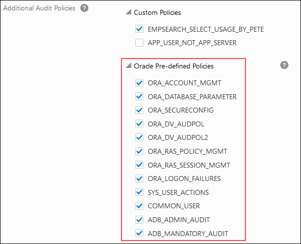

- Notice that the **Center for Internet Security (CIS) Configuration** policy is created and enabled by default.

  

- Click the **Alert Policies** tab.

  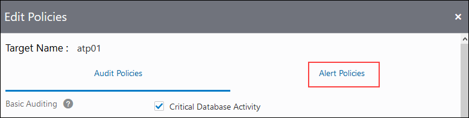

- Review the selected alert policies, and then click **Provision**. Oracle recommends that you provision all of these alert policies, which are as follows:
  - Profile Changes
  - Failed Logins by Admin User
  - Database Parameter Changes
  - Audit Policy Changes
  - Database Schema Changes
  - User Creation/Modification
  - User Entitlement Changes

  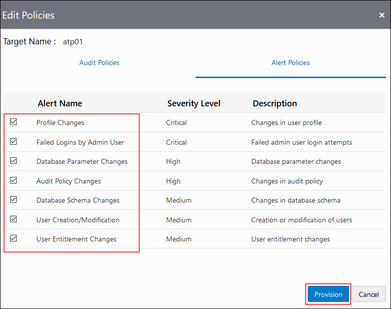  

- On the **Review and Provision Audit and Alert Policies** page, wait for check marks to appear under all audit policy types, except for **All User Activity**, and then click **Continue**.

  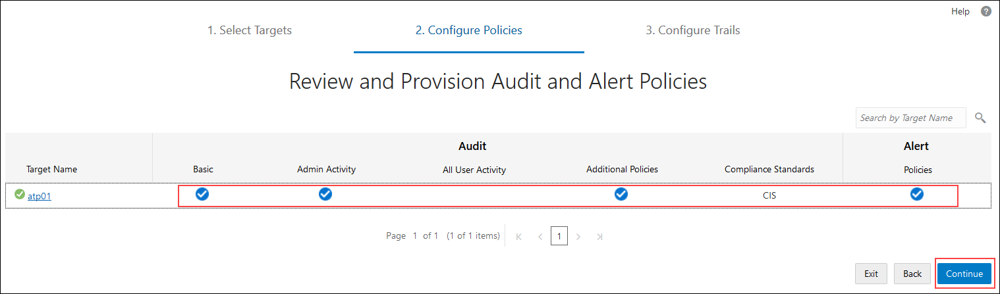  

- On the **Start Audit Collection** page, notice the following defaults:

  - The audit trail location is automatically set to `UNIFIED_AUDIT_TRAIL`.
  - Audit collection is not yet started.
  - The auto purge feature is not enabled by default.
  - You need to configure an audit collection start date.

  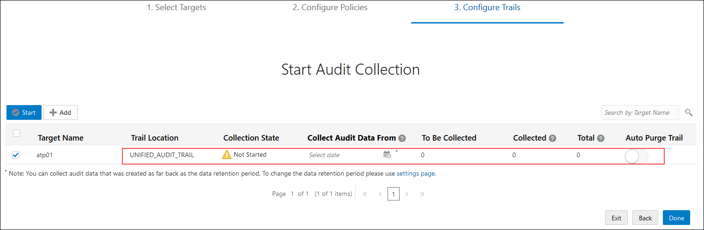  

- In the **Collect Audit Data From** column, click the calendar widget, configure a start date of 12 months ago, and then click **Done**.

  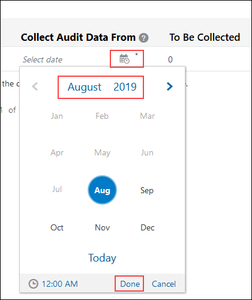  

- Wait for the **To Be Collected**, **Collected**, and **Total** columns to populate, review their values, and then click **Start** to start collecting audit data.

    

- In the **Start Audit Collection** dialog box, click **Start** to confirm that you want to start the `UNIFIED_AUDIT_TRAIL`.

  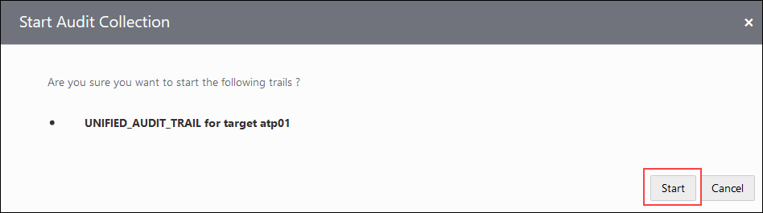  

  A message at the top of the page states the `UNIFIED_AUDIT_TRAIL` is successfully created. The **Collection State** column value changes from  `RUNNING`, `COLLECTING`, and then to `IDLE`.

  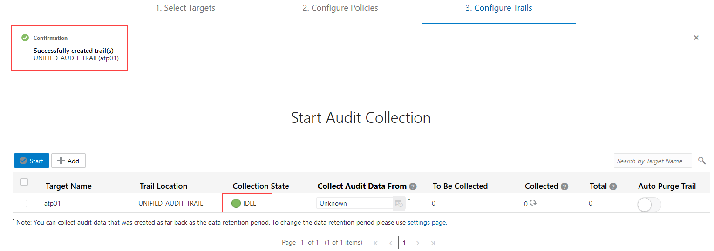  

- Click **Done**. You are directed to the **Audit Trails** page. 

    

  - On the **Audit Trails** page, you can manage all of the audit trails for your target databases.

    

## **STEP 3**: View details for an audit trail

- In the **Collection State** column on the **Audit Trails** page, click **COLLECTING** or **IDLE** if the audit data is collected.

  - Collection takes approximately 2 minutes.
  - You can continue with the lab.

    

- In the **Trail Log** dialog box, review the logs, and then click **X** to close the dialog box.

  

## **STEP 4**: Enable a custom audit policy on your target database

- Click the **Audit Policies** tab.

- On the **Review and Provision Audit and Alert Polices** page, click the name of your target database.

- In the **Edit Policies** dialog box, expand **Custom Policies**, select the `APP_USER_NOT_APP_SERVER` unified auditing policy to enable it, and then click **Provision**.

  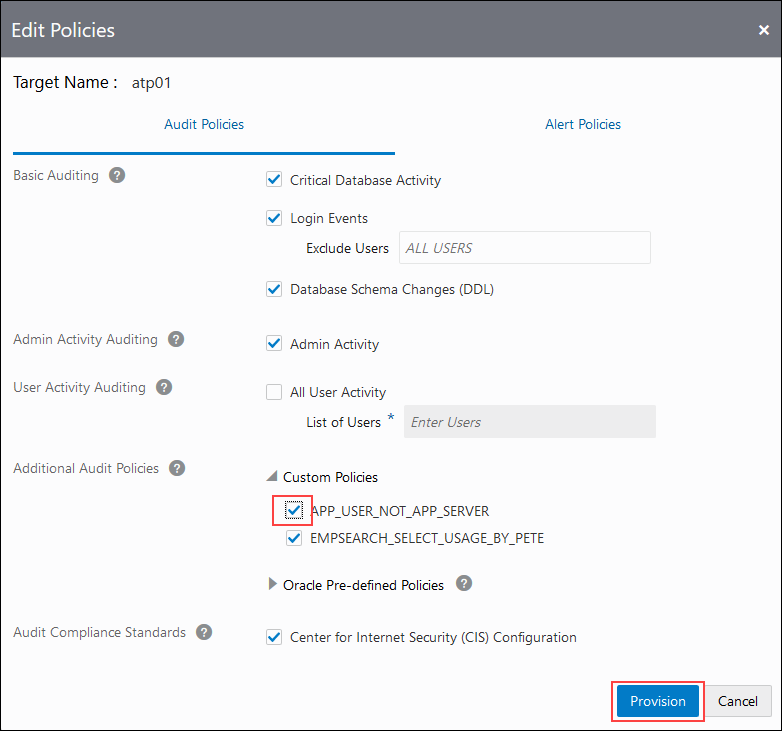

- Click the **Home** tab and review the dashboard. Notice that the **All Activity**, **Admin Activity**, **Open Alerts**, **Feature Usage**, and **Audit Trails** charts now have data.

  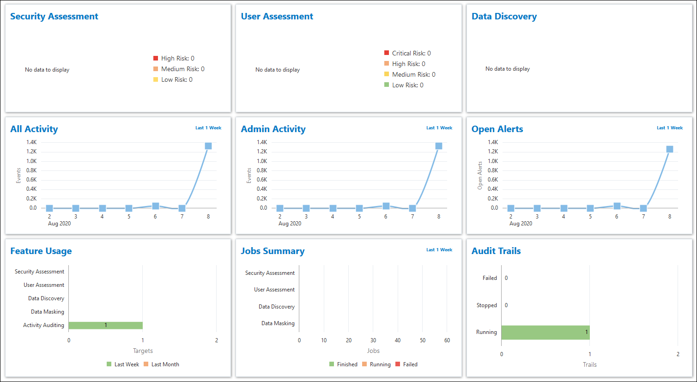

  You may proceed to the next lab.

## Learn More

  * [Activity Auditing Overview](https://docs.cloud.oracle.com/en-us/iaas/data-safe/doc/activity-auditing-overview.html)
  * [Audit Policies](https://docs.cloud.oracle.com/en-us/iaas/data-safe/doc/audit-policies.html)
  * [Create Activity Auditing Jobs](https://docs.cloud.oracle.com/en-us/iaas/data-safe/doc/create-activity-auditing-jobs.html)

## Acknowledgements
  * **Author** - Jody glover, UA Developer, Oracle Data Safe Team
  * **Last Updated By/Date** - Jody Glover, Oracle Data Safe Team, October 2, 2020

## See an issue?
  Please submit feedback using this [form](https://apexapps.oracle.com/pls/apex/f?p=133:1:::::P1_FEEDBACK:1). Please include the *workshop name*, *lab* and *step* in your request.  If you don't see the workshop name listed, please enter it manually. If you would like for us to follow up with you, enter your email in the *Feedback Comments* section.
