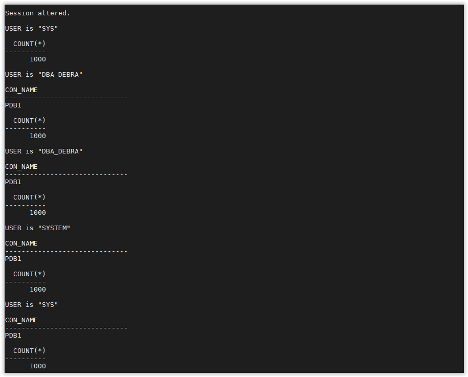
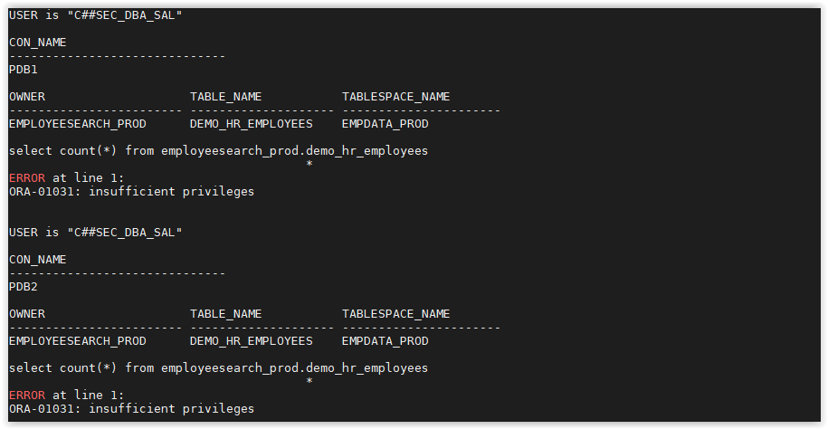

# Database Vault

## Introduction
In the Database Vault Exercises below, you will become familiar with all features and components and how you can use them protect your Oracle Databases.

Estimated Lab Time: 40 minutes

### Objectives
- Enable Database Vault in the container and `PDB1` pluggable database.
- Protect sensitive data using a Database Vault realm
- Safeguard service accounts using Trusted Path
- Test Database Vault Controls with Simulation mode
- Protect pluggable databases from Container Admins

### Prerequisites
This lab assumes you have:
- An Oracle Free Tier or Paid Cloud account (Always Free is not supported)
- SSH Keys
- Have successfully connected to the workshop machine

## **STEP 1**: Enable Database Vault

1. Open a SSH session on your DBSec-Lab VM as Oracle User

      ````
    <copy>sudo su - oracle</copy>
      ````

2. Go to the scripts directory

      ````
      <copy>cd $DBSEC_HOME/workshops/Database_Security_Labs/Database_Vault/Enable_Database_Vault</copy>
      ````

3. Start by enabling Database Vault in the container database.

      ````
      <copy>./01_config_enable_dv_on_cdb.sh</copy>
      ````

   

   **Note**: To enable DB Vault, database will be rebooted!

4. Next, enable it on the pluggable database. For now, just enable it on pdb1.

      ````
      <copy>./02_config_enable_dv_on_pdb.sh pdb1</copy>
      ````

   Now you will see a status like this:

   

5. Now, Database Vault is enabled in the container database as well as `PDB1`!

## **STEP 2**: Create a Simple Realm

1. Open a web browser and launch the Glassfish app by navigating to this URL:

   http://`<YOUR_DBSEC-LAB_VM_PUBLIC_IP>`:8080/hr\_prod\_pdb1

2. Login to the application as `hradmin` / `Oracle123`

3. Click **Search Employee**

4. Click [**Search**]

5. Open a SSH session on your DBSec-Lab VM as Oracle User

      ````
      <copy>sudo su - oracle</copy>
      ````

6. Go to the scripts directory

      ````
      <copy>cd $DBSEC_HOME/workshops/Database_Security_Labs/Database_Vault/Simple_Realm</copy>
      ````

7. Run the command to view the details about the Glassfish session

      ````
      <copy>./01_query_employee_data.sh</copy>
      ````

   

8. Now, create the Realm

      ````
      <copy>./02_create_realm.sh</copy>
      ````

   

9. Add objects to the Realm to protect

      ````
      <copy>./03_add_objects_to_realm.sh</copy>
      ````

   

10. Make sure you have an authorized user in the realm. In this step, we will add `EMPLOYEESEARCH_PROD` as a realm authorized owner.

    ````
    <copy>./04_add_auth_to_realm.sh</copy>
    ````

    

11. Re-execute the SQL query to show that SYS now receives the `insufficient privileges` error message

    ````
    <copy>./05_query_employee_data.sh</copy>
    ````

    

12. When you have completed this lab, you can drop the Realm

    ````
    <copy>./06_drop_realm.sh</copy>
    ````

## **STEP 3**: Create a Trusted Path / Multi-factor Authorization

1. Open a web browser and launch the Glassfish app by navigating to this URL:

   http://`<YOUR_DBSEC-LAB_VM_PUBLIC_IP>`:8080/hr\_prod\_pdb1

2. Login as **hradmin** / **Oracle123**

3. Click **Search Employee**

4. Click [**Search**]

5. Open a SSH session on your DBSec-Lab VM as Oracle User

      ````
      <copy>sudo su - oracle</copy>
      ````

6. Go to the scripts directory

      ````
      <copy>cd $DBSEC_HOME/workshops/Database_Security_Labs/Database_Vault/Trusted_App_Path</copy>
      ````

7. Next, run this query to view the session information associated with the Glassfish application

      ````
      <copy>./01_query_employeesearch_usage.sh</copy>
      ````

   

8. Now, query the `EMPLOYEESEARCH_PROD.DEMO_HR_EMPLOYEES` table as `SYS` to demonstrate it is accessible

      ````
      <copy>./02_query_employeesearch.sh</copy>
      ````

   

9. Begin protecting the application credentials by creating a Database Vault Rule

      ````
      <copy>./03_create_rule.sh</copy>
      ````

   

10. We use the Database Vault Rule by adding it to a DV Rule Set. You can have one or more rules in the rule set.
   If you have more than one, you can choose between the rule set evaluating all rules must be true or *any* rule must be true. Think of it like the difference between `IN` and `EXISTS` - `IN` includes all while `EXISTS` stops once it identifies one result matches.

    ````
    <copy>./04_create_rule_set.sh</copy>
    ````

    

11. Create a Command Rule on Connect to protect the `EMPLOYEESEARCH_PROD` user. You can only `CONNECT` AS `EMPLOYEESEARCH_PROD` if you match the Rule Set we created.

    ````
    <copy>./05_create_command_rule.sh</copy>
    ````

    

12. Go to your web browser and refresh a few times and run some queries by clicking [Search] and explore employee data

13. Go back to your terminal session and re-run our query of the application usage to verify that it still works.

    ````
    <copy>./06_query_employeesearch_usage.sh</copy>
    ````

    

14. Now, try to query the `DEMO_HR_EMPLOYEES` table as `SYS`. You should be blocked!

    ````
    <copy>./07_query_employeesearch.sh</copy>
    ````

    

15. Once you have successfully completed the lab, you can delete the Command Rule, Rule Set, and Rule from Database Vault

    ````
    <copy>./08_delete_trusted_path.sh</copy>
    ````

    

## **STEP 4**: Simulation Mode

1. Open a SSH session on your DBSec-Lab VM as Oracle User

      ````
      <copy>sudo su - oracle</copy>
      ````

2. Go to the scripts directory

      ````
      <copy>cd $DBSEC_HOME/workshops/Database_Security_Labs/Database_Vault/Simulation_Mode</copy>
      ````

3. First, query the simulation log to show that it has no current values

      ````
      <copy>./01_query_simulation_log.sh</copy>
      ````

   

4. Next, create a command rule that will simulate blocking all connections to the database. This is an easy way for us to identify who is connecting and where they are connecting from.

      ````
      <copy>./02_command_rule_sim_mode.sh</copy>
      ````

   

5. Execute a script to create some db connections and generate some log entries

      ````
      <copy>./03_run_queries.sh</copy>
      ````

   

6. Now, we query the simulation log again to see what new entries we have. Remember we created a command rule to simulate blocking user connections!

      ````
      <copy>./04_query_simulation_log.sh</copy>
      ````

   

   The log shows all the users who connected and would have been blocked by the rule. It also shows where they connected from and what client they used to connect.

7. Run this script to get a list of distinct usernames

      ````
      <copy>./05_distinct_users_sim_log.sh</copy>
      ````

   

8. Although we only used Simulation mode on a CONNECT rule, we could have used this on a Realm to show what violations we would had.

9. Before moving to the next lab, we will remove the command rule and clean out the log

      ````
      <copy>./06_purge_sim_log.sh</copy>
      ````

      ````
      <copy>./07_drop_command_rule.sh</copy>
      ````

## **STEP 5**: Ops Control

1. Open a SSH session on your DBSec-Lab VM as Oracle User

      ````
      <copy>sudo su - oracle</copy>
      ````

2. Go to the scripts directory

      ````
      <copy>cd $DBSEC_HOME/workshops/Database_Security_Labs/Database_Vault/Ops_Control</copy>
      ````

3. Check the status of Database Vault and Operations Control.
   Note that it is not yet configured.

      ````
      <copy>./01_query_dv_status.sh</copy>
      ````

   

4. Next, we will run the same queries as both container admin, SAL as well as DBA_DEBRA. Note that the query results are the same. The common user SAL has access to data in the PDB, just as the pdb admin has.

      ````
      <copy>./02_query_w_pdb_debra.sh</copy>
      ````

   

      ````
      <copy>./03_query_with_sal.sh</copy>
      ````

   

5. Enable Database Vault 19c Operations Control and run the queries again.
   Notice who can and who cannot query the `EMPLOYEESEARCH_PROD` schema data now.
   SAL should no longer be able to access data.

      ````
      <copy>./04_enable_ops_control.sh</copy>
      ````

   

      ````
      <copy>./05_query_dv_status.sh</copy>
      ````

   

      ````
      <copy>./06_query_w_pdb_debra.sh</copy>
      ````

   

      ````
      <copy>./07_query_with_sal.sh</copy>
      ````

   


6. When you are have completed this lab, disable Ops Control

      ````
      <copy>./08_disable_ops_control.sh</copy>
      ````

   

## **STEP 6**: Disabling Database Vault

1. Open a SSH session on your DBSec-Lab VM as Oracle User

      ````
      <copy>sudo su - oracle</copy>
      ````

2. Go to the scripts directory

      ````
      <copy>cd $DBSEC_HOME/workshops/Database_Security_Labs/Database_Vault/Disable_Database_Vault</copy>
      ````

3. Disable the pluggable database pdb1

      ````
      <copy>./01_config_disable_dv_on_pdb.sh pdb1</copy>
      ````

   You should see a status like this:

   

4. Now, Disable Database Vault in the container database

      ````
      <copy>./02_config_disable_dv_on_cdb.sh</copy>
      ````

   

   **Note**: To disable DB Vault, database will be rebooted!

5. Now, Database Vault is disabled in the container database as well as `PDB1`!

## Acknowledgements
- **Author** - Hakim Loumi, Database Security PM
- **Contributors** - Gian Sartor, Principal Solution Engineer, Database Security
- **Last Updated By/Date** - Kamryn Vinson, September 2020

## See an issue?
Please submit feedback using this [form](https://apexapps.oracle.com/pls/apex/f?p=133:1:::::P1_FEEDBACK:1). Please include the *workshop name*, *lab* and *step* in your request.  If you don't see the workshop name listed, please enter it manually. If you would like for us to follow up with you, enter your email in the *Feedback Comments* section.