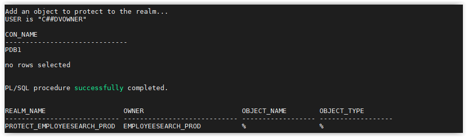

## Simple Realm on EMPLOYEESEARCH_PROD Schema

A very simple Database Vault Realm to protect the `EMPLOYEESEARCH_PROD` schema and all of it's objects.

This lab will require you to use the **Glassfish App** to generate traffic and to verify your results.

Open a web browser and launch the Glassfish app by navigating to this URL:

   http://<YOUR_DBSEC-LAB_VM_PUBLIC_IP>:8080/hr_prod_pdb1
    
Login to the application as `hradmin` / `Oracle123`

Click **Search Employee**

Click [**Search**] 

Open a SSH session on your DBSec-Lab VM as Oracle User

````
<copy>sudo su - oracle</copy>
````

Go to the scripts directory

````
<copy>cd $DBSEC_HOME/workshops/Database_Security_Labs/Database_Vault/Simple_Realm</copy>
````

Run the command to view the details about the Glassfish session

````
<copy>./01_query_employee_data.sh</copy>
````

    
    
Now, create the Realm 

````
<copy>./02_create_realm.sh</copy>
````

    

Add objects to the Realm to protect

````
<copy>./03_add_objects_to_realm.sh</copy>
````

   

Make sure you have an authorized user in the realm. In this lab, we will add `EMPLOYEESEARCH_PROD` as a realm authorized owner

````
<copy>./04_add_auth_to_realm.sh</copy>
````

   

Re-execute the SQL query to show that SYS now receives the `insufficient privileges` error message

````
<copy>./05_query_employee_data.sh</copy>
```` 

   

When you have completed this lab, you can drop the Realm

````
<copy>./06_drop_realm.sh</copy>
````
