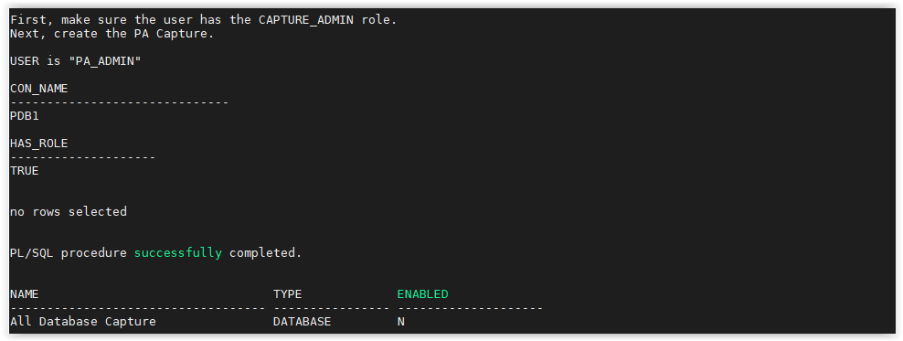

# [Lab] Basics: Capture and Report

- Open a SSH session on your DBSec-Lab VM as Oracle User

        sudo su - oracle

- Go to the scripts directory

        cd $DBSEC_HOME/workshops/Database_Security_Labs/Privilege_Analysis/Simple_PA_Lab

- Start by ensuring the user has the `CAPTURE_ADMIN` role and creating the PA Capture

		./01_start_pa_capture.sh

    

- Next, start the capture. This will start collecting all of the privileges and/or roles that are being used

		./02_start_capture.sh

    

- Generate some workload so we have used and unused roles and privileges

		./03_generate_workload.sh

- We can disable the capture when we feel we have enough data

		./04_disable_capture.sh

    

- This next step is where the work happens. This can take a few minutes to generate. Generating the report takes all of the privileges and roles that were identified as used during the capture and compares it to the roles and privileges granted to each user. 

		./05_generate_report.sh

    

- Next, view the report results by querying the views associated with the capture output

		./06_review_report.sh

    

- Once we have reviewed our report and we are comfortable with Privilege Analysis, we can drop the capture we created

		./07_drop_capture.sh

    
 

---
**CONGRATULATIONS... YOU HAVE SUCCESSFULLY COMPLETED THIS EXCERCISE!**

---
Move up one [directory](../README.md)

Click to return [home](/README.md)
