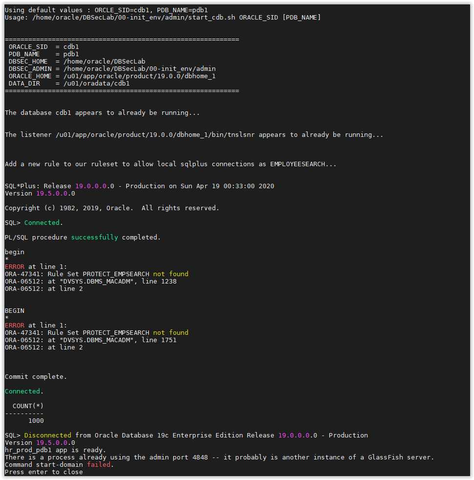
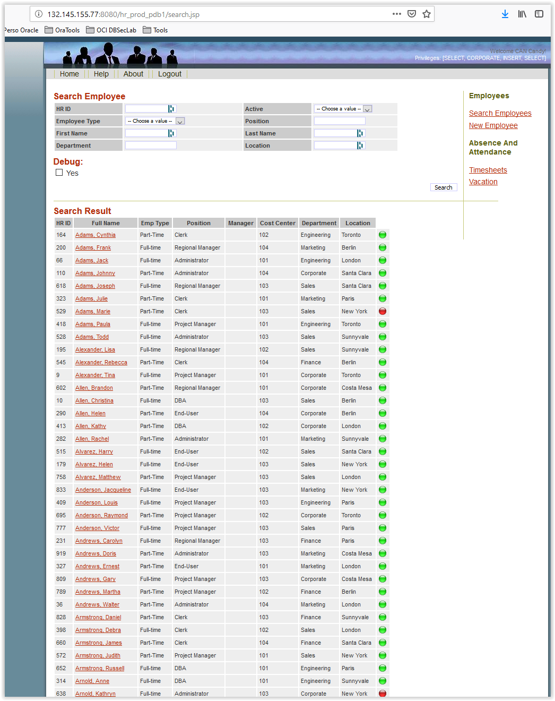
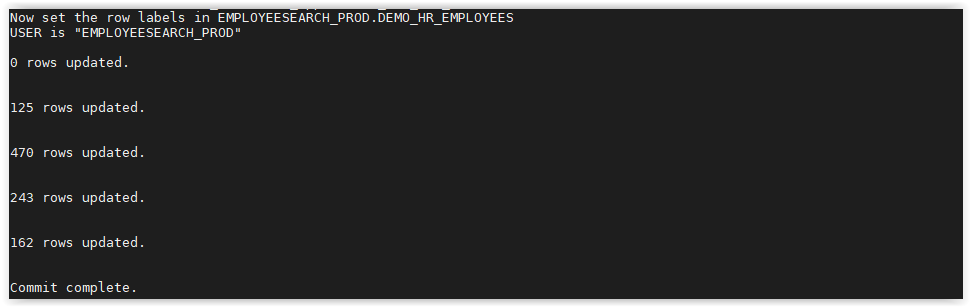
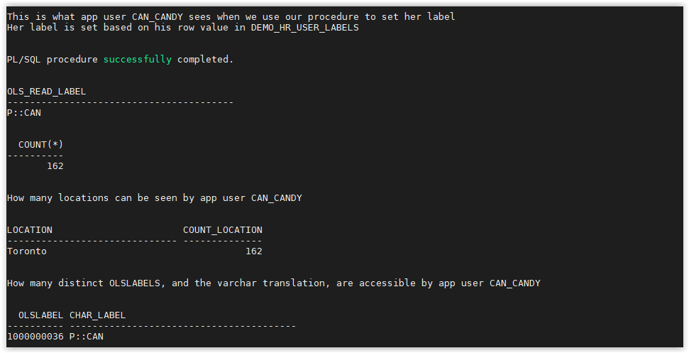
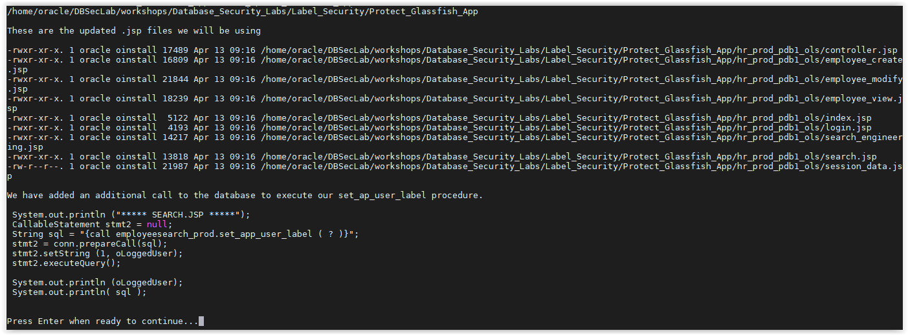
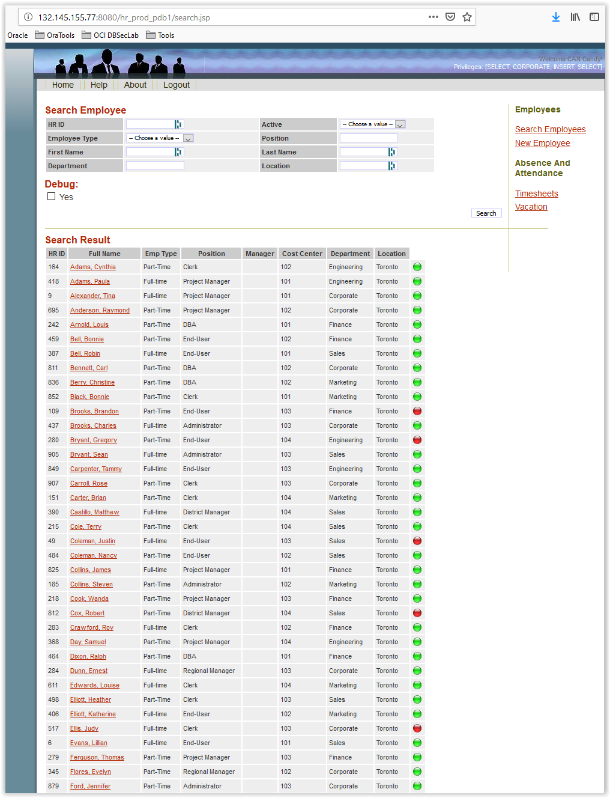
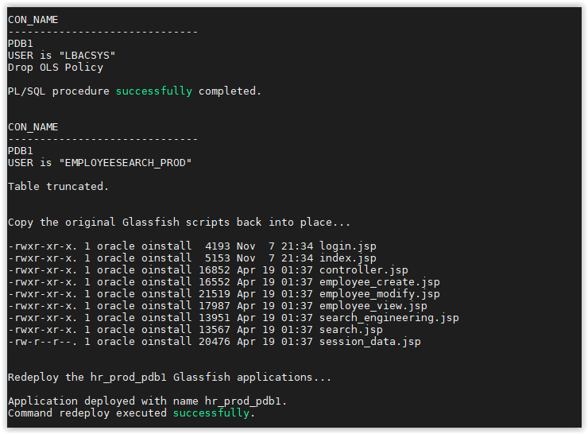

# [Lab] Protect Glassfish Application

This lab will use the Glassfish HR application and protect it with Oracle Label Security. It will make small modifications to the application's JSP files to set the user session during login.
  

- Open a SSH session on your DBSec-Lab VM as Oracle User

        sudo su - oracle

- Go to the scripts directory

        cd $DBSEC_HOME/workshops/Database_Security_Labs/Label_Security/Protect_Glassfish_App

- First, starts the infrastructure and makes sure you don't already have the OLS changes deployed to the application

		./00_start_infrastructure.sh

	

- Next, setup the OLS environment

		./01_setup_ols_environment.sh

	

	---
	**Note:** This script creates the OLS policy named `OLS_DEMO_HR_APP` as well as the levels (Public, Confidential, Highly Confidential), compartments (HR, FIN, IP, IT) and the OLS groups (GLOBAL, USA, CANADA, EU, GERMAN, LATAM).  This script also generates the data labels that will be used. This allows us to assign the numbers to our `label_tag` we want to have.  

	---

- Create `EMPLOYEESEARCH_APP`

		./02_configure_employeesearch_app.sh

	

	---
	**Note:** This script will create a custom table for the Application User Labels, `EMPLOYEESEARCH_PROD.DEMO_HR_USER_LABELS`, and populate it with all of the rows from `EMPLOYEESEARCH_PROD.DEMO_HR_USERS`.  The script will also create a few additional users we will use in this exercise, such as CAN_CANDY, EU_EVAN, and then grant the appropriate OLS User Labels to all of the Application Users. 

	---
	
- Open a web browser and launch the Glassfish app by navigating to this URL:

        http://<YOUR_DBSEC-LAB_VM_PUBLIC_IP>:8080/hr_prod_pdb1
    
	- Login to the application as `can_candy` / `Oracle123`
	- Select "**Search Employees**" and click [**Search**]
	- See the result before enabling OLS policy

		

	- Logout and do the same thing as `eu_evan` / `Oracle123`

		

		---
		**Note**: You can see all employees data with no geographic restriction

		---

- Go back to your terminal session and apply the OLS policy to the `EMPLOYEESEARCH_PROD.DEMO_HR_EMPLOYEES` table

		./03_apply_ols_policy.sh

	

	---
	**Note:** Once an OLS policy is applied to a table, only users with authorized labels, or OLS privileges, can see data.

	---
	
- Now, update `EMPLOYEESEARCH_PROD.DEMO_HR_EMPLOYEES` table to populate the `olslabel` column with the appropriate OLS numeric label
	
		./04_set_row_labels.sh

	

	---
	**Note:** We will dot his based on the `location` column in the table. For example, 'German' or 'Berlin' will receive an OLS label of 'P::GER' because they belong to the GERMANY group.

	---

- See what policy output looks like...
	
		./05_verify_our_policy.sh

	

	...and go through the data to demonstrate the different data labels and how they are displayed based on the "application user" that is accessing it:

	- for the DB USer, and schema owner `EMPLOYEESEARCH_PROD`
	
		

	- for the App User `HRADMIN`
	
		

	- for the App User `EU_EVAN`

		

	- for the App User `CAN_CANDY`

		
	
- Finally, we make changes to the Glassfish JSP files. 
This script will step you through all of the additions we need to make
	
		./06_Update_Glassfish_app.sh
	
	
	

- Go back to your web browser and launch the Glassfish app by navigating to this URL:

        http://<YOUR_DBSEC-LAB_VM_PUBLIC_IP>:8080/hr_prod_pdb1
    
	- Login to the application as `can_candy` / `Oracle123`
	- Select "**Search Employees**" and click [**Search**]
	- See the result after enabling OLS policy

		

	- Logout and do the same thing as `eu_evan` / `Oracle123`

		

		---
		**Note**: Now, you will see there is a difference from before. 
		`can_candy` can only see Canadian-labeled users and `eu_evan` can only see EU-labeled users!

		---

- When you have completed the lab, you can remove the policies and restore the Glassfish JSP files to their original state

		./09_Remove_Policies_and_Restore.sh

	

---
Move up one [directory](../README.md)

Click to return [home](/README.md)
