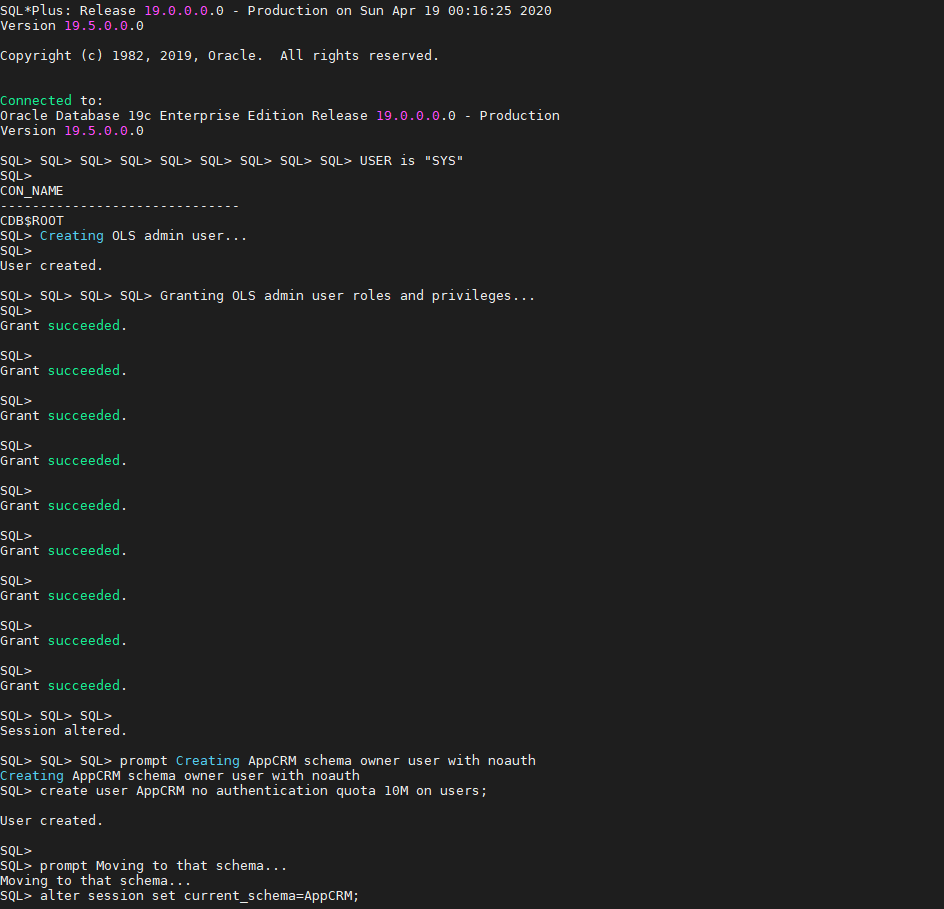
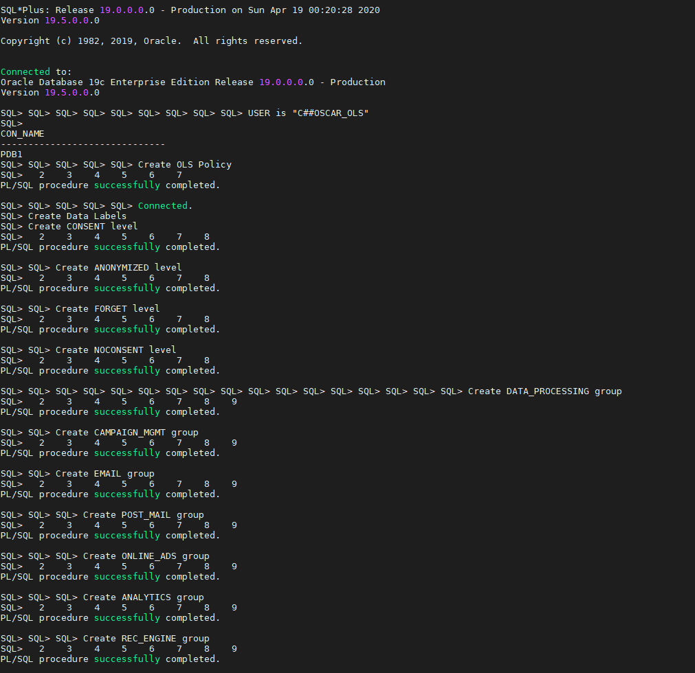
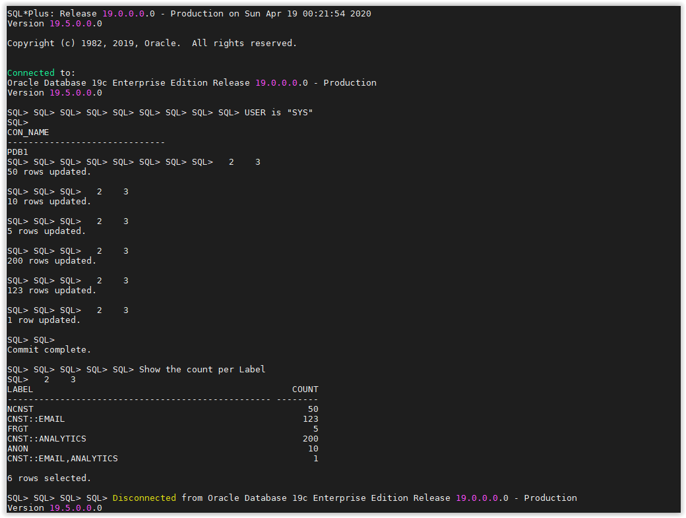
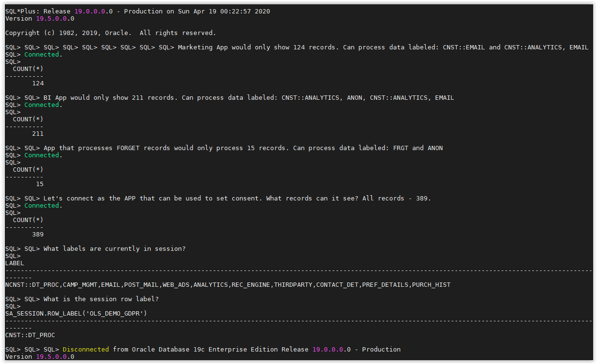
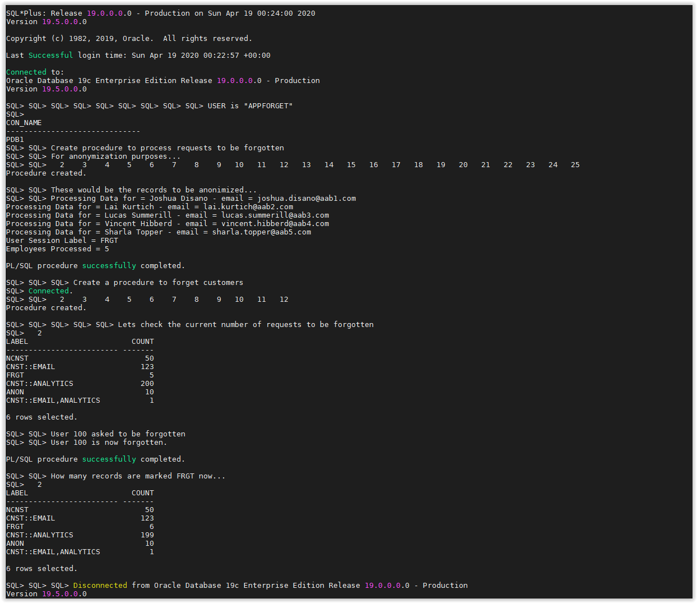
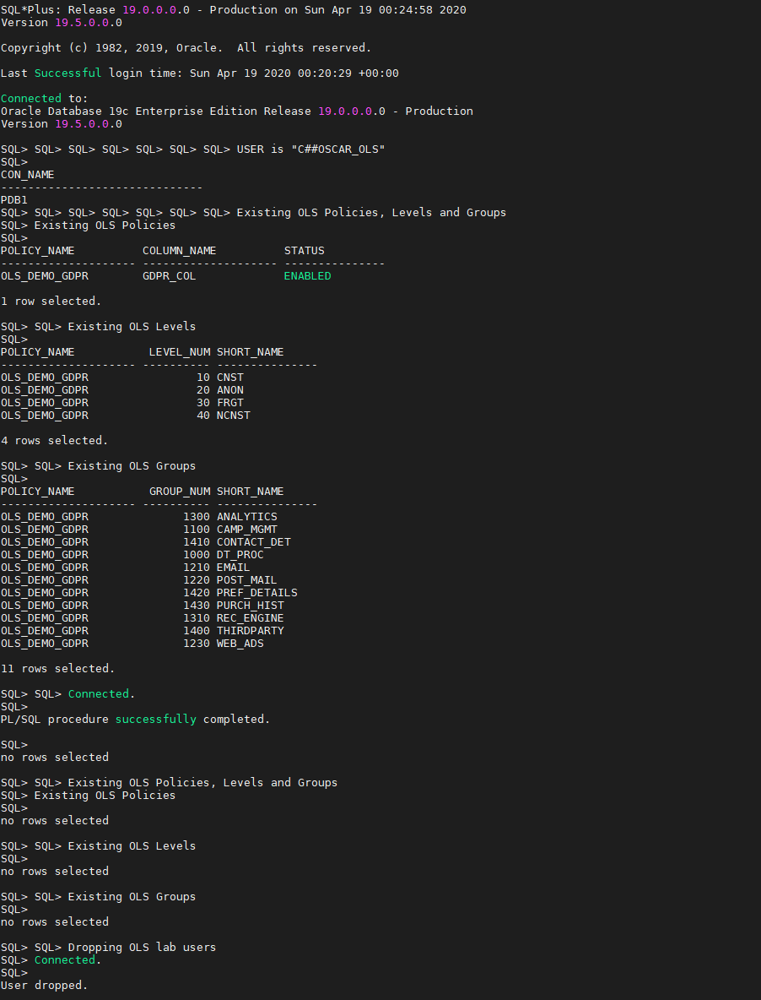

# [Lab] Simple CRM Application

## Scope
The objective of this lab is to provide guidance on how Oracle Label Security could be used to help tracking consent and enforce restriction of processing under the General Data Protection Regulation requirements. Different OLS strategies could be taken to achieve similar functionality. The details provided here are merely to serve as an example.  

## Scenario
Under GDPR there is the need to collect explicit consent from users, on how their data can be processed. There is the need to track consent. Based on granted consent, users/customers expect that their data is processed just for the purposes they have granted consent. This is known, under GDPR, “enforce restriction of processing”.

In this Hands-on lab, we will be demonstrating how Label Security could help customers to track consent and enforce restriction of processing based on OLS Levels and Groups. For that, we simulate that we have 4 applications.

### Different applications have different purposes:

**User App:** Application where users sets their preferences for consent to marketing, processing data or asks to be forgotten. Runs with User Label: NCNST::DP – Uses Database user: APPPREFERENCE.

**Email Marketing:** Application that can only access users that have consented to process their data and specifically for email marketing. Runs with User Label: CONS::EMAIL – Uses Database user: APPMKT.

**Business Intelligence:** Application that can access all users who have consented to process their data. Runs with User Label: CONS::DP – Uses Database user: APPBI.

**Anonymizer:** Batch process to anonmyize user records and set the data label to ANON::. Runs with User Label: FORGET:: - Uses Database user: APPFORGET.
  

## How to walk through the lab

While we provide scripts to execute the whole lab from start to finish in an automated fashion, it is strongly recommended that you open one by one and copy/execute the code blocks one by one. This way you’ll get a better understanding of the building blocks of this exercise. In case you decide to execute script by script, you can always review the log files (.out) for the details.

---
- Open a SSH session on your DBSec-Lab VM as Oracle User

        sudo su - oracle

- Go to the scripts directory

        cd $DBSEC_HOME/workshops/Database_Security_Labs/Label_Security/Simple_CRM_App

- First, you must setup the Label Security environment

        ./01_setup_ols_environment.sh

    

    For each step, you can review the output of the script that you executed.  
    For example `more 01_setup_ols_environment.out`

    ---
    **Note:**
    - This script creates c##oscar_ols user, creates a table, loads data, creates users that will be used to showcase difference scenarios. It also configures and enables OLS. 
    - This sql script invoke **load_crm_customer_data.sql** script to create the table `CRM_CUSTOMER` in `APPCRM` schema and inserts 389 rows.
    
    ---

- Next, you create the Label Security policy. 
A policy consists of  levels, groups and/or compartments. The only mandatory component of a policy is at least one level.   

        ./02_create_ols_policy.sh
  
    
    ---
    **Note:** This script will create Policy (Levels, Groups, and Labels), set Levels and Groups for Users, and apply the Policy to the `APPCRM.CRM_CUSTOMER` table

    ---

 - Then, we must label the data. 
 We use the policy we created and apply one level and optionally, one or more compartments and, optionally, one or more groups.
 
        ./03_label_data.sh
    
    
    ---
    **Note:** This script update data labels to create some diversity of labels that will be used in the scenarios. In real world scenarios would be advisable to create a labeling function that would assign labels based on other existing table data (other columns).

    ---

- Then we will see the label security in action

        ./04_label_sec_in_action.sh
    
    
    ---
    **Note:** This script connects as different apps would be connecting. Each App would only see records that they would be able to process. E.g. AppMKT (app that is used for emailing customers) would only be able to see records labeled as CNST::EMAIL; AppBI would be able to see records labeled as ANON, and CNST::ANALYTICS (rows labeled with level CNST, and part of Group Analytics – would work for CNST::ANALYTICS,EMAIL as well.)

    ---

- Now, we change users status to be forgotten

        ./05_to_be_forgotten.sh
    
    
    ---
    **Note:** This script simulates an app that would process records marked to be forgotten. It creates a stored procedure to show records marked to be Forgotten (labeled FRGT::). It also creates a procedure under an AppPreference app schema that would serve the purpose of forgetting a certain customer. AppPreference can access all data and forget_me(p_id) procedure will label a certain customerid row FRGT:: “moving” a record from Consent to Forgotten.

    ---

- Finally, we can clean up the environment (drops the OLS policy and users)

        ./06_clean_env.sh

    
---
Move up one [directory](../README.md)

Click to return [home](/README.md)
