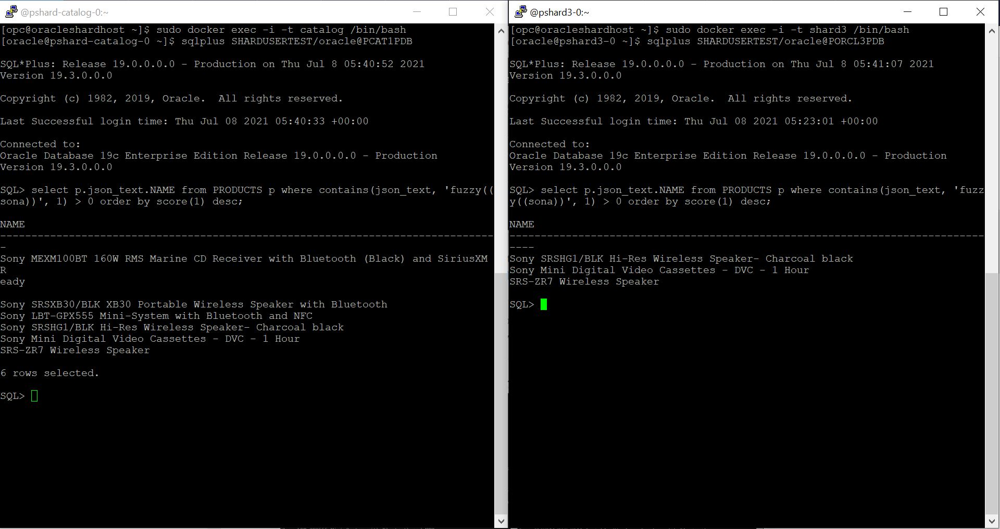
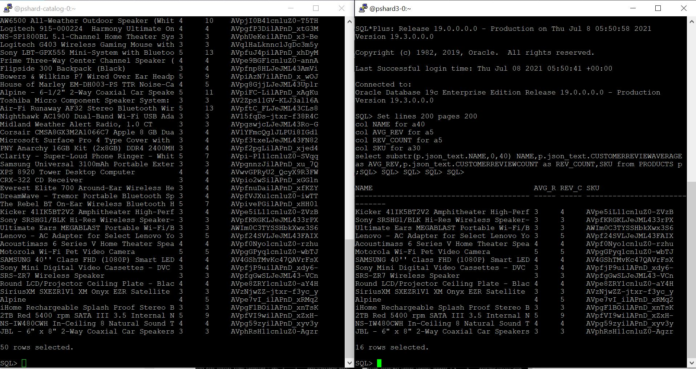

# Application Queries on a sharded Database

## Introduction   
Run each SQL query by logging in to the shard catalog database as well as one of the shard databases. You can observe the difference in row count on the shard catalog compared to the shard-database (porcl1cdb\_porcl1pdb, porcl2cdb\_porcl2pdb and porcl3cdb\_porcl3pdb).

*Estimated Lab Time*: 20 Minutes

### Objectives
In this lab, you will:
* Try running your queries on already loaded data.

### Prerequisites
This lab assumes you have:
- A Free Tier, Paid or LiveLabs Oracle Cloud account
- SSH Private Key to access the host via SSH
- You have completed:
    - Lab: Generate SSH Keys (*Free-tier* and *Paid Tenants* only)
    - Lab: Prepare Setup (*Free-tier* and *Paid Tenants* only)
    - Lab: Environment Setup
    - Lab: Initialize Environment

## **STEP 1**: Establish connection to Catalog and to one of the Shards.

1. Open a terminal and execute below as **opc** user to connect to **Catalog**.

    ```
    <copy>
    sudo docker exec -i -t catalog /bin/bash
    </copy>
    ```

    ```
    <copy>
    sqlplus SHARDUSERTEST/oracle@PCAT1PDB
    </copy>
    ```

2. Open another terminal and execute below as **opc** user to connect to one of the shards. In this    case, you will connect to **shard3** as below.

    ```
    <copy>
    sudo docker exec -i -t shard3 /bin/bash
    </copy>
    ```
    ```
    <copy>
    sqlplus SHARDUSERTEST/oracle@PORCL3PDB
    </copy>
    ```

     

## **STEP 2**: Application Queries on sharding Database.

Run the below each sql query by login into Catalog database as well as one of the shard database(shard3 in this case). You can notice the difference of row count on Shard catalog vs shard-DB (porcl1cdb\_porcl1pdb, porcl2cdb\_porcl2pdb and porcl3cdb\_porcl3pdb).

1. Text search on Products (JSON) table with auto corrections: Oracle Fuzzy matching is a method that provides an improved ability to process word-based matching queries to find matching phrases or sentences from a database.

    ```
    <copy>
    select p.json_text.NAME from PRODUCTS p where contains(json_text, 'fuzzy((sona))', 1) > 0 order by score(1) desc;
    </copy>
    ```

     

2. Dollar Value sale by month: A single query spanning from LINE_ITEM shard table by accessing multiple (3) shard databases.
   
    ```
    <copy>
    Select L.monthly,to_char(l.monthly,'MON') as month,sum(l.value) value from (select TRUNC(date_ordered, 'MON') as Monthly,Product_Cost*Product_Quantity as value, date_ordered from LINE_ITEM order by date_ordered asc) l group by l.monthly order by monthly asc;
    </copy>
    ```

     


3. Select products ordered by maximum sell

    ```
    <copy>
    set lines 200 pages 200
    col SKU for a20
    select product_id as SKU, sum(PRODUCT_QUANTITY) as count,ROUND(sum(PRODUCT_COST*PRODUCT_QUANTITY),2) as SELL_VALUE from LINE_ITEM where DATE_ORDERED > sysdate -60 group by product_id order by count desc;
    </copy>
    ```
     

4. Customer Average Review and review count

    ```
    <copy>
    Set lines 200 pages 200
    col NAME for a40
    col AVG_REV for a5
    col REV_COUNT for a5
    col SKU for a30
    select substr(p.json_text.NAME,0,40) NAME,p.json_text.CUSTOMERREVIEWAVERAGE as AVG_REV,p.json_text.CUSTOMERREVIEWCOUNT as REV_COUNT,SKU from PRODUCTS p ;
    </copy>
    ```

     

5.  Let's try one query at **shard2** database. Open another terminal and execute below as **opc** user to connect to **shard2**.

    ```
    <copy>
    sudo docker exec -i -t shard2 /bin/bash
    </copy>
    ```
    ```
    <copy>
    sqlplus SHARDUSERTEST/oracle@PORCL2PDB
    </copy>
    ```

    Top Selling Products: Return top Selling products in the store from last two months
    by fetching from LINE_ITEM (Relational ) & Products (JSON) & Reviews (JSON) Tables.

    ```
    <copy>
    set lines 200 pages 200
    col SKU for a20
    col PRODUCT_NAME for a30
    col BEST_REVIEW for a50
    select le.SKU,pr.Product_Name,le.count,le.SELL_VALUE,re.Avg_Senti_Score,rev.BEST_REVIEW from (select product_id as SKU, sum(PRODUCT_QUANTITY) as count,ROUND(sum(PRODUCT_COST*PRODUCT_QUANTITY),2) as SELL_VALUE from LINE_ITEM where DATE_ORDERED > sysdate -60 group by product_id ) le,(select r.sku as id,round(avg(r.senti_score)) as Avg_Senti_Score from reviews r group by r.sku) re,(select p.sku as pid,substr(p.json_text.NAME,0,30) as Product_Name from products p) pr,(select r.sku as rvid,r.revid,substr(r.json_text.REVIEW,0,40) as BEST_REVIEW from reviews r,(select sku as pid ,max(senti_score) as bestscore from reviews group by sku) where r.sku=pid and r.senti_score=bestscore) rev where re.id=le.SKU and pr.pid=le.SKU and rev.rvid=le.SKU order by 3 desc;
    </copy>
    ```
     


This is the end of the Oracle Sharding Workshop.


## Learn More

- [Oracle Sharding Documentation] (https://docs.oracle.com/en/database/oracle/oracle-database/19/shard/sharding-overview.html#GUID-0F39B1FB-DCF9-4C8A-A2EA-88705B90C5BF)

## Rate this Workshop
When you are finished don't forget to rate this workshop!  We rely on this feedback to help us improve and refine our LiveLabs catalog.  Follow the steps to submit your rating.

1.  Go back to your **workshop homepage** in LiveLabs by searching for your workshop and clicking the Launch button.
2.  Click on the **Brown Button** to re-access the workshop  

    

3.  Click **Rate this workshop**

    

If you selected the **Green Button** for this workshop and still have an active reservation, you can also rate by going to My Reservations -> Launch Workshop.

## Acknowledgements
* **Authors** - Shailesh Dwivedi, Database Sharding PM , Vice President
* **Contributors** - Balasubramanian Ramamoorthy, Alex Kovuru, Nishant Kaushik, Ashish Kumar, Priya Dhuriya, Richard Delval, Param Saini,Jyoti Verma, Virginia Beecher, Rodrigo Fuentes
* **Last Updated By/Date** - Priya Dhuriya, Staff Solution Engineer - June 2021
