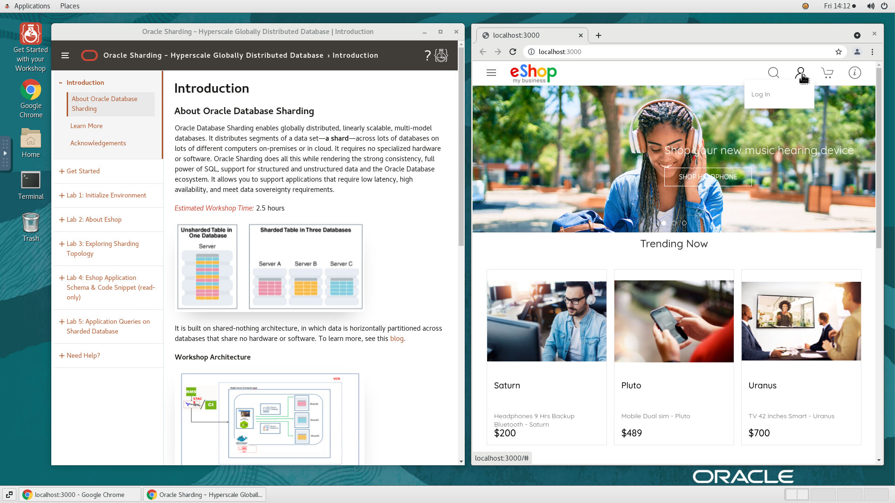
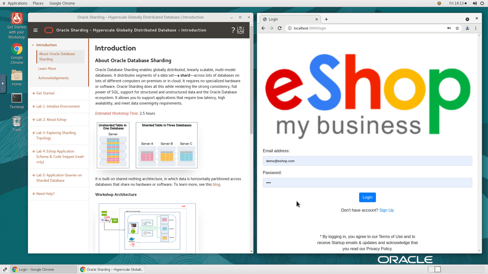
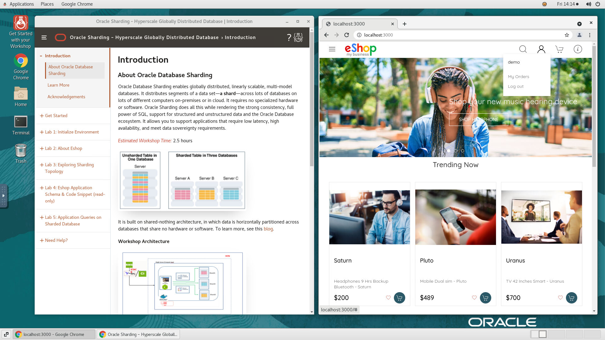

# Initialize Environment

## Introduction

In this lab we will review and startup all components required to successfully run this workshop.

*Estimated Lab Time:* 10 Minutes.

### Objectives
- Initialize the workshop environment.

### Prerequisites
This lab assumes you have:
- A Free Tier, Paid or LiveLabs Oracle Cloud account
- SSH Private Key to access the host via SSH
- You have completed:
    - Lab: Generate SSH Keys (*Free-tier* and *Paid Tenants* only)
    - Lab: Prepare Setup (*Free-tier* and *Paid Tenants* only)
    - Lab: Environment Setup

## **STEP 1:** Validate That Required Processes are Up and Running.
1. Now with access to your remote desktop session, proceed as indicated below to validate your environment before you start executing the subsequent labs. The following Processes should be up and running:

    - Oracle Sharding GSM  Container
    - Oracle Sharding Catalog container
    - Three Oracle shard Database container
    - Nodejs eShop Application Container

2. On the *Firefox* window on the right preloaded with *eShop Application*, click on the *Login* button to login the Application and select the saved credentials to login. These credentials have been saved within *Firefox* and are provided below for reference

    
    ```
    Username: <copy>demo@eshop.com</copy>
    ```

    ```
    Password: <copy>demo</copy>
    ```

    

3. Confirm successful login. Please note that it takes about 2 minutes after instance provisioning for all processes to fully start.

    

    If successful, the page above is displayed and as a result your environment is now ready.  

    You may now [proceed to the next lab](#next).

4. If you are still unable to login or the login page is not functioning after reloading from the *Workshop Links* bookmark folder, open a terminal session and proceed as indicated below to validate the services.

    - Oracle Sharding container Details

        ```
        <copy>
        sudo docker ps -a 
        </copy>
        ```
        

    - if container are stopped and not in running state then try to restart the container by using below docker command.
  
        ```
        <copy>
        sudo docker stop <container ID/NAME>
        </copy>
        <copy>
        sudo docker start <container ID/NAME>
        </copy>
        ```

You may now [proceed to the next lab](#next).

<!-- ## **Step 0**: Running your Lab
### Access the graphical desktop
For ease of execution of this workshop, your instance has been pre-configured for remote graphical desktop accessible using any modern browser on your laptop or workstation. Proceed as detailed below to login.

1. Launch your browser to the following URL

    ```
    URL: <copy>http://[your instance public-ip address]:8080/guacamole</copy>
    ```

2. Provide login credentials

    ```
    Username: <copy>oracle</copy>
    ```
    ```
    Password: <copy>Guac.LiveLabs_</copy>
    ```

    

    *Note*: There is an underscore `_` character at the end of the password.

3. Click on *Terminal* icon on the desktop to start a terminal

    

### Login to Host using SSH Key based authentication
While all command line tasks included in this workshop can be performed from a terminal session from the remote desktop session as shown above, you can optionally use your preferred SSH client.

Refer to *Lab Environment Setup* for detailed instructions relevant to your SSH client type (e.g. Putty on Windows or Native such as terminal on Mac OS):
  - Authentication OS User - “*opc*”
  - Authentication method - *SSH RSA Key*
  - OS User – “*oracle*”.

1. First login as “*opc*” using your SSH Private Key

2. Then sudo to “*oracle*”. E.g.

    ```
    <copy>sudo su - oracle</copy>
    ```

## **Step 1**: Check Application accessibility
1. Access the application using the URL  (**`http://<Public IP>:3000/`**), the application's home page opens.


You may now [proceed to the next lab](#next). -->

## Acknowledgements
* **Authors** - Shailesh Dwivedi, Database Sharding PM , Vice President
* **Contributors** - Alex Kovuru, Nishant Kaushik, Ashish Kumar, Priya Dhuriya, Richard Delval, Param Saini,Jyoti Verma, Virginia Beecher, Rodrigo Fuentes
* **Last Updated By/Date** - Ashish Kumar, Solution Engineer - July 2021
