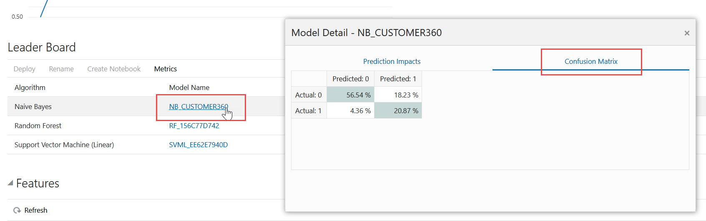

# Machine Learning

## Introduction

In this lab, you will test drive Oracle Machine Learning on Oracle Autonomous Database. You will explore OML Notebooks by creating notebooks, setting interpreter bindings, and scheduling a notebook job. In the Introduction to OML4SQL lab, you will use the SQL API via notebooks to implement a short data science project that forecasts product sales using a time series model. In the Introduction to OML4Py lab, you will use the Python API to develop and evaluate a Decision Tree-based classifier and score data using it. In the Introduction to OML AutoML UI lab, you will use the no-code user interface OML AutoML UI to run an experiment, which builds and ranks models, and deploy a Naive-Bayes classifier. You will also explore a notebook generated from a model produced by the experiment. Finally, in the Introduction to Oracle Machine Learning Services lab, you will score singleton and mini-batch records with a Naive-Bayes classifier and use the Cognitive Text feature to analyze a text string.

### Objectives

In this lab, you will learn how to:
* Use OML Notebooks:
    * Create a notebook based on an example template
    * Check and update the interpreter binding settings for a notebook
    * Schedule a notebook to run at a specific time using the Jobs interface
* Develop and score using a time series model using OML4SQL:
    * Explore data using SQL queries
    * Build a time series-based model
    * Evaluate the time series model using standard diagnostic metrics provided by OML4SQL
    * Access the forecasts from the DM$VP model view
* Develop and score with a Decision Tree model using OML4Py:
    * Create a table and proxy to the table
    * Explore and prepare data using
    * Build and evaluate a Decision Tree classifier
    * Score with the classifier
* Use OML AutoML UI:
    * Create an experiment, adjust experiment settings and run the experiment
    * Deploy models to OML Services
    * View the OML Models user interface with deployed metadata and endpoint JSON
    * Create a notebook for the top model
    * View generated notebook and individual paragraphs
* Use OML Services:
    * Authenticate your user account to obtain a token to use OML Services through Autonomous Database
    * Get a model scoring endpoint
    * Perform singleton and mini-batch scoring using the scoring endpoint
    * Discover keywords and summaries for a text string using the Cognitive Text feature

## Task 1: Connecting to your Oracle Cloud Database

1. Log in to the Oracle Cloud at <a href="https://cloud.oracle.com">cloud.oracle.com</a>. Cloud Account Name is howarduniversity. Click "Next".
2. Click on "Direct Sign-In" and enter your Cloud Account email and password.

    

3. Once you are logged in, you are taken to the cloud services dashboard where you can see all the services available to you. Click the navigation menu in the upper left to show top level navigation choices.

    


4. Click **Autonomous Data Warehouse**.

    

5. From the Compartment drop down on the left side of the page, expand howarduniversity->spring2022->student1xx and select you student number.

    

6. Click on the database you created in lab 1
   
    

## Task 2: Machine Learning Notebooks

**Sign into Oracle Machine Learning User Interface**

A notebook is a web-based interface for data analysis, data discovery, data visualization, and collaboration. You create and run notebooks using Oracle Machine Learning Notebooks, which is accessed through the Oracle Machine Learning user interface on Oracle Autonomous Database.

<if type="freetier">

1. Sign into your OCI console, click on the left navigation menu, and then click **Autonomous Database**.  

	

2. The Autonomous Database dashboard lists all the databases that are provisioned in the tenancy. Click the Oracle Autonomous Database that you have provisioned.

          	  

3. On your Oracle Autonomous Database instance page, click **Service Console**. The Launch Service Console dialog opens. Wait till the Service Console opens.

	


4. On the Service Console page, click **Development** on the left pane.

	

5. Click **Oracle Machine Learning User Interface.** This opens the Oracle Machine Learning sign in page.

  

6. Enter your user credentials and click **Sign in**. This opens the Oracle Machine Learning home page.

	>**Note:** The credential is what you have defined while creating the Oracle Machine Learning user.

	
</if>

<if type="livelabs">
1. On your Livelabs workshop page, click **Launch Workshop** under **My Reservations**.

	

2. On the Launch Oracle Machine Learning Fundamentals on Autonomous Database page, click  **OML Notebooks**.  This opens the Oracle Machine Learning sign in page.

	

3. Enter your user credentials and click **Sign in**. This opens the Oracle Machine Learning home page.

	>**Note:** The username is `OMLUSER`, and password is `AAbbcc123456`.

	

</if>
This completes the task of accessing Oracle Machine Learning.

**Create a Notebook and define paragraphs using the md, SQL, PL/SQL, and Python interpreters**

To create a notebook:

1. On the Oracle Machine Learning home page, click **Notebooks**. The Notebooks page opens.

	

	Alternatively, you can click the hamburger icon  on the top left corner of the home page to open the left navigation menu. Click **Notebooks**.

	

2. On the Notebooks page, click **Create**. The Create Notebook dialog opens.
	


3. In the Name field, enter **Test Notebook**.

4. In the **Comments** field, enter comments, if any.

5. In the **Connections** field, select a connection in the drop-down list. By default, the **Global** Connection Group is assigned.

6. Click **OK**. Your notebook is created and it opens in the notebook editor.


You can now use it to create a Markdown paragraph, SQL paragraph, and Python paragraph and do the following:

### Call the Markdown interpreter and generate static html from Markdown plain text
To call the Markdown interpreter and generate static html from Markdown plain text:

7. In the Test Notebook, type ``%md`` and press Enter.

	

8. Type the following:   

	* To generate static html text, type the text `Hello World` inside double quotes, and press Enter.
	* To format the text in bold, type the text `Hello World` inside two asterisks pair, and press Enter.
	* To format the text in italics, type the text `Hello World` either inside an asterisk pair or an underscore pair, and click the Run  icon.

	Alternatively, you may copy the code and paste it in the notebook just below `%md`, and click the Run icon  as shown in the screenshot:


		<copy>
		"Hello World"
		**Hello World**
		*Hello World*
		_Hello World_
		</copy>


	


	After running the paragraph, the output is displayed, and a new paragraph is automatically created. Also, you can manually create additional paragraphs.

	

9. To display the text in a bulleted list, prefix * (asterisk) to the text `Hello World`, as shown in the screenshot below.


		<copy>
		* Hello World
		* We welcome you
		 </copy>


	

	> **Note:** You are not clicking the Run icon here.

10. Manually create another paragraph just below by hovering your cursor over the paragraph border. This brings up the Add Paragraph option. Click **Add Paragraph** to create a new paragraph, as shown in the screenshot.   

	

11. In this paragraph that you just created, the markdown tag `%md` is already present. Here, you will use Markdown tags to display the text in heading 1 (H1), heading 2 (H2) and heading 23 (H3). For H1, H2, and H3, add one, two, and three hashes before the text `Hello World` respectively. Or, you may copy the code below and paste it just below the tag `%md`.

		<copy>
		# Hello World
		# Hello World
		### Hello World
		 </copy>


12. Now, scroll up the notebook and click the Run All icon present in the notebook toolbar, as shown in the screenshot here.  

	


13. Click **OK** in the Run All dialog to confirm.

	

	The two paragraphs run and the output is displayed in the respective paragraphs, as shown in the screenshot.


	 


### Call the SQL Interpreter and run SQL Statements
Let’s create another paragraph to call the SQL interpreter and run SQL statements:

14. To create another paragraph, hover your cursor over the paragraph border. This brings up the Add Paragraph option. Click **Add Paragraph** to create a new paragraph.

	

15. Edit the existing paragraph tag, type ``%sql`` to call the SQL interpreter, and press Enter.

	

16. Type the following command and click the Run  icon. Alternatively, you can press Shift+Enter keys to run the paragraph.

	```
	<copy>
	select table_name from user_tables
	</copy>
	```
	 The command returns the table names in a tabular format, as shown in the screenshot:

	


### Call the PL/SQL Interpreter and run PL/SQL Scripts

Create another paragraph to call the PL/SQL interpreter and run PL/SQL scripts:
17. In the new paragraph, type ``%script`` to call the PL/SQL interpreter, and press Enter.

	

18. Type the following command and click . Alternatively, you can press Shift+Enter keys to run the paragraph.


		<copy>
		CREATE TABLE small_table
		(
		NAME VARCHAR(200),
		ID1 INTEGER,
		ID2 VARCHAR(200),
		ID3 VARCHAR(200),
		ID4 VARCHAR(200),
		TEXT VARCHAR(200)
		);

		BEGIN
		FOR i IN 1..100 LOOP
		INSERT INTO small_table VALUES ('Name_'||i, i,'ID2_'||i,'ID3_'||i,'ID4_'||i,'TEXT_'||i);
		END LOOP;
		COMMIT;
		END;

		</copy>


	

The PL/SQL script successfully creates the table SMALL_TABLE. The PL/SQL script in this example contains two parts:
* The first part of the script contains the SQL statement CREATE TABLE to create a table named ``small_table``. It defines the table name, table column, data types, and size. In this example, the column names are ``NAME, ID1, ID2, ID3, ID4, and TEXT``.

* The second part of the script begins with the keyword ``BEGIN``. It inserts 100 rows into the table ``small_table``


### Call the Python Interpreter and run Python Statements
Let’s create another paragraph to call the Python interpreter and run Python statements:
19. To call the python interpreter, edit the paragraph tag, type ``%python`` and press Enter.

	

20. Type the following command and click .

	```
	<copy>
	import pandas as pd
	import oml
	DATA = oml.sync(table = "SUPPLEMENTARY_DEMOGRAPHICS", schema = "SH")
	z.show(DATA.head())
	</copy>
	```


	The ``z.show`` command displays the SUPPLEMENTARY_DEMOGRAPHICS table present in the SH schema, as shown in the screenshot here. Use the ``z.show`` command to display Python objects, proxy object content, and to display the desired data in the notebook. You will learn more about ``z.show`` in the lab on Oracle Machine Learning for Python.

	

**Create a Notebook using a Template Example**

This task demonstrates how to create notebooks based on Example templates. You will learn how to:

* Create the OML4Py Classification notebook based on the OML4Py Classification DT example template. The template builds and applies the classification Decision Tree algorithm to build a classification model based on the relationships between the predictor values and the target values. The template uses the Sales History (`SH`) schema.
* Create the Time Series notebook based on the OML4SQL Time Series ESM example template. This template forecasts sales by using the Exponential Smoothing Algorithm for Time Series Data. It also used the `Sales` table in the SH schema.

### Create an OML4Py Notebook using the Classification DT Template Example
This step demonstrates how to create the OML4Py Classification notebook based on the OML4Py Classification DT (Decision Tree) Example template:

1. Go to the Examples page by clicking the hamburger icon  on the top left corner of the page to open the left navigation menu. On the left navigation menu, click **Examples**.

	
	

  Alternatively, on the Oracle Machine Learning home page, click **Examples** in the Quick Actions section to go Examples.

	


2. Navigate to the **OML4Py Classification DT** example template notebook. You can search for the notebook by typing in keywords in the search box on the upper right corner of the page. Click on the grey box around the notebook. This highlights the notebook and enables the **Create Notebook** button. Click **Create Notebook**.

	

3. The Create Notebook dialog opens. The Name field displays the same name as the template with the suffix `(1)`. You can edit this name. In this example, we will retain the auto-generated name `OML4PY Classification DT (1)`. Click **OK**.

	> **Note:** In the Project field, the current user, project and workspace is selected by default. You have the option to choose a different project or a workspace by clicking the edit icon here.  

	


4. Once the notebook is created, the message _Notebook "OML4PY Classification DT (1)" created in project "OMLUSER Project"_ is displayed, as shown in the screenshot. The notebook is now available in the Notebooks page.

	


5. To view the notebook that you just created, click the hamburger icon  on the top left corner of the page to open the left navigation menu. Click **Notebooks** to go to the Notebooks page.

	

	


6. The OML4PY Classification DT (1) notebook is now listed on the Notebooks page, as shown in the screenshot. Click it to open the notebook in the Notebooks editor. Note that you will run this notebook in the subsequent steps.

	

This completes the task of creating a notebook from an Example template.


### Create a Time Series Notebook using the OML4SQL Time Series Template Example

These steps demonstrate how to create the Time Series notebook based on the Example template:

7. Click the hamburger icon  on the top left corner of the page to open the left navigation menu. Click **Examples** under Templates to open the Examples page. If you choose to go to the home page, then click **Home** on the left navigation pane, and then click **Examples**.

	

	

8. Navigate to the **OML4SQL Time Series ESM** example template notebook. You may type ESM in the search box on the upper right corner of the page to get a list of the ESM-related notebooks. Click the grey box around the notebook. This highlights the notebook and enables the **Create Notebook** button. Click **Create Notebook**.

	

9. The Create Notebook dialog opens. By default, the **Name** field displays the same name as the template with the suffix `(1)`. You can edit this field. In this example, we will retain the auto-generated name **OML4SQL Time Series ESM (1)** and click **OK**.

	> **Note:** In the Project field, the current user, project and workspace is selected by default. You have the option to choose a different project or a workspace by clicking the edit icon here.  

	


10. Once the notebook is created, the message _Notebook "OML4SQL Time Series ESM (1)" created in project "OMLUSER Project"_ is displayed. The notebook is now available in the Notebooks page.

	


11. To view the notebook, click the hamburger icon  on the top left corner of the page to open the left navigation menu. Click **Notebooks** to go to the Notebooks page.

	
	


12. The notebook **Notebook "OML4SQL Time Series ESM (1)** is now listed on the Notebooks page, as shown in the screenshot. Click on the notebook to open it in the Notebooks editor and work on it.

	

This completes the task of creating the Time Series notebook from the OML4SQL Time Series ESM Example template.

**Change Interpreter Bindings Order**

An interpreter allows using a specific data processing language at the backend to process commands entered in a notebook paragraph. For the notebooks in Oracle Machine Learning, you use the following interpreters:

* SQL interpreter for SQL Statements
* PL/SQL  interpreter for PL/SQL scripts/statements
* Python interpreter to process Python scripts
* md (MarkDown) interpreter for plain text formatting syntax so that it can be converted to HTML.

This is the initial binding order of the interpreters. You can change the order of the interpreter bindings by clicking and dragging an entry above or below others (turns from white to blue). You can also deselect a binding to disable it (turns from blue to white). This does not require dragging the enabled interpreters above the disabled ones.

* **Low** (Default): Provides the least level of resources for in-database operations, typically serial (non-parallel) running of database operations. It supports the maximum number of concurrent in-database operations by multiple users. The interpreter with low priority is listed at the top of the interpreter list, and hence, is the default.
* **Medium:** Provides a fixed number of CPUs to run in-database operations in parallel, where possible. It supports a limited number of concurrent users, typically 1.25 times the number of CPUs allocated to the Autonomous Database instance.
* **High:** Provides the highest level of CPUs to run in-database operations in parallel, up to the number of CPUs allocated to the Autonomous Database instance. It offers the highest performance but supports the minimum number of concurrent in-database operations, typically 3.

	> **Note:** The interpreter binding order that is set for a notebook applies to all the paragraphs in that notebook. However, you can override the binding of an individual paragraph also. This is an advanced topic, and is not covered in this workshop.

In this step, you learn how to set the interpreter bindings:
1. Go to the Notebooks page by clicking the hamburger icon on the top left corner of the page. On the left navigation menu, click **Notebooks**.

	
	

2. On the Notebooks page, click on the **OML4PY Classification_DT (1)** notebook to open it in the Notebook editor.

	

3. Click  on the top right corner of the notebook. This opens the interpreter settings.

	

4. Click **medium**, and drag and drop it on top of the list.

	

	>**Note:** You can disable a particular binding by deselecting it (turns from blue to white) or enable it by selecting it (turns from white to blue). However, this does not require dragging the enabled interpreters above the disabled ones.


	

5. Once you successfully drag and drop it on top of the list, click **Save**.

	

Clicking **Save** records the changes and hides the interpreter settings. You can verify it again by clicking the gear icon . This completes the task of changing the interpreter binding order.

**Create Jobs to Schedule Notebook Run**

Jobs allow you to schedule the running of notebooks. On the Jobs page, you can create jobs, duplicate jobs, start and stop jobs, delete jobs, and monitor job status by viewing job logs, which are read-only notebooks. In this lab, you will learn how to create a job to schedule the running of the notebook Classification_DT.

To create a job:

1. Click the hamburger icon  on the top left corner of the page to open the left navigation menu, and click **Jobs** to go to the Jobs page. You can also go to Jobs from the Oracle Machine Learning home page by clicking **Jobs**.
	
	

2. On the Jobs page, click **Create**. The Create Job dialog opens.

	

3. In the **Name** field, enter `Job1`. The number of characters in the job name must not exceed 128 bytes.

	

4. In the **Notebook** field, click the search icon. This opens the Search Notebook dialog. In the Search Notebook dialog, navigate through the OMLUSER workspace and OMLUSER project, select `OML4PY Classification_DT (1)`, and click **OK**.

	> **Note:** Only notebooks that are owned by the user or shared are available for selection.

	

5. In the **Start Date** field, click the date-time editor to set the date and time for your job to commence. You can select the current date or any future date and time. Based on the selected date and time, the next run date is computed.

6. Select **Repeat Frequency** and enter **3**, and select **Days** to set the repeat frequency and settings. You can set the frequency in minutes, hours, days, weeks, and months.

7. Expand **Advanced Settings**, and specify the following settings:

	

	* **Maximum Number of Runs:** Select **3**. This specifies the maximum number of times the job must run before it is stopped. When the job reaches the maximum run limit, it will stop.  

	* **Timeout in Minutes:** Select **60**. This specifies the maximum amount of time a job should be allowed to run.

	* **Maximum Failures Allowed:** Select **3**. This specifies the maximum number of times a job can fail on consecutive scheduled runs. When the maximum number of failures is reached, the next run date column in the Jobs UI will show an empty value to indicate the job is no longer scheduled to run. The Status column may show the status as `Failed`.

		> **Note:** Select **Automatic Retry** if you do not wish to specify the maximum failures allowed manually.  

8. Click **OK**. The job is now listed on the Jobs page with the status SCHEDULED.

	


9. Click on the job row to enable the options to either **Edit**, **Duplicate**, **Start**, or **Delete** the selected job.


	

This completes the task of creating a job.

## Task 3: Machine Learning for SQL

**Examine the Data**

1. Click the hamburger icon  to open the left navigation menu and click **Notebooks**.
2. The Notebooks page opens with all the notebooks listed in it. Click the **OML4SQL Time Series ESM (1)** notebook to open it.

3. The _OML4SQL Time Series ESM (1)_ notebook opens in the notebook editor. Click the gear icon to view and set the interpreter binding order.
5. Click the play icon next to the **OML4SQL Time Series ESM (1)** title to run all paragraphs of the notebook.

  
6.Click **OK** in the confirmation window to run all paragraphs.

7. The paragraphs start running one by one and display the status next to the paragraph titles. When the paragraph is running, the status displays **PENDING** and when it finishes, it displays **FINISHED**.


 

In this notebook you are using the `SALES` table from the `SH` schema. You can access the table by running the `SELECT` statements in OML Notebooks.
The following table displays information about the attributes from the `SALES` table:

| Attribute Name | Information |
| --- | --- |
| `PROD_ID`  |The ID of the product  |
| `CUST_ID` |The ID of the customer | More text |
| `TIME_ID` | The timestamp of the purchase of the product in yyy-mm-dd hh:mm:ss format | More text |
| `CHANNEL_ID` | The channel ID of the channel sales data|
|`PROMO_ID` | The product promotion ID|
|`QUANTITY_SOLD` |The number of items sold|
|`AMOUNT_SOLD` |	The amount or sales data|


**Prepare the Data**

In this step, you will prepare the data by creating a view.
The following steps help you to create a view and view the data:
1. Prepare a view called `ESM_SH_DATA` by selecting the necessary columns from `SH.SALES` table. For this example, select `TIME_ID` and `AMOUNT_SOLD`.

    ```
    <copy>
    %script
    CREATE OR REPLACE VIEW ESM_SH_DATA AS
    SELECT TIME_ID, AMOUNT_SOLD FROM SH.SALES;

    </copy>

     ```

  The output is as follows:
    ```
    View ESM_SH_DATA created.
    --------------------------
    ```

    >**Note:** If you are reserving a workshop on LiveLabs, some of the table views may already exist.


2. Count the number of rows to ensure that we have the same amount of data. Run the following query:

    ```
    <copy>
    %script
    SELECT count(*) from ESM_SH_DATA;
    </copy>
    ```
The output is follows:

    ```
    COUNT(*)  
    918843

    ---------------------------

    ```

3. View the `ESM_SH_DATA`.


    ```
    <copy>
    %sql
    SELECT * from ESM_SH_DATA
    WHERE rownum <11;

    </copy>
    ```

	

**Build Your Model**

To build a model using the time series data, you will use the Exponential Smoothing algorithm on the `ESM_SH_DATA` view that is generated during the data preparation stage. In this example you build a time series model by applying the Holt-Winters model on time series aggregated on a quarterly interval.
1. Build a Holt-Winters model with the `ESM_SH_DATA` table, run the following script:
    ```sql
        <copy>
        %script

        BEGIN DBMS_DATA_MINING.DROP_MODEL('ESM_SALES_FORECAST_1');
        EXCEPTION WHEN OTHERS THEN NULL; END;
        /
        DECLARE
              v_setlst DBMS_DATA_MINING.SETTING_LIST;
        BEGIN
    &nbsp;
             -- algorithm = exponential smoothing
             v_setlst('ALGO_NAME')            := 'ALGO_EXPONENTIAL_SMOOTHING';


                 -- accumulation interval = quarter
                 v_setlst('EXSM_INTERVAL')        := 'EXSM_INTERVAL_QTR';

                 -- prediction step = 4 quarters
                 v_setlst('EXSM_PREDICTION_STEP') := '4';                 

                 -- ESM model = Holt-Winters
                 v_setlst('EXSM_MODEL')           := 'EXSM_WINTERS';      

                 -- seasonal cycle = 4 quarters
                 v_setlst('EXSM_SEASONALITY')     := '4';                 

    &nbsp;
             DBMS_DATA_MINING.CREATE_MODEL2(
                MODEL_NAME           => 'ESM_SALES_FORECAST_1',
                MINING_FUNCTION      => 'TIME_SERIES',
                DATA_QUERY           => 'select * from ESM_SH_DATA',
                SET_LIST             => v_setlst,
                CASE_ID_COLUMN_NAME  => 'TIME_ID',
                TARGET_COLUMN_NAME   =>'AMOUNT_SOLD');
        END;
        </copy>


    ```

    The output is as follows:
    ```
        PL/SQL procedure successfully completed.
        ---------------------------
        PL/SQL procedure successfully completed.

    ```

    Examine the script:
    - `v_setlist` is a variable to store `SETTING_LIST`.
    - `SETTING_LIST` specifies model settings or hyperparameters for the model.
    - `DBMS_DATA_MINING` is the PL/SQL package used for machine learning. These settings are described in [`DBMS_DATA_MINING — Algorithm Settings: Exponential Smoothing`](https://docs.oracle.com/en/database/oracle/oracle-database/21/arpls/DBMS_DATA_MINING.html#GUID-A95A0A38-8A5A-4470-B49F-80D81C588BFC).
    - `ALGO_NAME` specifies the algorithm name. Since you are using Exponential Smoothing as the algorithm, the value of the setting is `ALGO_EXPONENTIAL_SMOOTHING`.
    - `EXSM_INTERVAL` indicates the interval of the data set or a unit of interval size. For example, day, week, month, and so on. You want to predict for quarterly sales. Hence, the setting is `EXSM_INTERVAL_QTR`. This setting applies only to the time column with datetime type.
    - `EXSM_PREDICTION_STEP` specifies how many predictions to make. You want to display each value representing a quarter. Hence, a value of 4 gives four values ahead prediction.
    - `EXSM_MODEL` specifies the type of exponential smoothing model to be used. Here the value is `EXSM_HW`. The Holt-Winters triple exponential smoothing model with additive trend and multiplicative seasonality is applied. This type of model considers various combinations of additive and multiplicative trend, seasonality and error, with and without trend damping. Other options are `EXSM_SIMPLE`, `EXSM_SIMPLE_MULT`, `EXSM_HOLT`, `EXSM_HOLT_DMP`, `EXSM_MUL_TRND`, `EXSM_MULTRD_DMP`, `EXSM_SEAS_ADD`, `EXSM_SEAS_MUL`, `EXSM_HW`, `EXSM_HW_DMP`, `EXSM_HW_ADDSEA`, `EXSM_DHW_ADDSEA`, `EXSM_HWMT`, `EXSM_HWMT_DMP`.
    - `EXSM_SEASONALITY` indicates how long a season lasts. The parameter specifies a positive integer value as the length of seasonal cycle. The value it takes must be larger than 1. For example, 4 means that every group of four values forms a seasonal cycle.
    - `EXSM_SETMISSING` specifies how to handle missing values. Time series data can contain missing values. The special value `EXSM_MISS_AUTO` indicates that, if the series contains missing values it is to be treated as an irregular time series. The Automatic Data Preparation (ADP) setting does not impact this data for time series.

    The `CREATE_MODEL2` procedure takes the following parameters:
    - `MODEL_NAME`: A unique name that you will give to the model. Name of the model in the form `[schema_name.]model_name`. If you do not specify a schema, then your own schema is used. Here, the model name is `ESM_SALES_FORECAST_1`.
    - `MINING_FUNCTION`: Specifies the machine learning function. Since it is a time series problem, select `TIME_SERIES`.
    - `DATA_QUERY`: A query that provides training data for building the model. Here, the query is SELECT * FROM `ESM_SH_DATA`.
    - `SET_LIST`: Specifies `SETTING_LIST`.
    - `CASE_ID_COLUMN_NAME`: A unique case identifier column in the training data. In this example, `case_id` is `TIME_ID`. If there is a composite key, you must create a new attribute before creating the model.
    - `TARGET_COLUMN_NAME`: Specifies the column that is to be predicted. Also referred to as the target variable of the model. In other words, the value the model predicts. In this example, you are predicting the sale of products in terms of their dollar price. Therefore, in this example, the `TARGET_COLUMN_NAME` is `AMOUNT_SOLD`.
    >**Note:** Any parameters or settings not specified are either system-determined or default values are used.


**Evaluate Your Model**

Evaluate your model by viewing diagnostic metrics and performing quality checks. To obtain more insights about the model and view model settings, you can query data dictionary views and model detail views. Specific model detail views display model statistics which can help you evaluate the model. Model detail views are specific to the algorithm. The names of model detail views begin with `DM$xx` where _xx_ corresponds to the view prefix. See [Model Detail Views](https://docs.oracle.com/en/database/oracle/machine-learning/oml4sql/21/dmprg/model-detail-views.html#GUID-AF7C531D-5327-4456-854C-9D6424C5F9EC).
1. You can review the model settings by running the following query:

    ```
    <copy>
    %sql
    SELECT SETTING_NAME, SETTING_VALUE
    FROM USER_MINING_MODEL_SETTINGS
    WHERE MODEL_NAME = UPPER('ESM_SALES_FORECAST_1')
    ORDER BY SETTING_NAME;
    </copy>
    ```
	

2. To view the model diagnostic view, `DM$VG`, and evaluate the model, run the following query:

    ```
    <copy>
    %sql
    SELECT NAME, round(NUMERIC_VALUE,4), STRING_VALUE
    FROM DM$VGESM_SALES_FORECAST_1
    ORDER BY NAME;
    </copy>
    ```

	
The `DM$VG` view for time series contains the global information of the model along with the estimated smoothing constants, the estimated initial state, and global diagnostic measures.

- `NAME`: Indicates the diagnostic attribute name.
- `NUMERIC_VALUE`: Indicates the calculated statistical value for the model.
- `STRING_VALUE`: Indicates alphanumeric values for the diagnostic parameter.

    A few parameters to note for an exponential smoothing algorithm are:
    - `ALPHA`: Indicates the smoothing constant.
    - `BETA`: Indicates the trend smoothing constant.
    - `GAMMA`: Indicates the seasonal smoothing constant.
    - `MAE`: Indicates Mean Absolute Error.
    - `MSE`: Indicates Mean Square Error.

In exponential smoothing, a series extends infinitely into the past, but that influence of past on future decays smoothly and exponentially fast. The smooth rate of decay is expressed by one or more smoothing constants. The smoothing constants are parameters that the model estimates. These smoothing constants are represented as _α_, _β_, and _γ_. Values of a smoothing constant near one put almost all weight on the most recent observations. Values of a smoothing constant near zero allow the distant past observations to have a large influence.

Note that _α_ is associated with the error or noise of the series, _β_ is associated with the trend, and _γ_ is associated with the seasonality factors.

**Access Forecasts from Your Model**

For a time series model, you use the `DM$VP` view to retrieve the forecasts for the requested time periods.
1. Query the `DM$VP` model detail view to see the forecast (sales for four quarters). The `DM$VP` view for time series contains the result of an ESM model. The output has a set of records such as partition, `CASE_ID`, value, prediction, lower, upper, and so on and ordered by partition and `CASE_ID` (time). Run the following statement:

    ```
    <copy>
    %sql
    SELECT TO_CHAR(CASE_ID,'YYYY-MON') DATE_ID,
           round(VALUE,2) ACTUAL_SOLD,
           round(PREDICTION,2) FORECAST_SOLD,
           round(LOWER,2) LOWER_BOUND, round(UPPER,2) UPPER_BOUND
    FROM DM$VPESM_SALES_FORECAST_1
    ORDER BY CASE_ID DESC;
    </copy>
    ```

	
	In this step, the forecast shows the amount sold along with the `case_id`. The forecasts display upper and lower confidence bounds showing that the estimates can vary between those values.

	Examine the statement:
	- `TO_CHAR(CASE_ID,'YYYY-MON') DATE_ID`: The `DATE_ID` column has timestamp or `case_id` extracted in year-month (yyyy-mon) format.
	- `round(VALUE,2) ACTUAL_SOLD`: Specifies the `AMOUNT_SOLD` value as `ACTUAL_SOLD` rounded to two decimal places.
	- `round(PREDICTION,2) FORECAST_SOLD`: Specifies the predicted value as `FORECAST_SOLD` rounded to two decimal places.
	- `round(LOWER,2) LOWER_BOUND, round(UPPER,2) UPPER_BOUND`: Specifies the lower and upper confidence levels rounded to two decimal places.

2. To see a visual representation of the predictions in OML Notebooks, run the same query above without ```DESC``` in the ```ORDER BY``` clause. Click the Line Chart graph and apply the following settings:
Click **settings** and drag `DATE_ID` to **keys** and `FORECASTED_SOLD`, `ACTUAL_SOLD`, `LOWER_BOUND`, and `UPPER_BOUND` to **values**. By default, the columns in the **values** field show `(sum)`. For example,  `ACTUAL_SOLD (sum)`. Click the column name and change it to `(avg)`. Change all the column names in the **values** field to show `(avg)`.

    ```
    <copy>
      %sql
      SELECT TO_CHAR(CASE_ID,'YYYY-MON') DATE_ID, VALUE ACTUAL_SOLD,
             round(PREDICTION,2) FORECAST_SOLD,
             round(LOWER,2) LOWER_BOUND, round(UPPER,2) UPPER_BOUND
        FROM DM$VPESM_SALES_FORECAST_1
        ORDER BY CASE_ID;
    </copy>
    ```

  

  

  

This completes the prediction step. The model has successfully forecast sales for the next four quarters.

## Task 4: Machine Learning for Python

**Create a Database Table**

With OML4Py, you can create Python proxy objects that can be used to access, analyze, and manipulate data that reside in the database. OML4Py uses these proxy objects and transparently translates many standard Python functions into SQL. First access the OML4Py Classification DT (1) notebook and then create the database table.

### Access the OML4Py Classification DT (1) notebook

This step illustrates how you can access the OML4Py Classification DT (1) notebook available on the Notebook page which was created in Lab 1. The OML4Py Classification DT (1) notebook was created based on the example template of the OML4Py Classification Decision Tree.
1. Click the hamburger icon  on the top left screen. Click Notebooks to proceed to the Notebook page.
	
	

2. The Notebook page opens with the list of notebooks available. Click the OML4Py Classification DT (1) notebook to open it.
	

3. The OML4Py Classification DT (1) notebook opens up in the notebook editor. Click the gear icon  on the top right corner of the notebook to view and set the interpreter binding order.
	
	You can change the order of the interpreter bindings by clicking and dragging an entry above or below others (turns from white to blue). You can also deselect a binding to disable it (turns from blue to white). This does not require dragging the enabled interpreters above the disabled ones.
	
	Click **Save** to set the interpreter bindings.

4. Click the play icon next to the title of the notebook to run all paragraphs.
	

5. Click **OK** to confirm in the confirmation dialogue.
	

6. The paragraphs start running one by one and display the status next to the paragraph titles. When the paragraph is running, the status displays **PENDING** and when it finishes, it displays **FINISHED**.
	
	

In this step, the iris data set is used for illustrative purposes to load the data into a temporary database table. Such temporary tables are automatically deleted when the OML Notebook connection to the database ends unless you have saved its proxy object to a datastore, which we'll discuss in step 10, before disconnecting.
To use OML4Py, you must first import the `oml` module and the Pandas library. Use the `oml.push` function to create a temporary table.
1. Run the following scripts to import the `oml` package, the Pandas library, and set the display options:
	```
	<copy>
	%python

	import pandas as pd
	import oml

	pd.set_option('display.max_rows', 500)
	pd.set_option('display.max_columns', 500)
	pd.set_option('display.width', 1000)
	</copy>
	```
2. Load the iris data into a single DataFrame. Use the `oml.push` function to load this Pandas DataFrame into the database, which creates a temporary table and returns a proxy object that you can use for IRIS_TMP.

	```
	<copy>
	%python
	from sklearn.datasets import load_iris
	import pandas as pd

	iris = load_iris()

	x = pd.DataFrame(iris.data, columns = ['SEPAL_LENGTH','SEPAL_WIDTH', 'PETAL_LENGTH','PETAL_WIDTH'])
	y = pd.DataFrame(list(map(lambda x: {0: 'setosa', 1: 'versicolor', 2:'virginica'}[x], iris.target)), columns = ['SPECIES'])

	iris_df = pd.concat([x, y], axis=1)
	IRIS_TMP = oml.push(iris_df)

	z.show(IRIS_TMP.head())
	</copy>
	```

  You use the zeppelin-context z.show method to display Python objects and proxy object content. Here, you display the first few rows of IRIS_TMP using z.show.
	

**Create a Persistent Database Table**

1. You can also create a persistent table using the create function and specifying a table name, IRIS as done below. The `oml.create` function creates a table in the database schema and returns an `oml.DataFrame` object. This table is now accessible both within OML4Py and directly from SQL. Use the z.show function to display the desired data in the notebook. To create the persistent table IRIS, run the following script.

	```
	<copy>
	%python
	try:
		oml.drop(table='IRIS')
	except:
		pass
	IRIS = oml.create(iris_df, table = 'IRIS')
	print(IRIS.columns)

	print("Shape:",IRIS.shape)
	z.show(IRIS.head(10))
	</copy>
	```

	The output is as follows:
	

**Create a Proxy Object for a Database Object**

1. Use the `oml.sync` function to create a Python object as a proxy for a database table or view. The `oml.sync` function returns an `oml.DataFrame` object or a dictionary of `oml.DataFrame` objects. The `oml.DataFrame` object returned by `oml.sync` is a proxy for the database object.  
	```
	<copy>
	%python

	DEMO = oml.sync(table = "SUPPLEMENTARY_DEMOGRAPHICS", schema = "SH")
	z.show(DEMO.head())
	</copy>
	```
	In this step, you are viewing a few rows from the SUPPLEMENTARY_DEMOGRAPHICS table using the overloaded head function.
	

**Explore the Data**

In this example, use shape, describe and crosstab functions to explore and view the data.
1. Run the shape function to view the rows and columns of an `oml.DataFrame`.
	```
	<copy>
	%python

	DEMO.shape
	</copy>

	```
	```
	The output is (4500, 14).
	```
2. Use the transparency layer function `describe()` to calculate descriptive statistics that summarize the central tendency, dispersion, and shape of the DEMO table in each numeric column.Note that all computations are computed in the database and only the summary results are returned to the Python client, in this case, the notebook. Eliminating the need to move data greatly increases scalability.A few rows of the output are displayed using the `z.show` function.
		```
		<copy>
		%python
		summary_df = DEMO.describe()
		summary_df = summary_df.reset_index()
		summary_df = summary_df.rename(columns = {'index': 'statistics'})
		z.show(summary_df.head())
		</copy>
		```
	
3. Use the crosstab function to perform cross-column analysis of an `oml.DataFrame` object. The crosstab method computes a cross-tabulation of two or more columns. By default, it computes a frequency table for the columns unless a column and an aggregation function have been passed to it.  In this example, the crosstab function displays the distribution of `AFFINITY_CARD` responders.
	```
	<copy>
	%python

	z.show(DEMO.crosstab('AFFINITY_CARD'))
	</copy>
	```
	
4. Run the following script to view the distribution of `HOUSEHOLD_SIZE` according to `AFFINITY_CARD` responders with the following setting. Click on the **Bar chart**, then click on **settings**. Drag the fields to titles as `HOUSEHOLD_SIZE` to **keys**, `AFFINITY_CARDS`  to **groups**, and count to **values**. Click on **Stacked** to get the required view.
	```
	<copy>
	%python

	z.show(DEMO.crosstab(['HOUSEHOLD_SIZE', 'AFFINITY_CARD']))
	</copy>
	```
	

**Prepare the Data**

In this step, you will create a `DEMO_DF` DataFrame, select the necessary columns for further analysis, display a few rows of the `DEMO_DF` DataFrame, and split your data into TRAIN and TEST sets.
1. Use the DEMO proxy object to create a new proxy object `DEMO_DF` by selecting the necessary columns. Run the following script:
	```
	<copy>
	%python

	DEMO_DF = DEMO[["CUST_ID", 'AFFINITY_CARD', "BOOKKEEPING_APPLICATION", "BULK_PACK_DISKETTES", "EDUCATION",
	 "FLAT_PANEL_MONITOR", "HOME_THEATER_PACKAGE", "HOUSEHOLD_SIZE", "OCCUPATION", "OS_DOC_SET_KANJI",
	 "PRINTER_SUPPLIES", "YRS_RESIDENCE", "Y_BOX_GAMES"]]
	 </copy>
	```
2. To display the first few records of `DEMO_DF`, run the following script:
	```
	<copy>
	%python

	z.show(DEMO_DF.head())
	</copy>
	```
	
3. In this example, you are splitting the `DEMO_DF` data with 60 percent of the records for the TRAIN data set and 40 percent for the TEST data set. The split method splits the data referenced by DataFrame proxy object `DEMO_DF` into two new DataFrame proxy objects, TRAIN, and TEST.
	```
	<copy>
	%python

	TRAIN, TEST = DEMO_DF.split(ratio = (0.6,0.4))
	TRAIN_X = TRAIN.drop('AFFINITY_CARD')
	TRAIN_Y = TRAIN['AFFINITY_CARD']
	TEST_X = TEST
	TEST_Y = TEST['AFFINITY_CARD']
	</copy>
	```

Since we’ll be using automatic data preparation provided by the in-database algorithms, no further data preparation is required.

**Build Your Model**

Use the `oml.dt` class to build a Decision Tree model. You can build a model with default settings or specify custom model settings.
1. To build a Decision Tree model with the default settings, run the following script:
	```
	<copy>
	%python

	try:
	    oml.drop(model = 'DT_CLAS_MODEL')
	except:
	    print("No such model")

	setting = dict()
	dt_mod = oml.dt(**setting)
	dt_mod.fit(TRAIN_X, TRAIN_Y, case_id = 'CUST_ID', model_name = 'DT_CLAS_MODEL')
	</copy>

	```

	The `oml.dt` class uses the Decision Tree algorithm for classification and a model object `dt_mod` is created with the default parameter settings.  The **fit** function builds the Decision Tree model according to the training data and parameter settings.
	```

	Model Name: DT_CLAS_MODEL

	Model Owner: OMLUSER

	Algorithm Name: Decision Tree

	Mining Function: CLASSIFICATION

	Target: AFFINITY_CARD

	Settings:
	                    setting name            setting value
	0                      ALGO_NAME       ALGO_DECISION_TREE
	1              CLAS_MAX_SUP_BINS                       32
	2          CLAS_WEIGHTS_BALANCED                      OFF
	3                   ODMS_DETAILS              ODMS_ENABLE
	4   ODMS_MISSING_VALUE_TREATMENT  ODMS_MISSING_VALUE_AUTO
	5                  ODMS_SAMPLING    ODMS_SAMPLING_DISABLE
	6                      PREP_AUTO                       ON
	7           TREE_IMPURITY_METRIC       TREE_IMPURITY_GINI
	8            TREE_TERM_MAX_DEPTH                        7
	9          TREE_TERM_MINPCT_NODE                      .05
	10        TREE_TERM_MINPCT_SPLIT                       .1
	11         TREE_TERM_MINREC_NODE                       10
	12        TREE_TERM_MINREC_SPLIT                       20

	Global Statistics:
	  attribute name  attribute value
	0       NUM_ROWS             2725

	Attributes:
	EDUCATION
	HOME_THEATER_PACKAGE
	HOUSEHOLD_SIZE
	OCCUPATION
	YRS_RESIDENCE
	Y_BOX_GAMES

	Partition: NO

	Distributions:

	    NODE_ID  TARGET_VALUE  TARGET_COUNT
	0         0             0          2088
	1         0             1           637
	2         1             0           676
	3         1             1           549
	4         2             0           108
	5         2             1           252
	6         3             0           568
	7         3             1           297
	8         4             0          1412
	9         4             1            88
	10        5             0            50
	11        5             1            23
	12        6             0          1362
	13        6             1            65
	14        7             0            89
	15        7             1           244
	16        8             0            19
	17        8             1             8
	18        9             0           188
	19        9             1            38
	20       10             0           380
	21       10             1           259
	22       11             0            20
	23       12             0            30
	24       12             1            23
	25       13             0           826
	26       13             1             6
	27       14             0           536
	28       14             1            59

	Nodes:

	    parent  node.id  row.count  prediction                                              split                                          surrogate                                        full.splits
	0      0.0        1       1225           0                   (HOUSEHOLD_SIZE IN ("3" "4-5"))                          YRS_RESIDENCE >(3.5E+000))                    (HOUSEHOLD_SIZE IN ("3" "4-5"))
	1      0.0        4       1500           0          (HOUSEHOLD_SIZE IN ("1" "2" "6-8" "9+"))                         YRS_RESIDENCE <=(3.5E+000))           (HOUSEHOLD_SIZE IN ("1" "2" "6-8" "9+"))
	2      1.0        2        360           1       (OCCUPATION IN ("Armed-F" "Exec." "Prof."))   (EDUCATION IN( ("Bach." "Masters" "PhD" "Profs...  (HOUSEHOLD_SIZE IN ("3" "4-5")) AND (OCCUPATIO...
	3      1.0        3        865           0  (OCCUPATION IN ("?" "Cleric." "Crafts" "Farmin...  (EDUCATION IN( ("10th" "11th" "12th" "1st-4th"...  (HOUSEHOLD_SIZE IN ("3" "4-5")) AND (OCCUPATIO...
	4      2.0        7        333           1                         (Y_BOX_GAMES <=(5.0E-001))                         YRS_RESIDENCE >(2.5E+000))  (HOUSEHOLD_SIZE IN ("3" "4-5")) AND (OCCUPATIO...
	5      2.0        8         27           0                          (Y_BOX_GAMES >(5.0E-001))                        YRS_RESIDENCE <=(2.5E+000))  (HOUSEHOLD_SIZE IN ("3" "4-5")) AND (OCCUPATIO...
	6      3.0        9        226           0                       (YRS_RESIDENCE <=(3.5E+000))                 HOME_THEATER_PACKAGE <=(5.0E-001))  (HOUSEHOLD_SIZE IN ("3" "4-5")) AND (OCCUPATIO...
	7      3.0       10        639           0                        (YRS_RESIDENCE >(3.5E+000))                  HOME_THEATER_PACKAGE >(5.0E-001))  (HOUSEHOLD_SIZE IN ("3" "4-5")) AND (OCCUPATIO...
	8      4.0        5         73           0         (EDUCATION IN ("Masters" "PhD" "Profsc"))                                                None  (HOUSEHOLD_SIZE IN ("1" "2" "6-8" "9+")) AND (...
	9      4.0        6       1427           0  (EDUCATION IN ("10th" "11th" "12th" "1st-4th" ...                                               None  (HOUSEHOLD_SIZE IN ("1" "2" "6-8" "9+")) AND (...
	10     5.0       11         20           0                (HOME_THEATER_PACKAGE <=(5.0E-001))                           Y_BOX_GAMES >(5.0E-001))  (HOUSEHOLD_SIZE IN ("1" "2" "6-8" "9+")) AND (...
	11     5.0       12         53           0                 (HOME_THEATER_PACKAGE >(5.0E-001))                          Y_BOX_GAMES <=(5.0E-001))  (HOUSEHOLD_SIZE IN ("1" "2" "6-8" "9+")) AND (...
	12     6.0       13        832           0                       (YRS_RESIDENCE <=(3.5E+000))                 HOME_THEATER_PACKAGE <=(5.0E-001))  (HOUSEHOLD_SIZE IN ("1" "2" "6-8" "9+")) AND (...
	13     6.0       14        595           0                        (YRS_RESIDENCE >(3.5E+000))                  HOME_THEATER_PACKAGE >(5.0E-001))  (HOUSEHOLD_SIZE IN ("1" "2" "6-8" "9+")) AND (...
	14     NaN        0       2725           0                                               None                                               None    
	                                              (
		```
2. To specify model settings and build a Decision Tree model, run the following script :
	```
	<copy>
	%python

	try:
	    oml.drop(model = 'DT_CLAS_MODEL')
	except:
	    print("No such model")

	settings = {'TREE_IMPURITY_METRIC': 'TREE_IMPURITY_GINI',
	            'TREE_TERM_MAX_DEPTH': '7',
	            'TREE_TERM_MINPCT_NODE': '0.05',
	            'TREE_TERM_MINPCT_SPLIT': '0.1',
	            'TREE_TERM_MINREC_NODE': '10',
	            'TREE_TERM_MINREC_SPLIT': '20',
	            'CLAS_MAX_SUP_BINS': '32'}


	dt_mod = oml.dt(**settings)
	dt_mod.fit(TRAIN_X, TRAIN_Y, case_id = 'CUST_ID', model_name = 'DT_CLAS_MODEL')
	</copy>
	```
	The following is the list of model settings that are applied in the example:
* `TREE_IMPURITY_METRIC`: Specifies tree impurity metric for a Decision Tree model. Tree algorithms seek the best column/attribute and values for splitting data at each node. The best splitter and split value are those that result in the largest increase in target value homogeneity (purity) for the entities in the node. Purity in the decision trees algorithm can use either gini (`TREE_IMPURITY_GINI`) or entropy (`TREE_IMPURITY_ENTROPY`) as the purity metric. By default, the algorithm uses `TREE_IMPURITY_GINI`.
* `TREE_TERM_MAX_DEPTH`: Specifies the criteria for splits: maximum tree depth (the maximum number of nodes between the root and any leaf node, including the leaf node). The default is 7.
* `TREE_TERM_MINPCT_NODE`: Specifies the minimum number of training rows in a node expressed as a percentage of the rows in the training data. The default value is 0.05, indicating 0.05%.
* `TREE_TERM_MINPCT_SPLIT`: Specifies the minimum number of rows required to consider splitting a node expressed as a percentage of the training rows. The default value is 0.1, indicating 0.1%.
`TREE_TERM_MINREC_NODE`: Specifies the minimum number of rows in a node. The default value is 10.
* `TREE_TERM_MINREC_SPLIT`: Specifies the criteria for splits: minimum number of records in a parent node expressed as a value. No split is attempted if the number of records is below this value. The default value is 20.
* `CLAS_MAX_SUP_BINS`: Specifies the maximum number of bins for each attribute. The default value is 32.

**Evaluate Your Model**

To evaluate your model you need to score the test data using the model and then evaluate the model using various metrics.
1. In this step, you will make predictions on the test case and add the `CASE_ID` as a supplemental column so that you can uniquely associate scores with the original data. To do so run the below script:
	```
	<copy>
	%python

	# Set the case ID attribute
	case_id = 'CUST_ID'
	# Gather the Predictions
	RES_DF = dt_mod.predict(TEST_X, supplemental_cols = TEST_X)
	# Additionally collect the PROBABILITY_OF_0 and PROBABILITY_OF_1
	RES_PROB = dt_mod.predict_proba(TEST_X, supplemental_cols = TEST_X[case_id])
	# Join the entire result into RES_DF
	RES_DF = RES_DF.merge(RES_PROB, how = "inner", on = case_id, suffixes = ["", ""])
	</copy>
	```
2. To evaluate the model, pass a proxy `oml.Dataframe` containing predictions and the target columns in a user-defined function named evaluate_model. Evaluate your model using standard metrics. For a classification example, you can evaluate your model using Confusion Matrix, Lift Chart, Gains Chart, and ROC curve chart. The Confusion Matrix displays the number of correct and incorrect predictions made with respect to the actual classification in the test data. It is an **n**-by-**n** matrix where **n** is the number of classes. A lift chart applies only to binary classifications requiring the designation of the positive class. It measures the degree to which the predictions of a classification model are better than randomly generated predictions. The ROC curve also applies to binary classification and requires the designation of the positive class. These are metrics for comparing predicted and actual target values in a classification model.

	Here is a custom script to generate the metrics and charts as described above. Run the below script:
	```
	<copy>
	%python

	def evaluate_model(pred_data='',settings_name={''},name='',target=''):
	    import numpy as np
	    import matplotlib.pyplot as plt
	    from sklearn.metrics import auc
	    from sklearn.metrics import roc_curve

	    #Creating the confucion matrix using crosstab function.
	    conf_matrix = pred_data.crosstab(target,'PREDICTION',pivot=True)

	    # Extract Statistics from the Confusion Matrix
	    cf_local = conf_matrix.pull()
	    TN = int(cf_local[cf_local[target]==0]['count_(0)'])
	    FN = int(cf_local[cf_local[target]==0]['count_(1)'])
	    TP = int(cf_local[cf_local[target]==1]['count_(1)'])
	    FP = int(cf_local[cf_local[target]==1]['count_(0)'])
	    TPR = TP/(TP+FN)
	    FPR = FP/(FP+TN)
	    TNR = TN/(TN+FP)
	    FNR = FN/(FN+TP)
	    Precision = TP/(TP+FP)
	    Accuracy = (TP+TN)/(TP+TN+FP+FN)
	    NPV = TN/(FN+TN)
	    DetectionRate = TN/(FN+TN)
	    BalancedAccuracy = (TPR+TNR)/2

	    # Estimated AUC
	    pred_local = pred_data.pull()
	    fpr, tpr, _ = roc_curve(pred_local[[target]],pred_local[['PROBABILITY_OF_1']])
	    AUC = auc(fpr, tpr)
	    opt_index = np.argmax(tpr - fpr)
	    FPR_OPT = fpr[opt_index]
	    TPR_OPT = tpr[opt_index]
	    F1Score = 2*Precision*TPR/(Precision+TPR)
	    MathewsCorrCoef = ((TP*TN)-(FP*FN))/((TP+FP)*(TP+FN)*(TN+FP)*(TN+FN))**0.5

	    # Store all statistics to export
	    statistics = {'Algorithm' : name,
	                  'Algorithm_setting' : settings_name,
	                  'TN' : TN,
	                  'TP' : TP,
	                  'FP' : FP,
	                  'FN' : FN,
	                  'TPR' : TPR,
	                  'FPR' : FPR,
	                  'TNR' : TNR,
	                  'FNR' : FNR,
	                  'Precision' : Precision,
	                  'Accuracy' : Accuracy,
	                  'NPV' : NPV,
	                  'DetectionRate' : DetectionRate,
	                  'BalancedAccuracy' : BalancedAccuracy,
	                  'AUC' : AUC,
	                  'F1Score' : F1Score,
	                  'MathewsCorrCoef' : MathewsCorrCoef
	                  }
	    # Nice round stats for printing to screen
	    TOTAL = TP+TN+FP+FN
	    TN_P = round((TN/TOTAL*100),2)
	    FP_P = round((FP/TOTAL*100),2)
	    FN_P = round((FN/TOTAL*100),2)
	    TP_P = round((TP/TOTAL*100),2)
	    # Print the output nicely on Zeppelin native Table
	    print("%table CONFUSION MATRIX\tPREDICTED 0\tPREDICTED 1\nACTUAL 0\t"+
	          "True Negative: "+str(TN)+" ("+str(TN_P)+"%)\t"+
	          "False Positive: "+str(FP)+" ("+str(FP_P)+"%)\nACTUAL 1\t"+
	          "False Negative: "+str(FN)+" ("+str(FN_P)+"%)\t"+
	          "True Positive: "+str(TP)+" ("+str(TP_P)+"%)\n"+
	          "Accuracy: "+str(round(Accuracy*100,4))+"%\t"+
	          "AUC: "+str(round(AUC,4))+"\t"+
	          "F1Score: "+str(round(F1Score,4))
	          )

	    # Multiple Charts for Evaluation
	    fig, axes = plt.subplots(nrows=1, ncols=4,figsize=[22,5])
	    ax1, ax2, ax3, ax4 = axes.flatten()
	    fig.suptitle('Evaluation of the '+str(name)+' Model, with settings: '+str(settings_name), size=16)

	    # Statistics
	    ax1.axis('off')

	    # Function to return rounded numbers if the string is float, return
	    # integers otherwise and return characters if not a number
	    def round_if_float(content):
	        try:
	            val = float(content)
	        except ValueError:
	            return(content)
	        else:
	            if val.is_integer():
	                return(int(content))
	            else:
	                return(round(float(content),4))

	    for num, name in enumerate(statistics):
	        ax1.text(0.01,
	        (-num*0.06+0.94),
	        "{0}: {1}".format(name,round_if_float(statistics[name])),
	        ha='left',
	        va='bottom',
	        fontsize=12)

	    # Produce Lift Chart
	    ax2.set_title('Lift Chart')
	    data = pred_local.sort_values(by='PROBABILITY_OF_1', ascending=False)
	    data['row_id'] = range(0,0+len(data))
	    data['decile'] = ( data['row_id'] / (len(data)/10) ).astype(int)
	    lift = data.groupby('decile')[target].agg(['count','sum'])
	    lift.columns = ['count', target]
	    lift['decile'] = range(1,11)

	    data_ideal = pred_local.sort_values(by=target, ascending=False)
	    data_ideal['row_id'] = range(0,0+len(data))
	    data_ideal['decile'] = ( data_ideal['row_id'] / (len(data_ideal)/10) ).astype(int)
	    lift_ideal = data_ideal.groupby('decile')[target].agg(['count','sum'])
	    lift_ideal.columns = ['count', 'IDEAL']
	    lift['IDEAL']=lift_ideal['IDEAL']

	    ax2.bar(lift['decile'],lift['IDEAL']/lift['count'],
	    color='darkorange', label='Ideal')
	    ax2.bar(lift['decile'],lift[target]/lift['count'],
	    color='blue', alpha=0.6, label='Model')
	    ax2.axhline((lift[target]/lift['count']).mean(),
	    color='grey', linestyle='--', label='Avg TARGET')
	    ax2.set_ylim(0,1.15)
	    ax2.set_xlabel('Decile', size=13)
	    ax2.set_ylabel('Percent of Actual Targets', size=13)
	    # Print labels.
	    for dec in lift['decile']:
	        ax2.text(dec, lift[lift.decile==dec][target]/lift[lift.decile==dec]['count'] + 0.05,
	        ("%.0f" % int(round((lift[(lift.decile==dec)][target]/lift[lift.decile==dec]['count'])*100,0)))+"%",
	        ha='center', va='bottom')
	    ax2.legend(loc="upper right")

	    # Produce Gains Chart
	    ax3.set_title('Distributions of Predictions')
	    pred_local[pred_local[target]==1]['PROBABILITY_OF_1'].rename("Target = 1").plot(kind='density', bw_method=0.1, grid=True, ax=ax3)
	    pred_local[pred_local[target]==0]['PROBABILITY_OF_1'].rename("Target = 0").plot(kind='density', bw_method=0.1, grid=True, ax=ax3)
	    ax3.axvline(.5, color='grey', linestyle='--', label='Cutoff at 0.5')
	    ax3.set_xlim([0,1])
	    ax3.set_xlabel('Probability of 1', size=13)
	    ax3.set_ylabel('Density', size=13)
	    ax3.legend(loc="upper right")

	    # ROC curve Chart
	    ax4.set_title('ROC Curve')
	    ax4.plot(fpr, tpr, color='blue', lw=2, label='ROC curve')
	    ax4.plot(FPR_OPT, TPR_OPT, 'bo', color='orange', markersize=6)
	    ax4.plot([0, 1], [0, 1], lw=2, linestyle='--', color='grey', label='Random guess')
	    ax4.annotate('Optimal Cutoff:\nTPR: '+str(round(TPR_OPT,2))+' FPR: '+str(round(FPR_OPT,2)),
	                 fontsize=11, xy=(FPR_OPT, TPR_OPT), xycoords='data', xytext=(0.98, 0.54),
	                 textcoords='data',
	                 arrowprops=dict(facecolor='gray', shrink=0.1, width=2,
	                                 connectionstyle='arc3, rad=0.3'),
	                 horizontalalignment='right', verticalalignment='top')
	    ax4.annotate('AUC ='+str(round(AUC,4)), xy=(0.5, 0.35),
	                 xycoords='axes fraction', size=13)
	    ax4.annotate('Precision ='+str(round(Precision,4)), xy=(0.45, 0.3),
	                 xycoords='axes fraction', size=13)
	    ax4.annotate('Recall ='+str(round(TPR,4)), xy=(0.4, 0.25),
	                 xycoords='axes fraction', size=13)
	    ax4.annotate('Accuracy ='+str(round(Accuracy,4)), xy=(0.35, 0.2),
	                 xycoords='axes fraction', size=13)
	    ax4.annotate('F1 Score ='+str(round(F1Score,4)), xy=(0.3, 0.15),
	                 xycoords='axes fraction', size=13)
	    ax4.set_xlim([-0.02, 1.02])
	    ax4.set_ylim([0.0, 1.02])
	    ax4.set_xlabel('False Positive Rate', size=13)
	    ax4.set_ylabel('True Positive Rate', size=13)
	    ax4.legend(loc="lower right")

	    return(statistics, pred_local)
	_ = evaluate_model(pred_data=RES_DF, settings_name='Gini,Max Depth:7,Min%Node:0.05,Min%Split:0.1', name='Decision Tree', target='AFFINITY_CARD')
	</copy>
	```
	
	

3. You can also call the score function to get the model accuracy computed on the TEST data provided.
	```
	<copy>
	%python
	dt_mod.score(TEST_X, TEST_Y)
	</copy>

	```

	```
	The output is 0.824789
	```
	You obtain an accuracy of 0.824789 or approximately 82.5% of the result are correctly predicted.

**Score Data for Deployment Using Your Model**

Having built and evaluated the model, you will now filter scores computed above. Such results can be computed in batch and materialized as a table for static lookup by applications and dashboards or results can be computed dynamically using in-database models using OML4Py functions or SQL queries.
1. You can also display results of customers responding to affinity card with a probability greater than 0.5. You can also select the columns from the `RES_DF` dataset to display. To do so, run the following script.
	```
	<copy>
	%python  
	z.show(RES_DF[RES_DF['PROBABILITY_OF_1'] > 0.5][['PREDICTION', 'PROBABILITY_OF_1', 'CUST_ID', 'AFFINITY_CARD','EDUCATION','OCCUPATION', 'HOUSEHOLD_SIZE', 'YRS_RESIDENCE', 'OS_DOC_SET_KANJI','BULK_PACK_DISKETTES']])
	</copy>
	```
	The output is as follows:
	

2. Now use the model to make predictions again on the test data by using the predict function, but also specify to retrieve prediction details using the `topN_attrs` parameter. To do so run the below script.
	```
	<copy>
	%python

	RES_DF = dt_mod.predict(TEST_X, supplemental_cols = TEST_X[['CUST_ID']], topN_attrs = True)
	z.show(RES_DF)
	</copy>
	```
	where `topN_attrs` returns the top **N** most influential attributes of the predicted value. For each attribute, three columns are provided: the attribute name, specific value, and corresponding weight of that attribute are provided. The output is similar to the following:
	

**Use the SQL Interface to Score Data and Display Prediction Details**

You can score data and make similar predictions using the SQL interface. The test data is materialized into DT\_TEST\_TABLE so that you can query it using SQL. The materialized method writes the contents of an Oracle Machine Learning proxy object (a view, a table, and so on) to an Oracle Database table.
1. Run the following command to materialize the test dataset:
	```
	<copy>
	%python

	try:
	    oml.drop(table = 'DT_TEST_TABLE')
	except:
	    pass
	_ = TEST_X.materialize(table = 'DT_TEST_TABLE')
	</copy>
	```
2. Run the following SQL command to score and display the prediction details. The prediction functions apply a decision tree classification model named `DT_CLAS_MODEL` to the data from the materialized table `DT_TEST_TABLE`. The query includes information about the predictors that have the greatest influence on the prediction.
	```
	<copy>
	%sql

	SELECT CUST_ID,
	    round(PREDICTION_YRS_RES,3) PRED_YRS_RES,
	    RTRIM(TRIM(SUBSTR(OUTPRED."Attribute1",17,100)),'rank="1"/>') FIRST_ATTRIBUTE,
	    RTRIM(TRIM(SUBSTR(OUTPRED."Attribute2",17,100)),'rank="2"/>') SECOND_ATTRIBUTE,
	    RTRIM(TRIM(SUBSTR(OUTPRED."Attribute3",17,100)),'rank="3"/>') THIRD_ATTRIBUTE
	FROM (SELECT CUST_ID,
	             PREDICTION(DT_CLAS_MODEL USING *) PREDICTION_YRS_RES,
	             PREDICTION_DETAILS(DT_CLAS_MODEL USING *) PD
	     FROM DT_TEST_TABLE
	     WHERE CUST_ID < 100015
	     ORDER BY CUST_ID) OUT,
	     XMLTABLE('/Details'
	              PASSING OUT.PD
	              COLUMNS
	              "Attribute1" XMLType PATH 'Attribute[1]',
	              "Attribute2" XMLType PATH 'Attribute[2]',
	              "Attribute3" XMLType PATH 'Attribute[3]')
	     OUTPRED
	</copy>
	```
	The output is similar to the following:
	

**Save and Load Python Objects in a Datastore Instance**

You can save the python objects you create in one python session and load them in another session using the OML4Py datastore. Python objects and OML4Py proxy objects exist only during the current Python session, unless they are saved to a Datastore. OML4Py creates the datastore in the current user’s database schema. Until you delete the datastore and objects, they remain in the database. OML4Py provides functions for managing the objects in the datastore, such as `oml.ds.save`, `oml.ds.load`, `oml.ds.dir`, and so on.

1. First insert a new paragraph at the bottom of the Notebook. Click on the gear icon in the top-right corner of the last paragraph. Then, click on **Insert new** in the drop-down list. The default paragraph shows %md indicating that it is a markdown paragraph. To run a Python code, enter %python to change it to a Python paragraph.
	

2. To save one or more python objects to a datastore, use the `oml.ds.save` function. Here the DataFrame object is stored to `ds_pydata` and python model object is stored to `ds_pymodel`.
	- To save IRIS and res_df `oml.DataFrame` proxy object to the `ds_pydata` datastore, run the script below. Use the oml.sync function to create a python object as a proxy for IRIS table (see Task 3). You can give some descriptive text using the description argument, which will appear when you get information on the datastore.
	```
	<copy>
	%python
	IRIS = oml.sync(table='IRIS')
	oml.ds.save(objs={'iris':IRIS, 'res_df':RES_DF},name="ds_pydata", description = "python datasets", overwrite=True)
	</copy>
	```
	- Run the below script to save the `dt_mod` model proxy object to the `ds_pymodel` datastore. When the **overwrite**  boolean argument is set to TRUE (overwrite=TRUE), an existing datastore is replaced with a new datastore with the same name.
	```
	<copy>
	%python
	oml.ds.save(objs={'dt_mod':dt_mod},name="ds_pymodel",description = "python model", grantable=True, overwrite=True)
	</copy>
	```
	- The `oml.ds.dir` function returns a list of existing datastores that are available to you. Run the script below to get the list.
	```
	<copy>
	%python
	oml.ds.dir()
	</copy>
	```
	The output is similar to the following:
	
	The output also includes the size in bytes consumed, the date, and the descriptive text provided by the user when loading the python objects into the datastore.

3. In this step, you will use `oml.ds.load` function for loading one or more python objects from the datastore to the global workspace or the user's workspace.
	- Run the following script to load all the python objects of a datastore into global Workspace and sort them by their name.
		```
		<copy>
		%python
		sorted(oml.ds.load(name="ds_pydata"))
		</copy>
		```
		

	- Run the following script to load the named python object from the datastore into the global workspace.
		```
		<copy>
		%python
		oml.ds.load(name="ds_pymodel", objs=["dt_mod"])
		</copy>
		```
		The output is similar to the following:
		

	-	Run the following script to use the `dt_mod` model from the datastore to make predictions on the test data using the predict function.
		```
		<copy>
		%python
		RES_DS= dt_mod.predict(TEST_X, supplemental_cols = TEST_X)
		z.show(RES_DS)
		</copy>
		```
		The output is similar to the following:
		

	- Run the following script to load the named python object from the datastore into the user's workspace.
		```
		<copy>
		%python
		oml.ds.load(name="ds_pymodel", objs=["dt_mod"], to_globals=False)
		</copy>
		```
		The output is similar to the following:
		
		Also, the boolean input **to\_globals** is set to True by default. If to\_global=True then the `oml.ds.load` loads the python object to the global workspace. If to\_global=False, then the `oml.ds.load` function returns a dictionary object containing the object's name and value.
		To learn more about how to use datastores to store python objects click this [link](https://docs.oracle.com/en/database/oracle/machine-learning/oml4py/1/mlpug/save-python-objects-in-database.html#GUID-C02396D1-2B30-47A0-AE27-37B123E15710).

In this example, you classified customers who are most likely to be positive responders to an Affinity Card loyal program. You built and applied a classification decision tree model using the Sales history (SH) schema data. You were also able to successfully identify the top **N** attributes that are important to the model built.

## Task 5: Machine Learning AutoML UI
 
 **Access Oracle Machine Learning AutoML UI**

To access AutoML UI, you must sign into the Oracle Machine Learning User Interface, which also includes Oracle Machine Learning notebooks, on Autonomous Database:


1. Sign into Oracle Machine Learning user interface.

2. On your Oracle Machine Learning home page, click **AutoML** in the Quick Actions section.

	

	Alternatively, you can click the hamburger icon  on the top left corner of the home page to open the left navigation menu. Click **AutoML**. This opens the AutoML Experiments page.

	

**Create an Experiment**

An Experiment can be described as a work unit that contains the definition of data source, prediction target, and prediction type along with optional settings. After an Experiment runs successfully, it presents you a list of machine learning models in the leader board. You can select any model for deployment, or use it to create a notebook based on the selected model.
When creating an Experiment, you must define the data source and the target of the experiment. To create an Experiment:

1. Click **AutoML** on your Oracle Machine Learning home page. Alternatively, you can go to the left navigation menu at the upper left corner of the page and click AutoML. The AutoML Experiments page opens.

	

2. Click **Create**. The Create Experiments page opens.

	

3. In the **Name** field, enter **Customers 360**.


4. In the **Comments** field, enter comments, if any.

5. In the **Data Source** field, click the search icon to open the Select Table dialog. Under Schema, click **ADMIN** and on the right pane, click **CUSTOMERS360** from the list of tables. Click **OK**.

	>**Note:** The Customers360 table is present in the ADMIN schema.

	

6. In the **Predict** drop-down list, select the column **AFFINITY_CARD** from the ``CUSTOMERS360`` table. You can also type the column name and the column names are filtered for easier selection. This is the target for your prediction.

7. In the **Prediction Type** field, the prediction type is automatically selected based on target field data type and cardinality. In this lab, **Classification** is automatically selected.	The supported prediction types are:

	* Classification: For non-numeric data type, Classification is selected by default. Classification may be selected for small cardinality numeric data as well.
	* Regression: For numeric data type, Regression is selected by default.
8. In the **Case ID** field, select **CUST_ID**. For easier selection, you can also type the column name and the column names are filtered. The Case ID helps in data sampling and dataset split to make the results reproducible between experiments. It also aids in reducing randomness in the results. This is an optional field.  
	

9. To adjust additional settings of this experiment, expand the **Additional Settings** section on the Experiments page, and make the following changes:

	

10. **Maximum Top Models:** Click the down arrow and set it to 3. This is the maximum number of top models to create. The default is 5 models. Fewer models built results is less time and the experiment will complete sooner.

11. **Maximum Run Duration:** This is the maximum time for which the experiment will be allowed to run. Retain the default entry 8. If you do not enter a time, then the experiment will be allowed to run up to the default, which is 8 hours am extreme upper bound.

12. **Database Service Level:** This is the database connection service level and query parallelism level. Default is **Low**. Change this to **Medium**.

	*  **High** level gives the greatest parallelism but significantly limits the number of concurrent jobs.
	*  **Medium** level enables some parallelism but allows greater concurrency for job processing.

>**Note:** Changing the database service level setting on the Always Free Tier will have no effect since there is a 1 OCPU limit. However, if you increase the OCPUs allocated to your autonomous database, then you can increase the Database Service Level to Medium or High.

13. Leave the other settings under **Additional Settings** as is, and click **Start** and then **Faster Results** to trigger the AutoML UI experiment to run.

	

	Note the following about the two options:

	* **Faster Results:** Select this option if you want to get candidate models sooner, possibly at the expense of accuracy. This option works with a smaller set of pipeline combinations and hence yields faster results.
	* **Better Accuracy:** Select this option if you want more pipeline combinations to be tried for possibly more accurate models. A pipeline is defined as an algorithm, selected data feature set, and set of algorithm hyperparameters.

> **Note:** This option works with the broader set of hyperparameter options recommended by the internal meta-learning model. Selecting Better Accuracy will take longer to run your experiment, but may provide models with more accuracy.

This completes the task of creating an experiment.
When an experiment starts running, the status is displayed in a progress bar. When an experiment runs, it starts to show the results in the Leader Board. Click **Details** next to the **Stop** button to view the experiment run details, as shown in the screen shot.


The Leader Board displays the top performing models relative to the model metric selected along with the algorithm and accuracy. Here,  you will view the additional metrics Precision, Recall, ROC AUC for the models:

14. Scroll down the Customer 360 experiments page to view the Leader Board section. The top three algorithms for this experiment are Naive Bayes, Random Forest and Support Vector Machine (Linear).

	>**Note:** Only when the experiment is completed, can you perform any of these actions listed here, including metrics 	selection.


	

15. Click on the Naive Bayes model row, and not on the model. This highlights the model row in blue. Click **Metrics**. The **Select Additional Metrics** dialog opens.

	>**Note:** The additional metrics can be selected once the experiment has completed.

	

16. In the Select Additional Metrics dialog, click **Precision, Recall, ROC AUC**, and then click the close icon to close the dialog.

	

	The Leader Board now displays the selected metrics, as shown in the screenshot here. You can sort the rows by clicking the triangle to the right of each column name.

	

17. Click on any row in the Leader Board to enable the options - **Deploy, Rename**, and **Create Notebook**. Note that these options are greyed out if you do not click on the rows.

18. Click on the Naive Bayes model row (and not on the model), and then click **Rename**. In the Rename Model dialog, enter `NB_Customer360` to rename the auto generated model name for Naive Bayes. Click **OK**.  	

	

19. Click **OK**. A confirmation message is displayed once the renaming is complete.

	

	The leader board refreshes to display the renamed model.

	

20. Click on any model name to view the model details in the Model Detail dialog. Click **Prediction Impacts** and **Confusion Matrix** tab in the dialog to view the respective details, as shown in the screenshots below:

* **Prediction Impact:** Displays the importance of the attributes in terms of the target prediction of the models. In this lab, the attribute HOUSEHOLD_SIZE has the highest impact on target prediction. Move your cursor over the prediction impact chart for each attribute to view the values.

	


* **Confusion Matrix:** Characterizes the accuracy of a model, including the types of errors made. It is computed by OML AutoML UI on a random subset of the original data (based on the cross-validation process) to help assess the model quality. Because our target is binary, the results are classified into true positive (actual = predicted = 1), true negative (actual = predicted = 0), false positive (actual = 0, predicted = 1) and false negative (actual = 1, predicted = 0).

	>Note: The values shown here represent percentages of the test data that correspond to each of the confusion matrix entries.

	

21. To go back to the AutoML Experiments page, scroll up the page and click **<-Experiments**.

	

	Alternatively, you can click the hamburger icon  on the top left corner of the experiment page and click **AutoML** on the left navigation menu.

**Deploy Top Model to Oracle Machine Learning Services**

When you deploy a model using the Oracle Machine Learning AutoML UI, you create an Oracle Machine Learning Services endpoint for scoring. Oracle Machine Learning Services extends Oracle Machine Learning functionality to support model deployment and model lifecycle management for in-database OML models through REST APIs.

>**Note:** Through Oracle Machine Learning AutoML UI, you can deploy in-database models only, not ONNX-format models.

To deploy a model:  

1. Go to the AutoML Experiments page by clicking the hamburger icon on the top left corner of the page. Click **AutoML** on the left navigation menu.  

	
	

2. On the AutoML Experiments page, click on the **Customer 360** experiment to open it.

	

3. Scroll down to the Leader Board of the experiment, click on the **NB_CUSTOMER360** model row. Clicking on a model row enables all the Leader Board options - Deploy, Rename, Create Notebooks, and Metrics. Click **Deploy**. The Deploy Model dialog opens.

	

	>**Note:** You can also deploy a model from the Models page. You can access the Models page from the home page and the left navigation menu.  

4. In the Deploy Models dialog, enter the following details:

	

5. In the **Name** field, the model name is displayed here by default. In this example, the name `NB_CUSTOMER360` is displayed. This is the name that you renamed in the previous step. Edit this name to change it to **NaiveBayes_CUST360**. The model name must be a unique alphanumeric name with a maximum of 50 characters.

6. In the **URI** field, enter **nb_cust360**. The URI must be alphanumeric, and the length must be max 200 characters.

7. In the **Version** field, enter **1.0**. The version must be in the format ``xx.xx`` where x is a number.

8. In the **Namespace** field, enter **DEMO**. This is the name for the model namespace. You can specify any name here to create different namespaces.
	>**Note:** Namespace is case sensitive.

9. Click **Shared** to allow users with access to the database schema to view and deploy the model.

10. Click **OK**. After a model is successfully deployed, a confirmation message is displayed stating that _The selected model has been deployed successfully_, as shown in the screenshot below. The deployed model is listed under Deployments.

	

This completes the task of deploying the top model Naive Bayes to Oracle Machine Learning Services.

**View Oracle Machine Learning Models with Deployed Metadata and REST Endpoint**

The deployed models are listed under **Deployments** on the Models page. To view the metadata of the deployed model **NaiveBayes_CUST360**:

1. To go to Deployments, click the hamburger icon  to open the left navigation menu. Click  **Models**. Alternatively, you can click **Models** on the Oracle Machine Learning home page.

  

2. On the Models page, click **Deployments**.

	

2. The deployed model **NaiveBayes_CUST360** is listed along with the metadata - Shared, version, namespace, owner, deployed date and URI under **Deployments** on the Models page.

	

3. To view the metadata of the deployed model, click the name of the deployed model `NaiveBayes_CUST360`.  The model metadata is listed in the **Model metadata for NaiveBayes_CUST360** dialog.

	

4. To view the entire JSON of the REST endpoint, click the URI `nb_cust360`. All details of the deployed model are listed in the **OPEN API Specification for NaiveBayes_CUST360** dialog, as shown in the screenshot. Scroll down to view all details of the endpoint.

	

This completes the task of viewing the metadata of the deployed model, and its endpoint.

**Create a Notebook for the Top Model**

You can create notebooks based on the top models produced in the experiment. This provides the code to build a model with the same settings for the selected model. This option is helpful if you want to use the code to re-create a similar machine learning model. To create a notebook:

1. Click the hamburger icon  on the top left corner of your page to open the left navigation menu, and click **AutoML**.

	

2. On the AutoML Experiments page, click the **Customers 360** experiment.  

	

3. Scroll down to the Leader Board, click on the Naive Bayes model row. Clicking on a model row enables all the Leader Board options - Deploy, Rename, Create Notebooks, and Metrics. Click **Create Notebook**. The Create Notebook dialog opens.

 	

4. In the Create Notebook dialog, the experiment name is displayed in the **Notebook Name** field with the suffix (1). Retain this name and click **OK**.

	

4. Click **OK**. The message _Notebook NB Customer 360 (1) successfully created_ is displayed once the notebook is created successfully.

	

	The notebook is created, and is listed on the Notebooks page.

This completes the task of creating the notebook **NB Customer 360** based on the Naive Bayes model that is created by the AutoML experiment **Customers 360**.

**View Generated Notebook and Individual Paragraphs**

To view the generated notebook Customer 360:

1. Click the hamburger icon  on the top left corner of the page to open the left navigation menu. Click **Notebooks**.

	

2. The Notebooks page opens with all the notebooks listed in it. Click the **NB Customers 360** notebook to open it.

 	

3. The generated notebook _NB Customer 360_  opens in the notebook editor. Click the gear icon on the upper right corner of the notebook to view and set the interpreter binding order.

	

	Change the order of the interpreter bindings by clicking and dragging an entry above or below others (turns from white to blue). You can also deselect a binding to disable it (turns from blue to white). This does not require dragging the enabled interpreters above the disabled ones.

	

4. Click **Save**. Clicking **Save** records the changes and hides the interpreter settings. You can verify it again by clicking the gear icon . This completes the task of changing the interpreter binding order.

	

5. Scroll up to the notebooks toolbar, and click the **Run All** icon to run all the paragraphs in the notebook.

	

6. In the Run All confirmation dialog, click **OK**.  

	

7. Scroll down to view all the paragraphs in the notebook:

* The paragraph titled _Oracle Machine Learning AutoML UI - Experiment - Generated Notebook_ contains the experiment metadata.

	

* The paragraph titled _Get proxy object for selected data_ contains the code to get the proxy object for the data used in the experiment, which is the Customers360 table here. The paragraph titled _Prepare Training Data_ contains the code to prepare the training data.

	

* The paragraph titled _Build Model_ contains the code to build the model. In this lab, it is the Naive Bayes model. The settings used to produce the model using AutoML are provided here in the ``nb_settings`` variable. The paragraph titled _Show Model Details_ contains the code to view the model details.

	

* The paragraph titled _Data for Scoring_ contains the code to score the data, and the paragraph _Show model quality metric_ contains the code to view the model quality metric.

	

This completes the task of creating a notebook based on a model and viewing the paragraphs contained in it.

## Task 6: Maching Learning Service 

**Authenticate Your User Account with Your Autonomous Database Instance to Use OML Services**

1.  This lab uses OCI Cloud Shell. To access the OCI Cloud Shell, select your compartment and click on the Cloud Shell icon.

	 

   On clicking the Cloud Shell icon, the OCI Cloud Shell command prompt is displayed in the lower half of the console as illustrated in the image below.

  

2. To access Oracle Machine Learning Services using the REST API, you must acquire an access token. To authenticate and obtain an access token, use cURL with the -d option to pass the user name and password for your Oracle Machine Learning Services account against the Oracle Machine Learning User Management Cloud Service token service. Use the following details to get an authentication token.
    * Your OML user name
    * Your OML password
    * OML server URL

   Here is the syntax:
     ```
     curl -X POST --header 'Content-Type: application/json' --header 'Accept: application/json'\
     -d '{"grant_type":"password", "username":"'${oml_username}'", "password":"'${oml_password}'"}'\
     "<OML server URL>/omlusers/api/oauth2/v1/token"
     ```
   In the syntax above, OML server URL is the Autonomous Database URL and points to the region where the Autonomous Database instance resides. The URL also contains the database name and tenancy ID. You can obtain this URL information from the Development tab on the Autonomous Database service console. From your ADB instance details page, click open the service console.

  

   On the service console, click the Development link on the left panel.

  

   Scroll down the Development page to view the Oracle Machine Learning RESTful Services tile, and copy the URL for your ADB instance. Paste the URL to a text editor, such as Notepad. From the URL, remove the /omlusers/ segment.

  

   Now, go back to the Cloud Shell interface and run a command to obtain a token. First set variables for the parameters for ease of use in subsequent requests.

    ```
    <copy>export oml_username=OMLUSER
    export oml_password=AAbbcc123456
    export omlserver=<omlserver url></copy>

    ```
   In the command above,
    
     * OMLUSER is your OML user name.
     * AAbbcc123456 is your OML password.
     * omlserver url is the URL that you copied from the ADB console, without the /omlusers/ segment in it. An example of omlserver URL is https://aabbcc123456xyz-db2.adb.us-ashburn-1.oraclecloudapps.com. In this URL ``aabbcc123456xyz`` is the tenancy ID, ``db2`` is the database name and ``adb.us-ashburn-1.oraclecloudapps.com`` is the region name.

   Run the following command to obtain an authentication token using the variables set above and save the token string to the variable ``token``.

    ```
    <copy>export token=$(curl -X POST -H 'Content-Type: application/json'  -d '{"grant_type":"password", "username":"'${oml_username}'",  "password":"'${oml_password}'"}' "${omlserver}/omlusers/api/oauth2/v1/token" | grep -o -P '(?<="accessToken":").*(?=","expiresIn)' )
    </copy>
    ```
   Successfully running the command above results in a token string that is saved to the variable ``token``. To visually inspect the token, run the command below:

    ```
    <copy>echo $token</copy>

    ```

   Running the command above should display the token string. Note that the token string displayed below is truncated for security reasons.

    ```
    eyJhbGci... KLbI1wQ==

    ```

3. A token is valid for an hour. You can refresh a token for up to 8 hours after generating it. Each refresh will extend its validity by an hour.

     Here's the command for refreshing a token:

    ```
    <copy>export token=$(curl -i -X POST --header 'Content-Type: application/json' --header 'Accept: application/json' --header "Authorization: Bearer ${token}" -d '{"grant_type":"refresh_token", "refresh_token":"'${token}'"}' "${omlserver}/omlusers/api/oauth2/v1/token" | grep -o -P '(?<="accessToken":").*(?=","expiresIn)' )</copy>
    ```
    To visually inspect the token, run the command below:

    ```
    <copy>echo $token</copy>

    ```

4. You can also revoke a token. You cannot use or refresh a token you have revoked. For this LiveLab, do not perform this step. The syntax is provided for your reference.

    ```
    <copy>curl -i -X POST --header 'Content-Type: application/json' --header 'Accept: application/json' --header "Authorization: Bearer ${token}" "${omlserver}/omlusers/api/oauth2/v1/token/revoke"</copy>
    ```
   Running the command above produces a result similar to this:

    ```
    HTTP/1.1 200 OK
    Date: Mon, 06 Sep 2021 07:12:49 GMT
    Content-Type: application/json
    Content-Length: 15
    Connection: keep-alive
    Cache-Control: no-cache, no-store, must-revalidate
    Pragma: no-cache
    X-Frame-Options: SAMEORIGIN
    X-XSS-Protection: 1;mode=block
    Strict-Transport-Security: max-age=31536000; includeSubDomains
    X-Content-Type-Options: nosniff
    Content-Security-Policy: frame-ancestors 'none'

    {"status":"ok"}
    ```

**Explore OML Services REST APIs**

1. View the content of OML Services REST APIs. You can return the API content in a readable format by using the Linux utility jq.  

  **Note:** If you are using OCI Cloud Shell, you don't need to install the jq utility as OCI Cloud Shell comes with jq pre-installed. If you are using your own tenancy or a trial account and if you are not using OCI Cloud Shell, you can check if jq is installed by running the command rpm -qa jq. If this command returns an empty value, jq is not installed. In that case, install the jq utility by running the following command.

    ```
    <copy>sudo yum install jq</copy>

    ```
   Run the curl command to view the APIs.
    ```
    <copy>curl -i -X GET --header "Authorization: Bearer ${token}" "${omlserver}/omlmod/v1/api" | head -n 50</copy>

    ```
   Here's the result, in a truncated form, of running the command above:

    ```
    "lifecycle": {
                "type": "string",
                "enum": [
                  "active",
                  "deprecated"
                ]
              },
                "links": {
                  "type": "array",
                  "items": {
                    "$ref": "#/components/schemas/OMLResourceLink"
              }
            }
          }
        },
        "ApiVersionCollection": {
          "required": [
           "items",
           "links"
         ],
         "properties": {
          "items": {
            "type": "array",
            "items": {
              "$ref": "#/components/schemas/ApiVersion"
            }
    ...

    ```

2.  Get a list of saved models. For this step to return results, you need to have models deployed in your OML user account. If you have completed Lab 4, your account should include deployed models. Refer back to Lab 4 Using OML AutoML UI  to know how to quickly create and save a  model.

    ```
    <copy>curl -X GET --header "Authorization: Bearer ${token}" "${omlserver}/omlmod/v1/models" | jq</copy>

    ```
   The result of running the command above is displayed below:

    ```
    {
      "items": [
        {
          "version": "1.0",
          "modelType": "OML",
          "createdBy": "OMLUSER",
          "modelId": "25e9bd6a-a8be-48af-8657-ee66c9201157",
          "modelName": "NaiveBayes_CUST360",
          "links": [
            {
              "rel": "self",
              "href": "https://aabbcc123456xyz-db2.adb.us-ashburn-1.oraclecloudapps.com/omlmod/v1/models/25e9bd6a-a8be-48af-8657-ee66c9201157"
            }
          ],
          "namespace": "DEMO",
          "shared": true,
          "storedOn": "2022-02-07T11:17:00.871Z"
        }
      ],
      "links": [
        {
          "rel": "self",
          "href": "https://aabbcc123456xyz-db2.adb.us-ashburn-1.oraclecloudapps.com/omlmod/v1/models"
        }
      ]
    }

    ```

3. View a model's details by providing its name in the REST API call. In this case, the model name is `NaiveBayes_CUST360`.

    ```
    <copy>curl -X GET --header "Authorization: Bearer $token" "${omlserver}/omlmod/v1/models?modelName=NaiveBayes_CUST360" | jq</copy>

    ```
   Running the command above displays the model details for the model `NaiveBayes_CUST360` as displayed below:

    ```
    {
      "items": [
        {
          "version": "1.0",
          "modelType": "OML",
          "createdBy": "OMLUSER",
          "modelId": "25e9bd6a-a8be-48af-8657-ee66c9201157",
          "modelName": "NaiveBayes_CUST360",
          "links": [
            {
              "rel": "self",
              "href": "https://aabbcc123456xyz-db2.adb.us-ashburn-1.oraclecloudapps.com/omlmod/v1/models/25e9bd6a-a8be-48af-8657-ee66c9201157"
            }
          ],
          "namespace": "DEMO",
          "shared": true,
          "storedOn": "2022-02-07T11:17:00.871Z"
        }
      ],
      "links": [
        {
          "rel": "self",
          "href": "https://aabbcc123456xyz-db2.adb.us-ashburn-1.oraclecloudapps.com/omlmod/v1/models"
        }
      ]
    }

    ```

4.  Next, get a list of models filtered by version=1.0 and namespace=`DEMO`.

   **Note**: The namespace parameter is case-sensitive.

    ```
    <copy>curl -X GET --header "Authorization: Bearer $token" "${omlserver}/omlmod/v1/models?version=1.0&namespace=DEMO" | jq</copy>

    ```
   The command above applies the filters and produces the following result:

    ```
    {
      "items": [
        {
          "version": "1.0",
          "modelType": "OML",
          "createdBy": "OMLUSER",
          "modelId": "25e9bd6a-a8be-48af-8657-ee66c9201157",
          "modelName": "NaiveBayes_CUST360",
          "links": [
            {
              "rel": "self",
              "href": "https://aabbcc123456xyz-db2.adb.us-ashburn-1.oraclecloudapps.com/omlmod/v1/models/25e9bd6a-a8be-48af-8657-ee66c9201157"
            }
          ],
          "namespace": "DEMO",
          "shared": true,
          "storedOn": "2022-02-07T11:17:00.871Z"
        }
      ],
      "links": [
        {
          "rel": "self",
          "href": "https://aabbcc123456xyz-db2.adb.us-ashburn-1.oraclecloudapps.com/omlmod/v1/models"
        }
      ]
    }


    ```

**Get Model Endpoint Details**

1. Get model endpoint details for the model that you created in the preceding lab (Lab 4). Use the following values:

    * authentication token=generated in Task 1 or if expired then a refreshed or regenerated token
    * omlserver= OML server URL that you copied from the ADB console (in Task 1 Step 2), without the /omlusers/ segment in it. This URL is already saved to the ``omlserver`` variable so you don't have to copy it again. An example of an OML server URL is https://aabbcc123456xyz-db2.adb.us-ashburn-1.oraclecloudapps.com. In this example URL, ``aabbcc123456xyz`` is the tenancy ID, ``db2`` is the database name and ``adb.us-ashburn-1.oraclecloudapps.com`` is the region name.
    * model URI=`nb_cust360` (To get the URI for the model that you want the endpoint for, log in to OML Notebooks, go to the Models page,  Deployed tab.)

    ```
    <copy>curl -X GET "${omlserver}/omlmod/v1/deployment/nb_cust360" --header "Authorization: Bearer $token" | jq</copy>

    ```
   The endpoint details of the model with the model URI `nb_cust360` are displayed below:

    ```
    {
      "version": "1.0",
      "modelType": "OML",
      "createdBy": "OMLUSER",
      "modelId": "25e9bd6a-a8be-48af-8657-ee66c9201157",
      "modelName": "NaiveBayes_CUST360",
      "metadata": {
        "miningFunction": "CLASSIFICATION",
        "algorithm": "NAIVE_BAYES",
        "attributes": [
          {
            "name": "CUST_GENDER",
            "attributeType": "CATEGORICAL"
          },
          {
            "name": "CUST_MARITAL_STATUS",
            "attributeType": "CATEGORICAL"
          },
          {
            "name": "CUST_YEAR_OF_BIRTH",
            "attributeType": "NUMERICAL"
          },
          {
            "name": "EDUCATION",
            "attributeType": "CATEGORICAL"
          },
          {
            "name": "HOUSEHOLD_SIZE",
            "attributeType": "CATEGORICAL"
          },
          {
            "name": "OCCUPATION",
            "attributeType": "CATEGORICAL"
          },
          {
            "name": "YRS_RESIDENCE",
            "attributeType": "NUMERICAL"
          },
          {
            "name": "Y_BOX_GAMES",
            "attributeType": "NUMERICAL"
          }
        ],
        "output": {
          "name": "AFFINITY_CARD",
          "attributeType": "CATEGORICAL"
        },
        "labels": [
          "0",
          "1"
        ],
        "modelName": "NaiveBayes_CUST360"
      },
      "links": [
        {
          "rel": "self",
          "href": "https://aabbcc123456xyz-db2.adb.us-ashburn-1.oraclecloudapps.com/omlmod/v1/deployment/nb_cust360"
        }
      ],
      "namespace": "DEMO",
      "shared": true,
      "uri": "nb_cust360",
      "deployedOn": "2022-02-07T11:17:01.119Z"
    }


    ```
**Score singleton and mini batch records against a model**

1. Score a single record with a model. You need the following information handy to make a REST call to score with a model:

    * OML server name
    * Model URI of the model against which you are scoring
    * A valid authentication token
    * Input record to score

   Here's the syntax:

    ```
    curl -X POST "${omlserver}/omlmod/v1/deployment/${model_URI}/score" \
    --header "Authorization: Bearer ${token}" \
    --header 'Content-Type: application/json' \
    -d '{"topNdetails":n,"inputRecords":[{"XXX":value,"YYY":value}]}'| jq

    ```
  In the syntax above, the parameter `topNdetails` is optional. It fetches the top n prediction details for the record you are scoring. Prediction details refer to the attributes or features that impact a prediction. In the following example,  you specify the model URI `nb_cust360` and a valid token generated in Task 1. The model was built using the Supplementary Demographics data set. To score with a single record, for XXX use `YRS_RESIDENCE` with the value of 10 and for YYY  use `Y_BOX_GAMES` with a value of 0. You want to predict the probability that the person associated with this record will purchase the affinity card.

    ```
   <copy>curl -X POST "${omlserver}/omlmod/v1/deployment/nb_cust360/score"  --header "Authorization: Bearer ${token}" --header 'Content-Type: application/json'  -d '{"inputRecords":[{"YRS_RESIDENCE":10,"Y_BOX_GAMES":0}]}' | jq</copy>

    ```
   Here's the score for the data above. It indicates the probability value for each label.

    ```
    {
      "scoringResults": [
        {
          "classifications": [
            {
              "label": "0",
              "probability": 0.9893342613843232
            },
            {
              "label": "1",
              "probability": 0.010665738615676828
            }
          ]
        }
      ]
    }

    ```

2.  Next, score a mini-batch of 2 records with the same model URI. For the first record, use the same data as in the singleton scoring step above. For the second record and the prediction details parameter, use the data shown below. You want to return the top 3 attributes that impact the predictions and, therefore, set `topNdetails` to 3.:
    * `YRS_RESIDENCE`=5
    * `Y_BOX_GAMES`=1
    * `topNdetails` = 3

    ```
    <copy>curl -X POST "${omlserver}/omlmod/v1/deployment/nb_cust360/score" --header "Authorization: Bearer ${token}" --header 'Content-Type: application/json' -d '{"topNdetails":3, "inputRecords":[{"YRS_RESIDENCE":10,"Y_BOX_GAMES":0},{"YRS_RESIDENCE":5,"Y_BOX_GAMES":1}]}' | jq</copy>

    ```
    The scores for the above two records, along with the prediction details for each score, are displayed below:

    ```
    {
      "scoringResults": [
        {
          "classifications": [
            {
              "label": "0",
              "probability": 0.9893342613843232
            },
            {
              "label": "1",
              "probability": 0.010665738615676828
            }
          ],
          "details": [
            {
              "columnName": "YRS_RESIDENCE",
              "weight": 0.401
            },
            {
              "columnName": "CUST_YEAR_OF_BIRTH",
              "weight": 0.386
            },
            {
              "columnName": "Y_BOX_GAMES",
              "weight": 0.176
            }
          ]
        },
        {
          "classifications": [
            {
              "label": "0",
              "probability": 0.9993139062755378
            },
            {
              "label": "1",
              "probability": 0.000686093724462145
            }
          ],
          "details": [
            {
              "columnName": "CUST_YEAR_OF_BIRTH",
              "weight": 0.386
            },
            {
              "columnName": "Y_BOX_GAMES",
              "weight": 0.325
            },
            {
              "columnName": "YRS_RESIDENCE",
              "weight": 0.166
            }
          ]
        }
      ]
    }

    ```

3. In this task, use Oracle's proprietary Cognitive Text functionality. This functionality provides endpoints to score a string of text to obtain information such as most relevant keywords, topics, text summary, sentiment, similarity to another text string and text features. The supported languages for Cognitive Text include English (America), Spanish, French and Italian. In this step, pass a text string to obtain keywords and its summary using the relevant end points. Here's the syntax for using the keywords endpoint:

    ```
    curl -X POST "${omlserver}/omlmod/v1/cognitive-text/keywords" \
    --header 'Content-Type: application/json' \
    --header "Authorization: Bearer ${token}" \
    --data '{
         "topN":<n=number of top keywords to return>,
         "textList":["<text to score>"]
            }' | jq

    ```
   In the syntax above,

    * topN is an optional parameter, which determines the number of most relevant keywords to return. If you don't specify this parameter, by default 5 keywords are returned.
    * textList is a required parameter to pass the text string to be scored.

   Run the following command to obtain the top 2 most relevant keywords in the provided text string.

    ```
    <copy>curl -X POST "${omlserver}/omlmod/v1/cognitive-text/keywords" --header 'Content-Type: application/json' --header "Authorization: Bearer ${token}" --data '{"topN":2,"textList":["With Oracle Machine Learning, Oracle moves the algorithms to the data. Oracle runs machine learning within the database, where the data reside. This approach minimizes or eliminates data movement, achieves scalability, preserves data security, and accelerates time-to-model deployment. Oracle delivers parallelized in-database implementations of machine learning algorithms and integration with the leading open source environments R and Python. Oracle Machine Learning delivers the performance, scalability, and automation required by enterprise-scale data science projects - both on-premises and in the Cloud."]}' | jq</copy>

    ```

   Here's the result of running the command above. Notice that the result includes a weight for each keyword returned.

    ```
    [
      {
        "text": "With Oracle Machine Learning, Oracle moves the algorithms to the data. Oracle runs machine learning within the database, where the data reside. This approach minimizes or eliminates data movement, achieves scalability, preserves data security, and accelerates time-to-model deployment. Oracle delivers parallelized in-database implementations of machine learning algorithms and integration with the leading open source environments R and Python. Oracle Machine Learning delivers the performance, scalability, and automation required by enterprise-scale data science projects - both on-premises and in the Cloud.",
        "keywordResults": [
          {
            "keyword": "data",
            "weight": 0.5521764418721277
          },
          {
            "keyword": "algorithms",
            "weight": 0.46610186622828115
          }
        ]
      }
    ]

    ```

4. Next, get a summary of the same text string that you passed in the previous step by using the summary endpoint. Run the following command:

    ```
    <copy>curl -X POST "${omlserver}/omlmod/v1/cognitive-text/summary" --header 'Content-Type: application/json' --header "Authorization: Bearer ${token}" --data '{"topN":2,"textList":["With Oracle Machine Learning, Oracle moves the algorithms to the data. Oracle runs machine learning within the database, where the data reside. This approach minimizes or eliminates data movement, achieves scalability, preserves data security, and accelerates time-to-model deployment. Oracle delivers parallelized in-database implementations of machine learning algorithms and integration with the leading open source environments R and Python. Oracle Machine Learning delivers the performance, scalability, and automation required by enterprise-scale data science projects - both on-premises and in the Cloud."]}' | jq</copy>

    ```
   Here's the result of running the command above. Two summary statements have been returned as the topN parameter was set to 2.
For each summary, an associated weight is also returned.

    ```
    [
      {
      "text": "With Oracle Machine Learning, Oracle moves the algorithms to the data. Oracle runs machine learning within the database, where the data reside. This approach minimizes or eliminates data movement, achieves scalability, preserves data security, and accelerates time-to-model deployment. Oracle delivers parallelized in-database implementations of machine learning algorithms and integration with the leading open source environments R and Python. Oracle Machine Learning delivers the performance, scalability, and automation required by enterprise-scale data science projects - both on-premises and in the Cloud.",
      "summaryResults": [
       {
        "sentence": "With Oracle Machine Learning, Oracle moves the algorithms to the data. ",
        "weight": 0.8011026647210766
       },
       {
        "sentence": "Oracle delivers parallelized in-database implementations of machine learning algorithms and integration with the leading open source environments R and Python. ",
        "weight": 0.7995010355715527
       }
      ]
     }
   ]

    ```
**Review OML Services support for ONNX Models**

   Open Neural Network Exchange or ONNX is an open standard format of machine learning models. By using the Oracle Machine Learning Services REST API, you can deploy and score with your ONNX format models (both image and non-image).

   The REST API is exposed as part of the Oracle Machine Learning Services on Oracle Autonomous Database cloud service. The Oracle Machine Learning Services REST API supports ONNX format model deployment through REST endpoints for:

   * Classification models (both non-image models and image models)
   * Regression models
   * Clustering models
