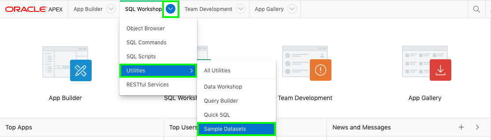
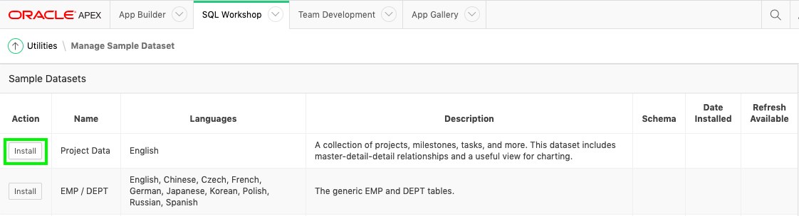
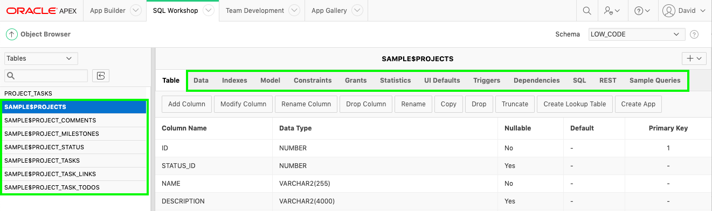

# Building your tables and views - Installing Sample Tables

## Introduction

In this lab, you will learn how to install sample tables and views from Sample Datasets which come complete with sample data.

## Task 1: Creating the Project Tables

1.  From your APEX workspace home page, select **SQL Workshop**, click **Utilities**, and then click **Sample Datasets**.  

    

2. On the Project Data row, click **Install**.

    

3. Click **Next**.
4. Click **Install Dataset**.
5. Click **Exit**.

    
    *{Note: You do not want to click _Create Application_, as you will manually create an application}*

## Task 2: Review Database Objects

1. In the App Builder Menu, click **SQL Workshop**.
2. Click **Object Browser**.  

    

3. Click on the tables starting with **EBA** and the various tabs, such as Data, Constraints, and so forth, to review the table details.  

    

## **Summary**

This completes Lab 2. You now know how to install a sample dataset. [Click here to navigate to Lab 3](?lab=lab-3-creating-application)

## **Acknowledgements**

 - **Author** -  David Peake, Consulting Member of Technical Staff
 - **Contributors** - Arabella Yao, Product Manager Intern, Database Management
 - **Last Updated By/Date** - Madhusudhan Rao, Apr 2022

