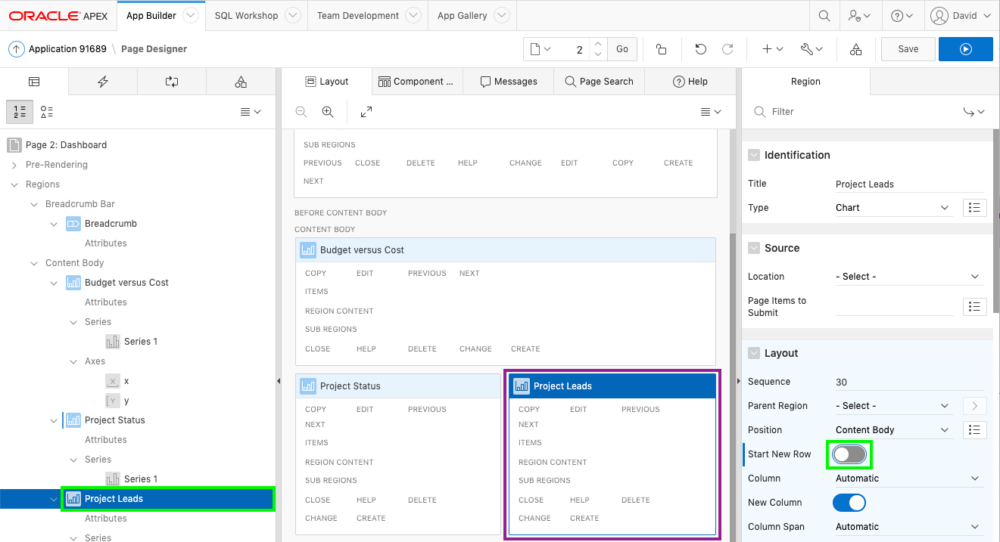

# Module 5: Improving the Dashboard

In this module, you will learn how to manipulate regions.

### **Part 1** - Removing Chart 4
Looking at the Dashboard you will see that Chart 4 is based on demo data and should be removed.

1. In the runtime environment, click **Dashboard**.
2. In the Developer Toolbar (at the bottom of the runtime page), click **Edit Page 2**.

    
   
    You should now be in Page Designer. Page Designer is where you will spend the majority of your time improving your application. There are three panes within Page Designer. The left pane initially displays the Rendering tree, with a list of page components. The middle pane displays the Layout, a representation of the page, and Gallery, from which you can drag and drop new components into the Layout. The right pane is the Property Editor, where you can change attributes for the selected component.

3. Within Page Designer, in the Rendering tree (left pane), _right-click_ **Chart 4** and select **Delete**.

    

4. Let’s review the dashboard again.   
    In the Page Designer toolbar, click **Save and Run**.

    
    
    The revised layout will be displayed.
    
    
    
### **Part 2** - Move Regions
Looking at the revised Dashboard page, it would look better to have the Budget versus Cost chart on a line by itself.

1. From the runtime environment, navigate back to the App Builder by clicking **Edit Page 2** in the Developer Toolbar, or by navigating back to the App Builder browser tab manually.
2. Within Page Designer, in the Rendering tree (left pane), click **Project Status**.   
    In the Property Editor (right pane), **_check_** Layout > Start New Row.  
    *{Note: Within Layout (middle pane) the region will move onto a row by itself}*

    

3. Now to move the Project Leads chart up on to the same line as the Project Status chart.  
    In the Rendering tree (left pane), click **Project Leads**.     
    In the Property Editor (right pane), **_uncheck_** Layout > Start New Row.  
    *{Note: Within Layout (middle pane) the region will move up to be on the same row as Project Status}*

    
    
5. Now to review the page!     
    Click **Save and Run**.
    
    
    
### **Summary**

This completes Module 5. You now know how to remove and reposition regions. [Click here to navigate to Module 6](6-improving-projects.md)
