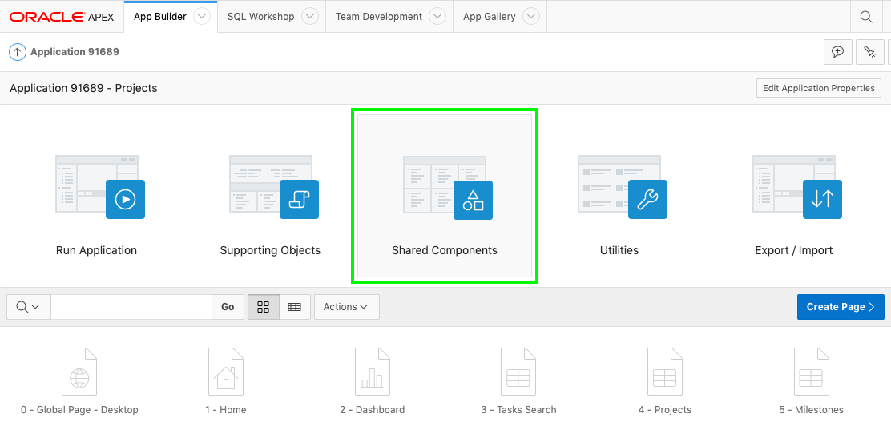
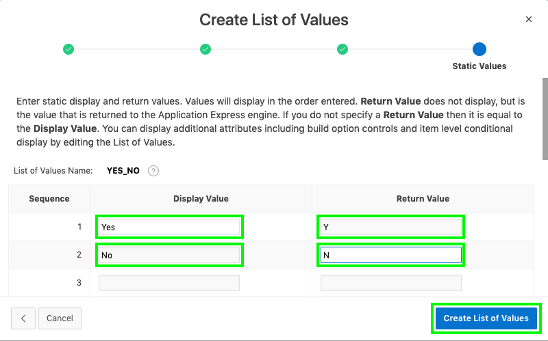
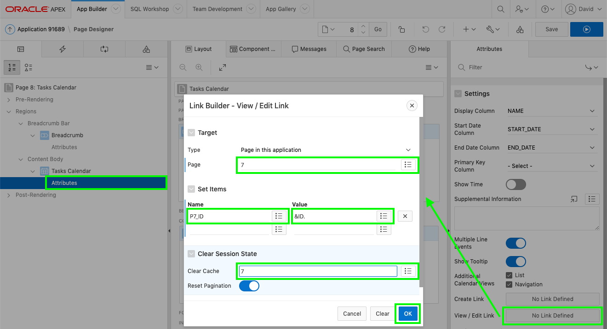
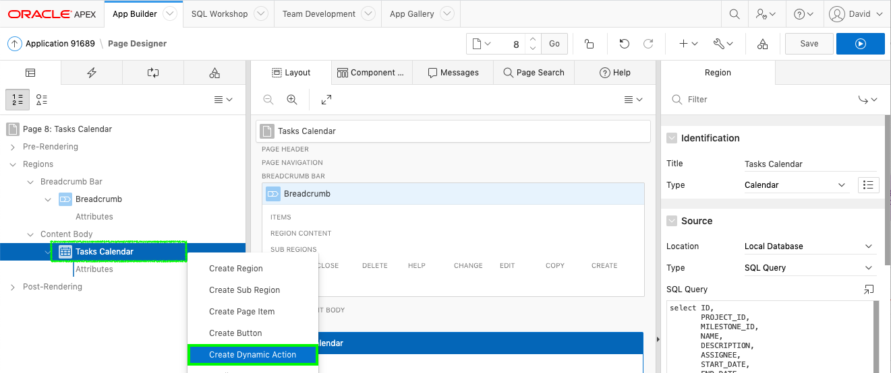
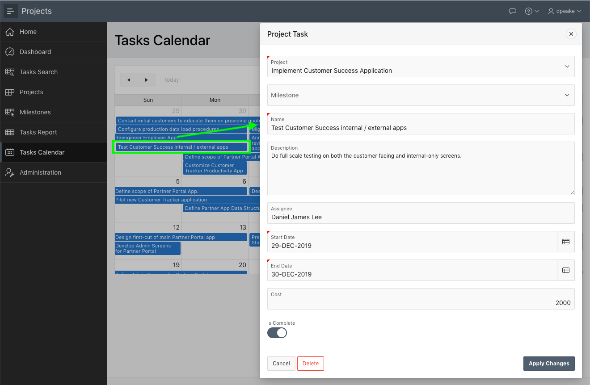

# Module 8: Improving Tasks

In this module, you will learn how to define a shared list of values and use it to improve the Faceted Searches, and Interactive Report pages for Tasks. You will also learn how easy it is to link the calendar to the Tasks Form page.

### **Part 1** - Defining a Shared List of Values
In the Runtime environment navigate to Tasks Search and review the page. Notice how Is Complete simply displays "Y". Now navigate to Tasks Report and you will notice the same issue. It would be far better to display "Yes" or "No". This can readily be achieved by defining a List of Values (LOV)

You can define a LOV directly on a page. However, if you require the same LOV on multiple pages, as you do here, it is far better to define it once as a Shared Component.

1. Navigate back to the App Builder browser tab.
2. On the application home page, click **Shared Components**.

    
    
    Alternatively, if in Page Designer, within the toolbar, click the Shared Components icon.

    

3. On Shared Components, click **List of Values**.

    

4. You will notice there are already several LOVs listed.   
    To create a new LOV click **Create**.

    

5. On the Create List of Values dialog, for Source keep the default selection ("From Scratch") 
    Click **Next**
6. On the Name and Type dialog, enter the following:
    - Name - enter **YES_NO** 
    - Type - select **Static**
    
    - Click **Next**

    

7. On the Static Values dialog, enter the following:
    - Sequence 1
        - Display Value - enter **Yes**
        - Return Value - enter **Y**
    - Sequence 2
        - Display Value - enter **No**
        - Return Value - enter **N**  
    
    - Click **Create List of Values**

    

### **Part 2** - Updating the Faceted Search
Now that you have defined the shared component you need to utilize it on the Faceted Search page.

1. In the breadcrumbs, click **Application xxxxx**

    

2. From the application home page, click **3 - Tasks Search**

    

3. You first want to update the entries in the Search.  
    Within Page Designer, in the Rendering tree (left pane), under Search, click **P3\_IS\_COMPLETE_YN**.   
    In the Property Editor (right pane), enter the following:
    - List of Values > Type - select **Shared Component**
    - List of Values > List of Values - select **YES_NO**

    

4. Next you also want to update the displayed value in the report.  
    In the Rendering tree (left pane), under **Project Tasks**, expand **Columns**.  
    Within the list of columns, click **IS\_COMPLETE_YN**.  
    In the Property Editor (right pane), enter the following:
    - Identification > Type - select **Plain Text (based on List of Values)**
    - List of Values > Type - select **Shared Component**
    - List of Values > List of Values - select **YES_NO**

    

5. The report has many columns. The Description column takes up too much real estate, so should be hidden.  
    In the Rendering tree (left pane), under **Project Tasks**, within the list of columns, click **DESCRIPTION**.   
    In the Property Editor (right pane), for Identification > Type select **Hidden Column**.
    
    

6. While we are on the page, we can quickly change the order of the search columns.  
    In the Rendering tree (left pane), click **P3\_MILESTONE_ID**   
    In the Property Editor (right pane), for Layout > Sequence enter **25**     
    *{Note: This will position Milestones after Projects}*
    
    In the Rendering tree (left pane), click **P3\_IS\_COMPLETE_YN**    
    In the Property Editor (right pane), for Layout > Sequence enter **35**     
    *{Note: This will position Is Complete after Assignee}*
    
    

7. Let’s review that the Faceted Search is complete.  
    In the Page Designer toolbar, click **Save and Run**.
    
    

### **Part 3** - Updating the Interactive Report
The Tasks Report also needs the Is Complete column updated.

1. In the Runtime environment, click **Tasks Report** in the menu.  
    In the Developer Toolbar (bottom of page), click **Edit Page 6**.    
    *{Note: You can also navigate back to the App Builder browser tab and manually navigate to Page 6}*
    
2. In Page Designer, with **Page 6: Tasks Report** selected, in the Rendering tree (left panel), under **Project Tasks** region, expand **Columns**.    
    In the list of columns, click **IS\_COMPLETE_YN**.   
    In the Property Editor (right pane), enter the following:
    - Identification > Type - select **Plain Text (based on List of Values)**
    - List of Values > List of Values - select **YES_NO**

    

3. Run the application.     
    In the Page Designer toolbar, click **Save and Run**.

    

4. Click on the edit icon for a record.     
    Notice that Is Complete uses a Switch so no need to modify the form page.   
    *(Note: The form page is Page 7 which we will need in the next part}*

### **Part 4** - Linking the Calendar
The Tasks Calendar page shows numerous tasks, however, there is no way to directly modify a record. Therefore, you should add a link to the existing Project Task form page. 

1. In the runtime environment, within the Navigation Menu, click **Tasks Calendar**
2. Click on any entry to confirm it simply displays the event details

    

3. In the Developer Toolbar (bottom of page), click **Edit Page 8**
4. In Page Designer, within the Rendering tree (left pane), under **Tasks Calendar**  region, click **Attributes**.  
    In the Property Editor (right pane), for Settings > View / Edit Link click **No Link Defined**.     
    In the Link Builder dialog, enter the following:
    - Target > Page - select **7**
    - Set Items > Name - select **P7_ID**
    - Set Items > Value - select **ID** {Returns **&ID**.}
    - Clear Cache - enter **7**

    - Click **OK**

    

5. It is important that the calendar is updated if the Task Name, Start Date or End Date are updated when the Project Task form page is called from the calendar.    
    In the Rendering tree (left pane), _right-click_ **Tasks Calendar**.    
    Select **Dynamic Actions**.

    

6. With the Dynamic Actions selected, in the Property Editor (right pane), enter the following:
    - Identification > Name - enter **Refresh Calendar**
    - When > Event - select **Dialog Closed**   
    *{Note: The Dialog Closed event will fire when the Project Task form page is closed as it is a modal page}*

    

7. In the Rendering tree (left pane), under the True action, click **Show**.    
    In the Property Editor (right pane), enter the following:
    - Identification > Action - select **Refresh**
    - Affected Elements > Selection Type - select **Region**
    - Affected Elements > Region - select **Tasks Calendar**

    

6. Navigate back to the runtime environment, and refresh the browser.   
    Click a calendar entry

    
    
    If you update the Name, Start Date or End Date and click **Apply Changes** on the Project Task form page, the changes will be reflected immediately in the calendar.

### **Summary**

This completes Module 8 and the lab. You now know how to create a Shared Component, improve a Faceted Search page, and link a Calendar page that refreshes after a record is updated.

### **Learn More** - *Useful Links*

- APEX on Autonomous  https://apex.oracle.com/autonomous
- APEX Collateral  http://apex.oracle.com
- Tutorials  https://apex.oracle.com/en/learn/tutorials
- Community  http://apex.oracle.com/community
- External Site + Slack  http://apex.world