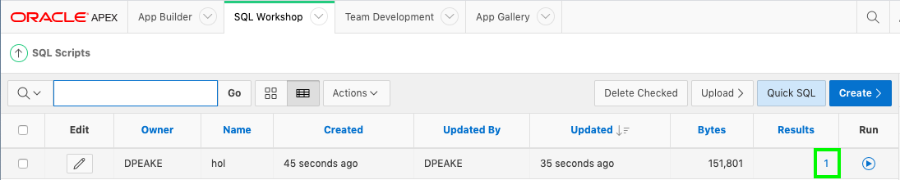
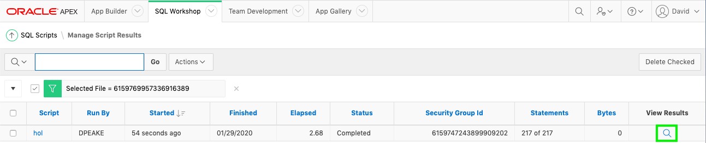
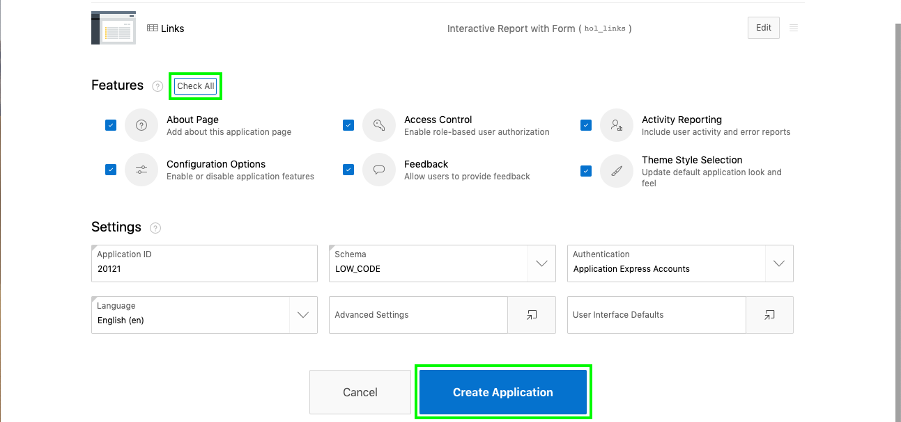
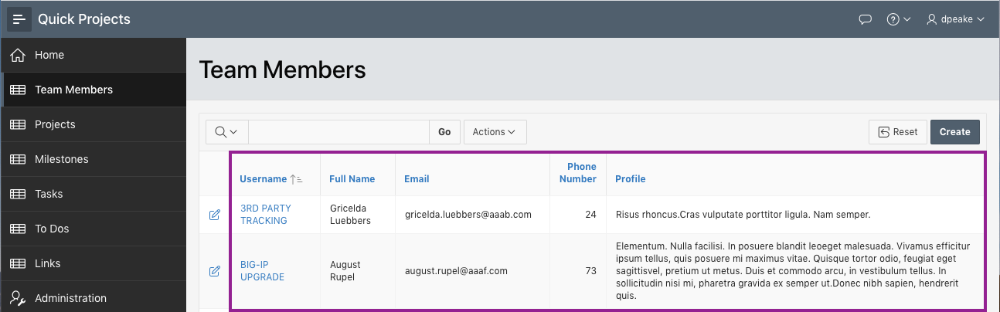

# Using the Create Application Wizard

## Introduction

In this lab you will build an application on the data structures you built in the previous lab.

## **STEP 1** – Run the Create App Wizard

1. From SQL Scripts > Results, click **Create App**

    

    *Note: If you are back on SQL Scripts, and don’t see the “Create App” button perform the following steps:*
    - *Within the Results column, click “1” for the script you just ran.*

    

    - *Under View Results, click the magnifying glass.*

    

    *The results page shown above should now be displayed again.*

2. In the Create App from Script dialog, click **Create Application**

    

3.  On the Create an Application page, for Name enter **Quick Projects**.
    Click **Appearance**.    
    For Theme Style, select **Vita-Slate**.     
    Click **Save Changes**

    

4. For Features, click **Check All**.   
    Click **Create Application**

    

## **STEP 2** – Run the Application

1. Your new application will be displayed in Page Designer.

    Click **Run Application**.

    

2. In the runtime environment, the login page will be displayed.

    Enter your **Username** and **Password**.   
    Click **Sign In**.

    The new application will be displayed.

    

3. Play around with the application and explore the different pages.

    Records are displayed in all of the reports which makes page review significantly easier, especially for reports. The fact that the data may not be exactly correct for the columns is not critical, as you can very easily update the data to make it more realistic.

    

## **Summary**
This completes Lab 3. You now know how to utilize the Create Application wizard directly from SQL Scripts to create the first cut of your application. [Click here to navigate to Lab 4](?lab=lab-4-regenerating-application)

## **Acknowledgements**

 - **Author/Contributors** -  David Peake, Consulting Member of Technical Staff
 - **Last Updated By/Date** - Tom McGinn, Database Cloud Services, Product Management, June 2020

## See an issue?
Please submit feedback using this [form](https://apexapps.oracle.com/pls/apex/f?p=133:1:::::P1_FEEDBACK:1). Please include the *workshop name*, *lab* and *step* in your request.  If you don't see the workshop name listed, please enter it manually. If you would like us to follow up with you, enter your email in the *Feedback Comments* section.
