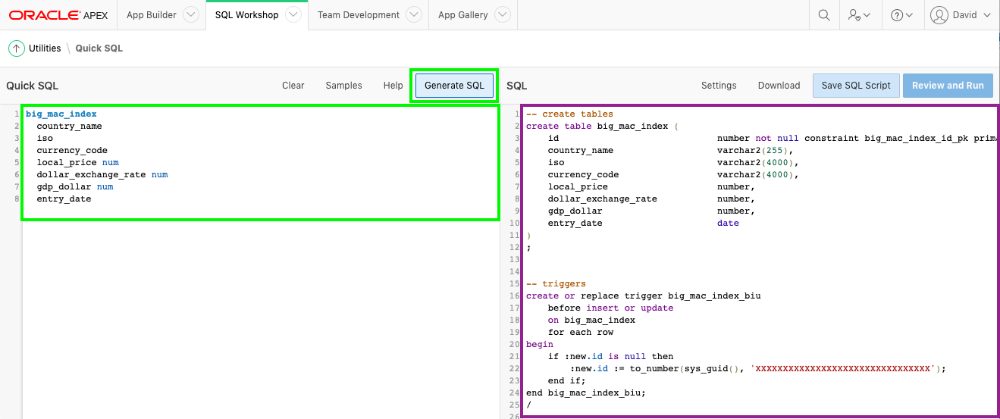
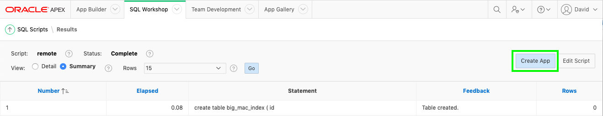

## Module 2 - Building your table Using Quick SQL

In this module, you will learn how to create a table by defining the data structures in Quick SQL. 

### **Part 1** - Open Quick SQL
1. Log into your workspace
2. Click **SQL Workshop**
3. Click **SQL Scripts**

    
    
4. Click **Quick SQL**

    

### **Part 2** - Enter Shorthand for Tables
Quick SQL provides an easy way to generate the SQL required to create a relational data model from an indented text document. This tool is designed to reduce the time and effort required to create SQL tables, triggers, and index structures.

1. In Quick SQL (left pane), enter the following:

    ```
    big_mac_index  
      country_name  
      iso
      currency_code 
      local_price num 
      dollar_exchange_rate num 
      gdp_dollar num 
      entry_date
    ```

    *{Note: By indenting the _country\_name_ and subsequent rows, it is indicating that these are columns for the table, _big\_mac\_index_, defined in the first row.}*

    Click **Generate SQL**

    

2. In SQL (right pane), click **Settings** 

    In the Settings dialog, for Primary Keys, select **12c Identity Data Types**  
    Click **Save Changes**   

    

### **Part 3** – Implement the Script
At this stage you have created a SQL statement. However, you first need to save the statement as a script file and then run the script. This will create the database object you defined.

1. In the SQL (right pane) toolbar, click **Save SQL Script**.
2. In the Save Script dialog, for Script Name, enter **remote**.   
    Click **Save Script**.

    
    
3. In the SQL (right pane) toolbar, click **Review and Run**    
    The script will be displayed in the **Script Editor**, within SQL Scripts.
    
    Click **Run**.

    

4. On the Run Script page, click **Run Now**.  
5. The Script Results page will be displayed listing the statements processed, successful, and with errors.

    

    *{Note: If you do not see 1 statements processed then return to Quick SQL and click _Generate SQL_, reimplement the Setting, resave the script and then run it again. If you still do not see 1 successful, then review the errors displayed in Feedback within the results.}*

### **Part 4** - Create the Application
Now that you have created the table you can quickly create an application with a report and form.

1. Click **Create App from Script**

    

    *{Note: If you are back on SQL Scripts, and don’t see the “Create
App from Script” button perform the following steps:*   
    *1. Within the Results column, click “1” for the script you just ran.*  
    *2. Under View Results, click the magnifying glass*.  
    *The results page shown above should now be displayed again}*

2. In the Create App from Script dialog, click **Create Application**.
3. In the Create an Application page, enter the following:
    - Name - enter **Global Exchange**
    - Features - click **Check All**

    At the bottom of the page, click **Create Application**

    

4. Your new application will be displayed in Page Designer
5. Click **Run Application**

    

6. In the runtime environment, on the login page, enter your credentials
7. Play around with your new application

    

    *{Note: When you click on Mac Index there will be no data displayed. You don't want to manually enter in data as the table will be populated in the next module.}*

### **Summary**
This completes Module 2. You now know how to utilize Quick SQL to build a simple table and create an application on top of it. [Click here to navigate to Module 3](3-populating-table.md)
