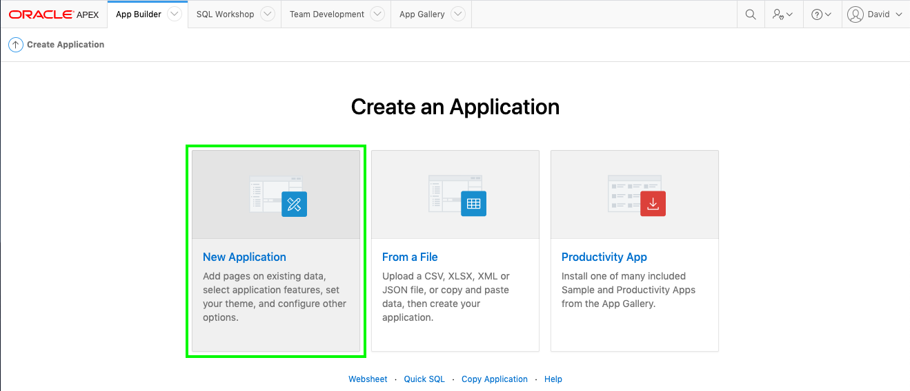
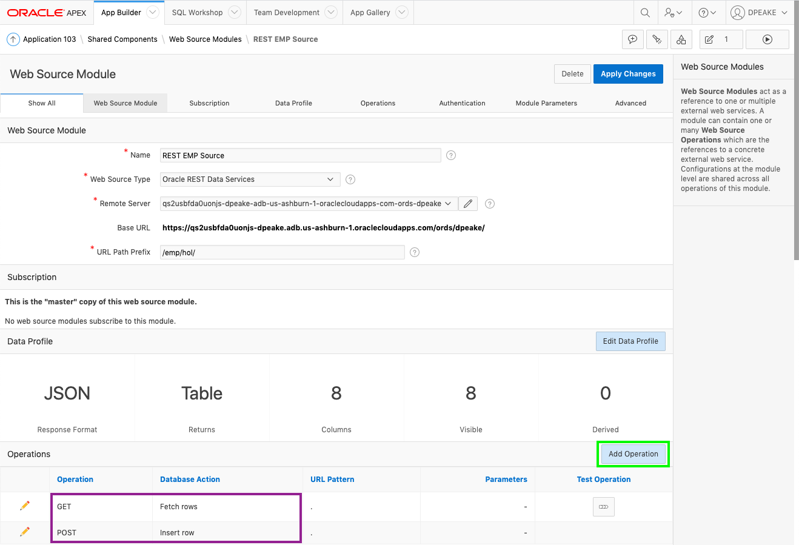

# Module 3 - Defining Web Sources 

In this module, you will learn how to utilize the REST APIs you created in the previous module as the basis for Web Sources. 

### **Part 1** – Create an App  
In a normal development environment, rather than in a lab, at this point you would log out of the remote database, where you defined the REST APIs, and log into your local database where you want to build the application. However, given for this lab you are using the same workspace for both, there is no need to log out and log back in.

1. Return to the APEX Builder tab or window.
2. In the App Builder toolbar, click **App Builder**, and click **Create**  

    

3. On the Create Application page, click **New Application**  

    
    
4. On the Create an Application page, for Name, enter **REST Employees**
    
    Click **Create Application**

    
    
    *{Note: At this stage you do not want to add any pages as you have not yet defined the Web Source module.}*

### **Part 2** – Add Web Source for EMP 

1. In the Application home page, click **Shared Components**  

    
    
2. Under **Data Sources**, click **Web Source Modules**  

    

3. On the Web Source Modules page, click **Create**.
4. For Method, click **Next**. *{Default: From Scratch}*
5. In the Create Web Source wizard, on the General dialog, enter the following:
    - Web Source Type - select **ORACLE REST Data Services**
    - Name - enter **REST EMP Source**
    - URL Endpoint - enter the REST URI you tested previously
    *{Note: Your URL endpoint will be similar to https://{cloud\_url}/ords/{{your_schema}}/emp/hol/ }*

    Click **Next**

    

6. On the Remote Server dialog, review the Base URL and Service URL Path.   
    Click **Next**.

    

7. On the Authentication dialog, click **Discover**.
*{Authentication Required = No}*

    

8. On the Preview dialog, click **Create Web Source**.

    

### **Part 3** – Adding Operations
Given the URL Endpoint used above, the _Create Web Source_ operation determined that the **GET** and **POST** operations have been defined. You also defined handlers for **GET**, **PUT**, and **DELETE** for a specific employee record. Therefore, it is important to add additional operations for these handlers. If you do not add the operations then the relevant functionality will not be included, such as selecting a single record, updating a record, or deleting a record. 

1. On the Web Source Modules page, click **REST EMP Source**.

    

2. On REST EMP Source page, click **Add Operation**.

    

3. In the Web Source Operation page, enter the following:
    - URL Pattern - enter **:empno**
    - HTTP Method - select **GET**
    - Database Operation, select **Fetch single row**

    Click **Create**. 

    

4. On REST EMP Source page, click **Add Operation**.

    In the Web Source Operation page, enter the following:
  - URL Pattern - enter **:empno**
  - HTTP Method - select **PUT**
  - Database Operation - select **Update row**
  
  Click **Create**.

5. On REST EMP Source page, click **Add Operation**

    In the Web Source Operation page, enter the following:
   - URL Pattern - enter :**empno**
   - HTTP Method - select **DELETE**
   - Database Operation - select **Delete row**
   
   Click **Create**.

### **Summary**
This completes Module 3. You now know how to define a Web Source module within an application and add the required operations for full CRUD operations. [Click here to navigate to Module 4](4-creating-pages.md)
