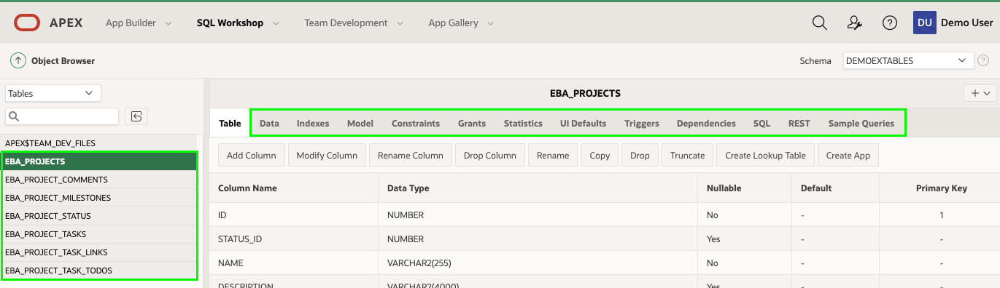

# Module 2: Building your tables and views - Installing Sample Tables

In this module, you will learn how to install sample tables and views from Sample Datasets which come complete with sample data.

### **Part 1** - Creating the Project Tables

1.  From your APEX workspace home page, select **SQL Workshop**, click **Utilities**, and then click **Sample Datasets**.  

    

2. On the Project Data row, click **Install**.

    

3. Click **Next**.
4. Click **Install Dataset**.
5. Click **Exit**.    
    *{Note: You do not want to click _Create Application_, as you will manually create an application}*

### **Part 2** - Review Database Objects

1. In the App Builder Menu, click **SQL Workshop**.
2. Click **Object Browser**.  

    

3. Click on the tables starting with **EBA_** and the various tabs, such as Data, Constraints, and so forth, to review the table details.  

    

### **Summary**

This completes Module 2. You now know how to install a sample dataset. [Click here to navigate to Module 3](3-create-app.md)
